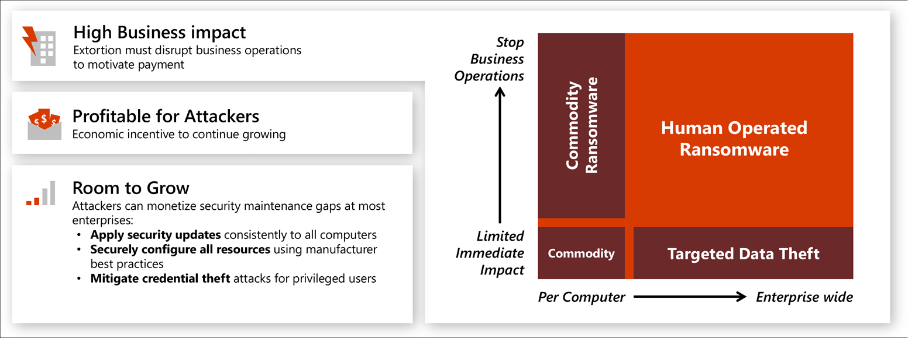

# Human operated ransomware
Human operated ransomware is a large and growing attack trend that represents a threat to most industries.

Human operated ransomware is different than commodity ransomware. These “hands-on-keyboard” attacks leverage human attackers’ knowledge of common system and security misconfigurations to infiltrate a compromised network and to adapt to the network and its weak points as they go. Hallmarks of a human-operated ransomware attack typically include credential theft and lateral movement, resulting in deployment of a ransomware payload to any resource the attackers choose.

These attacks can be catastrophic. Only through complete complete adversary eviction can you protect against future attacks. Unlike commodity ransomware, which only requires malware remediation, human operated ransomware will continue to  threaten your business operations. 

Microsoft recommends you use the mitigation plans described in this presentation: **[Ransomware recommendations (ppt)](https://download.microsoft.com/download/7/5/1/751682ca-5aae-405b-afa0-e4832138e436/RansomwareRecommendations.pptx)**, which includes securing your privileged access [Deploy a secure, Azure-managed workstation](https://aka.ms/spa).

This image shows how this extortion-based attack is growing in impact and likelihood, using privileged access.

