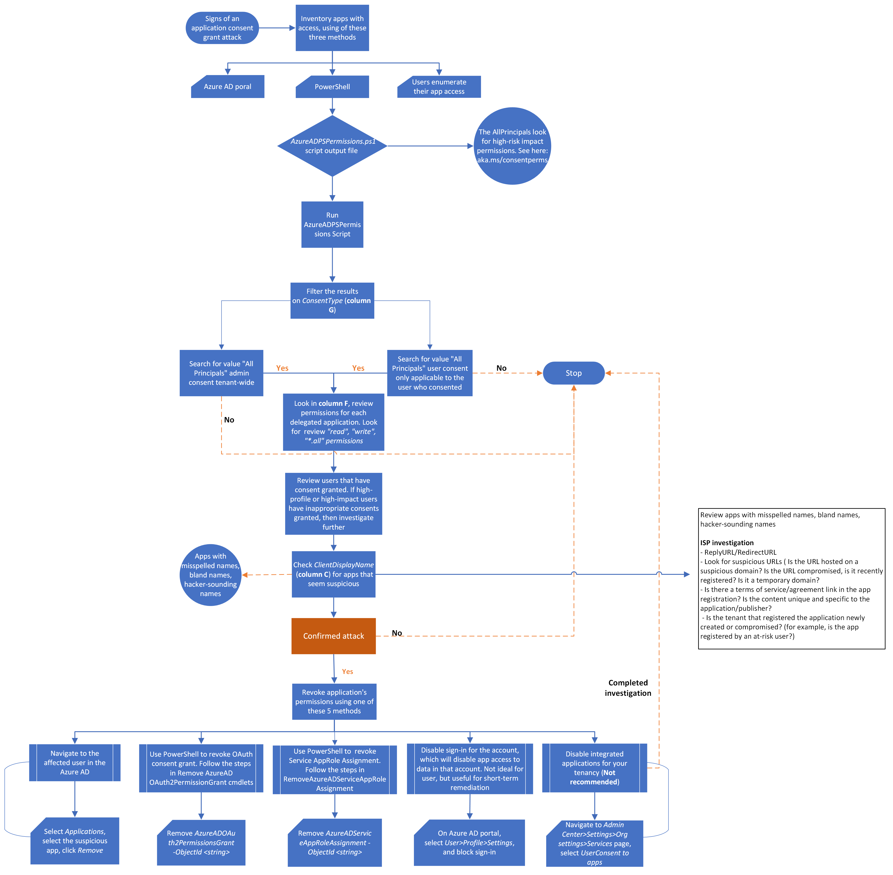

# App consent grant investigation

This article provides guidance on identifying and investigating app consent attacks, protecting information, and minimizing further risks.

This article contains the following sections:

- **Prerequisites:** Covers the specific requirements you need to complete before starting the investigation. For example, logging that should be turned on, roles and permissions required, among others.
- **Workflow:** Shows the logical flow that you should follow to perform this investigation.
- **Checklist:** Contains a list of tasks for each of the steps in the flow chart. This checklist can be helpful in highly regulated environments to verify what you have done or simply as a quality gate for yourself.
- **Investigation steps:** Includes a detailed step-by-step guidance for this specific investigation.
- **Recovery:** Contains high level steps on how to recover/mitigate from an Illicit Application Consent grant attack.
- **References:** Contains additional reading and reference materials.

## Prerequisites

Here are general settings and configurations you should complete to perform an investigation for Application Consent Grants. Before starting the investigation, make sure you have read about the types of consent permissions explained in [Consent permission types](/azure/active-directory/develop/v2-permissions-and-consent).

### Customer data

To start the investigation process, you need the following data:

- Access to the tenant as a Global Admin - A Cloud only account (not part of their on-premises environment)
- Detail of indicators of compromise (IoCs)
- The date and time when you noticed the incident
- Date range
- Number of compromised accounts
- Name(s) of compromised accounts
- Roles of the compromised account
- Are the accounts highly privileged (GA Microsoft Exchange, SharePoint)?
- Are there any Enterprise Applications that are related to the incident?
- Did any users report about any applications that were requesting permissions to data on their behalf?

### System requirements

Ensure you complete the following installations and configuration requirements:

1. The AzureAD PowerShell module is installed.
2. You have global administrator rights on the tenant that the script will be run against.
3. You are assigned local administrator role on the computer that you will use to run the scripts.

#### Install the AzureAD module

Use this command to install the AzureAD module.

```powershell
Install-Module -Name AzureAD -Verbose
```

>[!Note]
>If you are prompted to install the modules from an untrusted repository, type **Y** and press **Enter**.

#### Download the AzureADPSPermissions Script from GitHub

1. Download the [Get-AzureADPSPermissions.ps1](https://gist.github.com/psignoret/41793f8c6211d2df5051d77ca3728c09) script from GitHub to a folder from which you will run the script. The output file "*permissions.csv*" will also be written to this same folder.
2. Open a PowerShell instance as an administrator and open the folder in which you saved the script.
3. Connect to your directory using the `Connect-AzureAD` cmdlet. Here's an example.

    ```powershell
    Connect-AzureAD -tenantid "2b1a14ac-2956-442f-9577-1234567890ab" -AccountId "user1@contoso.onmicrosoft.com"
    ```

4. Run this PowerShell command.

    ```powershell
    Get-AzureADPSPermissions.ps1 | Export-csv -Path "Permissions.csv" -NoTypeInformation
    ```

    Disconnect your AzureAD session with this command.

    ```powershell
    Disconnect-AzureAD
    ```

## Consent terminologies

### What are application consent grants?

Consent is the process of granting authorization to an application to access protected resources on the users’ behalf. An administrator or user can be asked for consent to allow access to their organization/individual data.

An application is granted access to data based on a particular user or for the entire organization. These consents, however, can be misused by attackers to gain persistence to the environment and access sensitive data. These types of attacks are called Illicit Consent Grants, which can happen through a phishing email, a user account compromise through password spray, or when an attacker registers an application as a legitimate user. In scenarios where a Global Admin account is compromised, then the registration and consent grant are for tenant-wide and not just for one user.

Before an application can access your organization's data, a user must grant the application permissions to do so. Different permissions allow different levels of access. By default, all users are allowed to consent to applications for permissions that don't require administrator consent. For instance, by default, a user can consent to allow an app to access their mailbox but can't consent to allow an app unfettered access to read and write to all files in your organization.

>[!Note]
>By allowing users to grant apps access to data, users can easily acquire useful applications and be productive. However, in some situations, this configuration can represent a risk if it's not monitored and controlled carefully.
>

### Roles that can grant consent on behalf of the organization

To be able to grant **tenant-wide admin consent**, you must sign in as one of the following:

- Global Administrator
- Application Administrator
- Cloud Application Administrator

### Consent types

- **Administrator -** Indicates the consent was provided by the administrator (on behalf of the organization)
- **Individual user -** Indicates the consent was granted by the user and only has access to that user’s information
- **Accepted values**
  - *AllPrincipals -* Consented by an administrator for the entire tenancy
  - *Principal –* Consented by the individual user for data only related to that account

### Consent and permissions

The actual user experience of granting consent will differ depending on the policies set on the user's tenant, the user's scope of authority (or role), and the type of permissions being requested by the client application. This means that application developers and tenant admins have some control over the consent experience. Admins have the flexibility of setting and deactivating policies on a tenant or app to control the consent experience in their tenant. Application developers can dictate what types of permissions are being requested and if they want to guide users through the user consent flow or the admin consent flow.

- **User consent flow** - When an application developer directs users to the authorization endpoint with the intent to record consent for only the current user.

- **Admin consent flow** - When an application developer directs users to the admin consent endpoint with the intent to record consent for the entire tenant. To ensure the admin consent flow works properly, application developers must list all permissions in the **RequiredResourceAccess** property in the application manifest.

### Delegated permissions vs. application permissions

Delegated permissions are used by apps that have a signed-in user present and can have consents applied by the administrator or user.

Application permissions are used by apps that run without a signed-in user present. For example, apps that run as background services or daemons. Application permissions can be consented only by an administrator.

For more information see:

- [Admin consent workflow for admin approval for specific applications](/azure/active-directory/manage-apps/configure-admin-consent-workflow)
- [Publisher verification program](/azure/active-directory/develop/publisher-verification-overview#:~:text=Publisher%20verification%20%28preview%29%20helps%20admins%20and%20end%20users,application%20developers%20integrating%20with%20the%20Microsoft%20identity%20platform.)
- [Configure how end users consent to applications](/azure/active-directory/manage-apps/configure-user-consent)

### Classifying risky permissions

There are thousands (at least) of permissions in the system, and not feasible to list out or parse all of these. The list below will address commonly misused permissions, and others that would create catastrophic impact if misused.

At a high level, we have observed the following “root” delegated (App+User) permissions being misused in consent phishing attacks. Root equates to the top level. For example, *Contacts.\** means to include all delegated permutations of Contacts permissions: *Contacts.Read*, *Contacts.ReadWrite*, *Contacts.Read.Shared*, and *Contacts.ReadWrite.Shared*.

1. *Mail.\* (including Mail.Send\*, but not Mail.ReadBasic\*)*
2. *Contacts. \**
3. *MailboxSettings.\**
4. *People.\**
5. *Files.\**
6. *Notes.\**
7. *Directory.AccessAsUser.All*
8. *User\_Impersonation*

The first seven permissions in the list above are for Microsoft Graph and the “legacy” API equivalents, such as Azure Active Directory (Azure AD) Graph and Outlook REST. The eighth permission is for Azure Resource Manager (ARM), and could also be dangerous on any API that exposes sensitive data with this blanket impersonation scope.

As per our observation, attackers have used a combination of the first six permissions in the in 99% of the consent phishing attacks. Most people don’t think of the delegated version of *Mail.Read* or *Files.Read* as a high-risk permission, however, the attacks we’ve seen are generally widespread attacks targeting end users, rather than spear phishing against admins who can actually consent to the dangerous permissions. It is recommended to bubble apps with these “critical” level of impact permissions. Even if the applications do not have malicious intent, and if a bad actor were to compromise the app identity, then your entire organization could be at risk.

**For the highest risk impact permissions, start here:**

- Application permission (AppOnly/AppRole) versions of all the above permissions, where applicable

**Delegated and AppOnly versions of the following permissions:**

- *Application.ReadWrite.All*
- *Directory.ReadWrite.All*
- *Domain.ReadWrite.All\**
- *EduRoster.ReadWrite.All\**
- *Group.ReadWrite.All*
- *Member.Read.Hidden\**
- *RoleManagement.ReadWrite.Directory*
- *User.ReadWrite.All\**
- *User.ManageCreds.All*
- All other AppOnly permissions that allow write access

**For the lowest risk impact permissions list, start here:**

- *User.Read*
- *User.ReadBasic.All*
- *Open\_id*
- *Email*
- *Profile*
- *Offline\_access* (only if paired with other permissions on this “lowest risk” list)

### Viewing permissions

1. To view the permissions, navigate to the **Registration** screen in the enterprise application.

    :::image type="content" source="./media/incident-response-playbook-app-consent/Viewpermissions.png" alt-text="view permissions":::

2. Select **View API permissions**.

    :::image type="content" source="./media/incident-response-playbook-app-consent/Viewapipermissionbutton.png" alt-text="apipermissions":::

3. Select **Add a permission** and the following screen is displayed.

    :::image type="content" source="./media/incident-response-playbook-app-consent/Commonapi.png" alt-text="api":::

4. Select **Microsoft Graph** to view the different types of permissions.

    :::image type="content" source="./media/incident-response-playbook-app-consent/RequestAPIpermissions.png" alt-text="types of permissions":::

5. Select the type of permissions the registered application is using: **Delegated** **permissions** or **Application** **permissions**. In the above image, **Application permissions** is selected.

6. You can search for one of the high-risk impact permissions such as **EduRoster**.

    :::image type="content" source="./media/incident-response-playbook-app-consent/RequestAPIpermissions_edu.png" alt-text="examplepermission":::

7. Select **EduRoster** and expand the permissions.

    :::image type="content" source="./media/incident-response-playbook-app-consent/RequestAPIpermissions_selecteduroster.png" alt-text="eduroster":::

8. You can now assign or review these permissions.

    For more information, read  [Graph Permissions](/graph/permissions-reference).

## Workflow

[](https://raw.githubusercontent.com/MicrosoftDocs/security/main/compass/media/incident-response-playbook-app-consent/Appconsent_flow.png)

You can also:

- Download the app consent grant and other incident response playbook workflows as a [PDF](https://download.microsoft.com/download/2/9/a/29a32dc4-d126-42af-a825-ffb944135a50/Incident-Response-Playbook-Workflows.pdf).
- Download the app consent grant and other incident response playbook workflows as a [Visio file](https://download.microsoft.com/download/2/9/a/29a32dc4-d126-42af-a825-ffb944135a50/Incident-Response-Playbook-Workflows.vsdx).


## Checklist

Use this checklist to perform application consent grant validation.

- **Requirements**

  Make sure you have access to the tenant as a Global Admin. This is a cloud-only account and is not part of your on-premises environment.

- **Indicators of compromise (IoC)**

  Check the following indicators of compromise (IoC):

  - When did you notice the incident?
  - Date range of the incident (how far left is the goal post?)
  - Number of compromised accounts
  - Name(s) of compromised accounts
  - Roles of the compromised account(s)
  - Are the compromised accounts highly privileged, a standard user, or a combination

- **Roles**

  You must be assigned with these roles:

  - Global administrator rights on the tenant to execute the script
  - Local Administrator role on the computer from which will run the script

- **PowerShell configuration**

  Configure your PowerShell environment with the following:
  - Install the Azure AD PowerShell module.
  - Run the Windows PowerShell app with elevated privileges. (Run as administrator).
  - Configure PowerShell to run signed scripts.
  - Download the [Get-AzureADPSPermissions.ps1](https://gist.github.com/psignoret/41793f8c6211d2df5051d77ca3728c09) script.

- **Investigation triggers**
  - Account compromise
  - App Consent settings modified on the tenant
  - Alert/audit event status reason "risky application" detected
  - Noticed odd looking applications

You can also download the app consent grant and other incident playbook checklists as an [Excel file](https://download.microsoft.com/download/2/9/a/29a32dc4-d126-42af-a825-ffb944135a50/Incident-Response-Playbook-Checklists.xlsx).

## Investigation steps

You can use the following two methods to investigate application consent grants:

- Azure portal
- PowerShell script

>[!Note]
>Using the Azure portal *will only allow you to see Admin Consent Grants for the last 90 days and based on this, we recommend using the PowerShell script method only to reduce the attacker registers investigation steps.*
>

### Method 1 – Using the Azure portal

You can use the Azure Active Directory portal to find applications to which any individual user has granted permissions.

1. Sign in to the **Azure portal** as an administrator.
2. Select the **Azure Active Directory** icon.
3. Select **Users**.
4. Select the user that you want to review.
5. Select **Applications**.
6. You can see the list of apps that are assigned to the user and what permissions these applications have.

### Method 2 - Using PowerShell  

There are several PowerShell tools you can use to investigate illicit consent grants, such as:

- HAWK tool
- AzureAD incident response module
- The [Get-AzureADPSPermissions.ps1](https://gist.github.com/psignoret/41793f8c6211d2df5051d77ca3728c09) script from GitHub

PowerShell is the easiest tool and does not require you to modify anything in the tenancy. We are going to base our investigation on the public documentation from the Illicit Consent Grant attack.

Run `Get-AzureADPSPermissions.ps1`, to export all of the OAuth consent grants and OAuth apps for all users in your tenancy into a *.csv* file. See the [Prerequisites](#prerequisites) section to download and run the `Get-AzureADPSPermissions` script.

1. Open a PowerShell instance as an administrator and open the folder where you saved the script.
2. Connect to your directory using the following *Connect-AzureAD* command. Here's an example.

    ```powershell
    Connect-AzureAD -tenantid "2b1a14ac-2956-442f-9577-1234567890ab" -AccountId "user1@contoso.onmicrosoft.com"
    ```

3. Run this PowerShell command.

    ```powershell
    Get-AzureADPSPermissions.ps1 | Export-csv c:\temp\consentgrants\Permissions.csv -NoTypeInformation
    ```

4. Once the script completes, it is recommended to disconnect the Azure AD session with this command.

    ```powershell
     Disconnect-AzureAD
    ```

    >[!Note]
    >The script may take hours to complete, depending on the size and permissions configured as well as your connection.
    >

5. The script creates a file named *Permissions.csv*.
6. Open the file, filter or format the data into a table and save as an *.xlxs* file (for filtering).

    The **column headers** for output are shown in this image.

    

7. In the **ConsentType** column **(G),** search for the value **AllPrinciples**. The **AllPrincipals** permission allows the client application to access everyone's content in the tenancy. Native Microsoft 365 applications need this permission to work correctly. ***Every non-Microsoft application with this permission should be reviewed carefully***.

8. In the **Permission** column **(F)**, review the permissions that each delegated application has. Look for **Read** and **Write** permission or __*. All__ permission, and review these carefully because they may not be appropriate.


    >[!Note]
    >Review the specific users that have consents granted. If high profile or high impact users have inappropriate consents granted, you should investigate further.
    >

9. In the **ClientDisplayName** column **(C)**, look for apps that seem suspicious, such as:
    - Apps with misspelled names
        

    - Unusual or bland names
        

    - Hacker-sounding names. You must review these names carefully.
        

**Example Output:** AllPrincipals and read write all. Applications may not have anything suspicious like bland names and are using MS graph. However, perform research and determine the purpose of the applications and the actual permissions the applications have in the tenant, as shown in this example.


Here are some useful tips to review information security policy (ISP) investigations:

1. ReplyURL/RedirectURL
    - Look for suspicious URLs
2. Is the URL hosted on a suspicious domain?
    - Is it compromised?
    - Is the domain recently registered?
    - Is it a temporary domain?
3. Are there terms of service/service agreement link in the app registration?
4. Are the contents unique and specific to the application/publisher?
5. Is the tenant that registered the application either newly created or compromised (for example, is the app registered by an at-risk user)?

## Details of consent grant attack

### Attack techniques

While [each attack tends to vary, the core attack techniques are](https://attack.mitre.org/techniques/T1550/001/):

- An attacker registers an app with an OAuth 2.0 provider, such as Azure AD.
- The app is configured in a way that makes it seem legitimate. For example, attackers might use the name of a popular product available in the same ecosystem.
- The attacker gets a link directly from users, which may be done through conventional email-based phishing, by compromising a non-malicious website, or through other techniques.
- The user selects the link and is shown an authentic consent prompt asking them to grant the malicious app permissions to data.
- If a user selects ‘Accept’, they will grant the app permissions to access sensitive data.
- The app gets an authorization code, which it redeems for an access token, and potentially a refresh token.
- The access token is used to make API calls on behalf of the user.
- If the user accepts, the attacker can gain access to the user’s mails, forwarding rules, files, contacts, notes, profile, and other sensitive data and resources.

    :::image type="content" source="./media/incident-response-playbook-app-consent/Permissions.png" alt-text="Example of permissions request":::

## Finding signs of an attack

1. Open the [Security & Compliance Center](https://protection.office.com/).
2. Navigate to **Search** and select **Audit log search**.
3. Search (all activities and all users) and enter the start date and end date if required, and then select **Search**.

    :::image type="content" source="./media/incident-response-playbook-app-consent/Auditlogsearch1.png" alt-text="Example of an audit log search":::

4. Select **Filter** results and in the **Activity** field, enter **Consent** to application.

    :::image type="content" source="./media/incident-response-playbook-app-consent/Auditlogsearch2.png" alt-text="Example of filtering an audit log search":::

5. If you have activity under consent to grant, continue as directed below.
6. Select the result to see the details of the activity. Select **More Information** to get details of the activity.
7. Check whether IsAdminContent is set to ‘True’.

    >[!Note]
    >This process can take from 30 minutes up to 24 hours for the corresponding audit log entry to be displayed in the search results after an event occurs.
    >

    The extent of time that an audit record is retained and is searchable in the audit log depends on your Microsoft 365 subscription, and specifically the type of the license that is assigned to a specific user. **If this value is true, it indicates that someone with Global Administrator access may have granted broad access to data. If this is unexpected, take immediate steps to confirm an attack.**

## How to confirm an attack?

If you have one or more instances of the IOCs listed above, you need to do further investigation to positively confirm that the attack occurred.

**Inventory apps with access in your organization**

You can inventory apps for your users using the Azure Active Directory portal, PowerShell, or have your users individually enumerate their application access.

- Use the Azure Active Directory portal to inventory applications and their permissions. This method is thorough, but you can only check one user at a time, which can be time-consuming if you have to check the permissions of several users.
- Use PowerShell to inventory applications and their permissions. This method is the fastest and most thorough, with the least amount of overhead.
- Encourage your users to individually check their apps and permissions and report the results back to the administrators for remediation.

#### Inventory apps assigned to users

You can use the Azure Active Directory portal to see the list of apps to which any individual user has granted permissions.

1. Sign in to the **Azure Portal** with administrative rights.
2. Select the **Azure Active Directory** icon.
3. Select **Users**.
4. Select the user that you want to review.
5. Select **Applications**.
    You can see the list of apps that are assigned to the user and the permissions granted to these apps.

## Determine the scope of the attack

After you have finished inventorying application access, review the audit log to determine the full scope of the breach. Search on the affected users, the time frames that the illicit application had access to your organization, and the permissions the app had. You can search the audit log in the Microsoft 365 Security and Compliance Center.

**Important:** If auditing was not enabled prior to the possible attack, you will **not** be able to investigate as auditing data will not be available.

## How to prevent attacks and mitigate risks?

- Regularly [audit applications](/azure/security/fundamentals/steps-secure-identity#audit-apps-and-consented-permissions) and granted permissions in your organization to ensure no unwarranted or suspicious applications have previously been granted access to data.

- [Review, detect, and remediate illicit consent grants in Office 365](/microsoft-365/security/office-365-security/detect-and-remediate-illicit-consent-grants) for additional best practices and safeguards against suspicious applications requesting OAuth consent.

If your organization has the appropriate license:

- Use additional [OAuth application](/cloud-app-security/investigate-risky-oauth)  auditing features in Microsoft Defender for Cloud Apps.
- Use [Azure Monitor Workbooks](/azure/active-directory/reports-monitoring/howto-use-azure-monitor-workbooks)  to monitor permissions and consent related activity. The Consent Insights workbook provides a view of apps by number of failed consent requests. This can be helpful to prioritize applications for administrators to review and decide whether to grant them admin consent.

## How to stop and remediate an illicit consent grant attack?

After you have identified an application with illicit permissions, you have several ways to remove that access.

**You can revoke the application's permission in the Azure Active Directory portal.**

1. Navigate to the affected user in the **Azure Active Directory User** tab.
2. Select **Applications**.

    :::image type="content" source="./media/incident-response-playbook-app-consent/applications1.png" alt-text="applications":::

3. Select the illicit application.
4. Select **Remove**.

    :::image type="content" source="./media/incident-response-playbook-app-consent/assignmentdetail.png" alt-text="removeapp":::

**You can use PowerShell to revoke the OAuth consent grant by following the steps in [Remove-AzureADOAuth2PermissionGrant](/powershell/module/azuread/remove-azureadoauth2permissiongrant)**.

First, run this command to gather information that you have in Azure AD, for permissions of consent grants.

```powershell
Get-ADOAuth2PermissionGrantoAuth
```

Here's an example of the output.


**You can use PowerShell to revoke the Service App Role Assignment by following the steps in [Remove-AzureADServiceAppRoleAssignment](/powershell/module/azuread/remove-azureadoauth2permissiongrant)**.

Here's an example.

```powershell
Remove-AzureADOAuth2PermissionGrant -ObjectId "GbrSwpsCB0ar6c7N7PRvD1bNACUj4C9IspcKu5YkdoE"
```

Here's an example of the output.


You can also deactivate sign-in for the affected account altogether, which will in turn deactivate app access to data in that account. This option isn't ideal for the end user's productivity, but it can be a viable short-term remediation.

:::image type="content" source="./media/incident-response-playbook-app-consent/Testuser3.png" alt-text="deactivateuser":::

## Recommended defenses

### Steps to protect your organization

There are various consent attack types, but if you follow these recommended defenses, which will mitigate all types of attacks, especially consent phishing, where attackers trick users into granting a malicious app access to sensitive data or other resources. Instead of trying to steal the user’s password, an attacker is seeking permission for an attacker-controlled app to access valuable data.

To help prevent consent attacks from affecting Azure AD and Office 365, see the following recommendations:

### Set policies

- This setting will have user implications and may not be applicable for an environment. If you are going to allow any consents, ensure the administrators approve the requests.
- Allow consents for applications from verified publishers only and specific types of permissions classified as low impact.

    >[!Note]
    >The above recommendations are suggested based on the most ideal, secure configurations. However, as security is a fine balance between functionalities and operations, the most secure configurations might cause additional overheads to administrators. It is a decision best made after consulting with your administrators.
    >

    **Configure risk-based step-up consent - Enabled by default if user consent to grants is enabled**
- Risk-based step-up consent helps reduce user exposure to malicious apps that make illicit consent requests. If Microsoft detects a risky end-user consent request, the request will require a "step-up" to admin consent instead. This capability is enabled by **default**, but it will only result in a behavior change when **end-user consent is enabled**.
- When a risky consent request is detected, the consent prompt will display a message indicating that admin approval is needed. If the admin consent request workflow is enabled, the user can send the request to the admin for further review directly from the consent prompt. If it's not enabled, the following message is displayed:

    *AADSTS90094: &lt;clientAppDisplayName&gt; needs permission to access resources in your organization that only an admin can grant. Please ask an admin to grant permission to this app before you can use it. In this case, an audit event will also be logged with a Category of **"ApplicationManagement"** Activity Type of **"Consent to application"**, and Status Reason of **"Risky application detected"**.*

>[!Note]
>Any tasks that require administrator’s approval will have operational overhead. The "**Consent and permissions, User consent settings**" is in **Preview** currently. Once it is ready for general availability (GA), the "**Allow user consent from verified publishers, for selected permissions**" feature should reduce administrators’ overhead and it is recommended for most organizations.
>

:::image type="content" source="./media/incident-response-playbook-app-consent/consentpermissions.png" alt-text="consent":::

**Educate your application developers to follow the trustworthy app ecosystem.**  
To help developers build high-quality and secure integrations, we’re also announcing [public preview of the Integration Assistant in Azure AD app registrations.](/azure/active-directory/develop/identity-platform-integration-checklist)

- The Integration Assistant analyzes your app registration and benchmarks it against a set of recommended security best practices.
- The Integration Assistant highlights best practices that are relevant during each phase of your integration’s lifecycle—from development all the way to monitoring—and ensures every stage is properly configured.
- It’s designed to make your job easier, whether you’re integrating your first app or you’re an expert looking to improve your skills.

**Educate your organization on consent tactics ([phishing tactics, admin and user consents](/azure/active-directory/develop/application-consent-experience) ):**

- Check for poor spelling and grammar. If an email message or the application’s consent screen has spelling and grammatical errors, it’s likely to be a suspicious application.
- Keep a watchful eye on app names and domain URLs. Attackers like to spoof app names that make it appear to come from legitimate applications or companies but drive you to consent to a malicious app.
- Make sure you recognize the app name and domain URL before consenting to an application.

#### Promote and allow access to apps you trust

- Promote the use of applications that have been publisher verified. Publisher verification helps admins and end users understand the authenticity of application developers. Over 660 applications by 390 publishers have been verified thus far.
- Configure application consent policies by allowing users to only consent to specific applications you trust, such as applications developed by your organization or from verified publishers.
- Educate your organization on how our permissions and consent [framework works](/azure/active-directory/manage-apps/configure-admin-consent-workflow).
- Understand the data and permissions an application is asking for and understand how permissions and consent work within our platform.
- Ensure administrators know how to manage and evaluate consent requests.

Audit apps and consented permissions in your organization to ensure applications being used are accessing only the data they need and adhering to the principles of least privilege.

## Mitigations
  - Educate the customer and provide awareness and training on securing application consent grants
  - Tighten the application consent grants process with organizational policy and technical controls
  - Set up **Create schedule** to review **Consented** applications
  - You can use PowerShell to revoke the OAuth consent grant by following the steps in *Remove-AzureADOAuth2PermissionGrant*.
  - You can use PowerShell to revoke the Service App Role assignment by following the steps in *Remove-AzureADServiceAppRoleAssignment*.
  - You can also deactivate sign-in for the affected account altogether, which will in turn deactivate application access to data in that account.
  - You can turn off integrated applications for your tenancy. This is a drastic step that prevents end users from granting consent to third-party applications on a tenant-wide basis. However, this option is not recommended.

## References

The source of the content for this article is the following:

- [Protecting remote workforce application attacks](https://www.microsoft.com/security/blog/2020/07/08/protecting-remote-workforce-application-attacks-consent-phishing/)
- [Fostering a secure and trustworthy app ecosystem](https://techcommunity.microsoft.com/t5/azure-active-directory-identity/build-2020-fostering-a-secure-and-trustworthy-app-ecosystem-for/ba-p/1257360)
- [Investigate risky OAuth apps](/cloud-app-security/investigate-risky-oauth)
- [Managing consent to applications and evaluating consent requests](/azure/active-directory/manage-apps/manage-consent-requests)
- [Disable user sign-ins for an enterprise app in Azure Active Directory](/azure/active-directory/manage-apps/disable-user-sign-in-portal)
- [Understand the permissions and consent framework in the Microsoft identity platform.](/azure/active-directory/develop/consent-framework)
- [Understand the difference between delegated permissions and application permissions.](/azure/active-directory/develop/v2-permissions-and-consent#permission-types)
- [Configure how end-users consent to applications](/azure/active-directory/manage-apps/configure-user-consent)
- [Unexpected application in my applications list](/azure/active-directory/manage-apps/application-types)
- [Detect and Remediate Illicit Consent Grants](/microsoft-365/security/office-365-security/detect-and-remediate-illicit-consent-grants)
- [How and Why Azure AD Applications are Added](/azure/active-directory/develop/active-directory-how-applications-are-added)
- [Application and service principal objects in Azure Active Directory](/azure/active-directory/develop/app-objects-and-service-principals)
- [Azure AD Config Documentor](https://github.com/microsoft/AADConnectConfigDocumenter)
- [Managing consent to applications and evaluating consent requests](/azure/active-directory/manage-apps/manage-consent-requests)
- [Get-AzureADServicePrincipal](/powershell/module/azuread/get-azureadserviceprincipal)
- [Build 2020: Fostering a secure and trustworthy app ecosystem for all users](https://techcommunity.microsoft.com/t5/azure-active-directory-identity/build-2020-fostering-a-secure-and-trustworthy-app-ecosystem-for/ba-p/1257360)
- [Configure the admin consent workflow](/azure/active-directory/manage-apps/configure-admin-consent-workflow)
- [Admins should evaluate all consent requests carefully before approving a request, especially when Microsoft has detected risk.](/azure/active-directory/manage-apps/configure-user-consent#configure-permission-classifications-preview)
- [Application Registration vs. Enterprise Applications](https://morgantechspace.com/2019/07/difference-between-azure-ad-app-registration-and-enterprise-application.html)
- [Permissions](/cli/azure/ad/app/permission)
- [KrebsOnSecurity on AppConsent Phishing](https://krebsonsecurity.com/2020/01/tricky-phish-angles-for-persistence-not-passwords/)

## Additional incident response playbooks

Examine guidance for identifying and investigating these additional types of attacks:

- [Phishing](incident-response-playbook-phishing.md)
- [Password spray](incident-response-playbook-password-spray.md)
- [Microsoft DART ransomware approach and best practices](incident-response-playbook-dart-ransomware-approach.md)

## Incident response resources

- [Overview](incident-response-overview.md) for Microsoft security products and resources for new-to-role and experienced analysts
- [Planning](incident-response-planning.md) for your Security Operations Center (SOC)
- [Process](incident-response-process.md) for incident response process recommendations and best practices
- [Microsoft 365 Defender](/microsoft-365/security/defender/incidents-overview) incident response
- [Microsoft Defender for Cloud (Azure)](/azure/defender-for-cloud/managing-and-responding-alerts)
- [Microsoft Sentinel](/azure/sentinel/investigate-cases) incident response
