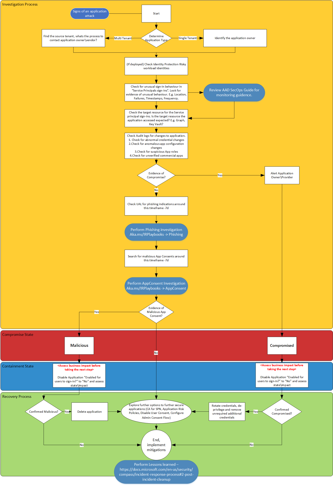

# Compromised and malicious applications investigation

This article provides guidance on identifying and investigating malicious attacks on one or more applications in a customer tenant. The step-by-step instructions will help you take the required remedial action to protect information and minimize further risks.

- **Prerequisites:** Covers the specific requirements you need to complete before starting the investigation. For example, logging that should be turned on, roles and permissions required, among others.
- **Workflow:** Shows the logical flow that you should follow to perform this investigation.
- **Investigation steps:** Includes a detailed step-by-step guidance for this specific investigation.
- **Containment steps:** Contains steps on how to disable the compromised applications. 
- **Recovery steps:** Contains high-level steps on how to recover/mitigate from a malicious attack on compromised applications.
- **References:** Contains additional reading and reference materials.

## Prerequisites

Before starting the investigation, make sure you have the correct tools and permissions to gather detailed information on the applications that you suspect to be compromised by the malicious attack.

- To leverage Identity protection signals, the tenant must be licensed for Azure Active Directory (Azure AD) Premium P2.
  - Understanding of the [Identity Protection risk concepts](/azure/active-directory/identity-protection/concept-identity-protection-risks)
  - Understanding of the [Identity Protection investigation concepts](/azure/active-directory/identity-protection/howto-identity-protection-investigate-risk)

- An account with the following directory roles:
  - Global administrator
  - Security administrator

- Ability to use [Microsoft Graph Explorer](/graph/graph-explorer) and be familiar (to some extent) with the Microsoft Graph API.

- Familiarize yourself with the [application auditing concepts](/azure/active-directory/fundamentals/security-operations-applications) (part of https://aka.ms/AzureADSecOps).

- Make sure all Enterprise apps in your tenant have an owner set for the purposes of accountability. Review the concepts on [overview of app owners](/azure/active-directory/manage-apps/overview-assign-app-owners) and [assigning app owners](/azure/active-directory/manage-apps/assign-app-owners).

- Familiarize yourself with the concepts of the [App Consent grant investigation](incident-response-playbook-app-consent.md) (part of https://aka.ms/IRPlaybooks).

- Make sure you understand the following Azure AD permissions:
  - [Risky permissions](incident-response-playbook-app-consent.md#classifying-risky-permissions)
  - [Consent model and the Admin consent workflow](/azure/active-directory/manage-apps/configure-admin-consent-workflow)

- Familiarize yourself with the concepts of [Workload identity risk detections](/azure/active-directory/identity-protection/concept-workload-identity-risk).

- You must have full Microsoft 365 E5 license to leverage Microsoft Defender for Cloud Apps. 
  - Understand the concepts of [anomaly detection alert investigation](/defender-cloud-apps/app-governance-anomaly-detection-alerts).  

- Familiarize yourself with the following application management policies:
  - [Azure AD application authentication methods API overview (preview)](/graph/api/resources/applicationauthenticationmethodpolicy?view=graph-rest-beta)
  - [appManagementPolicy resource type](/graph/api/resources/appmanagementpolicy?view=graph-rest-beta)

- Familiarize yourself with the following App Governance policies:
  - [The App Governance blog](https://techcommunity.microsoft.com/t5/security-compliance-and-identity/announcing-public-preview-of-app-governance/ba-p/2543768)
  - [App governance add-on to Defender for Cloud Apps](/defender-cloud-apps/app-governance-manage-app-governance)

### Required tools

For an effective investigation, install the following PowerShell module and the toolkit on your investigation machine:

- [Azure AD Incident Response PowerShell Module](https://github.com/AzureAD/Azure-AD-Incident-Response-PowerShell-Module)
- [Azure AD Toolkit](https://github.com/microsoft/AzureADToolkit)

## Workflow



## Investigation steps

For this investigation, it is assumed that you either have a indication for a potential application compromise in the form of a user report, Azure AD sign-in logs example, or Identity protection detection. Make sure to complete and enable all required prerequisite steps.

This playbook is created with the intention that not all Microsoft customers and their investigation teams will have the full Microsoft 365 E5 or Azure AD Premium P2 license suite available or configured in the tenant that is being investigated. We will however highlight additional automation capabilities when appropriate.

### Determine application type

It is important to determine the type of application (multi or single tenant) early in the investigation phase to get the correct information needed to reach out to the application owner. For more information, see [Tenancy in Azure Active Directory](/azure/active-directory/develop/single-and-multi-tenant-apps).

#### Multi-tenant applications

For multi-tenant applications, the application is hosted and managed by a third party. Identify the process needed to reach out and report issues to the application owner.

#### Single-tenant applications

Find the contact details of the application owner within your organization. You can find it under the **Owners** tab on the **Enterprise Applications** section. Alternatively, your organization may have a database that has this information.

You can also execute this Microsoft Graph query:

```HTTP
GET https://graph.microsoft.com/v1.0/applications/{id}/owners
```

### Check Identity Protection - risky workload identities

This feature is in preview at the time of writing this playbook and licensing requirements will apply to its usage. Risky workload identities can be the trigger to investigate a Service Principal, but can also be used to further investigate into other triggers you may have identified. You can check the **Risk State** of a Service Principal using the **Identity Protection - risky workload identities** tab, or you can use Microsoft Graph API.

:::image type="content" source="./media/compromised-malicious-apps/WorkloadIdentity-RiskDetectionSignalPortal_2.png" alt-text="Risk Detection portal":::

:::image type="content" source="./media/compromised-malicious-apps/WorkloadIdentity-RiskDetectionSignalPortal.png" alt-text="Risk Detection details":::

:::image type="content" source="./media/compromised-malicious-apps/SPRiskDetectionGraphSample.png" alt-text="A sample of Service Principal Risk Detection Graph API":::

### Check for unusual sign-in behavior

The first step of the investigation is to look for evidence of unusual authentications patterns in the usage of the Service Principal. Within the Azure portal, Azure Monitor, Azure Sentinel, or the Security Information and Event Management (SIEM) system of your organization's choice, look for the following in the **Service principal sign-ins** section:

- Location - is the Service Principal authenticating from locations\IP addresses that you would not expect?
- Failures - are there a large number of authentication failures for the Service Principal?
- Timestamps - are there successful authentications that are occurring at times that you would not expect?
- Frequency - is there an increased frequency of authentications for the Service Principal?
- Leak Credentials - are any application credentials hard coded and published on a public source like GitHub?

If you have deployed Identity Protection - risky workload identities, check the **Suspicious Sign-ins and Leak Credentials detections**. For more information, see [workload identity risk detentions](/azure/active-directory/identity-protection/concept-workload-identity-risk#workload-identity-risk-detections).

### Check the target resource

Within Service principal sign-ins, also check the **Resource** that the Service Principal was accessing during the authentication. It is important to have input from the application owner as they will be familiar with which resources the Service Principal should be accessing.

:::image type="content" source="./media/compromised-malicious-apps/TargetResource.png" alt-text="Check the Resource for Service Principal":::

### Check for abnormal credential changes

Use Audit logs to get information on credential changes on applications and service principals. Filter for **Category** by **Application Management**, and **Activity** by **Update Application – Certificates and secrets management**.

- Check whether there are newly created or unexpected credentials assigned to the service principal.
- Check for credentials on Service Principal using Microsoft Graph API.
- Check both the application and associated service principal objects.
- Check any [custom role](/azure/active-directory/roles/custom-enterprise-apps) that maybe have been created or modified. Note the permissions marked below:

:::image type="content" source="./media/compromised-malicious-apps/CustomRolesToCheck.png" alt-text="Check custom roles that may be created or modified":::

If you have deployed the app governance add-on, check the Azure portal for alerts relating to the application. For more information, see [Get started with app threat detection and remediation](/defender-cloud-apps/app-governance-detect-remediate-get-started).

If you have deployed Identity Protection, check the "Risk detections" report and in the user or workload identity “risk history”.

:::image type="content" source="./media/compromised-malicious-apps/WorkloadIdentity-RiskDetectionSignalPortal_2.png" alt-text="Risk Detection portal":::

If you have deployed Microsoft Defender for Cloud Apps, ensure that the "Unusual addition of credentials to an OAuth app" policy is enabled, and check for open alerts.
For more information, see [Unusual addition of credentials to an OAuth app](/defender-cloud-apps/investigate-anomaly-alerts#unusual-addition-of-credentials-to-an-oauth-app). 

Additionally, you can query the [servicePrincipalRiskDetections](/graph/api/identityprotectionroot-list-serviceprincipalriskdetections) and user [riskDetections APIs](/graph/api/resources/riskdetection) to retrieve these risk detections.

### Search for anomalous app configuration changes

- Check the API permissions assigned to the app to ensure that the permissions are consistent with what is expected for the app.
- Check Audit logs (filter **Activity** by **Update Application** or **Update Service Principal**).
- Confirm whether the connection strings are consistent and whether has the sign-out URL has been modified.
- Confirm whether the domains in the URL are in-line with those registered.
- Determine whether anyone has added an unauthorized redirect URL.
- Confirm ownership of the redirect URI that you own to ensure it did not expire and was claimed by an adversary.

Also, if you have deployed Microsoft Defender for Cloud Apps, check the Azure portal for alerts relating to the application you are currently investigating. Not all alert policies are enabled by default for OAuth apps, so ensure that these are all enabled. For more information, see the [OAuth app policies](/defender-cloud-apps/app-permission-policy). You can also view information about the apps prevalance and recent activity under the **Investigation** > **OAuth Apps** tab.

### Check for suspicious application roles

- This can also be investigated using the Audit logs. Filter **Activity** by **Add app role assignment to service principal**.
- Confirm whether the assigned roles have high privilege.
- Confirm whether those privileges are necessary.

### Check for unverified commercial apps

- Check whether commercial gallery (published and verified versions) applications are being used.

### Check for indications of keyCredential property information disclosure

Review your tenant for potential keyCredential property information disclosure as outlined in [CVE-2021-42306](https://msrc.microsoft.com/update-guide/vulnerability/CVE-2021-42306).

To identify and remediate impacted Azure AD applications associated with impacted Automation Run-As accounts, please navigate to the [remediation guidance Github Repo](https://github.com/microsoft/aad-app-credential-tools/blob/main/azure-automation/azure-automation-runas-credential-remediation.md). 

>[!Important]
>**Evidence of compromise:**
>If you discover evidence of compromise, then it is important to take the steps highlighted in the containment and recovery sections. This will help address the risk, but will need further investigation to understand the source of the compromise to avoid further impact and ensure bad actors are removed. 

There are two primary methods of gaining access to systems via the use of applications. The first involves an application being consented to by an administrator or user, usually via a phishing attack. This would be part of initial access to a system and is often referred to as "consent phishing".

The second method involves an already compromised administrator account creating a new app for the purposes of persistence, data collection and to stay under the radar. For example, an OAuth app could be created by a compromised administrator with a seemingly innocuous name, avoiding detection and allowing long term access to data without the need for an account. This is often seen in nation state attacks.

Below are some of the steps which can be taken to investigate further. 

### Check M365 Unified Audit Log (UAL) for phishing indications for the past 7 days

Sometimes, when attackers use malicious or compromised applications as a means of persistence or to exfiltrate data, a phishing campaign is involved. Based on the findings from the previous steps, you should review the identities of:

- Application Owners
- Consent Admins

Review the identities for indications of phishing attacks in the last 24 hours. Increase this time span if needed to 7, 14, and 30 days if there are no immediate indications. For a detailed phishing investigation playbook, see the [Phishing Investigation Playbook](incident-response-playbook-phishing.md).

### Search for malicious application consents for the past 7 days

To get an application added to a tenant, attackers spoof users or admins to consent to applications. To know more about the signs of an attack, see the [Application Consent Grant Investigation Playbook](incident-response-playbook-app-consent.md#finding-signs-of-an-attack). 

### Check application consent for the flagged application

#### Check Audit logs 

To see all consent grants for that application, filter **Activity** by **Consent to application**. 

- Use the Azure AD Portal Audit Logs

- Use Microsoft Graph to query the Audit logs

  a) Filter for a specific time frame:
  
```HTTP
GET https://graph.microsoft.com/v1.0/auditLogs/auditLogs/directoryAudits?&$filter=activityDateTime le 2022-01-24
```

  b) Filter the Audit Logs for 'Consent to Applications' audit log entries:

```http
https://graph.microsoft.com/v1.0/auditLogs/directoryAudits?directoryAudits?$filter=ActivityType eq 'Consent to application'


"@odata.context": "https://graph.microsoft.com/v1.0/$metadata#auditLogs/directoryAudits",
"value": [
    {
        "id": "Directory_0da73d01-0b6d-4c6c-a083-afc8c968e655_78XJB_266233526",
        "category": "ApplicationManagement",
        "correlationId": "0da73d01-0b6d-4c6c-a083-afc8c968e655",
        "result": "success",
        "resultReason": "",
        "activityDisplayName": "Consent to application",
        "activityDateTime": "2022-03-25T21:21:37.9452149Z",
        "loggedByService": "Core Directory",
        "operationType": "Assign",
       "initiatedBy": {
            "app": null,
            "user": {
                "id": "8b3f927e-4d89-490b-aaa3-e5d4577f1234",
                "displayName": null,
                "userPrincipalName": "admin@contoso.com",
                "ipAddress": "55.154.250.91",
                "userType": null,
                "homeTenantId": null,
                "homeTenantName": null
            }
        },
        "targetResources": [
            {
                "id": "d23d38a1-02ae-409d-884c-60b03cadc989",
                "displayName": "Graph explorer (official site)",
                "type": "ServicePrincipal",
                "userPrincipalName": null,
                "groupType": null,
                "modifiedProperties": [
                    {
                        "displayName": "ConsentContext.IsAdminConsent",
                        "oldValue": null,
                        "newValue": "\"True\""
                    },
```

  c) Use Log Analytics

```
AuditLogs
| where ActivityDisplayName == "Consent to application"
```

For more information, see the [Application Consent Grant Investigation Playbook](incident-response-playbook-app-consent.md).

#### Determine if there was suspicious end-user consent to the application

A user can authorize an application to access some data at the protected resource, while acting as that user. The permissions that allow this type of access are called "delegated permissions" or [user consent](/azure/active-directory/manage-apps/consent-and-permissions-overview#user-consent).

To find apps that have been consented by users, use LogAnalytics to search the Audit logs:

```
AuditLogs
| where ActivityDisplayName == "Consent to application" and (parse_json(tostring(parse_json(tostring(TargetResources[0].modifiedProperties))[0].newValue)) <> "True")
```

#### Check Audit logs to find whether the permissions granted are too broad (tenant-wide or admin-consented)

Reviewing the permissions granted to an application or Service Principal can be a time-consuming task. Start with understanding the potentially [risky permissions](incident-response-playbook-app-consent.md#classifying-risky-permissions) in Azure AD.

Now, follow the guidance on how to enumerate and review permissions in the [App consent grant investigation](incident-response-playbook-app-consent.md#method-2---using-powershell).

#### Check whether the permissions were granted by user identities that should not have the ability to do this, or whether the actions were performed at strange dates and times

Review using Audit Logs:

```
AuditLogs
| where OperationName == "Consent to application" 
//| where parse_json(tostring(TargetResources[0].modifiedProperties))[4].displayName == "ConsentAction.Permissions"
```

You can also use the Azure AD Audit logs, filter by **Consent to application**. In the Audit Log details section, click **Modified Properties**, and then review the **ConsentAction.Permissions**:

:::image type="content" source="./media/compromised-malicious-apps/AuditLogDetails-ConsentPermissions.png" alt-text="Use the Azure AD Audit Logs":::

## Containment steps

Once you have identified one or more applications or workload identities as either malicious or compromised, you may not immediately want to roll the credentials for this application, nor you want to immediately delete the application. It is highly recommended, that you follow the best practice guidance for [incident response](incident-response-process.md).

>[!Important]
>Before you perform the following step, your organization must weigh up the security impact and the business impact of disabling an application. If the business impact of disabling an application is too great, then consider preparing and moving to the Recovery stage of this process.

### Disable compromised application

A typical containment strategy involves the disabling of sign-ins to the application identified, to give your incident response team or the affected business unit time to evaluate the impact of deletion or key rolling. If your investigation leads you to believe that administrator account credentials have also been compromised, this type of activity should be coordinated with an eviction event to ensure that all routes to accessing the tenant are cut off simultaneously. 

:::image type="content" source="./media/compromised-malicious-apps/DisabledAppExample.png" alt-text="Toggle to disable users to sign-in":::

You can also use the following PowerShell code to disable the sign-in to the app:

```powershell
# The AppId of the app to be disabled
$appId = "{AppId}"

# Check if a service principal already exists for the app
$servicePrincipal = Get-AzureADServicePrincipal -Filter "appId eq '$appId'"
if ($servicePrincipal) {
   # Service principal exists already, disable it
   Set-AzureADServicePrincipal -ObjectId $servicePrincipal.ObjectId -AccountEnabled $false
} else {
   # Service principal does not yet exist, create it and disable it at the same time
   $servicePrincipal = New-AzureADServicePrincipal -AppId $appId -AccountEnabled $false
}
```

## Recovery steps

### Remediate Service Principals

1. List all credentials assigned to the **Risky Service Principal**. The best way to do this is to perform a Microsoft Graph call using GET ~/application/{id} where id passed is the application object ID.

    - Parse the output for credentials. The output may contain passwordCredentials or keyCredentials. Record the keyIds for all. 

      ```
      "keyCredentials": [],
           "parentalControlSettings": {
               "countriesBlockedForMinors": [],
               "legalAgeGroupRule": "Allow"
           },
           "passwordCredentials": [
               {
                   "customKeyIdentifier": null,
                   "displayName": "Test",
                   "endDateTime": "2021-12-16T19:19:36.997Z",
                   "hint": "7~-",
                   "keyId": "9f92041c-46b9-4ebc-95fd-e45745734bef",
                   "secretText": null,
                   "startDateTime": "2021-06-16T18:19:36.997Z"
               }
           ],
      ```

2. Add a new (x509) certificate credential to the application object using the application addKey API.

   ```
   POST ~/applications/{id}/addKey
   ```

3. Immediately remove all old credentials. For each old password credential, remove it by using:

   ```
   POST ~/applications/{id}/removePassword
   ```

   For each old key credential, remove it by using:

   ```
   POST ~/applications/{id}/removeKey
   ```

4. Remediate all Service Principals associated with the application. Follow this if your tenant hosts/registers a multi-tenant application, and/or registers multiple service principals associated to the application. Perform similar steps to what is listed above:

- GET ~/servicePrincipals/{id}
- Find passwordCredentials and keyCredentials in the response, record all old keyIds
- Remove all old password and key credentials. Use:
  
  ```
  POST ~/servicePrincipals/{id}/removePassword and POST ~/servicePrincipals/{id}/removeKey for this, respectively.
  ```

### Remediate affected Service Principal resources

Remediate KeyVault secrets that the Service Principal has access to by rotating them, in the following priority:

- Secrets directly exposed with [GetSecret](/java/api/com.microsoft.azure.keyvault.keyvaultclient.getsecret) calls.
- The rest of the secrets in exposed KeyVaults.
- The rest of the secrets across exposed subscriptions.

For more information, see [Interactively removing and rolling over the certificates and secrets of a Service Principal or Application](https://github.com/microsoft/azureadtoolkit#interactively-removing-and-rolling-over-the-certificates-and-secrets-of-a-service-principal-or-application).

 For Azure AD SecOps guidance on applications, see [Azure Active Directory security operations guide for Applications](/azure/active-directory/fundamentals/security-operations-applications).

In order of priority, this scenario would be:

- Update Graph PowerShell cmdlets (Add/Remove ApplicationKey + ApplicationPassword) doc to include examples for credential roll-over.
- Add custom cmdlets to Microsoft Graph PowerShell that simplifies this scenario.

### Disable or delete malicious applications

An application can either be disabled or deleted. To disable the application, under **Enabled for users to sign in**, move the toggle to **No**.

You can delete the application, either temporarily or permanently, in the Azure portal or through the Microsoft Graph API. When you soft delete, the application can be recovered up to 30 days after deletion.

```
DELETE /applications/{id}
```

To permanently delete the application, use this Microsoft Graph API call:

```
DELETE /directory/deletedItems/{id}
```

If you disable or if you soft delete the application, set up monitoring in Azure AD Audit logs to learn if the state changes back to enabled or recovered.

**Logging for enabled:**

- **Service** - Core Directory
- **Activity Type** - Update Service Principle
- **Category** - Application Management
- **Initiated by (actor)** - UPN of actor
- **Targets** - App ID and Display Name
- **Modified Properties** - Property Name = account enabled, new value = true

**Logging for recovered:**

- **Service** - Core Directory
- **Activity Type** - Add Service Principle
- **Category** - Application Management
- **Initiated by (actor)** - UPN of actor
- **Targets** - App ID and Display Name
- **Modified Properties** - Property name = account enabled, new value = true

### Implement Identity Protection for workload identities

**Suspicious sign-ins**: When risk detection indicates unusual sign-in properties or patterns, as well as unusual addition of credentials to an OAuth App, that may be an indicator of compromise. The detection baselines sign-in behavior between 2 and 60 days, and fires if one or more of the following unfamiliar properties occur during a subsequent sign-in:

- IP address / ASN
- Target resource
- User agent
- Hosting/non-hosting IP change
- IP country
- Credential type

When this detection is fired, the account is marked as high risk because this can indicate account takeover for the subject application. Note that the legitimate changes to an application’s configuration will sometimes trigger this detection. 

For more information, see [Securing workload identities with Identity Protection](/azure/active-directory/identity-protection/concept-workload-identity-risk).

These alerts appear in the Identity Protection portal and can be exported into SIEM tools through the [Identity Protection APIs](/graph/api/resources/identityprotection-overview?view=graph-rest-beta&preserve-view=true).

:::image type="content" source="./media/compromised-malicious-apps/IR_playbook_workload_identity_detections.png" alt-text="Review risks and alerts in the Identity Protection portal":::

### Conditional Access for risky workload identities

Conditional Access allows you to block access for specific accounts that you designate when Identity Protection marks them as “at risk.” Note that the enforcement through Conditional Access is currently limited to single-tenant applications only.

:::image type="content" source="./media/compromised-malicious-apps/RiskbasedCAPolicySample.png" alt-text="Control user access based on conditional access policy":::

For more information, see [Conditional Access for workload identities](/azure/active-directory/conditional-access/workload-identity).

### Implement application risk policies

#### Review user consent settings

Review the user consent settings under **Azure Active Directory** > **Enterprise applications** > **Consent and permissions** > **User consent settings**.

:::image type="content" source="./media/compromised-malicious-apps/UserConsentSettings.png" alt-text="Select Allow user consent for apps from the options":::

To review configuration options, see [Configure how users consent to apps](/azure/active-directory/manage-apps/configure-user-consent?tabs=azure-portal).

#### Implement admin consent flow

When an application developer directs users to the admin consent endpoint with the intent to give consent for the entire tenant, it is known as admin consent flow. To ensure the admin consent flow works properly, application developers must list all permissions in the RequiredResourceAccess property in the application manifest.

Most organizations disable the ability for their users to consent to applications. To give users the ability to still request consent for applications and to have an administrative review capability, it is recommended to implement the admin consent workflow. Follow the [admin consent workflow steps](/azure/active-directory/manage-apps/configure-admin-consent-workflow) to configure it in your tenant.

For high privileged operations such as admin consent, you have a privileged access strategy defined as per our [guidance](overview.md). 

### Configure risk-based step-up consent

Risk-based step-up consent helps reduce user exposure to malicious apps. For example, consent requests for newly registered multi-tenant apps that are not publisher verified and require non-basic permissions are considered risky. If a risky user consent request is detected, the request requires a "step-up" to admin consent instead. This step-up capability is enabled by default, but it results in a behavior change only when user consent is enabled.

To enable it, follow the steps outlined [here](/azure/active-directory/manage-apps/configure-risk-based-step-up-consent).

## References

- [Incident Response Playbooks](incident-response-playbooks.md)
- [App consent grant](incident-response-playbook-app-consent.md)
- [Azure AD Identity Protection risks](/azure/active-directory/identity-protection/concept-identity-protection-risks)
- [Azure AD security monitoring guide](/azure/active-directory/fundamentals/security-operations-introduction)
- [Application auditing concepts](/azure/active-directory/fundamentals/security-operations-applications)
- [Configure how users consent to applications](/azure/active-directory/manage-apps/configure-user-consent)
- [Configure the admin consent workflow](/azure/active-directory/manage-apps/configure-admin-consent-workflow)
- [Unusual addition of credentials to an OAuth app](/defender-cloud-apps/investigate-anomaly-alerts#unusual-addition-of-credentials-to-an-oauth-app)
- [Securing workload identities with Identity Protection](/azure/active-directory/identity-protection/concept-workload-identity-risk)
- [Holistic compromised identity signals from Microsoft](/azure-active-directory-identity/holistic-compromised-identity-signals-from-microsoft/ba-p/2365683)

## Additional incident response playbooks

Examine guidance for identifying and investigating these additional types of attacks:

- [Phishing](incident-response-playbook-phishing.md)
- [Password spray](incident-response-playbook-password-spray.md)
- [App consent grant](incident-response-playbook-app-consent.md)
- [Microsoft DART ransomware approach and best practices](incident-response-playbook-dart-ransomware-approach.md)

## Incident response resources

- [Overview](incident-response-overview.md) for Microsoft security products and resources for new-to-role and experienced analysts
- [Planning](incident-response-planning.md) for your Security Operations Center (SOC)
- [Process](incident-response-process.md) for incident response process recommendations and best practices
- [Microsoft 365 Defender](/microsoft-365/security/defender/incidents-overview) incident response
- [Microsoft Defender for Cloud (Azure)](/azure/defender-for-cloud/managing-and-responding-alerts)
- [Microsoft Sentinel](/azure/sentinel/investigate-cases) incident response
