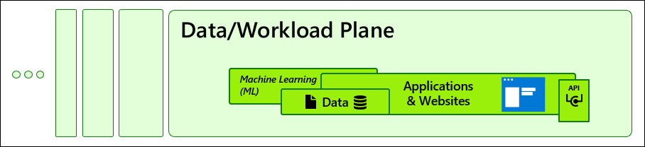
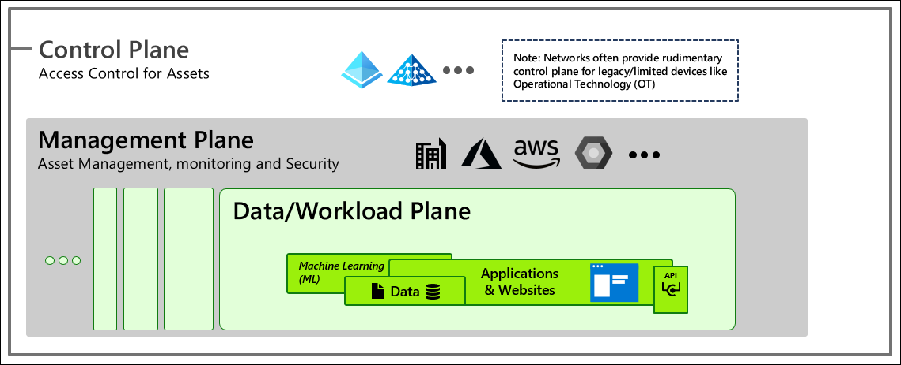
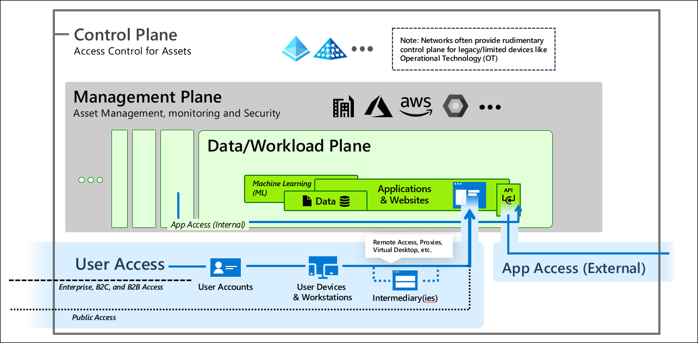

# Enterprise access model

This document describes an overall enterprise access model that includes context of how a [privileged access strategy](privileged-access-strategy.md) fits in. For a roadmap on how to adopt a privileged access strategy, see the [rapid modernization plan (RaMP)](security-rapid-modernization-plan.md). For implementation guidance to deploy this, see [privileged access deployment](privileged-access-deployment.md)

Privileged access strategy is part of an overall enterprise access control strategy. This enterprise access model shows how privileged access fits into an overall enterprise access model.

The primary stores of business value that an organization must protect are in the Data/Workload plane:

The applications and data typically store a large percentage of an organization's:

- **Business processes** in applications and workloads
- **Intellectual property** in data and applications

The enterprise IT organization manages and supports the workloads and the infrastructure they are hosted on, whether it's on-premises, on Azure, or a third-party cloud provider, creating a **management plane**. Providing consistent access control to these systems across the enterprise requires a **control plane** based on centralized enterprise identity system(s), often supplemented by network access control for older systems like operational technology (OT) devices.

Each of these planes has control of the data and workloads by virtue of their functions, creating an attractive pathway for attackers to abuse if they can gain control of either plane.

For these systems to create business value, they must be accessible to internal users, partners, and customers using their workstations or devices (often using remote access solutions) - creating **user access** pathways. They must also frequently be available programmatically via application programming interfaces (APIs) to facilitate process automation, creating **application access** pathways.

Finally, these systems must be managed and maintained by IT staff, developers, or others in the organizations, creating **privileged access** pathways. Because of the high level of control they provide over business critical assets in the organization, these pathways must be stringently protected against compromise.

Providing consistent access control in the organization that enables productivity and mitigates risk requires you to

- Enforce Zero Trust principles on all access
   - Assume Breach of other components
   - Explicit validation of trust
   - Least privilege access
- Pervasive security and policy enforcement across
   - Internal and external access to ensure consistent policy application
   - All access methods including users, admins, APIs, service accounts, etc.
- Mitigate unauthorized privilege escalation
   - Enforce hierarchy – to prevent control of higher planes from lower planes (via attacks or abuse of legitimate processes)
      - Control plane
      - Management plane
      - Data/workload plane
   - Continuously audit for configuration vulnerabilities enabling inadvertent escalation
   - Monitor and respond to anomalies that could represent potential attacks
	
## Evolution from the legacy AD tier model

The enterprise access model supersedes and replaces the legacy tier model that was focused on containing unauthorized escalation of privilege in an on-premises Windows Server Active Directory environment. 

The enterprise access model incorporates these elements as well as full access management requirements of a modern enterprise that spans on-premises, multiple clouds, internal or external user access, and more. 

### Tier 0 scope expansion

Tier 0 expands to become the control plane and addresses all aspects of access control, including networking where it is the only/best access control option, such as legacy OT options

### Tier 1 splits

To increase clarity and actionability, what was tier 1 is now split into the following areas:

- **Management plane** – for enterprise-wide IT management functions
- **Data/Workload plane** – for per-workload management, which is sometimes performed by IT personnel and sometimes by business units

This split ensures focus for protecting business critical systems and administrative roles that have high intrinsic business value, but limited technical control. Additionally, this split better accommodates developers and DevOps models vs. focusing too heavily on classic infrastructure roles.

### Tier 2 splits

To ensure coverage for application access and the various partner and customer models, Tier 2 was split into the following areas:

- **User access** – which includes all B2B, B2C, and public access scenarios
- **App access** – to accommodate API access pathways and resulting attack surface

## Next steps

- [Securing privileged access overview](overview.md)
- [Privileged access strategy](privileged-access-strategy.md)
- [Measuring success](privileged-access-success-criteria.md)
- [Security levels](privileged-access-security-levels.md)
- [Privileged access accounts](privileged-access-accounts.md)
- [Intermediaries](privileged-access-intermediaries.md)
- [Interfaces](privileged-access-interfaces.md)
- [Privileged access devices](privileged-access-devices.md)
