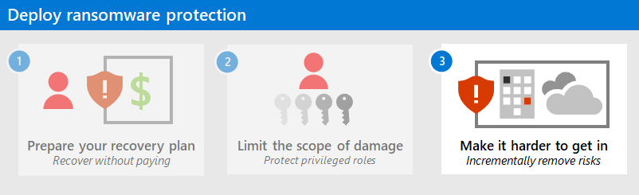

# Phase 2: Limit the scope of damage

In this phase, you prevent attackers from obtaining a large scope of access for potential damage to data and systems by protecting privileged roles.

## Privileged access strategy

You must implement a comprehensive strategy to reduce the risk of privileged access compromise.

All other security controls can easily be invalidated by an attacker with privileged access in your environment. Ransomware attackers use privileged access as a quick path to control all critical assets in the organization for their extortion. 

### Program and project member accountabilities

This table describes a privileged access strategy against ransomware in terms of a sponsorship/program management/project management hierarchy to determine and drive results.

| Lead | Implementor | Accountability |
|:-------|:-------|:-----|
| CISO or CIO | | Executive sponsorship |
| Program lead | | Drive results and cross-team collaboration |
|  | IT and [Security Architects](/azure/cloud-adoption-framework/organize/cloud-security-architecture) |  Prioritize components integrate into architectures |
|  | [Identity and Key Management](/azure/cloud-adoption-framework/organize/cloud-security-identity-keys) | Implement identity changes |
|  | [Central IT](/azure/cloud-adoption-framework/organize/central-it) Productivity / End User Team | Implement changes to devices and Office 365 tenant |
|  | [Security Policy and Standards](/azure/cloud-adoption-framework/organize/cloud-security-policy-standards) | Update standards and policy documents |
|  | [Security Compliance Management](/azure/cloud-adoption-framework/organize/cloud-security-compliance-management) | Monitor to ensure compliance |
|  | User Education Team | Update any password guidance |
|  |  |  |

### Implementation checklist

Build a multi-part strategy using the guidance at [https://aka.ms/SPA](https://aka.ms/SPA) that includes this checklist.

| Done| Task | Description |
|:-------|:-------|:-----|
| <input type="checkbox" /> | Enforce end-to-end session security. | Explicitly validates the trust of users and devices before allowing access to administrative interfaces (using [Azure AD Conditional Access](/azure/active-directory/conditional-access/overview)). |
| <input type="checkbox" /> |  Protect and monitor identity systems. | Prevents privilege escalation attacks including directories, identity management, administrator accounts and groups, and consent grant configuration. |
| <input type="checkbox" /> | Mitigate lateral traversal. | Ensures that compromising a single device does not immediately lead to control of many or all other devices using local account passwords, service account passwords, or other secrets. |
| <input type="checkbox" /> | Ensure rapid threat response. | Limits an adversary's access and time in the environment. See [Detection and Response](protect-against-ransomware-phase2.md#detection-and-response) for more information. |
|  |  |  |

<!--
| Done| Task | Description | Result | Priority | Level of difficulty | Dependencies |
|:-------|:-------|:-----|:-------|:-------|:-------|:-------|
| <input type="checkbox" /> | Enforce end-to-end session security | explicitly validate trust of users and workstations before allowing access to administrative interfaces (using [Azure AD Conditional Access](/azure/active-directory/conditional-access/overview)). |  |  |  |  |
| <input type="checkbox" /> |  Protect and monitor identity systems | against privilege escalation attacks including directories, identity management, administrator accounts and groups, and consent grant configuration. |  |  |  |  |
| <input type="checkbox" /> | Mitigate lateral traversal | Ensure that compromising a single device will not immediately lead to control of many or all other devices using local account passwords, service account passwords, or other secrets |  |  |  |  |
| <input type="checkbox" /> | Ensure rapid threat response | Limit adversary access and time in the environment. See [Detection and Response](protect-against-ransomware-phase2.md#detection-and-response) for more information. |  |  |  |  |
|  |  |  |  |  |  |  |

--> 

### Implementation results and timelines

Try to achieve these results in 30-90 days:

- 100 % of admins required to use secure workstations
- 100 % local workstation/server passwords randomized
- 100 % deployment of privilege escalation mitigations

## Detection and response

Your organization needs responsive detection and remediation of common attacks on endpoints, email, and identities. Minutes matter. You must rapidly remediate common attack entry points to limit the attacker’s time to laterally traverse your organization.

### Program and project member accountabilities

This table describes the improvement of your detection and response capability against ransomware in terms of a sponsorship/program management/project management hierarchy to determine and drive results.

| Lead | Implementor | Accountability |
|:-------|:-------|:-----|
| CISO or CIO | | Executive sponsorship |
| Program lead from [Security Operations](/azure/cloud-adoption-framework/organize/cloud-security-operations-center) | | Drive results and cross-team collaboration |
|  | [Central IT](/azure/cloud-adoption-framework/organize/central-it) Infrastructure Team | Implement client and server agents/features |
|  | [Security Operations](/azure/cloud-adoption-framework/organize/cloud-security-operations-center) | Integrate any new tools into security operations processes |
|  | [Central IT](/azure/cloud-adoption-framework/organize/central-it) Productivity / End User Team | Enable features for Defender for Endpoints, Defender for Office 365, Defender for Identity, and Cloud App Security |
|  | [Central IT](/azure/cloud-adoption-framework/organize/central-it) Identity Team | Implement Azure AD security and Defender for Identity |
|  | [Security Architects](/azure/cloud-adoption-framework/organize/cloud-security-architecture) |  Advise on configuration, standards, and tooling |
|  | [Security Policy and Standards](/azure/cloud-adoption-framework/organize/cloud-security-policy-standards) | Update standards and policy documents |
|  | [Security Compliance Management](/azure/cloud-adoption-framework/organize/cloud-security-compliance-management) | Monitor to ensure compliance |
|  |  |  |

### Implementation checklist

Apply these best practices for improving your detection and response.

| Done| Task | Description |
|:-------|:-------|:-----|
| <input type="checkbox" /> | Prioritize common entry points:    - Use integrated Extended Detection and Response (XDR) tools like [Microsoft 365 Defender](/microsoft-365/security/mtp/microsoft-threat-protection) to provide high quality alerts and minimize friction and manual steps during response.    - Monitor for brute-force attempts like [password spray](/defender-for-identity/compromised-credentials-alerts). | Ransomware (and other) operators favor endpoint, email, identity, and RDP as entry points. |
| <input type="checkbox" /> | Monitor for an adversary disabling security (this is often part of an attack chain), such as:    - Event log clearing, especially the Security Event log and PowerShell Operational logs.    - Disabling of security tools and controls (associated with some groups). | Attackers target security detection facilities to more safely continue their attack. |
| <input type="checkbox" /> | Don’t ignore commodity malware. | Ransomware attackers regularly purchase access to target organizations from dark markets. |
| <input type="checkbox" /> | Integrate outside experts into processes to supplement expertise, such as the [Microsoft Detection and Response Team (DART)](https://aka.ms/dart). | Experience counts for detection and recovery. |
| <input type="checkbox" /> | Rapidly isolate compromised computers using [Defender for Endpoint](/windows/security/threat-protection/microsoft-defender-atp/respond-machine-alerts#isolate-devices-from-the-network). | Windows 10 integration makes this easy. |
|  |  |  |

<!--
| Done| Task | Description | Result | Priority | Level of difficulty | Dependencies |
|:-------|:-------|:-----|:-------|:-------|:-------|:-------|
| <input type="checkbox" /> | Prioritize common entry points | Ransomware (and other) operators favor Endpoint/Email/Identity + RDP | Integrated XDR - Use integrated Extended Detection and Response (XDR) tools like [Microsoft 365 Defender(/microsoft-365/security/mtp/microsoft-threat-protection)] to provide high quality alerts and minimize friction and manual steps during response    Brute Force - Monitor for brute-force attempts like [password spray](/defender-for-identity/compromised-credentials-alerts) |  |  |  |
| <input type="checkbox" /> | Monitor for adversary disabling security | this is often part of HumOR attack chain | Event Logs Clearing – especially the Security Event log and PowerShell Operational logs    Disabling of security tools/controls (associated with some groups) |  |  |  |
| <input type="checkbox" /> | Don’t ignore commodity malware | Ransomware attackers regularly purchase access to target organizations from dark markets |  |  |  |  |
| <input type="checkbox" /> | Integrate outside experts into processes to supplement expertise, such as the [Microsoft Detection and Response Team (DART)](https://aka.ms/dart) |  |  |  |  |  |
| <input type="checkbox" /> | Rapidly isolate compromised computers using [Defender for Endpoint](/windows/security/threat-protection/microsoft-defender-atp/respond-machine-alerts#isolate-devices-from-the-network) |  |  |  |  |  |
|  |  |  |  |  |  |  |

### Implementation results and timelines

Try to achieve these results within 30 days:

- TBD for Mean Time to Acknowledge (MTTA) Alerts
- TBD for Mean Time to Remediate (MTTR) Incidents

--> 

## Next step

Continue with [Phase 3](protect-against-ransomware-phase3.md) to make it hard for an attacker to get into your environment by incrementally removing risks.
