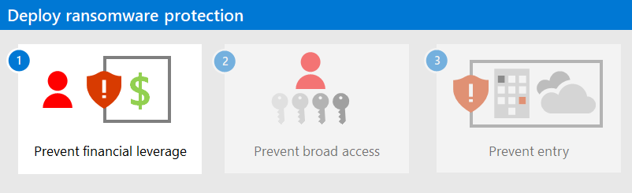

# Rapidly protect against ransomware and extortion

>[!Note]
>This guidance will be updated as new information becomes available.
>

Mitigating ransomware and extortion attacks is an urgent priority for organizations because of the high impact of these attacks and high likelihood an organization will experience one. 

Ransomware is a type of extortion attack that encrypts files and folders, preventing access to important data. Criminals use ransomware to extort money from victims by demanding money, usually in form of cryptocurrencies, in exchange for a decryption key. Criminals also often use ransomware to extort money from victims in exchange for not releasing sensitive data to the dark web or the public internet.

While early ransomware mostly used malware that spread with phishing or between devices, human-operated ransomware has emerged where a gang of active attackers, driven by human intelligence, target an organization rather than a single device or set of devices and leverage the attackers’ knowledge of common system and security misconfigurations and vulnerabilities to infiltrate the organization, navigate the enterprise network, and adapt to the environment and its weaknesses as they go.

These attacks can be catastrophic to business operations and are difficult to clean up, requiring complete adversary eviction to protect against future attacks. Unlike early forms of ransomware that only required malware remediation, human-operated ransomware can continue to threaten your business operations after the initial encounter.

## Sophistication of ransomware and extortion attacks

Technical hallmarks of these human-operated ransomware attacks typically include credential theft and lateral movement and can result in deployment of ransomware payloads to many high-value resources in order to encourage payment of the ransom. The attacker model is often effective and highly tuned, including targeting destruction or encryption of backups, network and enterprise documentation, and other artifacts that would let the organization rebuild without paying the ransom.

The attacks also have sophisticated business models, with attackers setting their ransom prices based on internal financial documentation from the company, cyber-insurance coverage levels, and typical regulatory compliance fines the company would have to pay. 

## Organization of the guidance in this solution

This guidance provides concrete instructions on how to best prepare your organization from many forms of ransomware and extortion.

To help you understand how to protect your organization from ransomware, this guidance is organized into prioritized phases. Each phase corresponds to a separate article. The priority order is designed to ensure you reduce risk as fast as possible with each phase, building on an assumption of extreme urgency that will override normal security and IT priorities to avoid or mitigate these devastating attacks.

**It is vital to note** that this guidance is structured as prioritized phases that you should follow in the prescribed order. To best adapt this guidance to your situation:

1. **Stick with the recommended priorities** 

    Use the phases as a starting plan for what to do first, next, and later so you get the most impactful elements first. 

2. **Be proactive and flexible (but don’t skip important tasks)**

    Scan through the implementation checklists for all sections of all three phases to see if there are any areas and tasks that you can quickly complete earlier (e.g., already have access to a cloud service that hasn’t been utilized but could be quickly and easily configured). As you look over the whole plan, be very careful that *these later areas and tasks don’t delay completion* of critically important areas like backups and privileged access!

3.	**Do some items in parallel** 

    Trying to do everything at once can be overwhelming, but some items can naturally be done in parallel. Staff on different teams can be working on tasks at the same time (e.g., backup team, endpoint team, identity team), while also driving for completion of the phases in priority order.

Implementation checklists do not intend to imply an order of tasks and results or assume a specific state of your existing configuration. Use a checklist to confirm and modify your existing configuration as needed and in a way that works within your organization. For example, in the most important backup element, you backup some systems, but they may not be offline/immutable, or you may not test the full enterprise restore procedures, or you may not have backups of critical business systems or critical IT systems like Active Directory Domain Services (AD DS) domain controllers. 

### Phase 1. Prepare for the worst

This phase is designed to [minimize the monetary incentive from ransomware attackers](protect-against-ransomware-phase1.md) by making it:

- Much harder to access and disrupt systems or encrypt or damage key organization data.
- Easier for your organization to recover from an attack without paying the ransom.

>[!Note]
>While restoring many or all enterprise systems is a difficult endeavor, the alternative of paying an attacker for a recovery key and then using tools written by the attackers to recover systems and data is a much worse option.
>

### Phase 2. Limit the scope of damage

Make the attackers work a lot harder to [gain access to multiple business critical systems via privileged access roles](protect-against-ransomware-phase2.md). Limiting the attacker’s ability to get privileged access makes it much harder to profit off of an attack on your organization, making it more likely they will give up and go elsewhere.

### Phase 3. Make it hard to get in

This last set of tasks is important to raise friction for entry but will take time to complete as part of a larger security journey. The goal of this phase is for attackers to have to work a lot harder to [obtain access to your on-premises or cloud infrastructures](protect-against-ransomware-phase3.md) at the various common points of entry for attacks. There are a lot of these tasks, so it’s important to prioritize your work here based on how fast you can accomplish these with your current resources. 

While many of these will be familiar and/or easy to quickly accomplish, it’s critically important that ***your work on phase 3 should not slow down your progress on phases 1 and 2***!

## Next step

Start with [Phase 1](protect-against-ransomware-phase1.md) to prepare your organization for the worst.
