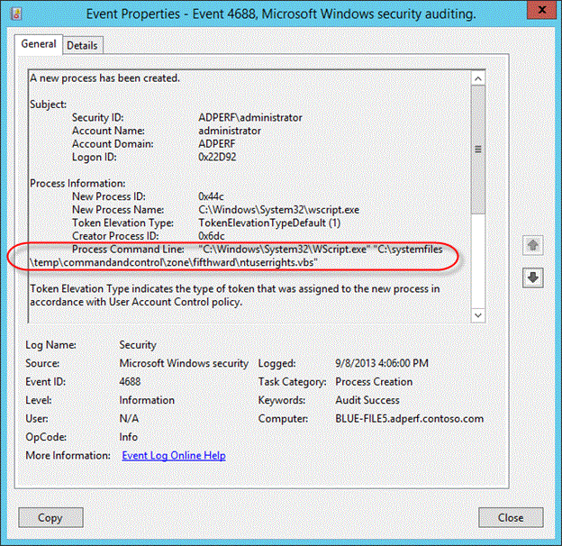

# Phishing investigation

This article provides guidance on identifying and investigating phishing attacks within your organization. The step-by-step instructions will help you take the required remedial action to protect information and minimize further risks.

This article contains the following sections:

- **Prerequisites:** Covers the specific requirements you need to complete before starting the investigation. For example, logging that should be turned on, roles and permissions required, among others.
- **Workflow:** Shows the logical flow that you should follow to perform this investigation.
- **Checklist:** Contains a list of tasks for each of the steps in the flow chart. This checklist can be helpful in highly regulated environments to verify what you have done or simply as a quality gate for yourself.
- **Investigation steps:** Includes a detailed step-by-step guidance for this specific investigation.

## Prerequisites

Here are general settings and configurations you should complete before proceeding with the phishing investigation.

### Account details

Before proceeding with the investigation, it is recommended that you have the user name, user principal name (UPN) or the email address of the account that you suspect is compromised.

### Microsoft 365 base requirements

#### Verify auditing settings

Verify that *mailbox auditing on by default* is turned on by running the following command in [Exchange Online PowerShell](/powershell/exchange/connect-to-exchange-online-powershell):

```powershell
Get-OrganizationConfig | Format-List AuditDisabled
```

The value **False** indicates that mailbox auditing is enabled for all mailboxes in the organization, regardless of the value of the *AuditEnabled* property on individual mailboxes. For more information, see [Verify mailbox auditing on by default is turned on](/microsoft-365/compliance/enable-mailbox-auditing#verify-mailbox-auditing-on-by-default-is-turned-on).

### Message trace

Message trace logs are invaluable components that help to find the original source of the message as well as the intended recipients. You can use the *message trace* functionality in Exchange admin center (EAC) at <https://admin.exchange.microsoft.com/#/messagetrace> or with the [Get-MessageTrace](/powershell/module/exchange/mail-flow/get-messagetrace) cmdlet in Exchange Online PowerShell.

> [!NOTE]
> Message trace is also available in the Microsoft 365 Defender portal at <https://security.microsoft.com> under **Email & collaboration** \> **Exchange message trace**, but that's just a passthrough link to message trace in the EAC.

Several components of the *message trace* functionality are self-explanatory but *Message-ID* is a unique identifier for an email message and requires thorough understanding. To get the *Message-ID* for an email of interest, you need to examine the raw email headers.

### Audit log search

You search the [unified audit log](/microsoft-365/compliance/search-the-audit-log-in-security-and-compliance) to view all the activities of the user and admin in your Microsoft 365 organization.

### Are the sign-in logs and/or audit logs exported to an external system?

Since most of the Azure Active Directory (Azure AD) [sign-in](/azure/active-directory/reports-monitoring/concept-sign-ins) and audit data will get overwritten after 30 or 90 days, we recommend that you leverage Sentinel, Azure Monitor or an external security information and event management (SIEM) system.

## Roles and permissions required

### Permissions in Azure AD

We recommend membership in the following roles for the account that does the investigation:

- [Global Reader](/azure/active-directory/users-groups-roles/directory-assign-admin-roles#global-reader)
- [Security Reader](/azure/active-directory/users-groups-roles/directory-assign-admin-roles#security-reader)
- As a last resort, you can always fall back to the role of a [Global Administrator / Company Administrator](/azure/active-directory/users-groups-roles/directory-assign-admin-roles#global-administrator--company-administrator)

### Permissions in Microsoft 365

Generally speaking, the [Global Reader](/azure/active-directory/users-groups-roles/directory-assign-admin-roles#global-reader) or the [Security Reader](/microsoft-365/security/office-365-security/permissions-microsoft-365-compliance-security#security-reader) role groups in the Microsoft 365 Defender portal or the Microsoft Purview compliance portal should give you sufficient permissions to search the relevant logs.

> [!NOTE]
> Accounts that are members of the **View-Only Audit Logs** or **Audit Logs** role groups only in the the Microsoft 365 Defender portal or the Microsoft Purview compliance portal won't be able to search the Microsoft 365 audit log. In this scenario, you must assign permissions in Exchange Online. For more information, see [Before you search the audit log](/microsoft-365/compliance/search-the-audit-log-in-security-and-compliance#before-you-search-the-audit-log).

if you're unsure about the role groups to use, see [Find the permissions required to run any Exchange cmdlet](/powershell/exchange/exchange-server/find-exchange-cmdlet-permissions).

### Microsoft Defender for Endpoint

If you have Microsoft Defender for Endpoint (MDE), you should leverage it for this flow. For more information, see [Tackling phishing with signal-sharing and machine learning](https://www.microsoft.com/security/blog/2018/12/19/tackling-phishing-with-signal-sharing-and-machine-learning/).

## System requirements

### Hardware requirements

The system should be able to run PowerShell.

### Software requirements

The following PowerShell modules are required for the investigation of the cloud environment:

- Azure AD PowerShell for Graph module. For installation instructions, see [Install Azure Active Directory PowerShell for Graph](/powershell/azure/active-directory/install-adv2?view=azureadps-2.0&preserve-view=true).

  If you need older cmdlets in the MSOnline (v1) Azure AD module, see [Azure Active Directory (MSOnline)](/powershell/azure/active-directory/install-msonlinev1).

- Exchange Online PowerShell module: For installation instructions, see [Install and maintain the Exchange Online PowerShell module](/powershell/exchange/exchange-online-powershell-v2#install-and-maintain-the-exchange-online-powershell-module).

- Azure AD Incident Response PowerShell module: For installation instructions, see [Azure AD Incident Response PowerShell Module](https://github.com/AzureAD/Azure-AD-Incident-Response-PowerShell-Module)

## Workflow

[![Phishing investigation workflow]](./media/incident-response-playbook-phishing/PI_flow.png)

You can also:

- Download the phishing and other incident response playbook workflows as a [PDF](https://download.microsoft.com/download/2/9/a/29a32dc4-d126-42af-a825-ffb944135a50/Incident-Response-Playbook-Workflows.pdf).
- Download the phishing and other incident response playbook workflows as a [Visio file](https://download.microsoft.com/download/2/9/a/29a32dc4-d126-42af-a825-ffb944135a50/Incident-Response-Playbook-Workflows.vsdx).

## Checklist

This checklist will help you evaluate your investigation process and verify whether you have completed all the steps during investigation:

|&nbsp;|&nbsp;|
|---|---|
|<input type="checkbox" />|Review initial phishing email|
|<input type="checkbox" />|Get the list of users who got this email|
|<input type="checkbox" />|Get the latest dates when the user had access to the mailbox|
|<input type="checkbox" />|Is delegated access configured on the mailbox?|
|<input type="checkbox" />|Are there forwarding rules configured on the mailbox?|
|<input type="checkbox" />|Review your Exchange mail flow rules (transport rules|
|<input type="checkbox" />|Find the email messages|
|<input type="checkbox" />|Did the user read or open the email?|
|<input type="checkbox" />|Who else got the same email?|
|<input type="checkbox" />|Did the email contain an attachment?|
|<input type="checkbox" />|Was there a payload in the attachment?|
|<input type="checkbox" />|Check email header for true source of the sender|
|<input type="checkbox" />|Verify IP addresses to attackers/campaigns|
|<input type="checkbox" />|Did the user click links in the email?|
|<input type="checkbox" />|On what endpoint was the email opened?|
|<input type="checkbox" />|Was the attachment payload executed?|
|<input type="checkbox" />|Was the destination IP or URL touched or opened?|
|<input type="checkbox" />|Was malicious code executed?|
|<input type="checkbox" />|What sign-ins happened with the account for the federated scenario?|
|<input type="checkbox" />|What sign-ins happened with the account for the managed scenario?|
|<input type="checkbox" />|Investigate the source IP address|
|<input type="checkbox" />|Investigate the device ID found|
|<input type="checkbox" />|Investigate each App ID|

You can also download the phishing and other incident playbook checklists as an [Excel file](https://download.microsoft.com/download/2/9/a/29a32dc4-d126-42af-a825-ffb944135a50/Incident-Response-Playbook-Checklists.xlsx).

## Investigation steps

For this investigation, it is assumed that you either have a sample phishing email, or parts of it like the sender's address, subject of the email, or parts of the message to start the investigation. Also make sure that you have completed / enabled all settings as recommended in the [Prerequisites](#prerequisites) section.

This playbook is created with the intention that not all Microsoft customers and their investigation teams will have the full Microsoft 365 E5 or Azure AD Premium P2 license suite available or configured in the tenant that is being investigated. We will however highlight additional automation capabilities when appropriate.

### Get the list of users / identities who got the email

As the very first step, you need to get a list of users / identities who received the phishing email. The objective of this step is to record a list of potential users / identities that you'll later use to iterate through for additional investigation steps. Refer to the [Workflow](#workflow) section for a high-level flow diagram of the steps you need to follow during this investigation.

We do not give any recommendations in this playbook on how you want to record this list of potential users / identities. Depending on the size of the investigation, you can leverage an Excel book, a CSV file, or even a database for larger investigations. There are multiple ways to obtain the list of identities in a given tenant, and here are some examples.

### Create a Content search in the Microsoft Purview compliance portal

Use the indicators that you've collected to create and run a Content search. For instructions, see [Create a content search](/microsoft-365/compliance/content-search#create-a-search).

For a full list of searchable email properties, see [searchable email properties](/microsoft-365/compliance/keyword-queries-and-search-conditions#searchable-email-properties).

The following example returns messages that were received by users between April 13, 2022 and April 14, 2022 and that contain the words "action" and "required" in the subject line:

```SearchFilter
(Received:4/13/2022..4/14/2022) AND (Subject:'Action required')
```

The following example query returns messages that were sent by `chatsuwloginsset12345@outlook.com` and that contain the exact phrase "*Update your account information*" in the subject line.

```SearchFilter
(From:chatsuwloginsset12345@outlook.com) AND (Subject:"Update your account information")
```

For more information, see how to [search for and delete messages in your organization](/microsoft-365/compliance/search-for-and-delete-messages-in-your-organization).

#### Use the Search-Mailbox cmdlet in Exchange Online PowerShell

You can also use the **Search-Mailbox** cmdlet in [Exchange Online PowerShell](/powershell/exchange/connect-to-exchange-online-powershell) to perform a specific query against a target mailbox of interest and copy the results to an unrelated destination mailbox.

The following example query searches Jane Smith mailbox for an email that contains the phrase Invoice in the subject and copies the results to IRMailbox in a folder named "Investigation."

```powershell
Search-Mailbox -Identity "Jane Smith" -SearchQuery "Subject:Invoice" -TargetMailbox "IRMailbox" -TargetFolder "Investigation" LogLevel Full
```

In this example command, the query searches all tenant mailboxes for an email that contains the phrase "InvoiceUrgent" in the subject and copies the results to IRMailbox in a folder named "Investigation."

```powershell
Get-Mailbox | Search-Mailbox -SearchQuery 'InvoiceUrgent vote' -TargetMailbox "IRMailbox" -TargetFolder "Investigation" -LogLevel Full
```

For detailed syntax and parameter information, see [Search-Mailbox](/powershell/module/exchange/search-mailbox).

### Is delegated access configured on the mailbox?

<!--- This will stop working on 10/1/22 as the script uses basic auth to connect! --->

Use the following script to check whether delegated access is configured on the mailbox: <https://github.com/OfficeDev/O365-InvestigationTooling/blob/master/DumpDelegatesandForwardingRules.ps1>.

To create this report, run a small PowerShell script that gets a list of all your users. Then, use the Get-MailboxPermission cmdlet to create a CSV file of all the mailbox delegates in your tenancy.

Look for unusual names or permission grants. If you see something unusual, contact the mailbox owner to check whether it is legitimate.

### Are there forwarding rules configured for the mailbox?

You need to check each identified mailbox for mailbox forwarding (also known as *SMTP forwarding*) or Inbox rules that forward email messages to external recipients (typically, newly-created Inbox rules).

- To check all mailboxes for mailbox forwarding, run the following command in [Exchange Online PowerShell](/powershell/exchange/connect-to-exchange-online-powershell):

  ```powershell
  Get-Mailbox -RecipientTypeDetails UserMailbox -ResultSize unlimited | Format-Table -Auto MicrosoftOnlineServicesID,ForwardingSmtpAddress,DeliverToMailboxAndForward | Export-csv C:\Temp\Forwarding.csv -NoTypeInformation
  ```

- To check for Inbox rules that were created in mailboxes between the specified dates, run the following command in Exchange Online PowerShell:

  ```powershell
  Search-UnifiedAuditLog -StartDate 12/16/2021 -EndDate 03/16/2022 -ResultSize 5000 -RecordType exchangeadmin -Operations New-InboxRule | Export-csv NoTypeInformation -Path c:\temp\Inboxrulesoutput.csv
  ```

- You can also use the **Auto-forwarded messages** report in the Exchange admin center (EAC). For instructions, see [Auto forwarded messages report in Exchange Online](/exchange/monitoring/mail-flow-reports/mfr-auto-forwarded-messages-report).

  **Notes**:

  - Look for unusual target locations, or any kind of external addressing.
  - Look for forwarding rules with unusual key words in the criteria such as *all mail with the word invoice in the subject*. Contact the mailbox owner to check whether it is legitimate.

### Review Inbox rules

Check for the removal of Inbox rules, considering the timestamps in proximity to your investigation. As an example, use the following command in [Exchange Online PowerShell](/powershell/exchange/connect-to-exchange-online-powershell):

```powershell
Search-UnifiedAuditLog -StartDate 12/16/2021 -EndDate 03/16/2022 -Operations Remove-InboxRule | Export-CSV NoTypeInformation -Path c:\temp\removedInboxRules.csv
```

### Review Exchange mail flow rules (transport rules)

There are two ways to get the list of Exchange mail flow rules (also known as transport rules) in your organization:

1. In the Exchange admin center or Exchange Online PowerShell. For instructions, see [View or modify a mail flow rule](/exchange/security-and-compliance/mail-flow-rules/manage-mail-flow-rules).
2. The **Exchange transport rule** report in the Exchange admin center. For instructions, see [Exchange transport rule report in Exchange Online](/exchange/monitoring/mail-flow-reports/mfr-exchange-transport-rule-report).

Look for new rules, or rules that have been modified to redirect the mail to external domains. The number of rules should be known and relatively small. You can do an audit log search to determine who created the rule and from where they created it. If you see something unusual, contact the creator to determine if it is legitimate.

### Get the latest dates when the user had access to the mailbox

In the Microsoft 365 security & compliance center, navigate to [unified audit log](https://protection.office.com/#/unifiedauditlog). Under **Activities** in the drop-down list, you can filter by **Exchange Mailbox Activities**.

The capability to list compromised users is available in the [Microsoft 365 security & compliance center](/microsoft-365/security/office-365-security/view-email-security-reports#compromised-users-report-new).

This report shows activities that could indicate a mailbox is being accessed illicitly. It includes created or received messages, moved or deleted messages, copied or purged messages, sent messages using send on behalf or send as, and all mailbox sign ins. The data includes date, IP address, user, activity performed, the item affected, and any extended details.

> [!NOTE]
> For this data to be recorded, you must enable the **mailbox auditing** option.

The volume of data included here could be very substantial, so focus your search on users that would have high-impact if breached. Look for unusual patterns such as odd times of the day, or unusual IP addresses, and look for patterns such as high volumes of moves, purges, or deletes.

### Did the user read / open the email?

There are two main cases here:

- The mailbox is in Exchange Online.
- The mailbox is in on-premises Exchange (Exchange hybrid).

#### Did the Exchange Online user open the email

Use the **Search-Mailbox** cmdlet in [Exchange Online PowerShell](/powershell/exchange/connect-to-exchange-online-powershell) to do a specific search query against a target mailbox of interest and copy the results to an unrelated destination mailbox.

The following example query searches Janes Smith's mailbox for an email that contains the phrase *Invoice* in the subject and copies the results to *IRMailbox* in a folder named *Investigation.*

```powershell
Search-Mailbox -Identity "Jane Smith" -SearchQuery "Subject:Invoice" -TargetMailbox "IRMailbox" -TargetFolder "Investigation" LogLevel Full
```

The following sample query searches all tenant mailboxes for an email that contains the phrase *InvoiceUrgent* in the subject and copies the results to *IRMailbox* in a folder named *Investigation*.

```powershell
Get-Mailbox | Search-Mailbox -SearchQuery 'InvoiceUrgent vote' -TargetMailbox "IRMailbox" -TargetFolder "Investigation" -LogLevel Full
```

#### Did the user open the email in Exchange hybrid

Use the **Get-MessageTrackingLog** cmdlet to search for message delivery information stored in the message tracking log. Here's an example:

```powershell
Get-MessageTrackingLog -Server Mailbox01 -Start "03/13/2022 09:00:00" -End "03/15/2022 17:00:00" -Sender "john@contoso.com"
```

For detailed syntax and parameter information, see [Get-MessageTrackingLog](/powershell/module/exchange/get-messagetrackinglog).

### Who else got the same email?

There are two main cases here:

- The mailbox is in Exchange Online.
- The mailbox is in on-premises Exchange (Exchange hybrid).

The workflow is essentially the same as explained in the [Get the list of users / identities who got the email](#get-the-list-of-users--identities-who-got-the-email) section earlier in this article.

#### Find the email in Exchange Online

Use the **Search-Mailbox** cmdlet to perform a specific search query against a target mailbox of interest and copy the results to an unrelated destination mailbox.

This sample query searches all tenant mailboxes for an email that contains the subject *InvoiceUrgent* in the subject and copies the results to *IRMailbox* in a folder named *Investigation*.

```powershell
Get-Mailbox | Search-Mailbox -SearchQuery "Subject:InvoiceUrgent" -TargetMailbox "IRMailbox" -TargetFolder "Investigation" -LogLevel Full
```

#### Find the email in on-premises Exchange

Use the **Get-MessageTrackingLog** cmdlet to search for message delivery information stored in the message tracking log. Here's an example:

```powershell
Get-MessageTrackingLog -Server Mailbox01 -Start "03/13/2018 09:00:00" -End "03/15/2018 17:00:00" -MessageSubject "InvoiceUrgent"
```

For detailed syntax and parameter information, see [Get-MessageTrackingLog](/powershell/module/exchange/get-messagetrackinglog).

### Did the email contain an attachment?

There are two main cases here:

- The mailbox is in Exchange Online.
- The mailbox is in on-premises Exchange (Exchange hybrid).

#### Find out if the message contained an attachment in Exchange Online

If the mailbox is in Exchange Online, you have two options:

- Use the classic **Search-Mailbox** cmdlet
- Use the **New-ComplianceSearch** cmdlet

Use the **Search-Mailbox** cmdlet to perform a specific search query against a target mailbox of interest and copy the results to an unrelated destination mailbox. Here's an example:

```powershell
Get-Mailbox -ResultSize unlimited | Search-Mailbox -SearchQuery attachment:trojan* -TargetMailbox "IRMailbox" -TargetFolder "Investigation" -LogLevel Full
```

For detailed syntax and parameter information, see [Search-Mailbox](/powershell/module/exchange/search-mailbox).

The other option is to use the **New-ComplianceSearch** cmdlet. Here's an example:

```powershell
New-ComplianceSearch -Name "Investigation" -ExchangeLocation "Research Department" -ContentMatchQuery "from:pilar@contoso.com AND hasattachment:true"
```

For detailed syntax and parameter information, see [New-ComplianceSearch](/powershell/module/exchange/new-compliancesearch).

#### Find out if the message contained an attachment in in on-premises Exchange

> [!NOTE]
> In Exchange Server 2013, this procedure requires Cumulative Update 12 (CU12) or later. For more information, see [this article](https://support.microsoft.com/topic/search-mailbox-cmdlet-with-attachment-keyword-lists-all-items-that-contain-the-query-string-of-attachment-b0422602-9f14-e85a-434f-81a14549574d).

Use the **Search-Mailbox** cmdlet to search for message delivery information stored in the message tracking log. Here's an example:

```powershell
Search-Mailbox -Identity "Jane Smith"-SearchQuery AttachmentNames:attachment_name -TargetMailbox "IRMailbox" -TargetFolder "Investigation" -LogLevel Full
```

For detailed syntax and parameter information, see [Search-Mailbox](/powershell/module/exchange/search-mailbox).

### Was there a payload in the attachment?

Look for potential malicious content in the attachment. For example, PDF files, obfuscated PowerShell, or other script codes.

The **View data by Email \> Malware** view in the **Threat protection status** report shows the number of incoming and outgoing messages that were detected as containing malware for your organization. For more information, see [Threat protection status report: View data by Email \> Malware](/microsoft-365/security/office-365-security/view-email-security-reports#view-data-by-email--malware-and-chart-breakdown-by-detection-technology).

### Check email header for true source of the sender

Many of the components of the message trace functionality are self-explanatory but you need to thoroughly understand about *Message-ID*. The *Message-ID* is a unique identifier for an email message.

To obtain the *Message-ID* for an email of interest, you need to examine the raw email headers. For instructions on how to do this in Microsoft Outlook or Outlook on the Web (formerly known as Outlook Web App or OWA) see [View internet message headers in Outlook](https://support.microsoft.com/office/view-internet-message-headers-in-outlook-cd039382-dc6e-4264-ac74-c048563d212c)

When viewing an email header, it is recommended to copy and paste the header information into an email header analyzer provided by [MXToolbox](https://mxtoolbox.com/EmailHeaders.aspx) or [Azure](https://mha.azurewebsites.net/) for readability.

- **Headers Routing Information:** The routing information provides the route of an email as its being transferred between computers.
- **Sender Policy Framework (SPF):** An email validation to help prevent/detect spoofing. In the SPF record, you can determine which IP addresses and domains can send email on behalf of the domain.
- **SPF = Pass:** The SPF TXT record determined the sender is permitted to send on behalf of a domain.
  - SPF = Neutral
  - SPF = Fail: The policy configuration determines the outcome of the message
    Sender IP
  - SMTP Mail: Validate if this is a legitimate domain

  For more information about SPF, see [How Microsoft 365 uses SPF to prevent spoofing](/microsoft-365/security/office-365-security/how-office-365-uses-spf-to-prevent-spoofing)

- **Common Values:** Here is a breakdown of the most commonly used and viewed headers, and their values. This is valuable information and you can use them in the **Search** fields in Threat Explorer.
  - From address
  - Subject
  - Message ID
  - To address
  - Return-path address

- **Authentication-Results:** You can find what your email client authenticated when the email was sent. It will provide you with SPF and DKIM authentication.

- **Originating IP:** The original IP can be used to determine if the IP is blocklisted and to obtain the geo location.

- **Spam Confidence Level (SCL):** This determines the probability of an incoming email is spam.
  - \-1: Bypass most spam filtering from a safe sender, safe recipient, or safe listed IP address (trusted partner)
  - 0, 1: Non-spam because the message was scanned and determined to be clean
  - 5, 6: Spam
  - 7, 8, 9: High confidence spam

The SPF record is stored within a DNS database and is bundled with the DNS lookup information. You can manually check the Sender Policy Framework (SPF) record for a domain by using the *nslookup* command:

1. Open the command prompt (**Start \> Run \> cmd**).
2. Type the command as: `nslookup -type=txt"` a space, and then the domain/host name. For example:

    ```DOS
     nslookup -type=txt domainname.com
    ```

> [!NOTE]
> *-all* (reject or fail them - don't deliver the email if anything does not match), this is recommended.

### Check if DKIM is enabled on your custom domains in Microsoft 365

You need to publish two CNAME records for every domain they want to add the domain keys identified mail (DKIM). See how to [use DKIM to validate outbound email sent from your custom domain](/microsoft-365/security/office-365-security/use-dkim-to-validate-outbound-email).

### Check for domain-based message authentication, reporting, and conformance (DMARC)

You can use this feature to [validate outbound email in Microsoft 365](/microsoft-365/security/office-365-security/use-dmarc-to-validate-email#CreateDMARCRecord).

### Verify IP addresses to attackers/campaigns

To verify or investigate IP addresses that have been identified from the previous investigation steps, you can use any of these options:

- VirusTotal
- Microsoft Defender for Endpoint
- Public Sources:
  - [Ipinfo.io](http://ipinfo.io/) - Has a free option to obtain geo-location
  - [Censys.io](http://censys.io/) - Has a free option to obtain information about what their passive scans of the internet know
  - [AbuseIPDB.com](https://www.abuseipdb.com/) - Has a free option that provides some geolocation
  - Ask Bing and Google - Search on the IP address

### URL reputation

You can use any Windows 10 device and Microsoft Edge browser which leverages the [SmartScreen](/windows/security/threat-protection/microsoft-defender-smartscreen/microsoft-defender-smartscreen-overview) technology.

Here are a few third-party URL reputation examples

- [Trend Micro Site Safety Check](https://global.sitesafety.trendmicro.com/)
- [Google Transparency Report](https://transparencyreport.google.com/safe-browsing/search?hl=en)
- [Talos Intelligency](https://talosintelligence.com/reputation_center/)

As you investigate the IP addresses and URLs, look for and correlate IP addresses to indicators of compromise (IOCs) or other indicators, depending on the output or results and add them to a list of sources from the adversary.

### Did the user click links in the email?

If the user has clicked the link in the email (on-purpose or not), then this action typically leads to a new process creation on the device itself. Depending on the device this was performed, you need perform device-specific investigations. For example, Windows vs Android vs iOS. In this article, we have described a general approach along with some details for Windows-based devices. If you are using Microsoft Defender for Endpoint (MDE), then you can also leverage it for iOS and soon Android.

You can investigate these events using Microsoft Defender for Endpoint.

1. **VPN/proxy logs**
    Depending on the vendor of the proxy and VPN solutions, you need to check the relevant logs. Ideally you are forwarding the events to your SIEM or to Microsoft Sentinel.

2. **Using Microsoft Defender for Endpoint**
    This is the best-case scenario, because you can use our threat intelligence and automated analysis to help your investigation. For more details, see [how to investigate alerts in Microsoft Defender for Endpoint](/windows/security/threat-protection/microsoft-defender-atp/investigate-alerts).

    The **Alert process tree** takes alert triage and investigation to the next level, displaying the aggregated alerts and surrounding evidences that occurred within the same execution context and time period.
    

3. **Windows-based client devices**
    Make sure you have enabled the [**Process Creation Events**](/windows/security/threat-protection/auditing/event-4688) option. Ideally, you should also enable [command-line Tracing Events](/windows-server/identity/ad-ds/manage/component-updates/command-line-process-auditing).

    On Windows clients, which have the above-mentioned Audit Events enabled prior to the investigation, you can check Audit Event 4688 and determine the time when the email was delivered to the user:

    

    

### On what endpoint was the email opened?

The tasks here are similar to the previous investigation step: [Did the user click links in the email?](#did-the-user-click-links-in-the-email)

### Was the attached payload executed?

The tasks here are similar to the previous investigation step: [Did the user click links in the email?](#did-the-user-click-links-in-the-email)

### Was the destination IP / URL touched or opened?

The tasks here are similar to the previous investigation step: [Did the user click links in the email?](#did-the-user-click-links-in-the-email)

### Was malicious code executed?

The tasks here are similar to the previous investigation step: [Did the user click links in the email?](#did-the-user-click-links-in-the-email)

### What sign-ins happened with the account?

Check the various sign-ins that happened with the account.

<h2 id="federated-scenario"></h2>

### Federated scenario

The audit log settings and events differ based on the operating system (OS) Level and the Active Directory Federation Services (ADFS) Server version.

See the following sections for different server versions.

#### Server 2012 R2

By default, security events are not audited on Server 2012 R2. You need to enable this feature on each ADFS Server in the Farm. In the ADFS Management console and select **Edit Federation Service Properties**.


You also need to enable the **OS Auditing Policy**.

Open the command prompt, and run the following command as an administrator.

```DOS
auditpol.exe /set /subcategory:"Application Generated" /failure:enable /success:enable
```

For more details, see [how to configure ADFS servers for troubleshooting](/previous-versions/windows/it-pro/windows-server-2003/cc738766(v=ws.10)?redirectedfrom=MSDN#BKMK_97).

You may want to also download the ADFS PowerShell modules from:

- [GitHub](https://github.com/Microsoft/adfsToolbox/tree/master/eventsModule)
- [Microsoft scriptcenter](https://github.com/Microsoft/adfsToolbox/tree/master/eventsModule)

#### Server 2016 and newer

By default, ADFS in Windows Server 2016 has basic auditing enabled. With basic auditing, administrators can see five or less events for a single request. But you can raise or lower the auditing level by using this command:

```powershell
Set-AdfsProperties -AuditLevel Verbose
```

For more details, see [auditing enhancements to ADFS in Windows server](/windows-server/identity/ad-fs/technical-reference/auditing-enhancements-to-ad-fs-in-windows-server).

If you have Azure AD Connect Health installed, you should also look into the Risky IP report. The failed sign-in activity client IP addresses are aggregated through Web Application proxy servers. Each item in the Risky IP report shows aggregated information about failed AD FS sign-in activities that exceed the designated threshold.

:::image type="content" source="./media/incident-response-playbook-phishing/timestamp.png" alt-text="Example of the risky IP report":::

For more details, see [Risky IP report](/azure/active-directory/hybrid/how-to-connect-health-adfs-risky-ip).

#### Server 2012 R2

**Event ID 342** – "The user name or password are incorrect" in the ADFS admin logs.

For the actual audit events, you need to look at the Security events logs and you should look for events with Event ID 411 for *Classic Audit Failure* with the source as *ADFS Auditing*. Also look for Event ID 412 on successful authentication.

**Event ID 411** - *SecurityTokenValidationFailureAudit Token* validation failed. See inner exception for more details.


You may need to correlate the Event with the corresponding Event ID 501.

#### Server 2016 and newer

For the actual audit events you need to look at the security events logs and you should look for events with look for Event ID 1202 for successful authentication events and 1203 for failures

Example for Event ID1202:

*Event ID 1202 FreshCredentialSuccessAudit The Federation Service validated a new credential. See XML for details.*

Example for Event ID 1203:

*Event ID 1203 FreshCredentialFailureAudit The Federation Service failed to validate a new credential. See XML for failure details.*


To get the full list of ADFS Event ID per OS Level, refer to [GetADFSEventList](https://adfshelp.microsoft.com/AdfsEventViewer/GetAdfsEventList).

### Managed scenario

Check the Azure AD sign-in logs for the user(s) you are investigating.

- Navigate to the [Azure AD portal > Sign-in](https://portal.azure.com/#blade/Microsoft_AAD_IAM/ActiveDirectoryMenuBlade/SignIns) screen
- Check the [sign-in activities](/graph/api/resources/signinactivity)
- Check the [PowerShell function on GitHub](https://github.com/poshchap/Azure-AD-Users-PoSh/blob/master/Get-AzureADUserLastSignInActivity.ps1)

In the Azure AD portal, navigate to the [Sign-ins](https://portal.azure.com/#blade/Microsoft_AAD_IAM/ActiveDirectoryMenuBlade/SignIns) screen and add/modify the display filter for the timeframe you found in the previous investigation steps as well as add the user name as a filter, as shown in this image.

:::image type="content" source="./media/incident-response-playbook-phishing/DisplayFilter.png" alt-text="Example of a display filter":::

You can also search using Graph API. For example, filter on **User properties** and get **lastSignInDate** along with it. Search for a specific user to get the last signed in date for this user.
For example, `https://graph.microsoft.com/beta/users?$filter=startswith(displayName,'Dhanyah')&$select=displayName,signInActivity`

Or you can use the PowerShell command `Get-AzureADUserLastSignInActivity` to get the last interactive sign-in activity for the user, targeted by their object ID. This example writes the output to a date and time stamped CSV file in the execution directory.

```powershell
Get-AzureADUserLastSignInActivity -TenantId 536279f6-1234-2567-be2d-61e352b51eef -UserObjectId 69447235-0974-4af6-bfa3-d0e922a92048 -CsvOutput
```

Or you can use this command from the AzureADIncidentResponse PowerShell module:

```powershell
Get-AzureADIRSignInDetail -UserId johcast@Contoso.com -TenantId 536279f6-1234-2567-be2d-61e352b51eef -RangeFromDaysAgo 29 -RangeToDaysAgo 3
```

### Investigate source IP address

Based on the source IP addresses that you found in the Azure AD sign-in logs or the ADFS/Federation Server log files, investigate further to know from where the traffic originated.

### Managed user

For a managed scenario, you should start looking at the sign-in logs and filter based on the source IP address:

:::image type="content" source="./media/incident-response-playbook-phishing/managedusersip.png" alt-text="Example of a managed user IP address]":::

Or you can use this command from the AzureADIncidentResponse PowerShell module:

```powershell
Get-AzureADIRSignInDetail -IpAddress 1.2.3.4 -TenantId 536279f6-1234-2567-be2d-61e352b51eef -RangeFromDaysAgo 29 -RangeToDaysAgo 3 -OutGridView
```

When you look into the results list, navigate to the **Device info** tab. Depending on the device used, you'll get varying output. Here are a few examples:

- Example 1 - Un-managed device (BYOD):

  :::image type="content" source="./media/incident-response-playbook-phishing/unmanageddevice.png" alt-text="Example of a unmanaged device":::

- Example 2 - Managed device (Azure AD join or hybrid Azure AD join):

  :::image type="content" source="./media/incident-response-playbook-phishing/Manageddevice.png" alt-text="Example of a managed device":::

Check for the DeviceID if one is present. You should also look for the OS and the browser or *UserAgent* string.

:::image type="content" source="./media/incident-response-playbook-phishing/DeviceID.png" alt-text="Example of a device ID":::

Record the *CorrelationID*, *Request ID* and *timestamp*. You should use *CorrelationID* and *timestamp* to correlate your findings to other events.

### Federated user/application

Follow the same procedure that is provided for [Federated sign-in scenario](#federated-scenario).

Look for and record the *DeviceID, OS Level, CorrelationID, RequestID.*

### Investigate the identified DeviceID

This step is relevant for only those devices that are known to Azure AD. For example, from the previous steps, if you found one or more potential device IDs, then you can investigate further on this device. Look for and record the *DeviceID* and *Device Owner*.

### Investigate each AppID

The starting point here are the sign-in logs and the app configuration of the tenant or the federation servers' configuration.

#### Managed scenario

From the previously found sign-in log details, check the *Application ID* under the **Basic info** tab:

:::image type="content" source="./media/incident-response-playbook-phishing/managedscenario1.png" alt-text="managedscenario":::

Note the differences between the Application (and ID) to the Resource (and ID). The application is the client component involved, whereas the Resource is the service / application in Azure AD.

With this AppID, you can now perform research in the tenant. Here's an example:

```powershell
Get-AzureADApplication -Filter "AppId eq '30d4cbf1-c561-454e-bf01-528cd5eafd58'"

ObjectId                              |   AppId                                |    DisplayName

3af6dc4e-b0e5-45ec-8272-56f3f3f875ad     30d4cbf1-c561-454e-bf01-528cd5eafd58         Claims X-Ray
```

With this information, you can search in the Enterprise Applications portal. Navigate to **All Applications** and search for the specific AppID.

:::image type="content" source="./media/incident-response-playbook-phishing/enterpriseapps.png" alt-text="Example of an application ID":::

## Additional incident response playbooks

Examine guidance for identifying and investigating these additional types of attacks:

- [Password spray](incident-response-playbook-password-spray.md)
- [App consent](incident-response-playbook-app-consent.md)
- [Microsoft DART ransomware approach and best practices](incident-response-playbook-dart-ransomware-approach.md)

## Incident response resources

- [Overview](incident-response-overview.md) for Microsoft security products and resources for new-to-role and experienced analysts
- [Planning](incident-response-planning.md) for your Security Operations Center (SOC)
- [Microsoft 365 Defender](/microsoft-365/security/defender/incidents-overview) incident response
- [Microsoft Defender for Cloud (Azure)](/azure/defender-for-cloud/managing-and-responding-alerts)
- [Microsoft Sentinel](/azure/sentinel/investigate-cases) incident response
