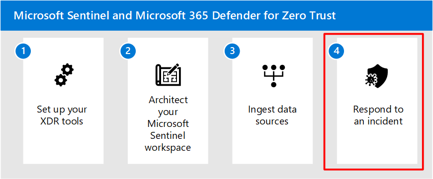

# Step 3. Ingest data sources and configure incident detection

After you've completed designing and implementing your Microsoft Sentinel workspaces, you can proceed to ingest data sources and configure incident detection.

Data connectors are configured to enable data ingestion into the workspace. After enabling key data points to be ingested into Sentinel, UEBA and Analytic Rules must also be enabled to capture anomalous and malicious activities; furthermore, Analytic Rules dictate how Alerts and Incidents are generated in your Sentinel instance.

## Before you begin

Confirm the installation method, roles required, and licenses needed to turn on data connectors. For more information, see [Find your Microsoft Sentinel data connector \| Microsoft Learn](/azure/sentinel/data-connectors-reference).

The following table is a summary of the prerequisites required for key Azure and data connectors:

| Resource Type                              | Installation Method              | Role/Permissions/License Needed                                                                                    |
|--------------------------------------------|----------------------------------|--------------------------------------------------------------------------------------------------------------------|
| Azure Active Directory                     | Native Data connector            | Security Admin/Global Admin Sign-in Logs require AAD P1 or P2 license Other logs do not require P1/P2        |
| Azure Active Directory Identity Protection | Native Data Connector            | Security Admin/Global Admin License: Azure AD Premium P2                                                        |
| Azure Activity                             | Azure Policy                     | Owner role required on subscriptions                                                                               |
| Microsoft Defender for Cloud               | Native Data Connector            | Security Reader To enable bi-directional sync, Contributor/Security Admin role is required on the subscription. |
| Microsoft Defender for Identity            | Native Data Connector            | Security Admin/Global admin License: Microsoft Defender for Identity                                            |
| Microsoft Defender for Office 365          | Native Data Connector            | Security Admin/Global admin License: Microsoft Defender for Office 365 Plan 2                                   |
| Office 365                                 | Native Data Connector            | Security Admin/Global admin                                                                                        |
| Microsoft Defender for IoT                 |                                  | Contributor to subscription with IoT hubs                                                                          |
| Microsoft Defender for Cloud Apps          | Native Data Connector            | Security Admin/Global admin License: Microsoft Defender for Cloud Apps                                          |
| Microsoft Defender for Endpoint            | Native Data Connector            | Security Admin/Global admin License: Microsoft Defender for Endpoint                                            |
| Windows Security Events via AMA            | Native Data Connector with Agent | Read/Write Workspace                                                                                               |
| Syslog                                     | Native Data Connector with Agent | Read/Write Workspace                                                                                               |

## Step 1. Turn on data connectors

Use the following recommendations to get started with configuring data connectors:

1.  Focus on setting up with free data sources to ingest:

    1.  Azure Activity Logs:
        a.  Ingesting Azure Activity Logs is **critical** in enabling Sentinel to provide a single-pane of glass view across the environment.
    2.  Office 365 Audit Logs, including all SharePoint activity, Exchange admin activity, and Teams.
    3.  Security alerts, including alerts from Microsoft Defender for Cloud, Microsoft 365 Defender, Microsoft Defender for Office 365, Microsoft Defender for Identity, and Microsoft Defender for Endpoint:

        1.  Ingesting security alerts into Sentinel enables it to be the "central pane of incident management" across the environment.

        2.  Incident investigation starts in Sentinel and should continue in the M365D or Defender for Cloud, if deeper analysis is required.

    4.  Microsoft Defender for Cloud Apps Alerts.

For more information, see [Free data sources](/azure/sentinel/billing?tabs=commitment-tier#free-data-sources).

The following table lists the free data sources you can enable in Microsoft Sentinel:

| **Microsoft Sentinel data connector** | **Free data type**                      |
|---------------------------------------|-----------------------------------------|
| Azure Activity Logs                   | AzureActivity                           |
| Azure AD Identity Protection          | SecurityAlert (IPC)                     |
| Office 365                            | OfficeActivity (SharePoint)    OfficeActivity (Exchange)    OfficeActivity (Teams)           |
| Microsoft Defender for Cloud          | SecurityAlert (Defender for Cloud)      |
| Microsoft Defender for IoT            | SecurityAlert (Defender for IoT)        |
| Microsoft 365 Defender                | SecurityIncident               SecurityAlert              |
| Microsoft Defender for Endpoint       | SecurityAlert (MDATP)                   |
| Microsoft Defender for Identity       | SecurityAlert (AATP)                    |
| Microsoft Defender for Cloud Apps     | SecurityAlert (Defender for Cloud Apps) |

2.  To provide broader monitoring and alerting coverage, focus on the following data connectors:

    >[!NOTE]
    >There's a charge for ingesting data from the sources listed in the section

    - Azure Active Directory.
    - Microsoft 365 Defender connector
           
        -  Send Microsoft 365 Defender logs to Sentinel, if any of the following are required:
        
            1.  Leverage Fusion Alerts with Sentinel.                 
                - Fusion correlates data sources from multiple products to detect multi-stage attacks across the environment.
            2. Longer retention than what's offered in Microsoft 365 Defender.

            3.  Automation not covered by the built-in remediations offered by Microsoft Defender for Endpoint.  For more information, see [Remediation actions in Microsoft 365 Defender](/microsoft-365/security/defender/m365d-remediation-actions).

3.  If deployed in Azure, use the following connectors:

    - Azure Firewall
    - Azure Application Gateway
    - Keyvault
    - Azure Kubernetes Service
    - Azure SQL
    - Network Security Groups
    - Azure-Arc Servers

4.  For virtual machines hosted on-premises or in other clouds that require their logs collected, use:

    - Windows Security Events using AMA
    - Security Events using Legacy Agent
    - Events via Defender for Endpoint (for server)
    - Syslog connector

5.  For Network Virtual Appliances or other on-premises sources that generate CEF or SYSLOG logs, use the following connector:

    - Common Event Format (CEF) via AMA
    - Common Event Format (CEF) via Legacy Agent
    - Syslog
    - [Deploy a log forwarder to ingest Syslog and CEF logs to Microsoft Sentinel](/azure/sentinel/connect-log-forwarder).

6.  Search in content hub for other devices, SaaS apps that require logs to be sent to Sentinel. For more information, see [Discover and manage Microsoft Sentinel out-of-the-box content ](/azure/sentinel/sentinel-solutions-deploy).

## Step 2. Enable User Entity Behavior Analytics 

Leveraging [User Entity Behavior Analysis to identify suspicious behavior](/azure/sentinel/identify-threats-with-entity-behavior-analytics) that could lead to Ransomware.

Data Sources required:

-   Active Directory logs (Microsoft Defender for Identity\*\*)
-   Azure Active Directory
-   Audit Logs
-   Azure Activity
-   Security Events
-   Sign in Logs

Using UEBA allows Microsoft Sentinel to build behavioral profiles of your organization's entities across time and peer group to identify anomalous activity. This added utility aids in an expedition of determining if an asset has been compromised. Since it identifies peer group association this can also aid in determining the blast radius of said compromise.

**Leveraging Microsoft Security suite with [Fusion technology to detect Ransomware](/azure/sentinel/fusion#fusion-for-ransomware).**

Microsoft Sentinel enables the Advanced multistage attack detection analytic rule by default to automatically identify multistage attacks. Leveraging anomalous behavior and suspicious activity events observed across the cyber kill chain, Microsoft Sentinel generates incidents that allow you to see the compromise incidents with two or more alert activities in it with a high degree of confidence.

Fusion alert technology correlates broad points of data signals with extended ML analysis to help determine known, unknown and emerging threats.

Fusion detections take the anomaly rule templates and the scheduled queries you created for the Ransomware scenario and pair them with alerts from Microsoft Security Suite products:

-   Azure Active Directory Identity Protection
-   Microsoft Defender for Cloud
-   Microsoft Defender for IoT
-   Microsoft 365 Defender
-   Microsoft Defender for Cloud Apps
-   Microsoft Defender for Endpoint
-   Microsoft Defender for Identity
-   Microsoft Defender for Office 365

## Enabling Analytic Rules

## Recommended training

### Connect data to Microsoft Sentinel using data connectors

**[Connect data to Microsoft Sentinel using data connectors](/training/modules/connect-data-to-azure-sentinel-with-data-connectors/)** 
Description: Learn how to connect data to Microsoft Sentinel using data connectors

> [!div class="nextstepaction"]
> [Start >](/training/modules/connect-data-to-azure-sentinel-with-data-connectors/)

**[Ingest log data with data connectors](/training/modules/connect-data-to-azure-sentinel-with-data-connectors/2-ingest-log-data-with-data-connectors)** 
Description: Learn how to connect data to Microsoft Sentinel using data connectors

> [!div class="nextstepaction"]
> [Start >](/training/modules/connect-data-to-azure-sentinel-with-data-connectors/2-ingest-log-data-with-data-connectors)

**[Identify threats with Behavioral Analytics| Microsoft Learn](/training/modules/use-entity-behavior-analytics-azure-sentinel/)** 
Description: Learn how to identiy threats with Behavioral Analytics

> [!div class="nextstepaction"]
> [Start >](/training/modules/use-entity-behavior-analytics-azure-sentinel/)

## Next steps

Continue to [Step 4](respond-incident.md) to respond to an incident.

 
