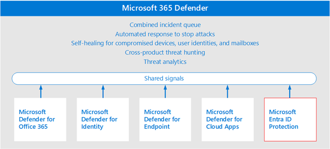
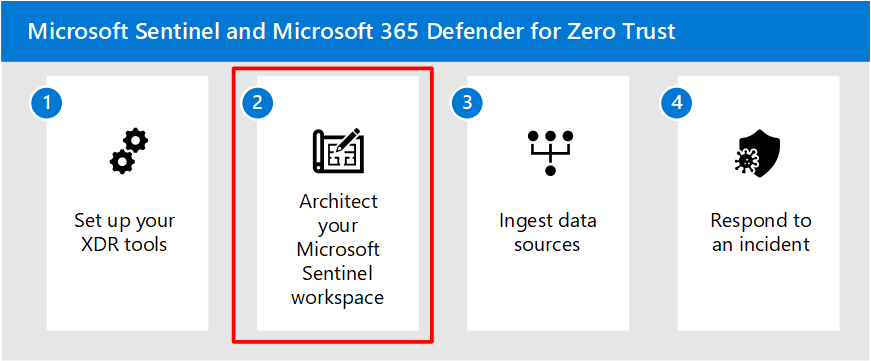

# Step 1. Setup XDR tools

This article guides you to the best approaches for setting up Microsoft Defender 365 and other Microsoft XDR tools. This is the first step in setting up an integrated environment with Microsoft Sentinel for security operations.  

The Microsoft Defender products are best in class for a security suite. Mature organizations unify their security platforms to ensure these are sharing information with each other for a more granular threat detection. Microsoft XDR tools have settings that allow the utilities to forward their information to each other. Additionally, each tool is designed to enrich data to each other.  

## Pilot and deploy Microsoft 365 Defender

Microsoft provides guidance to help you set up and get started with Microsoft 365 Defender components. If you haven't already set up Microsoft 365 Defender components, Microsoft recommends enabling the components in the order illustrated:

 

In the illustration: 

1. Create the evaluation environment 
2. Set up and pilot Defender for Identity 
3. Set up Defender for Office 365 
4. Set up Defender for Endpoint 
5. Set up Defender for Cloud apps 
6. Investigate and respond to threats 
7. Promote your evaluation to production 

This order is commonly recommended and designed to leverage the value of the capabilities quickly based on how much effort is typically required to deploy and configure the capabilities. For example, Defender for Office 365 can be configured in less time than it takes to enroll devices in Defender for Endpoint. Of course, you should prioritize the components to meet your business needs, and can enable these in a different order. 

Use the following guidance to enable Microsoft 365 capabilities and integrate these with other components. 

|       Task  |     Description  |     See . . .  |
|:---|:---|:---|
|     Pilot and deploy Microsoft 365 Defender  |   Use this methodical process to deploy the components of Microsoft 365 Defender.  |  [Evaluate and pilot Microsoft 365 Defender](/microsoft-365/security/defender/eval-overview)  |
|     Integrate Microsoft Defender for Endpoints with Microsoft Defender for Cloud Apps  |   Defender for Cloud Apps uses the traffic information collected by Defender for Endpoint about the cloud apps and services being accessed from IT-managed devices specified in the prerequisites below. The integration doesn't require any additional deployment and can be enabled directly from the settings in Defender for Endpoint and Microsoft 365 Defender.  |   [Microsoft Defender for Endpoint integration with Microsoft Defender for Cloud Apps](/defender-cloud-apps/mde-integration)  |
|     Integrate Microsoft Defender for Identity with Defender for Cloud Apps  |   Microsoft Defender for Cloud Apps integrates with Microsoft Defender for Identity to provide user entity behavioral analytics (UEBA) across a hybrid environment - both cloud app and on-premises  |   [Microsoft Defender for Identity integration](/defender-cloud-apps/mdi-integration) |
|     Integrate Microsoft Purview with Defender for Cloud Apps  |   Microsoft Defender for Cloud Apps lets you automatically apply sensitivity labels from Microsoft Purview Information Protection. You can then investigate files by using these labels.  |   [Microsoft Purview Information Protection integration](/defender-cloud-apps/azip-integration)  |

## Enable Azure Identity Protection

Microsoft 365 Defender also ingests and includes the signals of Azure AD Identity Protection, as illustrated below. 

Azure AD Identity Protection is licensed separately from Microsoft 365 Defender. It is included with Azure Active Directory Premium P2. 

Azure AD Identity Protection evaluates risk data from billions of sign-in attempts and uses this data to evaluate the risk of each sign-in to your environment. This data is used by Azure AD to allow or prevent account access, depending on how Conditional Access policies are configured.  

For this solution and target scenario, we'll also ingest the signals from Azure AD Identity Protection into Sentinel. To enable Azure AD Identity Protection, use the following resources. 

|       Task  |     Description  |     See . . .  |
|:---|:---|:---|
| Integrate Azure AD Identity Protection with Defender for Cloud Apps  | Microsoft Defender for Cloud Apps integrates with Azure Active Directory Identity Protection to provide user entity behavioral analytics (UEBA) across a hybrid environment. | [Azure Active Directory Identity Protection](/defender-cloud-apps/aadip-integration) 

## Enable Microsoft Defender for Cloud
Although Microsoft Defender for Cloud is not included in the reference architecture, you can complete the deployment of Microsoft XDR tools by enabling Microsoft Defender for Cloud, and then include these signals in your Sentinel workspace, if desired.  

Use the following guidance to enable Defender for Cloud and integrate capabilities.

|       Task  |     Description  |     See . . .  |
|:---|:---|:---|
|Set up Defender for Cloud |	Recommended steps to enable Microsoft Defender for Cloud and the enhanced security features | [Quickstart: Set up Microsoft Defender for Cloud](/azure/defender-for-cloud/get-started)
|Protect your server resources | With Microsoft Defender for Servers (included with Defender for Cloud), you gain access to and can deploy Microsoft Defender for Endpoint to your server resources. | [Protect your endpoints with Defender for Cloud's integrated EDR solution: Microsoft Defender for Endpoint](/azure/defender-for-cloud/integration-defender-for-endpoint?WT.mc_id=Portal-Microsoft_Azure_Security_CloudNativeCompute)

## Recommended training

### Explore security solutions in Microsoft 365 Defender

|Training  |[Explore security solutions in Microsoft 365 Defender](/training/modules/explore-security-solutions-microsoft-365-defender/)|
|---------|---------|
|:::image type="icon" source="media/generic-badge.svg" border="false"::: | This module introduces you to several features in Microsoft 365 that can help protect your organization against cyberthreats, detect when a user or computer has been compromised, and monitor your organization for suspicious activities.|
> [!div class="nextstepaction"]
> [Start >](/training/modules/explore-security-solutions-microsoft-365-defender/)

### Introduction to Microsoft 365 Defender

|Training  |[Introduction to Microsoft 365 Defender](/training/modules/defender-introduction/)|
|---------|---------|
|:::image type="icon" source="m365-defender-introduction.svg" border="false"::: | Understand what Microsoft 365 Defender is and how it can help to improve your security posture by empowering your Security Operations Center (SOC) or security teams with the tools they need to identify, control, and remediate security threats. |
> [!div class="nextstepaction"]
> [Start >](/training/modules/defender-introduction/)

### Defend against threats with Microsoft 365

|Training  |[Defend against threats with Microsoft 365](/training/paths/m365-security-threat-protection/)|
|---------|---------|
|:::image type="icon" source="media/defend-against-threats-m365-microsoft-threat-protection.svg" border="false"::: | Microsoft 365 includes security technologies that enterprises can use to secure email, data, devices, and identities against the risk of cyber threats. This learning path provides an introduction to Microsoft 365 Defender, Microsoft Defender for Endpoint, Microsoft Defender for Identity, and Microsoft Defender for Office 365. |
> [!div class="nextstepaction"]
> [Start >](/training/paths/m365-security-threat-protection/)

## Next steps

Continue to [Step 2](siem-workspace.md) to architect a Sentinel workspace. 

