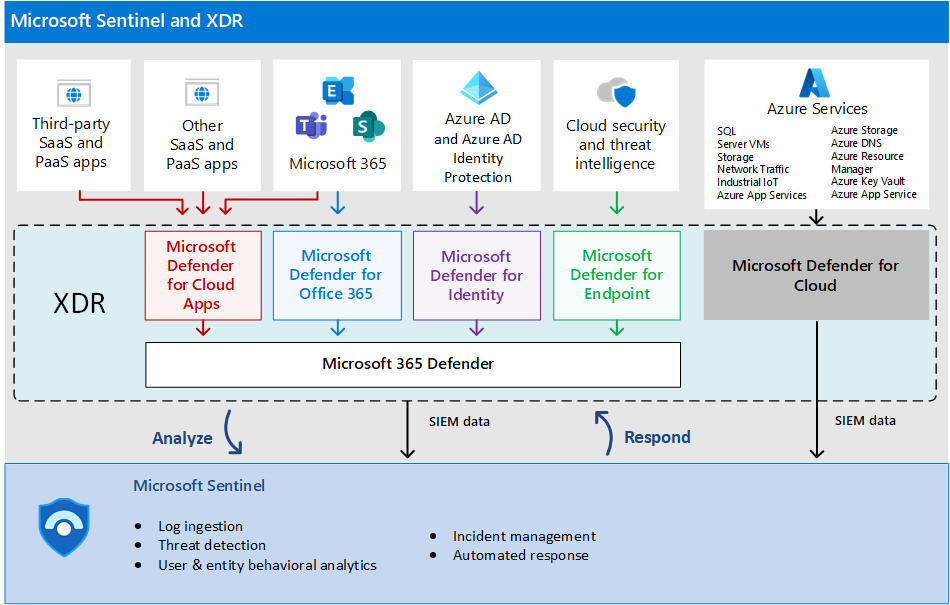

---
title: Implement Microsoft Sentinel and XDR for a Zero Trust approach
description: Implement Microsoft Sentinel and XDR for a Zero Trust approach
ms.author: macapara
author: mjcaparas
localization_priority: Normal
manager: dansimp
ms.topic: article
ms.service: microsoft-365-security
---

# Implement Microsoft Sentinel and XDR for a Zero Trust approach

## Introduction 

This solution guide walks through the process of setting up Microsoft XDR tools together with Microsoft Sentinel to accelerate your organization’s ability to respond to and remediate cybersecurity attacks. As a proof of concept, this guidance walks through the process of responding to a ransomware attack, starting with discovery in Microsoft Sentinel.  

This guidance helps you mature your Zero Trust architecture by mapping the principles of Zero Trust in the following ways.    

|     Zero   Trust Principle             |     Met by      |
|----------------------------------------|-----------------|
|     Verify   explicitly                |                 |
|     Use least   privileged access      |                 |
|     Assume   breach                    |                 |

## Reference architecture

Microsoft Sentinel is a cloud-native SIEM tool; Microsoft 365 Defender provides XDR capabilities for end-user environments (email, documents, identity, apps, and endpoint); and Microsoft Defender for Cloud provides XDR capabilities for infrastructure and multi-cloud platforms including virtual machines, databases, containers, and IoT.

In scope for the reference architecture: 

- Defender 365 

- Sentinel 

Data sources:

- Azure AD Identity Protection 
- Office 365 
- Microsoft Defender for Cloud 
- Microsoft 365 Defender 
- Microsoft Defender for Endpoint 
- Microsoft Defender for Identity 
- Microsoft Defender for Cloud Apps 
- Azure activity logs 

## Key capabilities
To implement a Zero trust approach in managing incidents, use these Microsoft Sentinel and XDR features.

Capability or feature | Description | Licensing
:---|:---|:---
 |  ||
 | | |

## What's in this solution
This solution steps you through the implementation of Microsoft Sentinel and XDR for a Zero Trust so your SecOps team can effectively remediate incidents using a Zero Trust approach. 

## Next steps

Use these steps to implement Microsoft Sentinel and XDR for a Zero Trust approach:

1. Set up your XDT tools
2. Architect a Sentinel workspace
3. Ingest data sources
4. Respond to an incident