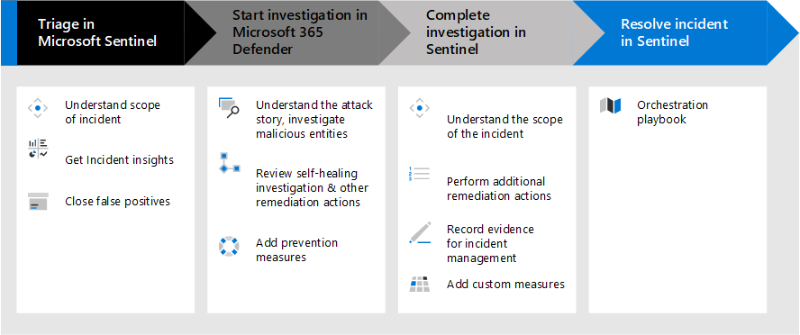

---
title: Implement Microsoft Sentinel and XDR for a Zero Trust approach
description: Implement Microsoft Sentinel and XDR for a Zero Trust approach
ms.author: macapara
author: mjcaparas
localization_priority: Normal
manager: dansimp
ms.topic: article
ms.service: microsoft-365-security
---

# Implement Microsoft Sentinel and XDR for a Zero Trust approach

## Introduction 

This solution guide walks through the process of setting up Microsoft XDR tools together with Microsoft Sentinel to accelerate your organization’s ability to respond to and remediate cybersecurity attacks. 

This guidance walks through the process of responding to a incident, starting with discovery in Microsoft Sentinel.  

With Microsoft Sentinel you can connect to any of the security sources using built-in connectors and industry standards. With its artificial intelligence you can correlate multiple low fidelity signals spanning multiple sources to create a complete view of ransomware kill chain and prioritized alerts. 

Microsoft 365 Defender is an extended detection and response (XDR) solution that complements Microsoft Sentinel. An XDR pulls raw telemetry data from across multiple tools like cloud applications, email security, identity, and access management. 

Using AI and machine learning, the XDR then performs automatic analysis, investigation, and response in real time. The XDR solution also correlates security alerts into larger incidents, providing security teams greater visibility into attacks, and provides incident prioritization, helping analysts understand the risk level of the threat. 

This guidance helps you mature your Zero Trust architecture by mapping the principles of Zero Trust in the following ways.    

|     Zero   Trust Principle             |     Met by      |
|----------------------------------------|-----------------|
|     Verify   explicitly                |                 |
|     Use least   privileged access      |                 |
|     Assume   breach                    |                 |

## Reference architecture

JUST FOR ILLUSTRATION PURPOSES / PLACEHOLDER:

JUST FOR ILLUSTRATION PURPOSES / PLACEHOLDER:

Microsoft Sentinel is a cloud-native SIEM tool; Microsoft 365 Defender provides XDR capabilities for end-user environments (email, documents, identity, apps, and endpoint); and Microsoft Defender for Cloud provides XDR capabilities for infrastructure and multi-cloud platforms including virtual machines, databases, containers, and IoT.

In scope for the reference architecture: 

- Defender 365 

- Sentinel 

Data sources:

- Azure AD Identity Protection 
- Office 365 
- Microsoft Defender for Cloud 
- Microsoft 365 Defender 
- Microsoft Defender for Endpoint 
- Microsoft Defender for Identity 
- Microsoft Defender for Cloud Apps 
- Azure activity logs 

## Key capabilities
To implement a Zero trust approach in managing incidents, use these Microsoft Sentinel and XDR features.

Capability or feature | Description | Licensing
:---|:---|:---
 |[Automated Investigation & Response (AIR)](/microsoft-365/security/defender-endpoint/automated-investigations) | AIR capabilities are designed to examine alerts and take immediate action to resolve breaches. AIR capabilities significantly reduce alert volume, allowing security operations to focus on more sophisticated threats and other high-value initiatives.  | E5?
 |[Advanced hunting](/microsoft-365/security/defender/advanced-hunting-overview) |Advanced hunting is a query-based threat hunting tool that lets you explore up to 30 days of raw data. You can proactively inspect events in your network to locate threat indicators and entities. The flexible access to data enables unconstrained hunting for both known and potential threats. | E5?
|[Custom file indicators](/microsoft-365/security/defender-endpoint/indicator-file) | Prevent further propagation of an attack in your organization by banning potentially malicious files or suspected malware. | E5?
|[Custom network indicators](/microsoft-365/security/defender-endpoint/indicator-ip-domain)|By creating indicators for IPs and URLs or domains, you can now allow or block IPs, URLs, or domains based on your own threat intelligence. |E5?
|[EDR Block](/microsoft-365/security/defender-endpoint/edr-in-block-mode) | Provides added protection from malicious artifacts when Microsoft Defender Antivirus(MDAV) is not the primary antivirus product and is running in passive mode. EDR in block mode works behind the scenes to remediate malicious artifacts that were detected by EDR capabilities. | E5?
| [Device response capabilities](/microsoft-365/security/defender-endpoint/respond-machine-alerts) | Quickly respond to detected attacks by isolating devices or collecting an investigation package | E5
| [Live response](/microsoft-365/security/defender-endpoint/live-response) |Live response gives security operations teams instantaneous access to a device (also referred to as a machine) using a remote shell connection. This gives you the power to do in-depth investigative work and take immediate response actions to promptly contain identified threats in real time. | E5?
|[Vulnerability management](/microsoft-365/security/defender-vulnerability-management/defender-vulnerability-management)| Leveraging Microsoft threat intelligence, breach likelihood predictions, business contexts, and devices assessments, Defender Vulnerability Management rapidly and continuously prioritizes the biggest vulnerabilities on your most critical assets and provides security recommendations to mitigate risk. | E5?
| | | 
| | | 
| | | 

## What's in this solution
This solution steps you through the implementation of Microsoft Sentinel and XDR so that your security operations team can effectively remediate incidents using a Zero Trust approach. 

## Next steps

Use these steps to implement Microsoft Sentinel and XDR for a Zero Trust approach:

1. [Set up your XDR tools](setup-xdr-tools.md)
2. [Architect a Sentinel workspace](siem-workspace.md)
3. [Ingest data sources](ingest-data-sources.md)
4. [Respond to an incident](respond-incident.md)