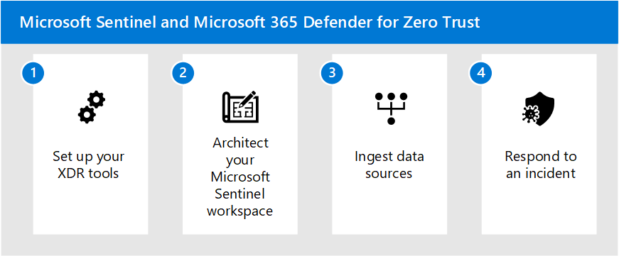

# Implement Microsoft Sentinel and Microsoft Defender XDR for Zero Trust

This solution guide walks through the process of setting up Microsoft eXtended detection and response (XDR) tools together with Microsoft Sentinel to accelerate your organization’s ability to respond to and remediate cybersecurity attacks.

Microsoft Defender XDR is an XDR solution that automatically collects, correlates, and analyzes signal, threat, and alert data from across your Microsoft 365 environment.

Microsoft Sentinel is a cloud-native solution that provides security information and event management (SIEM) and security orchestration, automation, and response (SOAR) capabilities. Together, Microsoft Sentinel and Microsoft Defender XDR provide a comprehensive solution to help organizations defend against modern attacks.

This guidance helps you mature your Zero Trust architecture by mapping the principles of Zero Trust in the following ways.

| Zero Trust Principle | Met by|
|--|:--|
| Verify explicitly | Microsoft Sentinel collects data from across the environment, performs analysis of threats and anomalies, and can respond with automation.    Microsoft Defender XDR provides extended detection and response across users, identities, devices, apps, and emails. Risk-based signals captured by Microsoft Defender XDR can be used by Microsoft Sentinel to take actions. |
| Use least privileged access | Microsoft Sentinel can detect anomalous activity through its User Entity Behavioral Analytics (UEBA) engine.   Threat Intelligence with Microsoft Sentinel can import threat intelligence data from Microsoft or third-party providers to detect new, emerging threats and provide extra context for investigations.    Microsoft Defender XDR has Microsoft Entra ID Protection, which can block users based on the level of risk with identity. Data can be fed into Microsoft Sentinel for further analysis and automation. |
| Assume breach | Microsoft Defender XDR continuously scans the environment for threats and vulnerabilities. Microsoft Sentinel analyzes collected data, behavioral trend of entities to detect suspicious activity, anomalies and multi-stage threats across enterprise.   Microsoft Sentinel has workbook visualizations that can help organizations harden the environment, such as the [Zero Trust workbook](/azure/sentinel/sentinel-solution).   Microsoft Defender XDR and Sentinel can implement automated remediation tasks, including automated investigations, device isolation, and data quarantine. Device risk can be used as a signal to feed into Microsoft Entra Conditional Access. |

## Microsoft Sentinel and XDR architecture

The following illustration shows how Microsoft's XDR solution seamlessly integrates with Microsoft Sentinel.

:::image type="content" source="./media/sentinel-xdr.svg" alt-text="Image of a Microsoft Sentinel and XDR" lightbox="./media/sentinel-xdr.svg":::

In this diagram:

- Insights from signals across your entire organization feed into Microsoft Defender XDR and Microsoft Defender for Cloud.
- Microsoft Defender XDR and Microsoft Defender for Cloud send SIEM log data through Microsoft Sentinel connectors.
- SecOps teams can then analyze and respond to threats identified in the Microsoft Sentinel and Microsoft Defender XDR portals.
- Microsoft Sentinel provides support for multi-cloud environments and integrates with third-party apps and partners.

## Implementing Microsoft Sentinel and Microsoft Defender XDR for Zero Trust

Microsoft Defender XDR is an XDR solution that complements Microsoft Sentinel. An XDR pulls raw telemetry data from across multiple services like cloud applications, email security, identity, and access management.

Using artificial intelligence (AI) and machine learning, the XDR then performs automatic analysis, investigation, and response in real time. The XDR solution also correlates security alerts into larger incidents, providing security teams greater visibility into attacks, and provides incident prioritization, helping analysts understand the risk level of the threat.

With Microsoft Sentinel, you can connect to many security sources using built-in connectors and industry standards. With its AI you can correlate multiple low fidelity signals spanning multiple sources to create a complete view of ransomware kill chain and prioritized alerts.

## Leveraging SIEM and XDR capabilities

In this section, we'll look into a typical attack scenario involving a phishing attack then proceed with how to respond to the incident with Microsoft Sentinel and Microsoft Defender XDR.

### Common attack order

The following diagram shows a common attack order of a phishing scenario. 

:::image type="content" source="./media/common-attack-defense.svg" alt-text="Image of a common attack scenario and defense from Microsoft security products" lightbox="./media/common-attack-defense.svg":::

The diagram also shows the Microsoft security products in place to detect each attack step and how attack signals and SIEM data flow to Microsoft Defender XDR and Microsoft Sentinel.

Here is a summary of the attack.

| Attack step | Detection service and signal source | Defenses in place |
| --- | --- | --- |
| 1. Attacker sends phishing email  | Microsoft Defender for Office 365 | Protects mailboxes with advanced anti-phishing features that can protect against malicious impersonation-based phishing attacks. |
| 2. User opens attachment | Microsoft Defender for Office 365 | The Microsoft Defender for Office 365 Safe Attachments feature opens attachments in an isolated environment for additional scanning of threats (detonation). |
| 3. Attachment installs malware | Microsoft Defender for Endpoint | Protects endpoints from malware with its next generation protection features, such as cloud-delivered protection and behavior-based/heuristic/real-time antivirus protection. |
| 4. Malware steals user credentials | Microsoft Entra ID and Microsoft Entra ID Protection | Protects identities by monitoring user behavior and activities, detecting lateral movement, and alerting on anomalous activity. |
| 5. Attacker moves laterally across Microsoft 365 apps and data | Microsoft Defender for Cloud Apps | Can detect anomalous activity of users accessing cloud apps. |
| 6. Attacker downloads sensitive files from a SharePoint folder | Microsoft Defender for Cloud Apps | Can detect and respond to mass download events of files from SharePoint. |

### Incident response using Microsoft Sentinel and Microsoft Defender XDR

Now that we've seen how a common attack takes place, let's look into leveraging the integration of Microsoft Sentinel and Microsoft Defender XDR for incident response.

Here is the process of responding to an incident with Microsoft Defender XDR and Microsoft Sentinel:

1. Triage the incident in the Microsoft Sentinel portal.
2. Move over to the Microsoft Defender XDR portal to start your investigation.
3. Where needed, continue the investigation in the Microsoft Sentinel portal.
4. Resolve the incident in the Microsoft Sentinel portal.

The following diagram shows the process, starting with discovery and triage in Microsoft Sentinel.

:::image type="content" source="./media/investigation-flow.svg" alt-text="Image of incident investigation using Sentinel and Microsoft Defender XDR" lightbox="./media/investigation-flow.svg":::

For more information, see [Respond to an incident using Microsoft Sentinel and Microsoft Defender XDR]( respond-incident.md).

## Key capabilities

To implement a Zero trust approach in managing incidents, use these Microsoft Sentinel and XDR features.

Capability or feature | Description | Product |
:---|:---|:---|
 |[Automated Investigation & Response (AIR)](/microsoft-365/security/defender-endpoint/automated-investigations) | AIR capabilities are designed to examine alerts and take immediate action to resolve breaches. AIR capabilities significantly reduce alert volume, allowing security operations to focus on more sophisticated threats and other high-value initiatives. | Microsoft Defender XDR |
 |[Advanced hunting](/microsoft-365/security/defender/advanced-hunting-overview) |Advanced hunting is a query-based threat hunting tool that lets you explore up to 30 days of raw data. You can proactively inspect events on your network to locate threat indicators and entities. The flexible access to data enables unconstrained hunting for both known and potential threats. | Microsoft Defender XDR |
|[Custom file indicators](/microsoft-365/security/defender-endpoint/indicator-file) | Prevent further propagation of an attack in your organization by banning potentially malicious files or suspected malware. | Microsoft Defender XDR |
|[Cloud discovery](/defender-cloud-apps/set-up-cloud-discovery) | Cloud Discovery analyzes traffic logs collected by Defender for Endpoint and assesses identified apps against the cloud app catalog to provide compliance and security information.| Microsoft Defender for Cloud Apps |
|[Custom network indicators](/microsoft-365/security/defender-endpoint/indicator-ip-domain)|By creating indicators for IPs and URLs or domains, you can now allow or block IPs, URLs, or domains based on your own threat intelligence. | Microsoft Defender XDR |
|[Endpoint detection and response (EDR) Block](/microsoft-365/security/defender-endpoint/edr-in-block-mode) | Provides added protection from malicious artifacts when Microsoft Defender Antivirus (MDAV) isn't the primary antivirus product and is running in passive mode. EDR in block mode works behind the scenes to remediate malicious artifacts that were detected by EDR capabilities. | Microsoft Defender XDR |
| [Device response capabilities](/microsoft-365/security/defender-endpoint/respond-machine-alerts) | Quickly respond to detected attacks by isolating devices or collecting an investigation package | Microsoft Defender XDR |
| [Live response](/microsoft-365/security/defender-endpoint/live-response) | Live response gives security operations teams instantaneous access to a device (also referred to as a machine) using a remote shell connection. This gives you the power to do in-depth investigative work and take immediate response actions to promptly contain identified threats in real time. | Microsoft Defender XDR |
| [Secure cloud applications](/azure/defender-for-cloud/defender-for-cloud-introduction#secure-cloud-applications) | A development security operations (DevSecOps) solution that unifies security management at the code level across multicloud and multiple-pipeline environments. | Microsoft Defender for Cloud |
| [Improve your security posture](/azure/defender-for-cloud/defender-for-cloud-introduction#improve-your-security-posture) | A cloud security posture management (CSPM) solution that surfaces actions that you can take to prevent breaches. | Microsoft Defender for Cloud |
| [Protect cloud workloads](/azure/defender-for-cloud/defender-for-cloud-introduction#protect-cloud-workloads) | A cloud workload protection platform (CWPP) with specific protections for servers, containers, storage, databases, and other workloads. | Microsoft Defender for Cloud |
| [User and Entity Behavioral Analytics (UEBA)](/azure/sentinel/enable-entity-behavior-analytics) |Analyzes behavior of organization entities such as users, hosts, IP addresses, and applications) | Microsoft Sentinel |
| [Fusion](/azure/sentinel/configure-fusion-rules) | A correlation engine based on scalable machine learning algorithms. Automatically detects multistage attacks&nbsp;also known as advanced persistent threats (APT)&nbsp;by identifying combinations of anomalous behaviors and suspicious activities that are observed at various stages of the kill chain. | Microsoft Sentinel |
|[Threat Intelligence](/azure/sentinel/threat-intelligence-integration) | Use Microsoft third-party providers to enrich data to provide extra context around activities, alerts, and logs in your environment. | Microsoft Sentinel |
| [Automation](/azure/sentinel/automation) | Automation rules are a way to centrally manage automation in Microsoft Sentinel, by allowing you to define and coordinate a small set of rules that can apply across different scenarios. | Microsoft Sentinel |
|[Anomaly rules](/azure/sentinel/work-with-anomaly-rules) | Anomaly rule templates use machine learning to detect specific types of anomalous behavior. | Microsoft Sentinel
|[Scheduled queries](/azure/sentinel/detect-threats-custom) | Built-in rules written by Microsoft security experts that search through logs collected by Sentinel for suspicious activity chains, known threats. | Microsoft Sentinel |
|[Near-real-time (NRT) rules](/azure/sentinel/create-nrt-rules) | NRT rules are limited set of scheduled rules, designed to run once every minute, in order to supply you with information as up-to-the-minute as possible.  | Microsoft Sentinel |
|[Hunting](/azure/sentinel/hunting) | To help security analysts look proactively for new anomalies that weren't detected by your security apps or even by your scheduled analytics rules, Microsoft Sentinel's built-in hunting queries guide you into asking the right questions to find issues in the data you already have on your network. | Microsoft Sentinel
| [Microsoft Defender XDR Connector](/azure/sentinel/connect-microsoft-365-defender) | Microsoft Defender XDR Connector synchronizes logs and incidents to Microsoft Sentinel. | Microsoft Defender XDR and Microsoft Sentinel |
|[Data connectors](/azure/sentinel/connect-data-sources) | Allow for the ingestion of data for analysis in Microsoft Sentinel. | Microsoft Sentinel|
|[Content hub solution -Zero Trust (TIC 3.0)](/azure/sentinel/sentinel-solution) | Zero Trust (TIC 3.0) includes a workbook, analytics rules, and a playbook, which provide an automated visualization of Zero Trust principles, cross-walked to the Trust Internet Connections framework, helping organizations to monitor configurations over time. | Microsoft Sentinel |
|[Security Orchestration, Automation, and Response (SOAR) ](/azure/sentinel/sentinel-soar-content) | Leveraging automation rules and playbooks in response to security threats increases your SOC's effectiveness and saves you time and resources. | Microsoft Sentinel |

## What's in this solution

This solution steps you through the implementation of Microsoft Sentinel and XDR so that your security operations team can effectively remediate incidents using a Zero Trust approach.

## Recommended training

|Training |[Connect Microsoft Defender XDR to Microsoft Sentinel](/training/modules/connect-microsoft-defender-365-to-azure-sentinel/)|
|---------|---------|
|:::image type="icon" source="media/connect-microsoft-defender-365-to-azure-sentinel.svg" border="false"::: | Learn about the configuration options and data provided by Microsoft Sentinel connectors for Microsoft Defender XDR. |
> [!div class="nextstepaction"]
> [Start >](/training/modules/connect-microsoft-defender-365-to-azure-sentinel/)

## Next steps

Use these steps to implement Microsoft Sentinel and XDR for a Zero Trust approach:

1. [Set up your XDR tools](setup-xdr-tools.md)
2. [Architect your Microsoft Sentinel workspace](siem-workspace.md)
3. [Ingest data sources](ingest-data-sources.md)
4. [Respond to an incident](respond-incident.md)

Also see these additional articles for applying Zero Trust principles to Azure:

- [Azure IaaS overview](/security/zero-trust/azure-infrastructure-overview)
  - [Azure storage](/security/zero-trust/azure-infrastructure-storage)
  - [Virtual machines](/security/zero-trust/azure-infrastructure-virtual-machines)
  - [Spoke virtual networks](/security/zero-trust//azure-infrastructure-iaas)
  - [Hub virtual networks](/security/zero-trust//azure-infrastructure-networking)

- [Azure Virtual Desktop](/security/zero-trust/azure-infrastructure-avd)
- [Azure Virtual WAN](/security/zero-trust/azure-virtual-wan)
- [IaaS applications in Amazon Web Services](/security/zero-trust/secure-iaas-apps)
