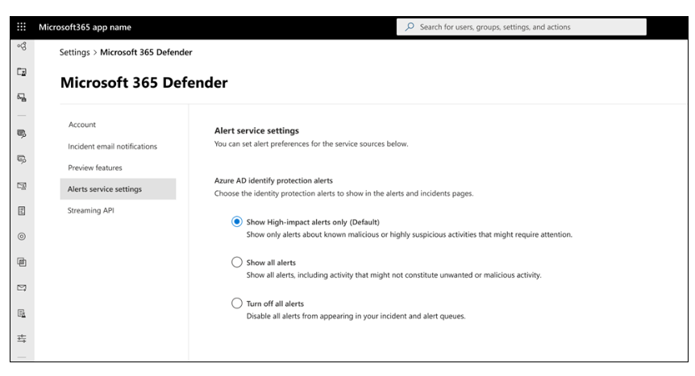

# Token theft playbook

This article, and its accompanying decision tree, provide guidance for security analysts and incident responders to identify and investigate token theft attacks in an organization. As organizations increase their security posture, threat actors use more sophisticated techniques to compromise resources. Quick response is needed to investigate, contain, and remediate damage resulting from token theft attacks.

A token theft attack occurs when threat actors compromise and replay tokens issued to a user, even if that user has satisfied multifactor authentication. Because authentication requirements are met, the threat actor is granted access to organizational resources by using the stolen token.

Learn more:
* [Token tactics: How to prevent, detect, and respond to cloud token theft](https://www.microsoft.com/security/blog/2022/11/16/token-tactics-how-to-prevent-detect-and-respond-to-cloud-token-theft/)

## Prerequisites

* Access to the Microsoft Entra ID (formerly Azure AD) [sign in](/azure/active-directory/reports-monitoring/concept-sign-ins) and [audit](/azure/active-directory/reports-monitoring/concept-audit-logs) logs for users and service principals
* An account with one of the following Microsoft Entra roles assigned:
  * Security Administrator
  * Global Administrator
  * Security Reader
  * Global Reader
  * Security Operator

## Recommendations

While not required, we recommend:

* Enable the advanced hunting feature, and access to the last seven days of event data
  * [Connect Office 365 to Microsoft Defender for Cloud Apps](/defender-cloud-apps/connect-office-365) provides instructions for connecting Microsoft Defender for Cloud Apps to your existing Microsoft 365 account using the app connector API.
* Access the Unified Access Log for additional signals
  * [Forensic artifacts in Office 365 and where to find them](https://techcommunity.microsoft.com/t5/microsoft-security-experts-blog/forensic-artifacts-in-office-365-and-where-to-find-them/ba-p/3634865) provides explanations and tips for investigators to understand what data is available and in which portal.
* Microsoft Entra ID [premium risk detections](/azure/active-directory/identity-protection/concept-identity-protection-risks) in Microsoft Entra ID P2 and E5 licenses enable more granular investigation triggers and instruction
* Use a [managed authentication configuration](/azure/active-directory/hybrid/connect/choose-ad-authn) with password hash synchronization (PHS), not federated, to access additional signals

## Requirements

### Configure a SIEM

Security information and event management (SIEM) tools such as Microsoft Sentinel have centralized log visibility. Configure the SIEM to ingest risk events for:

* Sign-in logs and audit logs
* [Microsoft Sentinel integration (Preview)](/defender-cloud-apps/siem-sentinel) describes how to integrate Microsoft Defender for Cloud Apps with Microsoft Sentinel (a scalable, cloud-native SIEM and SOAR) to enable centralized monitoring of alerts and discovery data.
* Office sign-in logs and audit logs
* Configure relevant alerts

Learn more:
* [Connect Microsoft Entra ID data to Microsoft Sentinel](/azure/sentinel/connect-azure-active-directory)
* [Access data from your event hub](/azure/active-directory/reports-monitoring/tutorial-azure-monitor-stream-logs-to-event-hub#access-data-from-your-event-hub)

Configure Microsoft Sentinel (or third-party SIEM) rules for threat detection and response by following guidance in [Detect threats out of the box](/azure/sentinel/detect-threats-built-in).

Learn more:
* Set up Microsoft Entra ID Protection alerts. [How To: Export risk data](/azure/active-directory/identity-protection/howto-export-risk-data) describes how to store data for longer periods by changing diagnostic settings in Azure AD to send RiskyUsers, UserRiskEvents, RiskyServicePrincipals, and ServicePrincipalRiskEvents data to a Log Analytics workspace, archive data to a storage account, stream data to an event hub, or send data to a partner solution.

### Integrate a SIEM with Microsoft Defender for Cloud Apps

Microsoft Defender for Cloud Apps and Microsoft Sentinel are connected by default. If you don't use Microsoft Sentinel, connect your SIEM to Microsoft Defender for Cloud Apps, which supports Microsoft Sentinel, ArcSight by Open Text, and generic common event format (CEF).  

Learn more:
* [Generic SIEM integration](/cloud-app-security/siem)

### Integrate SIEM with Microsoft Graph API

Connect SIEM with the Microsoft Graph Security API.

* **Supported integration options** - write code to connect your application to derive insights. The [Microsoft Graph security API overview](/graph/security-concept-overview) describes key features and provides codes samples.
* **Native integrations and connectors** - built by Microsoft partners
* **Connectors** - for the API through SIEM solutions, security orchestration automated response (SOAR), incident tracking and service management (ITSM), reporting, and so on
  * [List of connectors from Microsoft](/graph/security-integration#list-of-connectors-from-microsoft) describes options for connecting with the Microsoft Graph Security API.

## Investigations

  Review the following sections for guidance on triggers, the investigation checklists, and more.

### Investigation triggers

Every organization has typical vs. atypical scenarios. Use the following investigation checklist to determine triggers or unusual activity for:

* Identities
* Sign-in logs
* Audit logs
* Office apps
* Devices associated with affected users

If these user activities are confirmed valid, there's no breach. If they can't be confirmed valid, assume a breach and proceed with mitigating actions.
Detect token theft attempts by searching for and investigating event types in the Microsoft Sentinel portal or in a SIEM.

Learn more:
* [Investigate incidents with Microsoft Sentinel](/azure/sentinel/investigate-cases)

Ensure you receive alerts for the following events, which might indicate a token theft attack:

The Microsoft Entra ID Protection feature has the following triggers:

* **Anomalous token (offline detection)** - atypical token characteristics detected, or a token used from an unfamiliar location. The algorithms detecting this behavior use data from Microsoft Entra ID with Microsoft 365 properties. This detection indicates if the attacker is replaying the token.
* **Unfamiliar sign-in properties** - sign-in is anomalous when compared to sign-in history. This event occurs when user sign-in properties are unfamiliar.
* **Unfamiliar sign-in** – a non-interactive sign-in occurs. Increase scrutiny on unfamiliar sign-ins, particularly if detected with suspicious devices. We recommend you give immediate attention to detection for non-interactive sign-ins.
* **Attempted access of Primary Refresh Token (PRT)** - in Windows 10 and 11, Microsoft Defender for Endpoint detects suspicious access to PRT and associated artifacts. Detections feed into the Microsoft Entra ID risk score, which controls resource conditional access. This detection is low-volume and infrequent.
* **Microsoft 365 Defender detections** – integrate Microsoft Entra ID Protection and Microsoft 365 Defender to see detections in one portal.
  * By default, the most relevant alerts for the security operation center (SOC) are enabled. For all Microsoft Entra ID IP risk detections, or to turn off the integration, make the change in Microsoft 365 Defender [Alert service setting](https://security.microsoft.com/settings/mtp_settings/service_alert_settings).

   

* **Suspicious URLs** – a user might have clicked a phishing email link. The suspect email could be an adversary-in-the-middle (AiTM) phishing kit and the start of an attack.

   

* **Other suspicious behaviors** - Defender for Microsoft 365 advanced hunter alert evidence and alert tables show actions that indicate token theft. Review the logs to determine:
  * Mass file download by a user
  * Unusual file download by a user
  * Addition of multifactor authentication, or passwordless credential to an account
  * Mailbox forwarding rules added or edited

### Starting the investigation

**Before you begin**: Complete and enable the prerequisites. In addition, this playbook assumes Microsoft customers and investigation teams might not have Microsoft 365 E5 or Microsoft Entra ID P2 license suite available or configured. Therefore, note the provided automation guidance.

For this investigation, it's assumed you have an indication of potential token-theft compromise in:

* A user report
* Microsoft Entra ID sign-in logs example
* Microsoft Entra ID Protection detection

### Investigation checklist

With knowledge of your typical scenarios, determine anomalies or unusual activity for:

* **Identities**
* **Sign-in logs** - unexpected location or device
* Audit logs - newly registered devices, additional multifactor authentication options, or credential changes.
* **Office apps** - changes since the trigger occurred
* **Devices** - associated with affected users. Evaluate alerts since the incident trigger.

### Evidence of compromise or token-theft: user confirmation

After you identify potentially compromised user account(s), verify the suspicious activities. This process differs for every organization.

Learn more:
* [Incident response overview, Response best practices](incident-response-overview.md#response-best-practices)

### User and/or device investigation

If you believe an account or multiple user accounts were compromised, differentiate your investigation activities between two contexts: user-sessions and machine-device.

### User investigation: user checklist

Investigate logs that have user behavior. There's suspicious user activity if:

* In Microsoft Entra ID Protection, or in a similar feature, alerts suggest token theft
* Additional credentials or devices added to the user
  * Record the list of identities to revoke
* Affected users receive suspicious emails
  * For phishing or malicious email use Microsoft 365 Defender to investigate and determine other affected users
  * [Investigate malicious email delivered in Microsoft 365](/microsoft-365/security/office-365-security/investigate-malicious-email-that-was-delivered) describes how to find and investigate suspicious email messages.
* [Phishing investigation](incident-response-playbook-phishing.md) provides guidance on identifying and investigating phishing attacks within your organization.
* Privileged accounts affected
  * Review privileged account changes made after the compromise
* Inbox rules creation
  * Record suspicious mailbox rules
  * Compromised users
  * Document IP addresses and the user account(s)
  * Determine other potentially compromised accounts
  * Identify additional authentications from the suspected IP address or user agent string

### Phishing or malicious email

If there's indication of phishing or other malicious email, [Investigate malicious email delivered in Microsoft 365](/microsoft-365/security/office-365-security/investigate-malicious-email-that-was-delivered) describes how to find and investigate suspicious email messages.

### Attacker IP address or user agent string authentications

The following queries refer to tables in Sentinel. Look for signs of persistence: multifactor authentication enrollment, device enrollment, mailbox forwarding rules, or inbox rules.

Learn about rules in the [Microsoft Entra ID security operations guide](/azure/active-directory/fundamentals/security-operations-introduction).

```kusto
AADUserRiskEvents
| where RiskEventType contains "unfamiliar" or RiskEventType contains "anomalous"
| where IpAddress == "x"
```

Or, use sign-in logs to get users with same IP address.

```kusto
SigninLogs
| where IPAddress == "x"
```

For privileged users, confirm any changes in the time window.

```kusto
AuditLogs
| where TimeGenerated between (datetime(2023-03-01) .. datetime(2023-03-15))
| where InitiatedBy == "x"
```

### Authentication method changes for a privileged account

Use the following query to determine signs of data access: mailitemsaccessed, downloads, etc.

```kusto
Query
  let queryperiod = 14d;
  let queryfrequency = 2h;
  let security_info_actions = dynamic(["User registered security info", "User changed default security info", "User deleted security info", "Admin updated security info", "User reviewed security info", "Admin deleted security info", "Admin registered security info"]);
  let VIPUsers = (
      IdentityInfo
      | where TimeGenerated > ago(queryperiod)
      | mv-expand AssignedRoles
      | where AssignedRoles matches regex 'Admin'
      | summarize by tolower(AccountUPN));
  Audit logs
  | where TimeGenerated > ago(queryfrequency)
  | where Category =~ "UserManagement"
  | where ActivityDisplayName in (security_info_actions)
  | extend Initiator = tostring(InitiatedBy.user.userPrincipalName)
  | extend IP = tostring(InitiatedBy.user.ipAddress)
  | extend Target = 
tolower(tostring(TargetResources[0].userPrincipalName))
  | where Target in (VIPUsers)
```

### Questionable identities and anomalies

Use Log Analytics or Sentinel (log sourced in Microsoft Entra ID) to discover questionable identities and anomalies.

```kusto
SigninLogs
    | where UserId == "x"
    | extend deviceId_ = tostring(DeviceDetail.deviceId)
    | extend displayName_ = tostring(DeviceDetail.displayName)
    | extend city_ = tostring(LocationDetails.city)
    | extend countryOrRegion_ = tostring(LocationDetails.countryOrRegion)
    | summarize min(TimeGenerated), max(TimeGenerated) by IPAddress, ResultDescription, deviceId_, displayName_, city_, countryOrRegion_, AppDisplayName
```

> [!NOTE]
> Not all Microsoft Entra ID activity-generating alerts have a corresponding entry in SigninLogs, as seen with anomalous token detection. We recommended you see other tables, such as **OfficeActivity** and **AuditLogs**.

```kusto
OfficeActivity
    | where UserId == "x"
    | summarize min(TimeGenerated), max(TimeGenerated) by ClientIP, OfficeWorkload
```

### Activity in CloudAppEvents tables in Microsoft 365 Defender

Use of this method depends on logging setup.

```kusto
M365D AH
CloudAppEvents
| where AccountId == "x"
| summarize min(Timestamp), max(Timestamp) by IPAddress, CountryCode, City, Application
```

[CloudAppEvents](/microsoft-365/security/defender/advanced-hunting-cloudappevents-table) describes the advanced hunting schema that contains information about activities in various cloud apps and services covered by Microsoft Defender for Cloud Apps.

### Malicious actions in AuditLogs, AzureActivity, AzureDevOpsAuditing, and CloudAppEvents

Confirm what the attacker accessed: identity documents, code, repositories, etc. Review the items for sensitive information or hardcoded credentials as demonstrated in the following SharePoint example.

```kusto
OfficeActivity
    | where OfficeWorkload contains "SharePoint" (or other)
    | where ClientIP == "bad IP"
    | project TimeGenerated, Operation, OfficeObjectId
```

### Device investigation: device checklist

Investigate logs that record device behavior. There's suspicious device activity if:

* Microsoft 365 Defender portal:
  * The device has token theft-related alerts. Search for device ID: join AlertInfo on AlertId| where DeviceId is x
  * Attempts to access Primary Refresh Token (PRT)
  * User installed suspicious apps, extensions, or they recently browsed to suspicious websites. Search Microsoft Defender for Endpoints alerts for suspicious processes or files. Alerts can include suspicious: implant process from a known emerging threat, process name, process behavior, service launched, or scheduled task activity. For possible C2 comms, use Possible command-and-control activity.
  * [Investigate Microsoft Defender for Endpoint alerts](/microsoft-365/security/defender-endpoint/investigate-alerts#investigate-using-the-alert-story) describes how to investigate alerts that are affecting your network, understand what they mean, and how to resolve them.
* Advanced hunting:
  * The device has outgoing network connections from suspicious processes. Look for unusual outgoing activity during the trigger window.
  * Local accounts performed suspicious activity

Learn more:
* [View and organize the Microsoft Defender for Endpoint Alerts queue](/microsoft-365/security/defender-endpoint/alerts-queue)
* [Investigate devices in the Defender for Endpoint Devices list](/microsoft-365/security/defender-endpoint/investigate-machines)

### Isolate the device from the network

Contain the device. [Take response actions on a device in Microsoft Defender for Endpoint](/microsoft-365/security/defender-endpoint/respond-machine-alerts#contain-devices-from-the-network) describes how to quickly respond to detected attacks by isolating devices or collecting an investigation package.

### Data accessed by the attacker

Data loss is data destruction or leakage. Discover what the attacker accessed and the data sensitivity. Investigate SharePoint, OneNote, Azure DevOps. Rotate credentials.

### Data loss procedure

Use your disaster recovery plan's guidance on attacker access to corporate data. Use the following guidance to help prevent data loss, and to improve or create a disaster recovery plan.

* [Investigate data loss alerts with Microsoft 365 Defender](/microsoft-365/security/defender/dlp-investigate-alerts-defender)
* [Investigate Microsoft Purview Data Loss Prevention alerts in Microsoft 365 Defender](https://techcommunity.microsoft.com/t5/security-compliance-and-identity/learn-how-to-investigate-microsoft-purview-data-loss-prevention/ba-p/3732758)
* [Forensic artifacts in Office 365 and where to find them](https://techcommunity.microsoft.com/t5/microsoft-security-experts-blog/forensic-artifacts-in-office-365-and-where-to-find-them/ba-p/3634865)

### Other affected users or devices: entire environment

Query indicators of compromise for the entire environment. For example, more affected devices. Iterate to ensure discovery of affected users and devices.

## Containment state

Your system is in a compromised state if application(s) or workload identities are malicious or compromised. If compromised, you might not immediately roll the application's credentials, nor delete it.

Sometimes, it's more important to collect attacker details than to respond immediately to the attack. We recommend you consider the order of the following guidance. In this example, containment, or mitigation, is prioritized over information gathering.

> [!IMPORTANT]
> Determine the security and business effects of disabling user or device accounts. If it's too great, consider moving to the Recovery stage.

### Containment task list

1. Change the password for accounts suspected of breach, or if the account password was discovered.
2. Block the user. [Revoke user access in Microsoft Entra ID](/azure/active-directory/enterprise-users/users-revoke-access) describes how to revoke all access for a user in scenarios that include compromised accounts, employee termination, and other insider threats.
3. In Microsoft Entra ID Protection, or similar feature, mark relevant accounts as Compromised.
4. Block the attacker IP address.

    > [!TIP]
    > Attackers can use legitimate virtual private networks (VPNs), which can create more risk as they change IP addresses. If you use Cloud Authentication, block the IP address in Defender for Cloud Apps, or Microsoft Entra ID. If federated, block the IP address at the firewall level in front of the Active Directory Federation Services (ADFS).

5. Enable MFA. [Enable Microsoft Entra ID Multi-Factor Authentication](/azure/active-directory/authentication/tutorial-enable-azure-mfa) describes how to prompt users for additional forms of identification during a sign-in event.
6. Enable Microsoft Entra ID Protection for user and sign-in risk. [Risk policies: Microsoft Entra ID Protection](/azure/active-directory/identity-protection/howto-identity-protection-configure-risk-policies) describes risk policies in Azure Active Directory (Azure AD) Conditional Access that can automate the response to risks and allow users to self-remediate detected risks.
7. Determine compromised data: emails, SharePoint, OneDrive, apps. The Microsoft Defender for Cloud Apps [Activities](/cloud-app-security/activity-filters) filter can scan activities and update new activities.
8. Maintain password hygiene. The [Password Guidance](https://www.microsoft.com/research/publication/password-guidance/) whitepaper provides recommendations for password management for end users and identity administrators.
9. Iterate until you discover the affected accounts and devices, and the attack is stopped.

## Recovery

Use the following sections for guidance after investigation and containment.

### Remediation task list

After you complete the investigation and containment, remediate the damage:

* Disable affected user and device accounts
  * Revoke current tokens
  * Reset passwords
* Disable added credentials and/or devices
  * Remediate infected devices
* Disable suspicious email rules
* Roll back changes made by compromised privileged accounts

### Delete added credentials and devices

Before you re-enable affected accounts, use the following guidance.
Delete credentials added with Microsoft Entra ID authentication methods Graph API.

To delete a user email authentication method, run the following Graph call:

```http
DELETE /users/{id | userPrincipalName}/authentication/emailMethods/{id}
```

Or, delete an added authenticator authentication method run:

```http
DELETE /users/{id | userPrincipalName}/authentication/microsoftAuthenticatorMethods/{microsoftAuthenticatorAuthenticationMethodId}
```

Learn more:
* [Microsoft Entra ID authentication methods API overview](/graph/api/resources/authenticationmethods-overview)

Delete devices enrolled by the identified user account(s). Use the following Graph API calls:

```http
DELETE /devices/{id}
```

```http
DELETE /devices(deviceId='{deviceId}')
```

### Attacker-accessed data contains more credentials

If you enabled Microsoft Purview, scan your environment. Use the All credentials entity definition with the compromised accounts. Roll the identified credentials as described in the following credential rolling section.

Learn more:
* [All credentials entity definition](/microsoft-365/compliance/sit-defn-all-creds)

### Expire and rotate leaked secrets

Rotate secrets associated with the identified user or device credentials.

* In the Azure portal for the cloud accounts, reset account passwords.
* For hybrid accounts, reset the user password twice as described in [Revoke user access in Microsoft Entra ID](/azure/active-directory/enterprise-users/users-revoke-access).
* In the Microsoft Entra user account, verify devices and MFA are under user control:
  * Disable or delete unknown devices
  * Before you reenable the user account, delete unknown MFA options
* Expire the hardcoded or plaintext credentials in your code repositories:
  * Review the leaked credentials. [Workload identity risk detections](/azure/active-directory/identity-protection/concept-workload-identity-risk) describes how to protect applications and service principals.
  * Run credential scanning. [Credential Scanning](https://microsoft.github.io/code-with-engineering-playbook/continuous-integration/dev-sec-ops/secret-management/credential_scanning/) describes how to automatically inspect a project to ensure that no secrets are included in the project's source code.
* Delete added or changed inbox rules in the Microsoft 365 portal:
  * [Configure email forwarding in Microsoft 365](/microsoft-365/admin/email/configure-email-forwarding)
  * [Phishing investigation](incident-response-playbook-phishing.md)

### Secure identities in your environment

The following articles provide more information about securing identities.

* [Securing privileged access](https://aka.ms/Spa)
* [Securing privileged access for hybrid and cloud deployments in Microsoft Entra ID](/azure/active-directory/roles/security-planning)
* [Add or update a user's profile information and settings](/azure/active-directory/fundamentals/active-directory-users-profile-azure-portal)
* [Overview: Remove a former employee and secure data](/microsoft-365/admin/add-users/remove-former-employee)
* [Microsoft Entra ID security operations guide](/azure/active-directory/fundamentals/security-operations-introduction)

## Token theft root cause

Sometimes, it's not possible to discover the root cause. We recommended you complete the investigation to derive the details that can show root cause. After recovery, you can perform more investigative steps to help determine the root cause.

[Investigate malicious email delivered in Microsoft 365](/microsoft-365/security/office-365-security/investigate-malicious-email-that-was-delivered) describes how to find and investigate suspicious email messages.

## Next steps

* [What is Microsoft Entra ID Protection?](/azure/active-directory/identity-protection/overview-identity-protection)
* [Continuous access evaluation](/azure/active-directory/conditional-access/concept-continuous-access-evaluation)
* [Risk based access policies](/azure/active-directory/identity-protection/concept-identity-protection-policies)
* [From Strong to Stronger: Phishing Resistant authentication methods: The Blueprint Files](/events/ignite-nov-2021/security-compliance-and-identity/breakouts/brk244/)
* [Conditional Access authentication strength](/azure/active-directory/authentication/concept-authentication-strengths)
* [Conditional Access: Token protection (preview)](/azure/active-directory/conditional-access/concept-token-protection)
* [Download the Token Theft Playbook decision tree](link from Janice)
* [Token tactics: How to prevent, detect, and respond to cloud token theft](https://www.microsoft.com/security/blog/2022/11/16/token-tactics-how-to-prevent-detect-and-respond-to-cloud-token-theft/)
* [2023 identity security trends and solutions from Microsoft](https://www.microsoft.com/security/blog/2023/01/26/2023-identity-security-trends-and-solutions-from-microsoft/)
