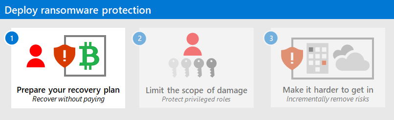

# Quickly protect your organization against ransomware attacks

Ransomware is a cyber attack type that cybercriminals use to extort organizations large and small.

Understanding how to protect against ransomware attacks and minizmize damage is an important part of safguarding your company. This article gives you practical guidance for how to quickly configure ransomware protection.  

The guidance is organized into steps, starting with the most urgent actions to take.

Each step is a separate article linked below. Bookmark this page as your starting point. 

> [!NOTE]
> What is ransomware? See the ransomware definition [here](/security/compass/human-operated-ransomware).

## Important information about this article

> [!NOTE]
> The order of these steps is designed to ensure you reduce risk *as fast as possible*, and built on an assumption of great urgency that overrides normal security and IT priorities, in order to avoid or mitigate devastating attacks.

**It is important to note** this ransomware prevention guidance is structured as steps you should follow in the order shown. To best adapt this guidance to your situation:

1. **Stick with the recommended priorities**

    Use the steps as a starting plan for what to do first, next, and later, so you get the most impactful elements first. These recommendations have been prioritized using the [Zero Trust](https://www.microsoft.com/security/business/zero-trust) principle of *assuming a breach*. This forces you to focus on minimizing business risk by assuming the attackers can successfully gain access to your environment through one or more methods.

2. **Be proactive and flexible (but ***don’t skip important tasks***)**

    Scan through the implementation checklists for all sections of all three steps to see if there are any areas and tasks that you can quickly *complete earlier* (e.g. already have access to a cloud service that hasn’t been utilized but could be quickly and easily configured). As you look over the whole plan, be very careful that *these later areas and tasks don’t delay completion* of critically important areas like backups and privileged access!

3. **Do some items in parallel**

    Trying to do everything at once can be overwhelming, but some items can naturally be done in parallel. Staff on different teams can be working on tasks at the same time (e.g. backup team, endpoint team, identity team), while also driving for completion of the steps in priority order.

The items in the implementation checklists are in the recommended order of prioritization, not a technical dependency order.

Use the checklists to confirm and modify your existing configuration as needed and in a way that works in your organization. For example, in the most important backup element, you backup some systems, but they may not be offline/immutable, or you may not test the full enterprise restore procedures, or you may not have backups of critical business systems or critical IT systems like Active Directory Domain Services (AD DS) domain controllers.

>[!Note]
>See the [3 steps to prevent and recover from ransomware (September 2021)](https://www.microsoft.com/security/blog/2021/09/07/3-steps-to-prevent-and-recover-from-ransomware/) Microsoft security blog post for an additional summary of this process.
>

## Set up your system to prevent ransomware right now

The steps are:

### Step 1. Prepare your ransomware recovery plan

This step is designed to [minimize the monetary incentive from ransomware attackers](protect-against-ransomware-phase1.md) by making it:

- Much harder to access and disrupt systems or encrypt or damage key organization data.
- Easier for your organization to recover from an attack without paying the ransom.

>[!Note]
>While restoring many or all enterprise systems is a difficult endeavor, the alternative of paying an attacker for a recovery key they may or may not deliver, and using tools written by the attackers to try to recover systems and data.
>

### Step 2. Limit the scope of ransomware damage

Make the attackers work a lot harder to [gain access to multiple business critical systems through privileged access roles](protect-against-ransomware-phase2.md). Limiting the attacker’s ability to get privileged access makes it much harder to profit off of an attack on your organization, making it more likely they will give up and go elsewhere.

### Step 3. Make it hard for cybercriminals to get in

This last set of tasks is important to raise friction for entry but will take time to complete as part of a larger security journey. The goal of this step is to make the attackers' work *much* harder as they try to [obtain access to your on-premises or cloud infrastructures](protect-against-ransomware-phase3.md) at the various common points of entry. There are a lot of these tasks, so it’s important to prioritize your work here based on how fast you can accomplish these with your current resources.

While many of these will be familiar and easy to quickly accomplish, it’s critically important that ***your work on step 3 should not slow down your progress on steps 1 and 2***.

## Ransomware protection at a glance

You can also see an overview of the steps and their implementation checklists as levels of protection against ransomware attackers with the [Protect your organization from ransomware poster](https://download.microsoft.com/download/5/e/3/5e37cbff-9a7a-45b2-8b95-6d3cc5426301/protect-your-organization-from-ransomware.pdf).

## Next step

Start with [step 1](protect-against-ransomware-phase1.md) to prepare your organization to recover from an attack without having to pay the ransom.

## Additional ransomware resources

Key information from Microsoft:

- [The growing threat of ransomware](https://blogs.microsoft.com/on-the-issues/2021/07/20/the-growing-threat-of-ransomware/), Microsoft On the Issues blog post on July 20, 2021
- [Human-operated ransomware](human-operated-ransomware.md)
- [2021 Microsoft Digital Defense Report](https://www.microsoft.com/security/business/microsoft-digital-defense-report) (see pages 10-19)
- [Ransomware: A pervasive and ongoing threat](https://security.microsoft.com/threatanalytics3/05658b6c-dc62-496d-ad3c-c6a795a33c27/overview) threat analytics report in the Microsoft Defender portal
- Microsoft's Detection and Response Team (DART) ransomware [approach](/security/operations/incident-response-playbook-dart-ransomware-approach) and [case study](dart-ransomware-case-study.md)

Microsoft 365:

- [Deploy ransomware protection for your Microsoft 365 tenant](/microsoft-365/solutions/ransomware-protection-microsoft-365)
- [Maximize Ransomware Resiliency with Azure and Microsoft 365](https://azure.microsoft.com/resources/maximize-ransomware-resiliency-with-azure-and-microsoft-365/)
- [Recover from a ransomware attack](/microsoft-365/security/office-365-security/recover-from-ransomware)
- [Malware and ransomware protection](/compliance/assurance/assurance-malware-and-ransomware-protection)
- [Protect your Windows 10 PC from ransomware](https://support.microsoft.com//windows/protect-your-pc-from-ransomware-08ed68a7-939f-726c-7e84-a72ba92c01c3)
- [Handling ransomware in SharePoint Online](/sharepoint/troubleshoot/security/handling-ransomware-in-sharepoint-online)
- [Threat analytics reports for ransomware](https://security.microsoft.com/threatanalytics3?page_size=30&filters=tags%3DRansomware&ordering=-lastUpdatedOn&fields=displayName,alertsCount,impactedEntities,reportType,createdOn,lastUpdatedOn,tags,flag) in the Microsoft Defender portal

Microsoft Defender XDR:

- [Find ransomware with advanced hunting](/microsoft-365/security/defender/advanced-hunting-find-ransomware)

Microsoft Azure:

- [Azure Defenses for Ransomware Attack](https://azure.microsoft.com/resources/azure-defenses-for-ransomware-attack/)
- [Maximize Ransomware Resiliency with Azure and Microsoft 365](https://azure.microsoft.com/resources/maximize-ransomware-resiliency-with-azure-and-microsoft-365/)
- [Backup and restore plan to protect against ransomware](/azure/security/fundamentals/backup-plan-to-protect-against-ransomware)
- [Help protect from ransomware with Microsoft Azure Backup](https://www.youtube.com/watch?v=VhLOr2_1MCg) (26 minute video)
- [Recovering from systemic identity compromise](/azure/security/fundamentals/recover-from-identity-compromise)
- [Advanced multistage attack detection in Microsoft Sentinel](/azure/sentinel/fusion#ransomware)
- [Fusion Detection for Ransomware in Microsoft Sentinel](https://techcommunity.microsoft.com/t5/azure-sentinel/what-s-new-fusion-detection-for-ransomware/ba-p/2621373)

Microsoft Defender for Cloud Apps:

- [Create anomaly detection policies in Defender for Cloud Apps](/cloud-app-security/anomaly-detection-policy)

Microsoft Security team blog posts:

- [3 steps to prevent and recover from ransomware (September 2021)](https://www.microsoft.com/security/blog/2021/09/07/3-steps-to-prevent-and-recover-from-ransomware/)
- [A guide to combatting human-operated ransomware: Part 1 (September 2021)](https://www.microsoft.com/security/blog/2021/09/20/a-guide-to-combatting-human-operated-ransomware-part-1/)

  Key steps on how Microsoft's Detection and Response Team (DART) conducts ransomware incident investigations.

- [A guide to combatting human-operated ransomware: Part 2 (September 2021)](https://www.microsoft.com/security/blog/2021/09/27/a-guide-to-combatting-human-operated-ransomware-part-2/)

  Recommendations and best practices.

- [Becoming resilient by understanding cybersecurity risks: Part 4—navigating current threats (May 2021)](https://www.microsoft.com/security/blog/2021/05/26/becoming-resilient-by-understanding-cybersecurity-risks-part-4-navigating-current-threats/)

  See the **Ransomware** section.

- [Human-operated ransomware attacks: A preventable disaster (March 2020)](https://www.microsoft.com/security/blog/2020/03/05/human-operated-ransomware-attacks-a-preventable-disaster/)

  Includes attack chain analyses of actual attacks.

- [Ransomware response—to pay or not to pay? (December 2019)](https://www.microsoft.com/security/blog/2019/12/16/ransomware-response-to-pay-or-not-to-pay/)
- [Norsk Hydro responds to ransomware attack with transparency (December 2019)](https://www.microsoft.com/security/blog/2019/12/17/norsk-hydro-ransomware-attack-transparency/)
