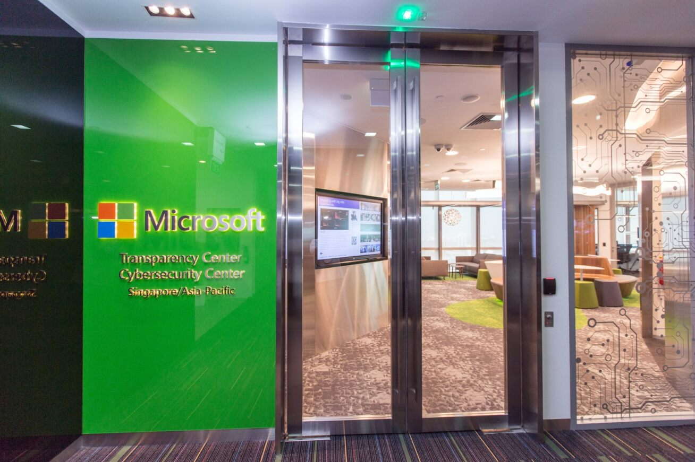

# Transparency Centers

Microsoft is committed to providing an unprecedented level of transparency through the Government Security Program (GSP), aimed at helping customers gain confidence in the integrity and assurance of the products and services on which they rely. Transparency Centers (TCs) are an excellent showcase to demonstrate Microsoft's commitment to security and transparency.

## A Secure Facility for Inspection and Analysis

Transparency Centers provide GSP participants with an opportunity to visit a secure facility to conduct deep levels of document and source code inspection and analysis. To support those efforts, Microsoft has five Transparency Centers throughout the world: United States, Ireland, Singapore, Brazil, and China. Participants have access to documents and source code and an environment for in-depth inspection with industry standard tools.Currently, the Transparency Centers provide source code for products such as **Windows, Windows Server, Office, Exchange Server, SQL Server, and SharePoint Server**.

## Center Visits

Each visit to a Transparency Center is tailored to the unique goals of what an agency is looking to accomplish. Visits can last from one day to two weeks, depending on an agency’s needs, and are scheduled based on facility availability. Face-to-face or teleconference exchanges with Microsoft engineers may also be available and can be beneficial during Transparency Center visits for agencies who have also joined the Technical Data portion of the program.

  

## Environment and Tools

The environment and tools for source code evaluation include:
- Private network with dedicated servers and clients
- OpenGrok open source search and cross-reference
- PowerShell, Visual Studio
- HeyRays IDA Disassembler and Decompiler
- Tools provided by the participant and approved by Microsoft
- SysInternals

## Use Cases

 - Evaluation of Cryptography Next Generation implementation and preparation for national cryptography implementation
 - Review of SSL and TCP/IP implementation
 - Inspection of the source of random number generators
 - Walkthrough of Microsoft's build process
 - Assessment of individual binaries to compare against shipped binaries

## Contact Us

Contact your local Microsoft representative to learn more about the Government Security Program.
