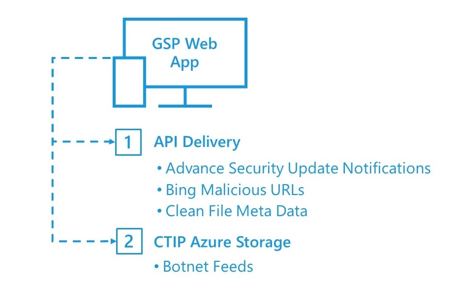
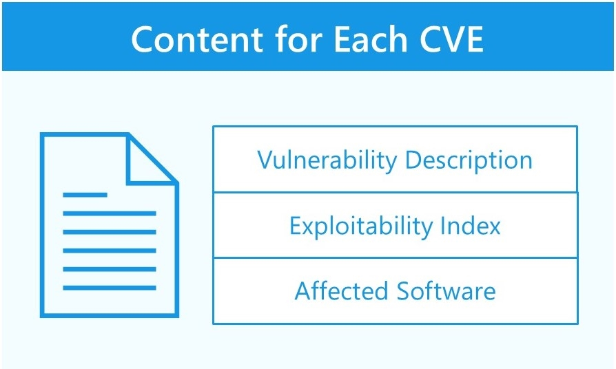
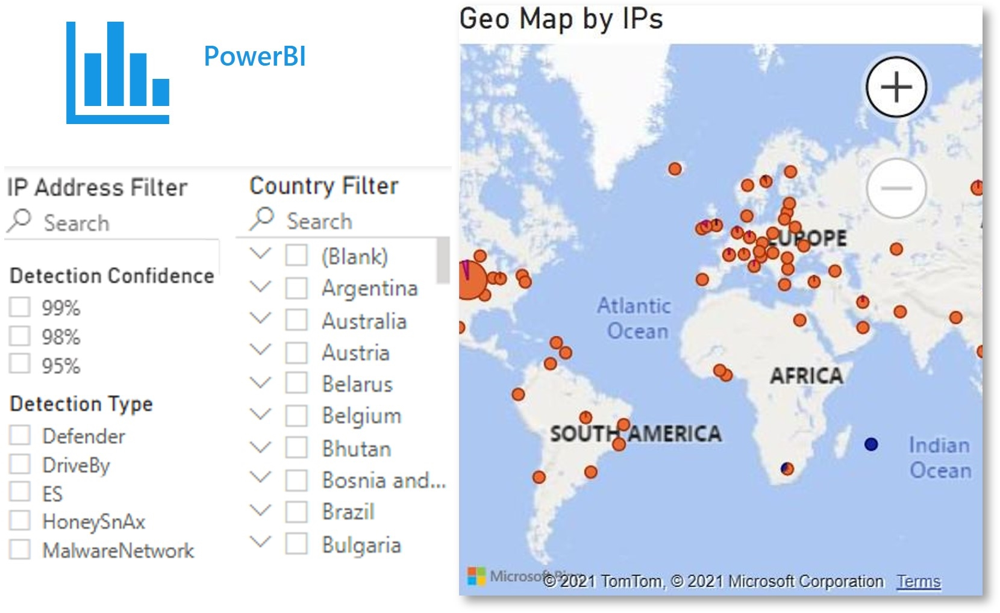
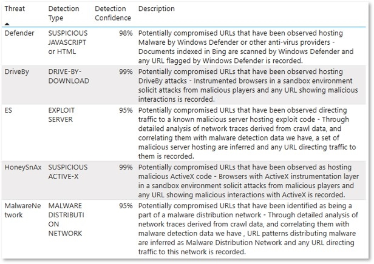
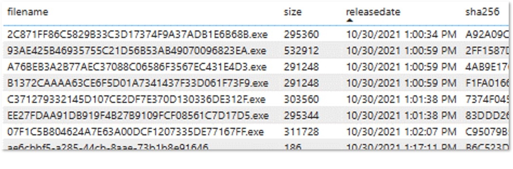
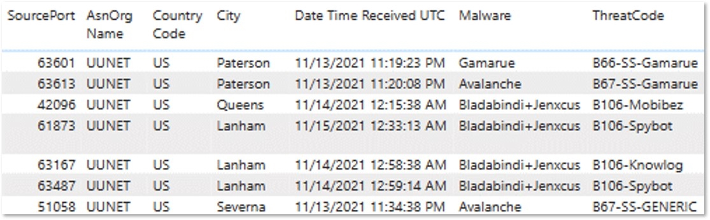
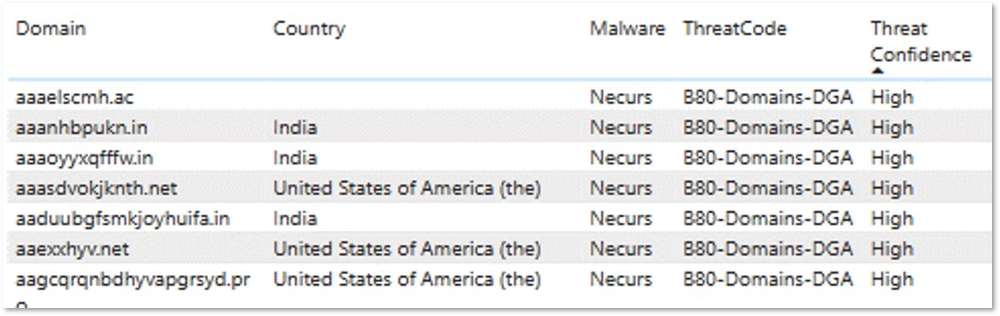

# Information Sharing and Exchange

The mission of Microsoft’s Government Security Program (GSP) is to build trust through transparency. Since the program’s inception in 2003, Microsoft has provided visibility into our technology and security artifacts which governments and international organizations can use to help protect themselves and their citizens. The Information Sharing and Exchange offering enables Microsoft to share and exchange materials about security threats, vulnerabilities, anomalous behavior, malware information, and security issues against or related to Microsoft products and services. 

This offering brings together groups and resources across the Microsoft environment to help governments protect citizens, infrastructure, and organizations.

## The Information Sharing and Exchange offering provides

<table>
<thead>
<tr>
<th>Name</th>
<th>Detail</th>
</tr>
</thead>
<tbody>
<tr>
<td><strong>Advance Notice of Security Vulnerabilities</strong></td>
<td><li> 5-day advance notice of vulnerabilities with release notes and affected software tables <li> 24-hour advance of full notice including exploitability index</td>
</tr>
<tr>
<td><strong>Malicious URLs</strong></td>
<td><li> Feed of potentially malicious publicly facing servers and services detected by the Bing crawlers <li> Updated every three hours, 5 day cycle of data</td>
</tr>
<tr>
<td><strong>CTIP Botnet Feeds</strong></td>
<td><li> Provided by the Digital Crimes Unit’s Cyber Threat Intelligence Program <li> Botnet data is tailored to the agency (or country code top level domain in the case of CERTs) <li> 4 feeds: Infected device, Command &amp; Control, IoT, and Domains <li> Delivered near real time, hourly or daily (deduped)</td>
</tr>
<tr>
<td><strong>Clean File Meta Data</strong></td>
<td><li> Clean file hash data often used for allow-listing and forensics <li> Updated every 3 hours <li> Covers all Microsoft binaries on the Microsoft download center</td>
</tr>
<tr>
<td><strong>Partnership</strong></td>
<td><li> Information exchange through a variety of forums <li> Access to the Digital Crimes Community Portal <li> Threat intelligence data sharing with the Digital Crimes Unit <li> Direct engagement with engineering groups and other Microsoft teams including the Microsoft Security Response Center and Windows Defender Security Intelligence</td>
</tr>
</tbody>
</table>

## Data Feeds Delivery
The feeds offered under the ISE authorization reside within several groups including the **Microsoft Security Response Center (MSRC)**, the **Digital Crimes Unit (DCU)**, **Bing** and **Product Release and Security Services (PRSS)**.

The GSP team provides a **web-based application** that allows GSP agencies to access the ISE data feeds from a single interface. All communications containing sensitive data are encrypted.
   

 

## Data Use Descriptions

**Advanced Security Update Notification**
The notice package lists all the CVEs (Common Vulnerabilities and Exposures) being addressed in the release. Each CVE contains a set of information including the Vulnerability Description (including metrics), Exploitability Index, and Affected Software.

 

**Bing Malicious URLs**
The Bing Malicious URL feed contains publicly facing servers or services which have been identified as being potentially malicious. New files are uploaded every three hours; full data sets are generated in 5 days. Many agencies import the JSON files directly into their existing threat intelligence analysis tools. 

 
 

     

**Clean File Meta Data (CFMD)**

The Clean File Meta Data (CFMD) feed contains cryptographic signatures (SHA256 hashes) for the files contained within Microsoft products. These are often used in forensic examinations of potentially compromised devices and for allow / disallow file execution in critical systems.

     

**CTIP Botnet Feeds: Infected Data Feed**

The DCU provides compromised victim botnet data via the DCU ‘s CTIP threat intelligence service Infected device data feed, to enable network protection scenarios for CTIP subscribers, and to help facilitate remediation of the compromised systems with the goal of reducing the number of infected systems on the Internet. 
Other feeds include the Command and Control (C2), IoT and Domains lists that are often used to restrict traffic flow to know malware networks via firewalls and protective DNS.

 
 

   

## Contact Us   

Contact your local Microsoft representative to learn more about the Government Security Program.   
