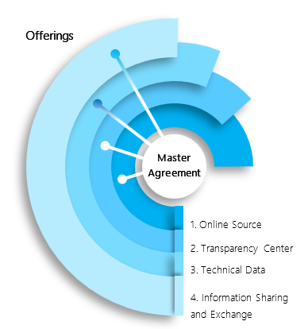

# Program Overview

## Our commitment to trust and transparency

The mission of Microsoft’s Government Security Program (GSP) is to build trust through transparency.  Microsoft recognizes that people will only use technology they trust and we strive to demonstrate our commitment to building this trust through our transparency, privacy, compliance, and security principles.  Since the program’s inception in 2003, Microsoft has provided visibility into our technology which governments and international organizations can use to help protect themselves and their citizens.

The GSP is designed to provide participants with the confidential security information and resources they need to trust Microsoft’s products and services.  Participants currently include over 40 countries and international organizations represented by more than 70 agencies.  Participation enables controlled access to source code, exchange of threat and vulnerability information, engagement on technical content about Microsoft’s products and services, and access to five globally-distributed Transparency Centers, which are located in the United States, Belgium, Singapore, Brazil, and China. 

## Qualifying agencies participate at no charge. Program criteria include requirements that GSP participants must be

 - A legal entity of a national government or recognized international organization.
 - Able to sign an agreement on behalf of that government.
 - Compliant with permitted law enforcement activities .
 - Able to adequately protect intellectual property and confidential information.

## The Purpose of the GSP is to help governments protect themselves and their citizens by

 - Enabling trust and transparency
 - Providing access to security information about Microsoft products and services
 - Providing data to improve protection of government information technology against cyber threats
 - Fostering collaboration between Microsoft security teams and government cybersecurity experts

## GSP Offerings

 The program is designed to allow participants to focus on topics that are most important to them.  Agencies work with local Microsoft representatives to ensure their goals are best supported by the right combination of GSP offerings.  Microsoft offers four different offerings which address a variety of priorities, including access to source code, threat and vulnerability information, technical content about Microsoft’s products and services, and access to Microsoft engineering and security experts.

 1. The **Online Source** offering enables online access to view source code. Access is provided through a secure web portal which provides select source code in a read-only format to Microsoft products such as Windows, Office, SharePoint Server, and Exchange Server.

 2. The **Transparency Center** offering provides agencies with an opportunity to visit a secure facility to conduct deep levels of source code inspection and analysis.  Microsoft’s five Transparency Centers are located in the United States, Belgium, Singapore, Brazil, and China.

 3. The **Technical Data** offering provides access to information about products and services.  This includes technical documentation about Microsoft’s products and cloud services, opportunities to access Microsoft engineers to address specific topics, and security-specific technical trips to Microsoft facilities for in-depth face-to-face conversations.

 4. The **Information Sharing and Exchange** offering provides data about threats and vulnerabilities and a communication channel with Microsoft security and response teams.

## Participation Profile

GSP participants typically have a mission which focuses on information security and assurance, and generally they are:
 - Security / information assurance and national defense agencies which include:
   - Developers and testers
   - Application security specialists
   - Cryptography specialists
 - Public safety agencies
 - National Computer Emergency Readiness Teams or Incident Response authorities

## GSP Membership

Local Microsoft representatives work with government and international organizations to determine if participating in the GSP through one of more offerings would match that agency’s needs, assuming that local practices and laws related to confidentiality, information sharing, intellectual property protection, export control, and related areas align to the program. 

If a country would like to have more than one agency participate in the program, the local Microsoft representatives and the agencies can work together to determine whether each agency should have its own GSP offering or have one agency as primary GSP participant that would sponsor additional agencies.   

## Sponsored Agency Process

A GSP participant (Sponsoring Agency) may request Microsoft’s approval to add other government agencies (Sponsored Agencies) as participants to the GSP.  The Sponsoring Agency takes responsibility for the Sponsored Agency’s compliance with all contractual terms..

## Contact Us

Contact your local Microsoft representative or email **gspteam\@microsoft.com**  to learn more about the Government Security Program
