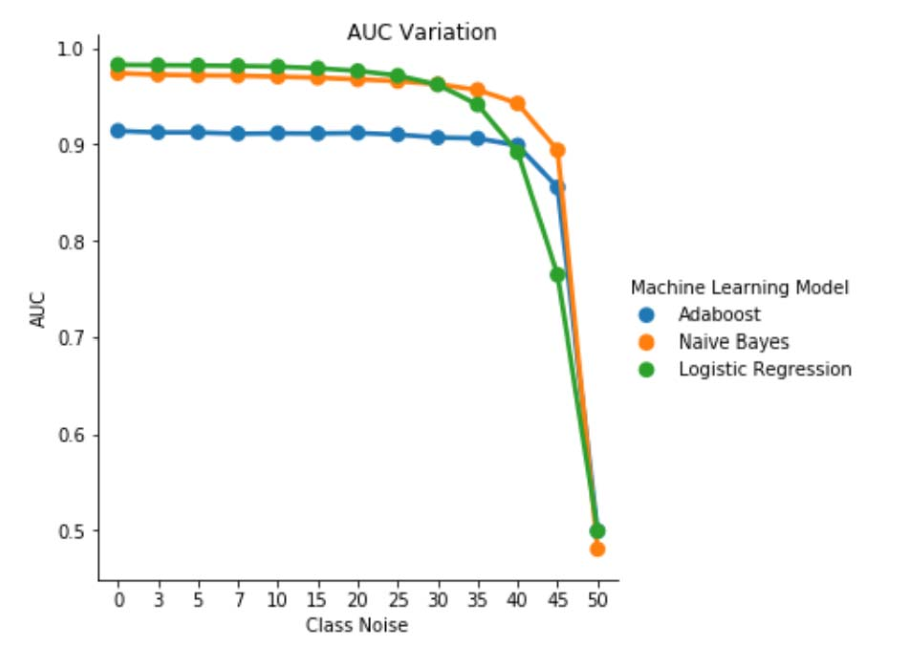

# Identifying Security Bug Reports Based Solely on Report Titles and Noisy Data

<table style="text-align:left" border="0">
  
  <tr>
    <td>
<a href="mailto:mayana.wanderley@microsoft.com">Mayana Pereira    </a>
CELA Data Science   Microsoft</td>
    <td>
<a href="mailto:scott.christiansen@microsoft.com">Scott Christiansen</a>
Customer Security and Trust   Microsoft</td>
    <td>
Alok Kumar
  </td>
</table>

_Abstract_ — Identifying security bug reports (SBRs) is a vital step in the software development life-cycle. In supervised machine learning based approaches, it is usual to assume that entire bug reports are available for training and that their labels are noise free. To the best of our knowledge, this is the first study to show that accurate label prediction is possible for SBRs even when solely the title is available and in the presence of label noise.

_Index Terms_ — Machine Learning, Mislabeling, Noise, Security Bug Report, Bug Repositories

## I. INTRODUCTION

Identifying security related issues among reported bugs is a pressing need among software development teams as such issues call for more expedited fixes in order to meet compliance requirements and ensure the integrity of the software and customer data.

Machine learning and artificial intelligence tools promise to make the software development faster, agile and correct. Several researchers have applied machine learning to the problem of identifying security bugs [2], [7], [8], [18].Previous published studies have assumed that the entire bug report is available for training and scoring a machine learning model. This is not necessarily the case. There are situations where the entire bug report cannot be made available. For example, the bug report might contain passwords, personally identifying information (PII) or other kinds of sensitive data - a case we are currently facing at Microsoft. It is therefore important to establish how well security bug identification can be performed using less information, such as when only the title of the bug report is available.

Additionally, bug repositories often contain mislabeled entries [7]: non-security bug reports classified as security related and vice-versa. There are several reasons for the occurrence of mislabeling, ranging from the development team's lack of expertise in security, to the fuzziness of certain problems, e.g. it is possible for non-security bugs to be exploited in an indirect way as to cause a security implication. This is a serious problem since the mislabeling of SBRs results in security experts having to manually review bug database in an expensive and time-consuming effort. Understanding how noise affects different classifiers and how robust (or fragile) different machine learning techniques are in the presence of data sets contaminated with different kinds of noise is a problem that must be addressed for to bring automatic classification to the practice of software engineering.

Preliminary work argues that bug repositories are intrinsically noisy and that the noise might have an adverse effect on the performance machine learning classifiers [7]. There lacks, however, any systematic and quantitative study of how different levels and types of noise affect the performance of different supervised machine learning algorithms for the problem of identifying security bug reports (SRBs).

In this study, we show that the classification of bug reports can be performed even when solely the title is available for training and scoring. To the best of our knowledge this is the very first work to do so. Additionally, we provide the first systematic study of the effect of noise in bug report classification. We make a comparative study of robustness of three machine learning techniques (logistic regression, naive Bayes and AdaBoost) against class-independent noise.

While there are some analytical models that capture the general influence of noise for a few simple classifiers [5], [6], these results do not provide tight bounds on the effect of the noise on precision and are valid only for a particular machine learning technique. An accurate analysis of the effect of noise in machine learning models is usually performed by running computational experiments. Such analyses have been done for several scenarios ranging from software measurement data [4], to satellite image classification [13] and medical data [12]. Yet these results cannot be translated to our specific problem, due to its high dependency on the nature of the data sets and underlying classification problem. To the best of our knowledge, there are no published results on the problem of the effect of noisy data sets on security bug report classification in particular.

### OUR RESEARCH CONTRIBUTIONS:

- We train classifiers for the identification of security bug reports (SBRs) based solely on the title of the reports. To the best of our knowledge this is the first work to do so. Previous works either used the complete bug report or enhanced the bug report with additional complementary features. Classifying bugs based solely on the tile is particularly relevant when the complete bug reports cannot be made available due to privacy concerns. For example, it is notorious the case of bug reports that contain passwords and other sensitive data.

- We also provide the first systematic study of the label noise-tolerance of different machine learning models and techniques used for the automatic classification of SBRs. We make a comparative study of robustness of three distinct machine learning techniques (logistic regression, naive Bayes and AdaBoost) against class-dependent and class-independent noise.

The remaining of the paper is presented as follows: In section II we present some of the previous works in the literature. In section III we describe the data set and how data is pre-processed. The methodology is described in section IV and the results of our experiments analyzed in section V. Finally, our conclusions and future works are presented in VI.

## II. PREVIOUS WORKS

### MACHINE LEARNING APPLICATIONS TO BUG REPOSITORIES.

There exists an extensive literature in applying text mining, natural language processing and machine learning on bug repositories in an attempt to automate laborious tasks such as security bug detection [2], [7], [8], [18], bug duplicate identification [3], bug triage [1], [11], to name a few applications. Ideally, the marriage of machine learning (ML) and natural language processing potentially reduces the manual work required to curate bug databases, shorten the required time for accomplishing these tasks and can increase the reliability of the results.

In [7] the authors propose a natural language model to automate the classification of SBRs based on the description of the bug. The authors extract a vocabulary from all bug description in the training data set and manually curate it into three lists of words: relevant words, stop words (common words that seem irrelevant for classification), and synonyms. They compare the performance of security bug classifier trained on data that is all evaluated by security engineers, and a classifier trained on data that was labeled by bug reporters in general. Although their model is clearly more effective when trained on data reviewed by security engineers, the proposed model is based on a manually derived vocabulary, which makes it dependent on human curation. Moreover, there is no analysis of how different levels of noise affects their model, how different classifiers respond to noise, and if noise in either class affects performance differently.

Zou et. al [18] make use of multiple types of information contained in a bug report which involve the non-textual fields of a bug report (meta features, e.g., time, severity, and priority) and the textual content of a bug report (textual features, i.e., the text in summary fields). Based on these features, they build a model to automatically identify the SBRs via natural language processing and machine learning techniques. In [8] the authors perform a similar analysis, but additionally they compare the performance of supervised and unsupervised machine learning techniques, and study how much data is needed to train their models.

In [2] the authors also explore different machine learning techniques to classify bugs as SBRs or NSBRs (Non-Security Bug Report) based on their descriptions. They propose a pipeline for data processing and model training based on TFIDF. They compare the proposed pipeline with a model based on bag-of-words and naive Bayes.
Wijayasekara et al. [16] also used text mining techniques to generate the feature vector of each bug report based on frequent words to identify Hidden Impact Bugs (HIBs). Yang et al. [17] claimed to identify high impact bug reports (e.g., SBRs) with the help of Term Frequency (TF) and naive Bayes. In [9] the authors propose a model to predict the severity of a bug.

### LABEL NOISE

The problem of dealing with data sets with label noise has been extensively studied. Frenay and Verleysen propose a label noise taxonomy in [6], in order to distinguish different types of noisy label. The authors propose three different types of noise: label noise which occurs independently of the true class and of the values of the instance features; label noise that depends only on the true label; and label noise where the mislabelling probability also depends on the feature values. In our work we study the first two types of noise. From a theoretical perspective, label noise usually decreases a model's performance [10], except in some specific cases [14]. In general, robust methods rely on overfitting avoidance to handle label noise [15]. The study of noise effects in classification has been done before in many areas such as satellite image classification [13], software quality classification [4] and medical domain classification [12].
To the best of our knowledge, there are no published works studying the precise quantification of the effects of noisy labels in the problem of SBRs classification. In this scenario, the precise relationship among noise levels, noise types and performance degradation has not been established. Moreover, it is worthwhile to understand how different classifiers behave in the presence of noise. More generally, we are unaware of any work that systematically studies the effect of noisy data sets on the performance of different machine learning algorithms in the context of software bug reports.

## III. DATA SET DESCRIPTION

Our data set consists of 1,073,149 bug titles, 552,073 of which correspond to SBRs and 521,076 to NSBRs. The data was collected from various teams across Microsoft in the years 2015, 2016, 2017 and 2018. All the labels were obtained by signature-based bug verification systems or human labeled. Bug titles in our data set are very short texts, containing around 10 words, with an overview of the problem.

A. Data Pre-processing
We parse each bug title by its blank spaces, resulting in a list of tokens. We process each list of tokens as follows:

- Remove all tokens that are file paths

- Split tokens where the following symbols are present: { ,
(, ), -, }, {, [, ], }

- Remove stop words , tokens that are composed by numeric characters only and tokens that appear fewer than 5 times in the entire corpus.

## IV. METHODOLOGY

The process of training our machine learning models consists of two main steps: encoding the data into feature vectors and training supervised machine learning classifiers.

### A. Feature Vectors and Machine Learning Techniques

The first part involves encoding data into feature vectors using the term frequencyinverse document frequency algorithm (TF-IDF), as used in [2]. TF-IDF is an information retrieval technique that weighs a terms frequency (TF) and its inverse document frequency (IDF). Each word or term has its respective TF and IDF score. The TF-IDF algorithm assigns the importance to that word based on the number of times it appears in the document, and more importantly, it checks how relevant the keyword is throughout the collection of titles in the data set. We trained and compared three classification techniques: naive Bayes (NB), boosted decision trees (AdaBoost) and logistic regression (LR). We have chosen these techniques because they have been shown to performance well for the related task of identifying security bug reports based on the entire report in the literature. These results were confirmed in a preliminary analysis where these three classifiers outperformed support vector machines and random forests. In our experiments we utilize the scikit-learn   library for encoding and model training.

### B. Types of Noise

The noise studied in this work refers to noise in the class label in the training data. In the presence of such noise, as a consequence, the learning process and resulting model are impaired by mislabelled examples. We analyze the impact of different noise levels applied to the class information.
Types of label noise have been discussed previously in the literature using various terminologies. In our work, we analyze the effects of two different label noise in our classifiers: class-independent label noise, which is introduced by picking instances at random and flipping their label; and class-dependent noise, where classes have different likelihood to be noisy.

a) _Class-independent noise_: Class-independent noise refers to the noise that occurs independently of the true class of the instances. In this type of noise, the probability of mislabeling pbr is the same for all instances in the data set. We introduce class-independent noise in our data sets by flipping each label in our data set at random with probability pbr.

b) _Class-dependent noise_: Class-dependent noise refers to the noise that depends on the true class of the instances. In this type of noise, the probability of mislabeling in class SBR is psbr and the probability of mislabeling in class NSBR is pnsbr. We introduce class-dependent noise in our data set by flipping each entry in the data set for which the true label is SBR with probability psbr. Analogously, we flip the class label of NSBR instances with probability pnsbr.

c) _Single-class noise_: Single-class noise is a special case of class-dependent noise, where pnsbr = 0 and psbr > 0.
Note that for class-independent noise we have psbr = pnsbr = pbr.

C. Noise Generation

Our experiments investigate the impact of different noise types and levels in the training of SBR classifiers. In our experiments we set 25% of the data set as test data, 10% as validation and 65% as training data.

We add noise to the training and validation data sets for different levels of pbr, psbr and pnsbr . We do not make any modifications to the test data set. The different noise levels used are P = {0.05 × i|0 < i < 10}.

In class-independent noise experiments, for pbr ∈ P we do the following:
- Generate noise for training and validation data sets;

- Train logistic regression, naive Bayes and AdaBoost models using training data set (with noise); * Tune models using validation data set (with noise);

- Test models using test data set (noiseless).

In class-dependent noise experiments, for psbr ∈ P and pnsbr ∈ P we do the following for all combinations of psbr and pnsbr:

- Generate noise for training and validation data sets;

- Train logistic regression, naive Bayes and AdaBoost models using training data set (with noise); 

- Tune models using validation data set (with noise);

- Test models using test data set (noiseless).

## V. EXPERIMENTAL RESULTS

In this section analyze the results of experiments conducted according to the methodology described in section IV.

_a) Model performance without noise in the training data set_: One of the contributions of this paper is the proposal of a machine learning model to identify security bugs by using only the title of the bug as data for decision making. This enables the training of machine learning models even when development teams do not wish to share bug reports in full due to presence of sensitive data. We compare the performance of three machine learning models when trained using only bug titles.

The logistic regression model is the best performing classifier. It is the classifier with the highest AUC value, of 0.9826, recall of 0.9353 for a FPR value of 0.0735. The naive Bayes Classifier presents slightly lower performance than the logistic regression Classifier, with an AUC of 0.9779 and a recall of 0.9189 for a FPR of 0.0769. The AdaBoost classifier has an inferior performance in comparison to the two previously mentioned classifiers. It achieves an AUC of 0.9143, and a recall of 0.7018 for a 0.0774 FPR. The area under the ROC curve (AUC) is a good metric for comparing performance of several models, as it summarizes in a single value the TPR vs. FPR relation. In the subsequent analysis we will restrict our comparative analysis to AUC values.

_A. Class Noise: single-class_

One can imagine a scenario where all bugs are assigned to class NSBR by default, and a bug will only be assigned to class SBR if there is a security expert reviewing the bug repository. This scenario is represented in the single-class experimental setting, where we assume that pnsbr = 0 and 0 < psbr < 0.5.

From table II we observe a very small impact in the AUC for all three classifiers. The AUC-ROC from a model trained on psbr = 0 compared to a AUC-ROC of model where psbr = 0.25 differs by 0.003 for logistic regression, 0.006 for naive Bayes, and 0.006 for AdaBoost. In the case of psbr = 0.50, the AUC measured for each of the models differ from the model trained with psbr = 0 by 0.007 for logistic regression, 0.011 for naive Bayes, and 0.010 for AdaBoost. logistic regression classifier trained in the presence of single-class noise presents the smallest variation in its AUC metric, i.e. a more robust behavior, when compared to our naive Bayes and AdaBoost classifiers.

_B. Class Noise: class-independent_

We compare the performance of our three classifiers for the case where the training set is corrupted by a class-independent noise. We measure the AUC for each model trained with different levels of pbr in the training data.

In Table III we observe a decrease in the AUC-ROC for every noise increment in the experiment. The AUC-ROC measured from a model trained on noiseless data compared to a AUC-ROC of model trained with class-independent noise with pbr = 0.25 differs by 0.011 for logistic regression, 0.008 for naive Bayes, and 0.0038 for AdaBoost. We observe that label noise does not impact the AUC of naive Bayes and AdaBoost classifiers significantly when noise levels are lower than 40%. On the other hand, logistic regression Classifier experiences an impact in AUC measure for label noise levels above 30%.

Fig. 1. Variation of AUC-ROC in class-independent noise. For a noise level pbr =0.5 the classifier acts like a random classifier, i.e. AUC≈0.5. But we can observe that for lower noise levels (pbr ≤0.30), the logistic regression learner presents a better performance compared to the other two models. However, for 0.35≤ pbr ≤0.45 naive Bayes learner presents better AUCROC metrics.

_C. Class Noise: class-dependent_

In the final set of experiments, we consider a scenario where different classes contain different noise levels, i.e. psbr &#8800; pnsbr. We systematically increment psbr and pnsbr independently by 0.05 in the training data and observe the change in behavior of the three classifiers.

Tables IV, V, VI show the variation of AUC as noise is increased in different levels in each class for logistic regression in Table IV, for naive Bayes in Table V and for AdaBoost in Table VI. For all classifiers, we notice an impact in AUC metric when both classes contains noise level above 30%. naive Bayes behaves mot robustly. The impact on AUC is very small even when the 50% of the label in the positive class are flipped, provided that the negative class contains 30% of noisy labels or less. In this case, the drop in AUC is of 0.03. AdaBoost presented the most robust behavior of all three classifiers. A significant change in AUC will only happen for noise levels greater than 45% in both classes. In that case, we start observing an AUC decay greater than 0.02.

_D. On The Presence of Residual Noise in the Original Data Set_

Our data set was labeled by signature-based automated systems and by human experts. Moreover, all bugs reports have been further reviewed and closed by human experts. While we expect that the amount of noise in our data set is minimal and not statistically significant, the presence of residual noise does not invalidate our conclusions. Indeed, for the sake of illustration, assume that the original data set is corrupted by a class-independent noise equal to 0 < p < 1/2 independent and identically distributed (i.i.d) for every entry.

If we, on top of the original noise, add a class-independent noise with probability pbr i.i.d, the resulting noise per entry will be p∗ = p(1 − pbr )+(1 − p)pbr . For 0 < p,pbr  < 1/2, we have that the actual noise per label p∗ is strictly larger than the noise we artificially add to the data set pbr . Thus, the performance of our classifiers would be even better if they were trained with a completely noiseless data set (p = 0) in the first place. In summary, the existence of residual noise in the actual data set means that the resilience against noise of our classifiers is better than the results here presented. Moreover, if the residual noise in our data set were statistically relevant, the AUC of our classifiers would become 0.5 (a random guess) for a level of noise strictly less than 0.5. We do not observe such behavior in our results.

## VI. CONCLUSIONS AND FUTURE WORKS
Our contribution in this paper is twofold. 

First, we have shown the feasibility of security bug report classification based solely on the title of the bug report. This is particularly relevant in scenarios where the entire bug report is not available due to privacy constraints. For example, in our case, the bug reports contained private information such as passwords and cryptographic keys and were not available for training the classifiers. Our result shows that SBR identification can be performed at high accuracy even when only report titles are available. Our classification model that utilizes a combination of TF-IDF and logistic regression performs at an AUC of 0.9831. 

Second, we analyzed the effect of mislabeled training and validation data. We compared three well-known machine learning classification techniques (naive Bayes, logistic regression and AdaBoost) in terms of their robustness against different noise types and noise levels. All three classifiers are robust to single-class noise. Noise in the training data has no significant effect in the resulting classifier. The decrease in AUC is very small ( 0.01) for a level of noise of 50%. For noise present in both classes and is class-independent, naive Bayes and AdaBoost models present significant variations in AUC only when trained with a data set with noise levels greater than 40%. 

Finally, class-dependent noise significantly impacts the AUC only when there is more then 35% noise in both classes. AdaBoost showed the most robustness. The impact in AUC is very small even when the positive class has 50% of its labels noisy, provided that the negative class contains 45% of noisy labels or less. In this case, the drop in AUC is less than 0.03. To the best of our knowledge, this is the first systematic study on the effect of noisy data sets for security bug report identification.

### FUTURE WORKS
In this paper we have started the systematic study of the effects of noise in the performance of machine learning classifiers for the identification of security bugs. There are several interesting sequels to this work, including: examining the effect of noisy data sets in determining the severity level of a security bug; understanding the effect of class imbalance on the resilience of the trained models against noise; understanding the effect of noise that is adversarially introduced in the data set.

### REFERENCES
[1]    John Anvik, Lyndon Hiew, and Gail C Murphy. Who should fix this bug? _In Proceedings of the 28th international conference on Software engineering_, pages 361–370. ACM, 2006.

[2]    Diksha Behl, Sahil Handa, and Anuja Arora. A bug mining tool to identify and analyze security bugs using naive bayes and tf-idf. In _Optimization, Reliabilty, and Information Technology (ICROIT)_, 2014 International Conference on, pages 294–299. IEEE, 2014.

[3]    Nicolas Bettenburg, Rahul Premraj, Thomas Zimmermann, and Sunghun Kim. Duplicate bug reports considered harmful really? In _Software maintenance, 2008. ICSM 2008. IEEE international conference on_, pages 337–345. IEEE, 2008.

[4]    Andres Folleco, Taghi M Khoshgoftaar, Jason Van Hulse, and Lofton Bullard. Identifying learners robust to low quality data. In _Information Reuse and Integration, 2008. IRI 2008. IEEE International Conference on_, pages 190–195. IEEE, 2008.

[5]    Benoˆıt Frenay.´ _Uncertainty and label noise in machine learning_. PhD thesis, Catholic University of Louvain, Louvain-la-Neuve, Belgium, 2013.

[6]    Benoˆıt Frenay and Michel Verleysen. Classification in the presence of´ label noise: a survey. _IEEE transactions on neural networks and learning systems_, 25(5):845–869, 2014.

[7]    Michael Gegick, Pete Rotella, and Tao Xie. Identifying security bug reports via text mining: An industrial case study. In _Mining software repositories (MSR), 2010 7th IEEE working conference on_, pages 11–20. IEEE, 2010.

[8]    Katerina Goseva-Popstojanova and Jacob Tyo. Identification of security related bug reports via text mining using supervised and unsupervised classification. In _2018 IEEE International Conference on Software Quality, Reliability and Security (QRS)_, pages 344–355, 2018.

[9]    Ahmed Lamkanfi, Serge Demeyer, Emanuel Giger, and Bart Goethals. Predicting the severity of a reported bug. In _Mining Software Repositories (MSR), 2010 7th IEEE Working Conference on_, pages 1–10. IEEE, 2010.

[10]    Naresh Manwani and PS Sastry. Noise tolerance under risk minimization. _IEEE transactions on cybernetics_, 43(3):1146–1151, 2013.

[11]    G Murphy and D Cubranic. Automatic bug triage using text categorization. In _Proceedings of the Sixteenth International Conference on Software Engineering & Knowledge Engineering_. Citeseer, 2004.

[12]    Mykola Pechenizkiy, Alexey Tsymbal, Seppo Puuronen, and Oleksandr Pechenizkiy. Class noise and supervised learning in medical domains: The effect of feature extraction. In _null_, pages 708–713. IEEE, 2006.

[13]    Charlotte Pelletier, Silvia Valero, Jordi Inglada, Nicolas Champion, Claire Marais Sicre, and Gerard Dedieu.´ Effect of training class label noise on classification performances for land cover mapping with satellite image time series. _Remote Sensing_, 9(2):173, 2017.

[14]    PS Sastry, GD Nagendra, and Naresh Manwani. A team of continuousaction learning automata for noise-tolerant learning of half-spaces. _IEEE Transactions on Systems, Man, and Cybernetics, Part B (Cybernetics)_, 40(1):19–28, 2010.

[15]    Choh-Man Teng. A comparison of noise handling techniques. In _FLAIRS Conference_, pages 269–273, 2001.

[16]    Dumidu Wijayasekara, Milos Manic, and Miles McQueen. Vulnerability identification and classification via text mining bug databases. In _Industrial Electronics Society, IECON 2014-40th Annual Conference of the IEEE, pages 3612–3618. IEEE_, 2014.

[17]    Xinli Yang, David Lo, Qiao Huang, Xin Xia, and Jianling Sun. Automated identification of high impact bug reports leveraging imbalanced learning strategies. In _Computer Software and Applications Conference (COMPSAC), 2016 IEEE 40th Annual_, volume 1, pages 227–232. IEEE, 2016.

[18]    Deqing Zou, Zhijun Deng, Zhen Li, and Hai Jin. Automatically identifying security bug reports via multitype features analysis. In _Australasian Conference on Information Security and Privacy_, pages 619–633. Springer, 2018.
