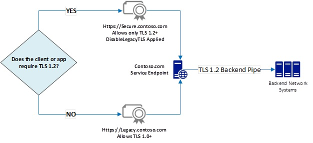
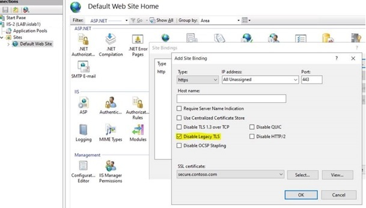

---
# This basic template provides core metadata fields for Markdown articles on docs.microsoft.com.

# Mandatory fields.
title: TLS version enforcement capabilities now available per certificate binding on Windows Server 2019
description: Threat Mitigation & Security Feature Technical Guidance
author: BruceCowper
ms.author: bcowper
ms.date: 8/14/2019
ms.topic: article
# Use ms.service for services or ms.prod for on-prem products. Remove the # before the relevant field.
# ms.service: service-name-from-allowlist
ms.prod: security

# Optional fields. Don't forget to remove # if you need a field.
# ms.custom: can-be-multiple-comma-separated
# ms.reviewer: MSFT-alias-of-reviewer
# manager: MSFT-alias-of-manager-or-PM-counterpart

---

TLS version enforcement capabilities now available per certificate binding on Windows Server 2019
========================

This post is authored by

Andrew Marshall, Principal Security Program Manager, Customer Security
and Trust

Gabriel Montenegro, Principal Program Manager, Core Networking

Niranjan Inamdar, Senior Software Engineer, Core Networking

Michael Brown, Senior Software Engineer, Internet Information Services

Ivan Pashov, Principal Software Engineering Lead, Core Networking

August 2019

As engineers worldwide work to eliminate their own dependencies on [TLS
1.0](https://blog.pcisecuritystandards.org/are-you-ready-for-30-june-2018-sayin-goodbye-to-ssl-early-tls),
they run into the complex challenge of balancing their own security
needs with the migration readiness of their customers. To date we have
helped customers address these issues by [adding TLS 1.2 support to
older operating
systems](https://www.microsoft.com/security/blog/2017/07/20/tls-1-2-support-added-to-windows-server-2008/),
by shipping [new logging formats in IIS for detecting weak TLS
usage](https://www.microsoft.com/security/blog/2017/09/07/new-iis-functionality-to-help-identify-weak-tls-usage/)
by clients, as well as providing the latest [technical guidance for
eliminating TLS 1.0
dependencies](https://www.microsoft.com/security/blog/2019/02/11/solving-the-tls-1-0-problem/).

Now Microsoft is pleased to announce a powerful new feature in Windows
to make your transition to a TLS 1.2+ world easier. Beginning with
[KB4490481](https://support.microsoft.com/help/4490481/windows-10-update-kb4490481),
Windows Server 2019 now allows you to block weak TLS versions from being
used with individual certificates you designate. We call this feature
“Disable Legacy TLS” and it effectively enforces a TLS version and
cipher suite floor on any certificate you select.

Disable Legacy TLS also allows an online service to offer two distinct
groupings of endpoints on the same hardware: one which allows only TLS
1.2+ traffic, and another which accommodates legacy TLS 1.0 traffic. The
changes are implemented in HTTP.sys, and in conjunction with the
issuance of additional certificates, allow traffic to be routed to the
new endpoint with the appropriate TLS version. Prior to this change,
deploying such capabilities would require an additional hardware
investment because such settings were only configurable system-wide via
registry.

Feature scenario details
------------------------

A common deployment scenario features one set of hardware in a
datacenter with customers of mixed needs: some need TLS 1.2 as an
enforced minimum right now and others aren’t done removing TLS 1.0
dependencies. Figure 1 illustrates TLS version selection and certificate
binding as distinctly separate actions. This is the default
functionality:


Figure 1: Default TLS Version selection and Certificate Binding
Functionality

- <https://secure.contoso.com> directs your customers to a service
    endpoint supporting only TLS 1.2 and above.

- <https://legacy.contoso.com> directs customers with legacy TLS 1.0
    needs (like those still migrating to TLS 1.2) to an endpoint which
    supports TLS 1.0 for a limited time. This allows customers to finish
    readiness testing for TLS 1.2 without service disruption and without
    blocking other customers who are ready for TLS 1.2.

Traditionally, you’d need two physically separate hosts to handle all
the traffic and provide for TLS version enforcement, as servicing TLS
requests with a minimum protocol version requires disabling weaker
protocols via system-wide registry settings. We have made this
functionality available higher up the stack, where the TLS session is
bound to the certificate, so a specific minimum TLS version can be
assigned as described in Figure 2 below.



Figure 2: Disable Legacy TLS feature enforcing minimum TLS version for a
selected certificate, Secure.contoso.com.

Feature deployment guidance
---------------------------

The Disable Legacy TLS feature can be deployed through the Internet
Information Services (IIS) Server UI, via PowerShell commands or C++
HTTP.sys APIs.

### Option \#1: IIS UI configuration (Available April 2020)

Create a site binding for the SSL Certificate “secure.contoso.com” as
shown below, then check “Disable Legacy TLS” and click OK.



### Option \#2: PowerShell (Available April 2020)

In PowerShell you can reference SSL flags like this:

    ```powershell
    [Microsoft.Web.Administration.SslFlags]::DisableLegacyTLS;
    ```

It’s convenient to create shorter named variables for them:

    ```powershell
    $Sni = [Microsoft.Web.Administration.SslFlags]::Sni

    $Sni\_CCS = [Microsoft.Web.Administration.SslFlags]::Sni + [Microsoft.Web.Administration.SslFlags]::CentralCertStore

    $CCS = [Microsoft.Web.Administration.SslFlags]::CentralCertStore

    $DisableLegacyTLS = [Microsoft.Web.Administration.SslFlags]::DisableLegacyTLS

    $storeLocation = "Cert:\\LocalMachine\\My";
    ```

An example of creating a site binding to a new site and disabling legacy
TLS:

    ```powershell
    $BindingInformation = "\*:443:"

    $siteName = "contoso"

    $Thumbprint = $certificate.ThumbPrint;
    ```

New-IISSite with Sslflag DisableLegacyTLS property value:

    ```powershell
    New-IISSite $siteName "$env:systemdrive\\inetpub\\wwwroot" "\*:443:secure.contoso.com" https $certificate.Thumbprint $DisableLegacyTLS $storeLocation -passthru;
    ```

An example of adding a site binding to an existing site and disabling
legacy TLS:

    ```powershell
    New-IISSiteBinding -Name "Default Web Site" -BindingInformation $BindingInformation -CertificateThumbPrint $certificate.Thumbprint -Protocol https -SslFlag $DisableLegacyTLS, $CCS -Force -verbose;
    ```

Additionally, one can troubleshoot and test this feature with Netsh:

- Adding a new binding:

     netsh http add sslcert \<regular parameters\>
        disablelegacytls=enable

- Updating an existing binding:

     netsh http update sslcert \<regular parameters\>
        disablelegacytls=enable

- Check whether it is set on a binding:

     netsh http show sslcert \<regular parameters\>

     Watch for Disable Legacy TLS Versions  : Set/Not Set

### Option \#3: C++ HTTP.sys APIs (Available Now)

Along with Disable Legacy TLS, the following additions have been made to
HTTP.sys:

- [HTTP\_SERVICE\_CONFIG\_SSL\_PARAM](/windows/win32/http/http-server-api-version-1-0-structures).DefaultFlags
    now supports the following new values:

- HTTP\_SERVICE\_CONFIG\_SSL\_FLAG\_ENABLE\_SESSION\_TICKET:
        Enable/Disable Session Ticket for a particular SSL endpoint.

- HTTP\_SERVICE\_CONFIG\_SSL\_FLAG\_LOG\_EXTENDED\_EVENTS :
        Enable/Disable extended event logging for a particular SSL
        endpoint. Additional events are logged to Windows Event Log.
        There is only one event supported as of now which is logged when
        the SSL handshake fails.

- HTTP\_SERVICE\_CONFIG\_SSL\_FLAG\_DISABLE\_LEGACY\_TLS:
        Enable/Disable legacy TLS versions for a particular SSL
        endpoint. Setting this flag will disable TLS1.0/1.1 for that
        endpoint and will also restrict cipher suites that can be used
        to HTTP2 cipher suites.

- HTTP\_SERVICE\_CONFIG\_SSL\_FLAG\_DISABLE\_TLS12 :
        Enable/Disable TLS1.2 for a particular SSL endpoint.

- HTTP\_SERVICE\_CONFIG\_SSL\_FLAG\_DISABLE\_HTTP2: Enable/Disable
        HTTP/2 for a particular SSL endpoint.

The simplest way to enable/disable this functionality per certificate in
C++ is with the HTTP\_SERVICE\_CONFIG\_SSL\_FLAG\_DISABLE\_LEGACY\_TLS
flag provided by the HttpSetServiceConfiguration HTTP.sys API.

When Disable Legacy TLS is set, the following restrictions are enforced:

- Disable SSL2, SSL3, TLS1.0 and TLS1.1 protocols.

- Disable encryption ciphers DES, 3DES, and RC4 (so only AES is used).

- Disable encryption cipher AES with CBC chaining mode (so only AES
    GCM is used).

- Disable RSA key exchange.

- Disable DH key exchange with key size less than 2048.

- Disable ECDH key exchanges with key size less than 224.

Official documentation of these changes on docs.Microsoft.com is
forthcoming.

Next steps for TLS version enforcement
--------------------------------------

Disable Legacy TLS provides powerful new capabilities for enforcing TLS
version/cipher suite floors on specific certificate/endpoint bindings.
It also requires you to plan out the naming of the certificates issued
with this functionality enabled. Some of the considerations include:

- Do I want the default path to my service endpoint to enforce TLS 1.2
    today, and provide a different certificate as a backup “legacy”
    access point for users who need TLS 1.0?

- Should my default, already-in-use
    [www.contoso.com](http://www.contoso.com) certification use Disable
    Legacy TLS? If so, I may need to provide a legacy.contoso.com
    certificate and bind it to an endpoint allowing TLS 1.0.

- How can I best communicate the recommended usage of these
    certificates to my customers?

You can leverage this feature to meet the needs of large groups of
customers – those with an obligation to use TLS 1.2+, and those still
working on the migration away from TLS 1.0, all without additional
hardware expenditure. In addition to today’s availability of
per-certificate TLS version binding in Windows Server 2019, Microsoft
will look to make Disable Legacy TLS available across its online
services based on customer demand.
