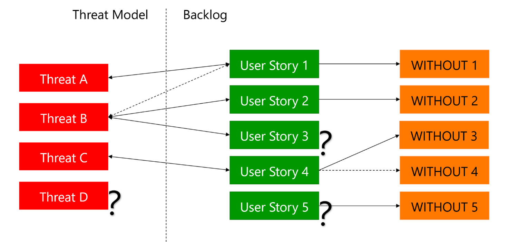

# Integrating Threat Modeling with DevOps 

## Introduction
  
Threat Modeling is an important security method that helps identifying and prioritizing the most important risk mitigations for an application or system. This paper contains some reflections on how it is possible to adopt Threat Modeling more effectively and efficiently, integrating it with modern DevOps methodologies and tools, and focusing on the value provided to all the various actors involved with the Software Development Lifecycle.

## Is this paper for you?

This paper is the result of the work of a small team of Security and Threat Modeling experts from Microsoft and incorporates inputs and ideas of some of the most prominent experts from outside Microsoft. It tries to address a simple but urgent question: what should we do to ensure that the Threat Modeling process we use is updated to the modern requirements imposed by Agile methodologies and DevOps, so that we provide the required value at the lowest cost?

If you are a Product Owner, the member of a Security team, or simply a developer who are considering to adopt Threat Modeling as a part of your development lifecycle, this paper is for you.

Analogously, if you already have adopted Threat Modeling, you may still find practical ideas to improve your process.

Nevertheless, the paper is designed to introduce ideas to improve current processes or to successfully adopt Threat Modeling as a part of your DevOps process. It does not introduce specific tools or products, even if it is our hope to see those ideas implemented by some tools or products in the future. Therefore, you will not find announcements of new tools or previews of upcoming features, here.

## Why Threat Modeling is important?

Threat Modeling is one of the primary approaches to designing software solutions securely. Through Threat Modeling, you analyze a system identify attack vectors, and develop actions for mitigating risks brought by those attacks. Appropriately done, Threat modeling is an excellent component of any Risk Management process. It can also help reduce costs by identifying and fixing design issues early. An old study from NIST estimated the cost of fixing a design issue in production code to be around 40 times higher than repairing it during the design phase. It also saves from incurring costs due to security incidents for the eventual design issues. Consider that the [2022 Cost of Data Breach Report](https://www.ibm.com/account/reg/us-en/signup?formid=urx-51643) from IBM Security and the Ponemon Institute estimates the average cost of a data breach to be \$ 4.35M. For the so-called Mega Breaches, involving the compromise of over 50 million records, the average cost reaches \$ 387M!

Threat Modeling is the first activity you can do to secure your solution because it operates on the solution design. This characteristic makes it the most effective security practice you can apply to your SDLC.

Microsoft has a long history with Threat Modeling. In 1999, two (then) Microsoft employees, Loren Kohnfelder and Praerit Garg, wrote a document, [The threats to our products](https://www.microsoft.com/en-us/security/blog/2009/08/27/the-threats-to-our-products/). This paper introduced the STRIDE approach, a synonym for the Microsoft Threat Modeling process.

## Threat Modeling is an evolutionary process

Threat Modeling is not a static process; it evolves as needs and technologies change.

- Supply Chain attacks like the recent one targeting [SolarWinds](https://www.microsoft.com/en-us/security/blog/2020/12/18/analyzing-solorigate-the-compromised-dll-file-that-started-a-sophisticated-cyberattack-and-how-microsoft-defender-helps-protect/) demonstrate the need to cover with Threat Modeling more scenarios than the solution itself, including development and deployment.

- [Open Source vulnerabilities](https://www.microsoft.com/en-us/security/blog/2020/07/20/open-source-security-managing-risk-software-composition-analysis/) like the recent one for [Log4j](https://www.cisa.gov/uscert/apache-log4j-vulnerability-guidance) have demonstrated the need to supplement the current approach based on the adoption of Software Composition Analysis tools to scan for vulnerable components by designing the solution defensively to limit its exposure.

- The application of new technologies like [Machine Learning](https://learn.microsoft.com/en-us/security/engineering/threat-modeling-aiml) introduces new attack vectors which must be understood and controlled. Consider, for example, the possibility of playing maliciously crafted sounds inaudible by human ears to cause the execution of commands by AI services, as discussed in <https://www.usenix.org/conference/usenixsecurity16/technical-sessions/presentation/carlini>.

At Microsoft, different product groups practice different variants of threat modeling based on their specific security requirements. Each variant aims to guarantee an adequate level of security assurance to the scenarios it is applied to, but what "adequate" means changes depending on the specific context.

For example, securing Windows is different from securing Azure Cognitive Services because those systems have very different sizes and characteristics. A key aspect of Threat Modeling is balancing its cost against the risk tolerance for an application. While this may lead to the decision to avoid Threat Modeling altogether for some scenarios, it is so effective when properly done that we can only recommend adopting it for any IT initiative, including software development and infrastructure deployment projects.

## The importance of focusing on the ROI

The last couple of years has seen a steady increase in interest in Threat Modeling as a key software development process. This interest is due to the exponential increase of attacks on infrastructures and solutions. Initiatives like the [NIST Recommended Minimum Standard for Vendor or Developer Verification of Code](https://www.darkreading.com/threat-intelligence/nist-brings-threat-modeling-into-the-spotlight) and the [Threat Modeling Manifesto](https://www.threatmodelingmanifesto.org/) have further increased the demand to the point that the current approaches have shown some limits. For example, the outcomes of Threat Modeling are highly dependent on the adopted process and on who performs the Threat Model. Thus, there is a concern about getting consistently higher quality out of the experience.

But, what does quality mean for Threat Modeling? To us, a Quality Threat Model must have the following characteristics:

- It must identify actionable Mitigations, activities that you can do to reduce the potential losses resulting from attacks. Actionable means that those Mitigations must be well defined, which means that you get enough information to implement them and then test the implementation. This also means that they must be provided to allow easy consumption from the Development team. With DevOps and Agile, this means that there is an easy path to import the Mitigations into the Backlog.

- For each Mitigation, it must identify its status. Some Mitigations are new, while others are already existing. The Threat Model must recognize what is already there and focus on the current risk to identify how to improve the situation.

- It must identify clearly why each Mitigation is required by linking it to the respective threats.

- Moreover, Mitigations have a relative strength for each threat. For example, TLS encryption may be a strong mitigation to the risk of having data in transit disclosed, and at the same time, it may be an almost complete mitigation to the risk of having the server spoofed.

- The Threats must be credible, well defined, and specific to the solution.

- The Threats must have an associated Severity, which should consider both their probability and the impact. The Severity must be reasonable and ideally unbiased.

- It should be possible to get a comprehensive view of the risks and how they can be addressed. This view would be instrumental in driving meaningful conversation with the Security team and with Business Decision Makers, and it would allow us to hide the unnecessary complexities.

This list already shows an important concept: Threat Modeling can provide value to many roles involved during the software lifecycle, but each role has different needs and requirements. For example, developers need to receive clear information about what they need to implement, and on how to verify that what they implemented behaves as expected. On the other hand, the Security team is typically concerned with the overall security of the ecosystem of infrastructure and applications owned by the organization; therefore, they need to receive information allowing to decide if the system in scope is secure enough and satisfies its compliance requirements. Finally, Product Owners and Business decision makers need to understand what is necessary to make the risk acceptable for the organization.

Such different needs require to provide different views on the Threat Model, each one of them focused on a specific usage scenario.

A typical problem with Threat Modeling is that the more it is successful, the more it is difficult for the few available experts to cover the demand while still providing the high quality expected from this experience. As a result, in some cases, quality may be affected negatively. All is good until Threat Modeling stops providing a significant value compared to the investment. More than a few organizations are impacted by this problem. There have already been a couple of reports of Business Decision Makers starting to question Threat Modeling because it would fail to deliver significant value for the cost.

With value, we refer to the Business value, which is the ability to provide the information needed to understand the risks represented by the system in scope and drive a meaningful decision process for selecting the proper Mitigations to be implemented. Moreover, value is also related to providing the correct information to the Developers and the Testers. Finally, value is related to communicating the residual risk with all the involved parties. We may, for example, measure the value by measuring the impact of the Threat Modeling process. Suppose we measure the overall risk for the solution by assigning a number to the Severity identified to each threat. In that case, we expect the overall risk to decrease over time per effect of the Threat Model. If the overall risk remains constant or increases, we may have a problem. The steeper the decrease, the higher the impact of the Threat Model. Of course, the Threat Model would not control the implemented mitigations. It is the responsibility of the Product Owner to decide what must be implemented. But the advantage of linking the effectiveness of the Threat Model with the actual implementation of the mitigations is that it increases the impact on the actual security of the solution, reducing the risk that the Threat Model remains a theoretical exercise.

Instead, the cost is related to the activities necessary to perform the Threat Model itself, which is the time required by all the involved parties to produce the Threat Model and discuss it.

This begs the question: can we define a Threat Modeling process focused on maximizing the Business value and minimizing the cost?

## The importance of DevOps

We have already highlighted how important it is to ensure that Threat Modeling is a valuable practice integrated with the DevOps process. This means that the process must be available to all the team members, typically by simplifying and automating it. Most importantly, focusing on Threat Modeling for DevOps means that we need to ensure that the experience is deeply integrated with the existing DevOps processes.

**Threat Modeling should not become yet another burden, but instead** **it should be an asset to facilitate the security requirements elicitation and collection, the design of secure solutions, the inclusion of activities in the Task & Bug Tracking tool of choice, and the evaluation of the residual risk given the current and future state of the solution.**

## Alignment with the DevOps

We can employ various techniques to align Threat Modeling with the current DevOps practice.

### Threats and Mitigations

First, we must focus the Threat Modeling process on what needs to be done. Threats, which are the attack patterns and how they may happen, are necessary to explain why the team needs to implement a security control. They are also a factor in determining when mitigations should be implemented. Still, the real goal is to determine what needs to be done: the mitigations. Therefore, the approach must lead to the rapid identification of required mitigations and must inform the decision process so that it is easier to determine what to do and when. The main deliverable of this decision process is to have the selected mitigations in the Backlog to make them a part of the standard process. Ideally, the Threat Modeling tool and the Task & Bug Tracking tool should be synchronized to reflect the updates to the mitigation status in the Threat Model. This would allow revision of the residual risk dynamically and automatically, which is vital to support informed decisions as part of the usual choreographies of the adopted Agile methodology, like the Sprint Planning meeting.

> **What can you do today?**
>
> As a Threat Modeling expert, you should ensure to implement a Threat Modeling process that is able to clearly identify actions and include them into your Task & Bug Tracking of choice. One way may be to adopt one of the many Threat Modeling tool able to automate this process.
>
> As a Developer, you should focus on the security controls that are identified as necessary. The process should be designed to provide them to you in the same way you expect to receive any other activity.

### Features, User Stories, and Tasks

We have already stated that the mitigations represent the most important artifact produced by the Threat Model concerning DevOps integration. Therefore, it is important to clearly define the type of objects created out of those mitigations on the Task & Bug Tracking tool of choice. Some mitigations may last more than a Sprint. Therefore, it may be best to create them as Features. But many are easier and could be implemented in a single Sprint; thus, it would be possible to represent them as User Stories or Tasks. While generating different work item types may be possible, this may result in a complicated process that may lead to mistakes and confusion. For this reason, it seems more practical to stick with a single work item type. Given that mitigations may be considered children of User Stories, you may consider representing them as Tasks, which implies relaxing the requirement of having the said work item type executed in a single Sprint.

> **What can you do today?**
>
> Ensure that mitigations identified by the Threat Model are represented in the backlog. Identify a way to clearly represent them.

### User Stories

The mitigations are not the only artifacts part of a Threat Model, which could and should be aligned with what you have in your Task & Bug Tracking tool. For example, you may want to represent threats as well. This goal could be achieved by extending the User Stories through the addition of a WITHOUT clause to the usual "As a \[who am I\] I want to \[what I want\] so that I can \[do something\]." For example: "As a user, I want to pay with my credit card so that I can buy some goods, WITHOUT having my credit card stolen data stolen". The WITHOUT clause can be mapped to one or more Threats and sometimes allowed to express Security Requirements. By ensuring that this alignment between Threats and WITHOUT clauses is made explicit within the Threat Model, we can ensure that possible risks are reflected and taken care of by the team because they are included as part of the User Stories. You can also use this relationship to map every Security Requirement identified as part of the User Stories to at least a Threat.

> **Nice to know**
>
> The WITHOUT clause is not an original idea by the team who has produced this page. We are not sure about who first introduced it, but we are grateful to whoever came with this idea.
  
_Figure 1: Aligning requirements_  
  
For example, the previous picture shows the following situations:

- Threat A is linked to User Story 1 via clause WITHOUT 1.

- Threat B is linked to User Story 2 via clause WITHOUT 2.

- Threat B is also linked to User Story 3. But User Story 3 is not assigned to any WITHOUT clause. Why? It represents a potential anomaly that you should investigate.

- Threat B is also linked to User Story 1. It's not yet clear if we should allow having User Stories linked to more than one threat.

- Threat C is linked to User Story 4, which is associated with WITHOUT 3 and 4. It is not yet clear if we should allow having more than one WITHOUT clause.

- Threat D is not linked to any User Story. Are we missing a User Story or a WITHOUT clause?

- User Story 5 is linked to a WITHOUT clause, but it has no associated threat. Are we missing a threat or simply a link between a User Story and a threat?

We rarely identify Security Requirements as part of the Threat Model. Therefore, the WITHOUT clause introduces the opportunity to further integrate the experience by extending the Threat Models with Security Requirements and linking them with the related User Stories. This approach would play a significant role in evolving the Threat modeling experience from being an assessment repeated over time to become the security design tool for DevOps.

> **What can you do today?**
>
> Start using the WITHOUT clause within your User Stories.
>
> Map the Threats you identify to User Stories with WITHOUT clauses, and vice versa.

### An integrated experience

You can apply the same idea to other scenarios. For example, the Threat Model could link the Security Requirements with artifacts inside the Threat Model itself – like threats and mitigations – and those in the Track & Bug Tracking tool. For example, the requirement to implement monitoring for identifying attacks in progress should be mapped to all those mitigations related to monitoring and then to the corresponding artifacts in the Task & Bug Tracking tool. As a result, it would be easy to identify situations where a Security Requirement is not realized: in fact, it would not be linked to anything.

You can use the same links between the artifacts in the Task & Bug Tracking tool and the threats and mitigations identified by the Threat Model to facilitate the prioritization of the security activities. Security is usually implemented last, sometimes to address reactively vulnerabilities identified by some tool or a Penetration Test. On the contrary, it would be most effective to implement the mitigations along with the related User Stories or Features. Why wait to implement the controls to secure the credit card details when you should implement them along with the related payment functions? The Threat Model should highlight those relationships and provide a simple way to determine when implementing some feature during a Sprint requires the implementation of some related security feature. This information could be used, for example, during the Sprint Planning meeting to have a meaningful discussion and drive an informed prioritization. The mechanism is simple. Let's suppose that the Product Owner for a project we work on decides to plan a User Story for the next Sprint. The said User Story has a WITHOUT clause that is linked to threat. The threat model identifies several mitigations for the same threat. Therefore, we can immediately deduce that we should prioritize one or more of the identified mitigations.  
  
 
_Figure 2: Prioritizing security_
  
For example, in the picture above, we can see that User Story 1 is linked to Threat 1, which in turn is linked to Mitigations A and B. Therefore, we should also consider implementing one or both of those mitigations.

> **What can you do today?**
>
> Link User Stories with WITHOUT clauses to the work items corresponding to the selected Mitigations using the Threat Model as a reference. When planning the next Sprint, be sure to prioritize the linked security activities when you implement one of those User Stories with WITHOUT clauses.

### Integration to highlight misalignments

Once we start thinking about how we could link the artifacts composing the Threat Model with those in the Task & Bug Tracking tool, it becomes easier to identify opportunities for improving the quality of both. The key is to leverage their relationships to highlight discrepancies and leverage the information present in one to supplement, integrate, and interpret what is present in the other. As discussed above, you can do that without significantly impacting how the team already works. That is because the approach relies on existing information and creates relationships between the various objects in the various worlds. Therefore, the Threat Model would become the source of truth for the solution's security. At the same time, the Backlog is continuously aligned with the solution's status.

> **What can you do today?**
>
> Regularly verify that there are no unmapped Threats or User Stories with WITHOUT clauses.

### Threat Modeling and the Operations

All those ideas are mainly focused on the development side of DevOps. Can we do something to improve Operations as well? We do think so. For example, it would be possible to use Threat Modeling as a tool to facilitate Root Cause Analysis because it provides a comprehensive view of the system from a security perspective and thus can provide a better understanding of the implications of some attacks. To achieve that, it would be necessary to integrate the Threat Model with the existing feeds from the chosen Monitoring tools. This approach may represent a complement for the chosen SIEM.

Another idea for integrating Threat Modeling with Operations is to use the first to drive the design of how the latter could happen. An example of that is the design of events for the solution. Threat Modeling identifies possible attacks, and we can use that knowledge to identify events that the solution in scope may raise when those attacks fail. If you do strict input validation, a malicious attacker would need a few attempts before succeeding. Initially, the attempts fail, and one of them eventually succeeds. By raising events for each failure and triggering alerts when some threshold is reached, you may be able to detect attacks and take actions to remediate them. Those situations are rarely detected if you limit yourself to monitoring the infrastructure. Therefore, it is necessary to include custom events, which the team must design and implement before the SOC can leverage them.

Moreover, the latter may not know much about the solution. Therefore, the SOC may not be able to determine how to react when input validation fails. Unfortunately, when a data breach occurs, it is imperative to react fast to reduce the direct damage and the probability and entity of eventual fines.

Therefore, we need to plan in advance what needs to be monitored, under what conditions we may have a problem, and what to do when that happens. The best way to identify those events is to rely on a Threat Model. Therefore, it would be helpful to leverage it to generate standardized artifacts to guide and accelerate the implementation of the necessary configurations to drive Monitoring and Auditing and facilitate Incident Response.

> **What can you do today?**
>
> Actively use Threat Model to identify events you can raise for each Threat. Those events may be provided by the infrastructure, or something that the application must raise. Include work items in your backlog to ensure that those events are implemented.
>
> Work actively with your Operations and Security teams, including the SOC team, to ensure that the events are leveraged to raise alerts and identify Security Incidents.

### The impact on the ROI

You may wonder why those techniques may positively impact the ROI of Threat Modeling. From our point of view, they are crucial for increasing the value of Threat Modeling for the DevOps teams. The problem we have seen repeatedly is that those teams perceive security as a cost that provides limited value and requires much unforeseen work. Sometimes, it is unclear why they should invest so much of their time fixing security. As a result, security becomes a problem instead of being an opportunity. Threat Modeling has the potential to overcome those issues because it provides the reasons to implement security. Moreover, it can be started early in the development process and avoid design mistakes that may cost dearly if not detected soon. The techniques above aim to better integrate Threat Modeling with DevOps. This ensures that business decision-makers and developers perceive Threat Modeling as a natural complement to the development and operations process. Therefore, the value received by adopting Threat Modeling increases, and its costs decrease because of the integration with the various tools already in use.

## Simplifying the work for Threat Modelers

Another important aspect necessary to improve the ROI of Threat Modeling is related to reducing its cost and increasing the number of people able to deliver it while maintaining more homogeneous quality levels.

There are many attempts to address the shortage of competent people. Some of them are based on the active involvement of the whole DevOps team in the Threat Modeling exercise. The idea is to identify a leader of the initiative, that is someone with intermediate knowledge about the process but is not necessarily an expert, and have her lead the discussion among the other team members. This approach is actively endorsed by the signatories of the Threat Modeling Manifesto.

We do agree that this approach allows to get good value and represents an improvement over the current situation. It also provides good insights and enables the team to grow its security culture. Nevertheless, it is not without downsides because it covers just a few issues, leaving out a lot. This creates a consistency problem because it would be too easy to go down the rabbit hole and waste precious time on secondary issues, missing important ones. The leader's experience would play a significant role in preventing those situations from happening. Moreover, this approach requires much time from all team members to discuss each issue.

For this reason, even spending a couple of hours per Sprint for this exercise may represent a significant investment. Everyone knows that most teams tend to waste time on big meetings involving everyone, and those Threat Modeling sessions would not make an exception. Still, this approach is excellent for small products, where the team comprises a handful of senior members.

### A different approach

Given the limitations of the previous approach, we prefer to limit the number of meetings, their length, and the number of participants. Therefore, the responsibility of the Threat Modeler would be more significant: not only to lead the interviews but also to create and maintain the Threat Model itself. This approach requires more significant competencies and expertise. Threat Modelers may be represented by Security Champions or by members of the internal Security team. Most organizations would go for the first because the Security team is typically fully booked.

Security Champions are members of the DevOps teams with a particular interest in security. They are not experts by any means, but they have a basic knowledge and the willingness to improve the security posture of their team. The idea is to create a privileged connection between the Security Champions and the internal Security team so that the first are empowered to assist their teams in doing the right thing, while the Security team can reduce its workload. With Threat Modeling, the Security Champions would act as Threat Modelers, and the internal Security team would have the responsibility to guide them and review their work.

> **What can you do today?**
>
> Investigate the possibility to adopt a Security Champions program and to leverage it to further strengthen your Secure Software Development Lifecycle.

### The role of knowledge bases

A significant problem with Threat Modeling is ensuring that the quality of the experience and the value for the DevOps team is high no matter who performs the Threat Model. With Security Champions, this problem becomes even more urgent. An idea to address this is to provide knowledge bases to drive the creation of the Threat Model. Knowledge Bases for Threat Modeling are packages of information about a specific context: they contain a definition of the entities related to that context, the possible attack patterns over those entities, and the standard mitigations which can be applied. Knowledge bases enable the organization to get better and more consistent results because they represent reference material that guides the Threat Modelers in a prescriptive way. Knowledge bases should have rules that allow us to apply threats and mitigations to a system automatically. This automation would allow us to overcome the fact that some Threat Modelers may not have the experience required to determine if a threat should be applied or if some mitigation is effective.

Knowledge bases are not a new idea: many current threat modeling tools already support them in some form. But many current implementations have significant downsides. For example, you should be able to maintain knowledge bases easily. Their maintainability is a problem that is still unsolved. For instance, it's not easy to identify the best sources of information to use for building them. Moreover, maintenance is typically manual. The creation and maintenance of the knowledge bases should be the organization's internal Security team's responsibility. We hope that companies will start providing knowledge bases for the most common Threat Modeling tools to lift some of the burdens from their customers in the future. Those knowledge bases should be flexible to support and facilitate their adoption even by the most mature organizations, which need to adapt the said knowledge bases to their practices, policies, and regulations.

> **What can you do today?**
>
> Consider the possibility to devote part of the effort of the centralized Security Team for developing knowledge bases that can be used by the various development teams to accelerate Threat Modeling.

### Consuming knowledge bases

Another problem with knowledge bases is that sometimes they are too complex to consume. Many of them try to be comprehensive by including essential and less critical issues. Unfortunately, not all of them are required by all systems. You would want to adopt a simpler approach when the system you are analyzing is small and does not handle sensitive data. On the contrary, you would want to go more in-depth if the system is complex and processes PII and high-Business value data. Therefore, it should be possible to apply different versions of the knowledge depending on the context or mark some attack patterns and associated mitigations as "TOP". As a result, the Threat Modelers would be able to decide if they want a comprehensive experience or to go easy and minimize the work required.

Speaking of efficiency, it is imperative to ensure that the activities are streamlined and automated as much as possible to reduce the amount of work required. We do think that a sweet spot to perform a Threat Model of an average-sized solution should be 1 day of work for the Threat Modeler. Such results are possible only if the tool of choice provides accelerators to allow cutting the time required. For example, if the tool applies 20 different types of mitigations in 100 different places, and you are requested to specify for each one of them their status, you would be 5 times more efficient by focusing on the first instead of the latter. The tool of choice should provide this capability while still granting the possibility to do a more thorough job when required.

> **What can you do today?**
>
> If the knowledge bases you use today do not support the concept of “TOP” threats and mitigations, consider the possibility to remove what is rarely necessary or useful, to allow focusing only on what really matters.
>
> Sometimes the problem is that the adopted knowledge bases try to be generic and cover multiple scenarios. You may improve the situation by specializing them.

### Asking the right questions

During our analysis, we have considered the possibility of using a tool to support a Questions framework to drive the first phases of the analysis. We have noticed that most inexperienced Threat Modelers cannot ask the right questions to get the information required for their analysis. Some of our Experts have demonstrated that it is possible to determine some crucial questions based on a system diagram in scope. Those questions can even be applied automatically, with some generation rules. The problem is that this approach may not provide the value it seems to promise. That would be because you need to understand the rationale behind each question. Otherwise, you would not be able to evaluate the answer and determine if it is satisfactory. Still, automated questions generation may provide significant value to the less expert Threat Modelers, improving their understanding of the systems in scope.

> **What can you do today?**
>
> Adopt a structured approach to asking questions. For example, our team has had good results by adopting Microsoft STRIDE as a reference. You can do that by asking for each component of the solution questions like:
>
> - **Spoofing**: how does the component authenticates towards the services and resources it uses?
>
> - **Tampering**: does the component validate the messages it receives? Is the validation loose or strict?
>
> - **Repudiation**: is the component logging the interactions in an audit log?
>
> - **Information Disclosure**: is the traffic incoming and outgoing the component encrypted? What protocols and algorithms are allowed?
>
> - **Denial of Service**: is the component configured in high availability? Is it protected against DDoS attacks?
>
> - **Elevation of Privilege**: are users assigned the least privileges required? Does the solution mix code targeted to normal users with that for high privileged users?
>
> Techniques like this one can be taught and can be improved with experience. Therefore, it’s important to implement a Continuous Learning approach designed to collect learnings and spread them within the organization.

### The impact on the ROI

Bottom line, it is possible to identify many ideas to improve the efficiency of the Threat Modeling experience, its quality, and ultimately increase the ROI. This effort should be considered an ongoing process, though, which should be directed to the continuous improvement of the practice.

## Conclusions

Threat Modeling is an excellent methodology for improving your organization's security. If done correctly, it can provide value for a very reasonable cost. We have already identified various techniques that may prove essential for improving the value of Threat Modeling for securing modern solutions, including:

- Align the Threat Model with your DevOps practice by

  - Focusing on the mitigations

  - Link mitigations with User Stories

  - Highlight discrepancies between the Threat Model and the Backlog

  - Use the Threat Model to drive a more comprehensive Monitoring and Auditing for Security

- Simplify the creation of Threat Models and increase the consistency of the results

  - Rely on Security Champions

  - Adopt knowledge bases to automate the identification of threats and mitigations

  - Creating better knowledge bases

  - Provide a question framework supported by automation

Hopefully, some of them can already be found in your Threat Modeling tool of choice. Others will be included in the future. We know that maximizing the ROI for Threat Modeling is a long-term effort that requires answers we do not have yet. We also know that some questions are still unknown. This paper should provide some food for thought and hopefully may assist you in improving how you do Threat Modeling. We hope it can be a lighthouse for you and us, and that it will be useful to direct our efforts for the years to come.