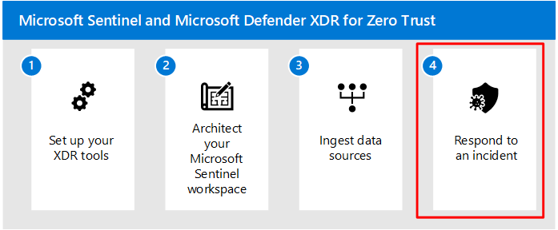

# Step 3. Ingest data sources and configure incident detection in Microsoft Sentinel

After you've completed designing and implementing your Microsoft Sentinel workspace(s), proceed to ingest data sources and configure incident detection.

Data connectors are configured to enable data ingestion into the workspace. After enabling key data points to be ingested into Microsoft Sentinel, user and entity behavior analytics (UEBA) and analytic rules must also be enabled to capture anomalous and malicious activities. Analytic rules dictate how alerts and incidents are generated in your Microsoft Sentinel instance. Tailoring analytic rules to your environment and organizational needs through entity mapping allows you to produce high-fidelity incidents and reduce alert fatigue.

The procedures in this step are available in both the Azure and Defender portals, depending on whether you onboarded your Microsoft Sentinel workspace to the unified security operations platform.

## Before you begin

Confirm the installation method, roles required, and licenses needed to turn on data connectors. For more information, see [Find your Microsoft Sentinel data connector](/azure/sentinel/data-connectors-reference).

The following table is a summary of the prerequisites required to ingest key Azure and Microsoft data connectors: 

| Resource Type    | Installation Method    | Role/Permissions/License Needed |
|------------------|------------------------|---------------------------------------|
| Microsoft Entra ID| Native Data connector| [Security Administrator](/entra/identity/role-based-access-control/permissions-reference#security-administrator)  Sign-in Logs require Microsoft Entra ID P1 or P2 license Other logs don't require P1 or P2    |
| Microsoft Entra ID Protection     | Native Data Connector| [Security Administrator](/entra/identity/role-based-access-control/permissions-reference#security-administrator)  License: Microsoft Entra ID P2 |
| Azure Activity   | Azure Policy   | Owner role required on subscriptions   |
| Microsoft Defender XDR   | Native Data Connector| [Security Administrator](/entra/identity/role-based-access-control/permissions-reference#security-administrator)  License: Microsoft 365 E5, Microsoft 365 A5 or any other Microsoft Defender XDR eligible license |
| Microsoft Defender for Cloud | Native Data Connector| [Security Reader](/entra/identity/role-based-access-control/permissions-reference#security-reader)  To enable bi-directional sync, Contributor/Security Admin role is required on the subscription.  |
| Microsoft Defender for Identity     | Native Data Connector| [Security Administrator](/entra/identity/role-based-access-control/permissions-reference#security-administrator)  License: Microsoft Defender for Identity   |
| Microsoft Defender for Office 365  | Native Data Connector| [Security Administrator](/entra/identity/role-based-access-control/permissions-reference#security-administrator)  License: Microsoft Defender for Office 365 Plan 2|
| Microsoft 365| Native Data Connector| [Security Administrator](/entra/identity/role-based-access-control/permissions-reference#security-administrator)    |
| Microsoft Defender for IoT  |    | Contributor to subscription with IoT hubs  |
| Microsoft Defender for Cloud Apps | Native Data Connector| [Security Administrator](/entra/identity/role-based-access-control/permissions-reference#security-administrator)  License: Microsoft Defender for Cloud Apps |
| Microsoft Defender for Endpoint   | Native Data Connector| [Security Administrator](/entra/identity/role-based-access-control/permissions-reference#security-administrator)  License: Microsoft Defender for Endpoint   |
| Windows Security Events  through the Azure Monitor Agent (AMA) | Native Data Connector with Agent | Read/Write on Log Analytics Workspace|
| Syslog    | Native Data Connector with Agent | Read/Write Log Analytics Workspace   |

## Step 1: Turn on data connectors

Use the following recommendations to get started with configuring data connectors. For more information, see [Find your Microsoft Sentinel data connector](/azure/sentinel/data-connectors-reference).

### Set up free data sources

Start by focus on setting up free data sources to ingest, including:

- **Azure activity logs**: Ingesting Azure activity Logs is **critical** in enabling Microsoft Sentinel to provide a single-pane of glass view across the environment.

- **Office 365 Audit Logs**, including all SharePoint activity, Exchange admin activity, and Teams.

- **Security alerts**, including alerts from Microsoft Defender for Cloud, Microsoft Defender XDR, Microsoft Defender for Office 365, Microsoft Defender for Identity, and Microsoft Defender for Endpoint.

    If you're working in the Azure portal, ingesting security alerts into Microsoft Sentinel enables it to be the *central pane of incident management* across the environment. In such cases, incident investigation starts in Microsoft Sentinel and should continue in the Microsoft Defender portal or Defender for Cloud, if deeper analysis is required.

    For more information, see [Microsoft Defender XDR incidents and Microsoft incident creation rules](/azure/sentinel/microsoft-365-defender-sentinel-integration#microsoft-365-defender-incidents-and-microsoft-incident-creation-rules).

- **Microsoft Defender for Cloud Apps alerts**.

The following table lists the free data sources you can enable in Microsoft Sentinel:

| **Microsoft Sentinel data connector** | **Free datatype**                      |
|-------------------------------------------|---- |
| **Azure activity logs**                   |AzureActivity                           |
| **Microsoft Entra ID Protection**          | SecurityAlert(IPC)                     |
| **Office 365**                            | OfficeActivity (SharePoint)   OfficeActivity (Exchange)    OfficeActivity (Teams)           |
| **Microsoft Defender for Cloud**          | SecurityAlert (Defender forCloud)      |
| **Microsoft Defender for IoT**            | SecurityAlert (Defender forIoT)        |
| **Microsoft Defender XDR**                | SecurityIncident              SecurityAlert              |
| **Microsoft Defender for Endpoint**       | SecurityAlert (Microsoft DefenderAdvanced Threat Protection (MDATP))                   |
| **Microsoft Defender for Identity**       | SecurityAlert (Azure AdvancedThreat Protection (AATP))                    |
| **Microsoft Defender for Cloud Apps**     | SecurityAlert (Defender for CloudApps) |

For more information, see [Microsoft Sentinel Pricing](https://azure.microsoft.com/pricing/details/microsoft-sentinel/) and [Free data sources](/azure/sentinel/billing?tabs=commitment-tier#free-data-sources).

### Set up paid data sources

To provide broader monitoring and alerting coverage, focus on adding the **Microsoft Entra ID** and **Microsoft Defender XDR** data connector. There is a charge for ingesting data from these sources.

Make sure to send Microsoft Defender XDR logs to Microsoft Sentinel if any of the following are required:

- **Microsoft Sentinel fusion alerts**, which correlate data sources from multiple products to detect multi-stage attacks across the environment.
- **Longer retention** than what is offered in Microsoft Defender XDR.
- **Automation** not covered by the built-in remediations offered by Microsoft Defender for Endpoint.  For more information, see [Remediation actions in Microsoft Defender XDR](/microsoft-365/security/defender/m365d-remediation-actions).

### Set up data sources per your environment

This section describes data sources you may want to use, depending on the services and deployment methods used in your environment.

|Scenario  |Data sources  |
|---------|---------|
|**Azure services**     | If any of the following services are deployed in Azure, use the following connectors to send these resources' Diagnostic Logs to Microsoft Sentinel:       - **Azure Firewall**  - **Azure Application Gateway**  - **Keyvault**     - **Azure Kubernetes Service**  - **Azure SQL** - **Network Security Groups**     - **Azure-Arc Servers**   We recommend that you set up Azure Policy to require that their logs be forwarded to the underlying Log Analytics workspace. For more on information, see [Create diagnostic settings at scale using Azure Policy](/azure/azure-monitor/essentials/diagnostic-settings-policy).        |
|**Virtual machines**     |  For virtual machines hosted on-premises or in other clouds that require their logs collected, use the following data connectors:       - **Windows Security Events using AMA**     - Events via **Defender for Endpoint** (for server) - **Syslog**       |
|**Network virtual appliances / on-premises sources**     |   For network virtual appliances or other on-premises sources that generate Common Event Format (CEF) or SYSLOG logs, use the following data connectors:   - **Syslog via AMA**  - **Common Event Format (CEF) via AMA**      For more information, see, [Ingest Syslog and CEF messages to Microsoft Sentinel with the Azure Monitor Agent](/azure/sentinel/connect-cef-syslog-ama?branch=main&tabs=single%2Ccef%2Cportal).    |

When you're done, search in the Microsoft Sentinel **Content hub** for other devices and Software as a service (SaaS) apps that require logs to be sent to Microsoft Sentinel.

For more information, see [Discover and manage Microsoft Sentinel out-of-the-box content ](/azure/sentinel/sentinel-solutions-deploy).

## Step 2: Enable user entity behavior analytics

After setting up data connectors in Microsoft Sentinel, make sure to enable [user entity behavior analytics](/azure/sentinel/identify-threats-with-entity-behavior-analytics) to identify suspicious behavior  that could lead to phishing exploits and eventually attacks such as ransomware. Often, anomaly detection through UEBA is the best method for detecting Zero-day exploits early on.

Data sources required:

-   Active Directory logs (Microsoft Defender for Identity)
-   Microsoft Entra ID
    -   Audit Logs
    -   Azure Activity
-   Security Events
-   Sign in Logs

Using UEBA allows Microsoft Sentinel to build behavioral profiles of your organization's entities across time and peer group to identify anomalous activity. This added utility aids in an expedition of determining if an asset has been compromised. Since it identifies peer group association this can also aid in determining the blast radius of said compromise.

## Step 3: Enable analytic rules

The brains of Microsoft Sentinel come from the analytic rules. These are rules you set to tell Microsoft Sentinel to alert you to events with a set of conditions that you consider to be important. The out-of-the-box decisions Microsoft Sentinel makes are based on user entity behavioral analytics (UEBA) and on correlations of data across multiple data sources.

When turning on analytic rules for Microsoft Sentinel, prioritize enabling by connected data sources, organizational risk, and MITRE tactic.

## Avoid duplicate incidents

If you enabled the Microsoft Defender XDR connector, a bi-directional sync between 365 Defender incidents and Microosft Sentinel is automatically established.

To avoid creating duplicate incidents for the same alerts, we recommend that you turn off all **Microsoft incident creation rules** for Microsoft Defender XDR-integrated products, including Defender for Endpoint, Defender for Identity, Defender for Office 365, Defender for Cloud Apps, and Microsoft Entra ID Protection. 

For more information, see [Microsoft Defender XDR incidents and Microsoft incident creation rules](/azure/sentinel/microsoft-365-defender-sentinel-integration#microsoft-365-defender-incidents-and-microsoft-incident-creation-rules).

### Use fusion alerts

By default, Microsoft Sentinel enables the **Fusion advanced multistage attack detection** analytic rule to automatically identify multistage attacks.

Leveraging anomalous behavior and suspicious activity events observed across the cyber kill chain, Microsoft Sentinel generates incidents that allow you to see the compromise incidents with two or more alert activities in it with a high degree of confidence.

Fusion alert technology correlates broad points of data signals with extended machine learning (ML) analysis to help determine known, unknown and emerging threats. For example, fusion detection can take the anomaly rule templates and the scheduled queries created for the [Ransomware scenario](/azure/sentinel/fusion#fusion-for-ransomware) and pair them with alerts from Microsoft Security Suite services, such as:

-   Microsoft Entra ID Protection
-   Microsoft Defender for Cloud
-   Microsoft Defender for IoT
-   Microsoft Defender XDR
-   Microsoft Defender for Cloud Apps
-   Microsoft Defender for Endpoint
-   Microsoft Defender for Identity
-   Microsoft Defender for Office 365

### Use anomaly rules

Microsoft Sentinel anomaly rules are available out-of-the-box and enabled by default. Anomaly rules are based on machine learning models and UEBA that train on the data in your workspace to flag anomalous behavior across users, hosts, and others.

Often, a phishing attack leads to an execution step such as local or cloud account manipulation/control or malicious script execution. Anomaly rules look exactly for those types of activities, such as:

-   [Anomalous Account Access Removal](/azure/sentinel/anomalies-reference#anomalous-account-access-removal)
-   [Anomalous Account Creation](/azure/sentinel/anomalies-reference#anomalous-account-creation)
-   [Anomalous Account Deletion](/azure/sentinel/anomalies-reference#anomalous-account-deletion)
-   [Anomalous Account Manipulation](/azure/sentinel/anomalies-reference#anomalous-account-manipulation)
-   [Anomalous Code Execution (UEBA)](/azure/sentinel/anomalies-reference#anomalous-code-execution-ueba)
-   [Anomalous Data Destruction](/azure/sentinel/anomalies-reference#anomalous-data-destruction)
-   [Anomalous Defensive Mechanism Modification](/azure/sentinel/anomalies-reference#anomalous-defensive-mechanism-modification)
-   [Anomalous Failed Sign-in](/azure/sentinel/anomalies-reference#anomalous-failed-sign-in)
-   [Anomalous Password Reset](/azure/sentinel/anomalies-reference#anomalous-password-reset)
-   [Anomalous Privilege Granted](/azure/sentinel/anomalies-reference#anomalous-privilege-granted)
-   [Anomalous Sign-in](/azure/sentinel/anomalies-reference#anomalous-sign-in)

Review the anomaly rules and anomaly score threshold for each one. If you're observing false positives for example, consider duplicating the rule and modifying the threshold by following the steps outlined in [Tune anomaly rules](/Azure/sentinel/work-with-anomaly-rules#tune-anomaly-rules).

### Use the Microsoft Threat Intelligence analytics rule

After reviewing and modifying fusion and anomaly rules, enable the out-of-the-box Microsoft Threat Intelligence analytics rule. Verify that [this rule matches your log data with Microsoft-generated threat intelligence](/azure/sentinel/understand-threat-intelligence#detect-threats-with-threat-indicator-analytics). Microsoft has a vast repository of threat intelligence data, and this analytic rule uses a subset of it to generate high fidelity alerts and incidents for SOC (security operations centers) teams to triage.

### Conduct a MITRE Att&ck crosswalk

With fusion, anomaly, and threat intelligence analytic rules enabled, conduct a [MITRE Att&ck crosswalk](/azure/sentinel/mitre-coverage) to help you decide which remaining Analytic Rules to enable and to finish implementing a mature XDR (extended detection and response) process. This empowers you to detect and respond throughout the lifecycle of an attack.

The [MITRE Att&ck research department](https://attack.mitre.org/matrices/enterprise/) created the MITRE method, and it is provided as part of Microsoft Sentinel to ease your implementation. Ensure you have analytic rules that stretch the length and breadth of the attack vectors approach. 

1. Review the MITRE techniques that are covered by your existing active analytic rules.

1. Select '**Analytic rule templates**' and '**Anomaly Rules**' in the **Simulated** dropdown. This shows you where you have the adversary tactic and/or technique covered and where there are available analytic rules you should consider enabling to improve your coverage. 

    For example, to detect potential phishing attacks, review the **Analytic rule templates** for the **Phishing** technique, and prioritize enabling the rules that specifically query the data sources you have onboarded to Microsoft Sentinel.

    In general, there are five phases to a human-operated Ransomware attack, and **Phishing** falls under **Initial Access**, as shown in the following images:

    #### [Defender portal (Preview)](#tab/defender-portal)

    :::image type="content" source="./media/sentinel-dashboard-defender.png" alt-text="Image of the Sentinel dashboard" lightbox="./media/sentinel-dashboard-defender.png":::

    #### [Azure portal](#tab/azure-portal)

    :::image type="content" source="./media/sentinel-dashboard.svg" alt-text="Image of the Sentinel dashboard" lightbox="./media/sentinel-dashboard.svg":::

    ---

1. Continue through the remaining steps to cover the entire kill chain with appropriate analytic rules:

    1. Initial access
    1. Credential theft
    1. Lateral movement
    1. Persistence
    1. Defense evasion
    1. Exfiltration (this is where ransomware itself is detected)

## Recommended training

Training content focuses on general availability features, and therefore doesn't include content for the unified security operations platform, which is in Preview.

### Connect data to Microsoft Sentinel using data connectors

|Training  |[Connect data to Microsoft Sentinel using data connectors](/training/modules/connect-data-to-azure-sentinel-with-data-connectors/)|
|---------|---------|
|:::image type="icon" source="media/connect-data-to-azure-sentinel-with-data-connectors.svg" border="false"::: |The primary approach to connect log data is using the Microsoft Sentinel provided data connectors. This module provides an overview of the available data connectors. |
> [!div class="nextstepaction"]
> [Start >](/training/modules/connect-data-to-azure-sentinel-with-data-connectors/)

### Connect logs to Microsoft Sentinel

|Training  |[Connect logs to Microsoft Sentinel](/training/paths/sc-200-connect-logs-to-azure-sentinel/)|
|---------|---------|
|:::image type="icon" source="media/connect-windows-hosts-to-azure-sentinel.svg" border="false"::: |Connect data at cloud scale across all users, devices, applications, and infrastructure, both on-premises and in multiple clouds to Microsoft Sentinel. |
> [!div class="nextstepaction"]
> [Start >](/training/paths/sc-200-connect-logs-to-azure-sentinel/)

### Identify threats with Behavioral Analytics

|Training  |[Identify threats with Behavioral Analytics](/training/modules/use-entity-behavior-analytics-azure-sentinel/)|
|---------|---------|
|:::image type="icon" source="media/azure-sentinel-behavior-analytics.svg" border="false"::: |The primary approach to connect log data is using the Microsoft Sentinel provided data connectors. This module provides an overview of the available data connectors. |
> [!div class="nextstepaction"]
> [Start >](/training/modules/use-entity-behavior-analytics-azure-sentinel/)

## Next steps

Continue to [Step 4](respond-incident.md) to respond to an incident.

