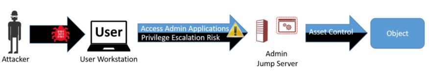

# Legacy privileged access guidance

> [!IMPORTANT]
> This guidance has been replaced with updated [secure workstation](https://aka.ms/PAW) guidance that is part of a complete solution for [securing privileged access](https://aka.ms/SPA).
>
> This documentation is being retained online for archival and reference purposes only. Microsoft strongly recommends following the new guidance for a solution that is more secure and easier to deploy and support.

## Legacy guidance

Privileged Access Workstations (PAWs) provide a dedicated operating system for sensitive tasks that is protected from Internet attacks and threat vectors. Separating these sensitive tasks and accounts from the daily use workstations and devices provides strong protection from phishing attacks, application and OS vulnerabilities, various impersonation attacks, and credential theft attacks such as keystroke logging, [Pass-the-Hash](https://aka.ms/pth), and Pass-The-Ticket.

## What is a Privileged Access Workstation?

In simplest terms, a PAW is a hardened and locked down workstation designed to provide high security assurances for sensitive accounts and tasks. PAWs are recommended for administration of identity systems, cloud services, private cloud fabric, and sensitive business functions.

> [!NOTE]
> The PAW architecture doesn't require a 1:1 mapping of accounts to workstations, though this is a common configuration. PAW creates a trusted workstation environment that can be used by one or more accounts.

In order to provide the greatest security, PAWs should always run the most up-to-date and secure operating system available: Microsoft strongly recommends Windows 11 Enterprise, which includes several other security features not available in other editions (in particular, [Credential Guard](/windows/security/identity-protection/credential-guard/credential-guard) and [Device Guard](/windows/security/threat-protection/device-guard/introduction-to-device-guard-virtualization-based-security-and-windows-defender-application-control)).

> [!NOTE]
> Organizations without access to Windows 11 Enterprise can use Windows 11 Pro, which includes many of the critical foundational technologies for PAWs, including Trusted Boot, BitLocker, and Remote Desktop. Education customers can use Windows 11 Education.
>
> Windows 11 Home should not be used for a PAW.

The PAW security controls are focused on mitigating high impact and high probability risks of compromise. These include mitigating attacks on the environment and risks that can decrease the effectiveness of PAW controls over time:

* **Internet attacks** - Most attacks originate directly or indirectly from internet sources and use the internet for exfiltration and command and control (C2). Isolating the PAW from the open internet is a key element to ensuring the PAW isn't compromised.
* **Usability risk** - If a PAW is too difficult to use for daily tasks, administrators are motivated to create workarounds to make their jobs easier. Frequently, these workarounds open the administrative workstation and accounts to significant security risks, so it's critical to involve and empower the PAW users to mitigate these usability issues securely. This can be accomplished by listening to their feedback, installing tools and scripts required to perform their jobs, and ensuring all administrative personnel are aware of why they need to use a PAW, what a PAW is, and how to use it correctly and successfully.
* **Environment risks** - Because many other computers and accounts in the environment are exposed to internet risk directly or indirectly, a PAW must be protected against attacks from compromised assets in the production environment. This requires minimizing the use of management tools and accounts that have access to the PAWs to secure and monitor these specialized workstations.
* **Supply chain tampering** - While it's impossible to remove all possible risks of tampering in the supply chain for hardware and software, taking a few key actions can mitigate critical attack vectors that are readily available to attackers. This includes validating the integrity of all installation media and using a trusted and reputable supplier for hardware and software.
* **Physical attacks** - Because PAWs can be physically mobile and used outside of physically secure facilities, they must be protected against attacks that apply unauthorized physical access to the computer.

> [!IMPORTANT]
> A PAW will not protect an environment from an adversary that has already gained administrative access over an Active Directory Forest.
> Because many existing implementations of Active Directory Domain Services have been operating for years at risk of credential theft, organizations should assume breach and consider the possibility that they might have an undetected compromise of domain or enterprise administrator credentials. An organization that suspects domain compromise should consider the use of professional incident response services.
>
> For more information on response and recovery guidance, see the "Respond to suspicious activity" and "Recover from a breach" sections of [Mitigating Pass-the-Hash and Other Credential Theft](https://aka.ms/pth), version 2.

### Legacy PAW hardware profiles

Administrative personnel are standard users too - they need a PAW and a standard user workstation to check email, browse the web, and access corporate line-of-business applications. Ensuring that administrators can remain both productive and secure is essential to the success of any PAW deployment. A secure solution that dramatically limits productivity will be abandoned by the users in favor of one that enhances productivity (even if it's done in an insecure manner).

In order to balance the need for security with the need for productivity, Microsoft recommends using one of these PAW hardware profiles:

* **Dedicated hardware** - Separate dedicated devices for user tasks vs. administrative tasks.
* **Simultaneous Use** - Single device that can run user tasks and administrative tasks concurrently by taking advantage of OS or presentation virtualization.

Organizations might use only one profile or both. There are no interoperability concerns between the hardware profiles, and organizations have the flexibility to match the hardware profile to the specific need and situation of a given administrator.

> [!IMPORTANT]
> It is critical that, in all these scenarios, administrative personnel are issued a standard user account that is separate from designated administrative account(s). The administrative account(s) should only be used on the PAW administrative operating system.

This table summarizes the relative advantages and disadvantages of each hardware profile from the perspective of operational ease-of-use and productivity and security. Both hardware approaches provide strong security for administrative accounts against credential theft and reuse.

|**Scenario**|**Advantages**|**Disadvantages**|
|--------|---------|-----------|
|Dedicated hardware|-   Strong signal for sensitivity of tasks -   Strongest security separation|-   Extra desk space  -   Extra weight (for remote work) -   Hardware Cost|
|Simultaneous use|-   Lower hardware cost -   Single device experience|-   Sharing single keyboard/mouse creates risk of inadvertent errors/risks|

This guidance contains the detailed instructions for the PAW configuration for the dedicated hardware approach. If you have requirements for the simultaneous use hardware profiles, you can adapt the instructions based on this guidance yourself or hire a professional services organization like Microsoft to assist with it.

#### Dedicated hardware

In this scenario, a PAW is used for administration that is separate from the PC that is used for daily activities like email, document editing, and development work. All administrative tools and applications are installed on the PAW and all productivity applications are installed on the standard user workstation. The step-by-step instructions in this guidance are based on this hardware profile.

#### Simultaneous use - Adding RemoteApp, RDP, or a VDI

In this simultaneous use scenario, a single PC is used for both administration tasks and daily activities like email, document editing and development work. In this configuration, the user operating systems are deployed and managed centrally (on the cloud or in your datacenter), but aren't available while disconnected.

The physical hardware runs a single PAW operating system locally for administrative tasks and contacts a Microsoft or third party remote desktop service for user applications such as email, document editing, and line-of-business applications.

In this configuration, daily work that doesn't require administrative privileges is done in the Remote OS(es) and applications, which aren't subject to restrictions applied to the PAW host. All administrative work is done on the Admin OS.

To configure this, follow the instructions in this guidance for the PAW host, allow network connectivity to the Remote Desktop services, and then add shortcuts to the PAW user's desktop to access the applications. The remote desktop services could be hosted in many ways including:

* An existing Remote Desktop or VDI service like [Azure Virtual Desktop](/azure/virtual-desktop/overview), [Microsoft Dev Box](/azure/dev-box/), or [Windows 365](/windows-365/overview).
* A new service you install on-premises or in the cloud
* Azure RemoteApp using preconfigured templates or your own installation images

## Architecture overview

The following diagram depicts a separate "channel" for administration (a highly sensitive task) that is created by maintaining separate dedicated administrative accounts and workstations.

This architectural approach builds on the protections found in the Windows 11 [Credential Guard](/windows/security/identity-protection/credential-guard/credential-guard) and [Device Guard](/windows/security/threat-protection/device-guard/introduction-to-device-guard-virtualization-based-security-and-windows-defender-application-control) features and goes beyond those protections for sensitive accounts and tasks.

This methodology is appropriate for accounts with access to high value assets:

* **Administrative Privileges** - PAWs provide increased security for high impact IT administrative roles and tasks. This architecture can be applied to administration of many types of systems including Active Directory Domains and Forests, Microsoft Entra ID tenants, Microsoft 365 tenants, Process Control Networks (PCN), Supervisory Control and Data Acquisition (SCADA) systems, Automated Teller Machines (ATMs), and Point of Sale (PoS) devices.
* **High Sensitivity Information workers** - The approach used in a PAW can also provide protection for highly sensitive information worker tasks and personnel such as those involving preannouncement merger and acquisition activity, prerelease financial reports, organizational social media presence, executive communications, unpatented trade secrets, sensitive research, or other proprietary or sensitive data. This guidance doesn't discuss the configuration of these information worker scenarios in depth or include this scenario in the technical instructions.

This document describes why this practice is recommended for protecting high impact privileged accounts, what these PAW solutions look like for protecting administrative privileges, and how to quickly deploy a PAW solution for domain and cloud services administration.

This document provides detailed guidance for implementing several PAW configurations and includes detailed implementation instructions to get you started on protecting common high impact accounts:

* [**Phase 1 - Immediate Deployment for Active Directory Administrators**](#phase-1-immediate-deployment-for-active-directory-administrators) this provides a PAW quickly that can protect on premises domain and forest administration roles
* [**Phase 2 - Extend PAW to all administrators**](#phase-2-extend-paw-to-all-administrators) this enables protection for administrators of cloud services like Microsoft 365 and Azure, enterprise servers, enterprise applications, and workstations
* [**Phase 3 - Advanced PAW security**](#phase-3-extend-and-enhance-protection) this discusses more protections and considerations for PAW security

### Why dedicated workstations?

The current threat environment for organizations is rife with sophisticated phishing and other internet attacks that create continuous risk of security compromise for internet exposed accounts and workstations.

This threat environment requires organizations to adopt an "assume breach" security posture when designing protections for high value assets like administrative accounts and sensitive business assets. These high value assets need to be protected against both direct internet threats and attacks mounted from other workstations, servers, and devices in the environment.

This figure depicts risk to managed assets if an attacker gains control of a user workstation where sensitive credentials are used.

An attacker in control of an operating system has numerous ways in which to illicitly gain access to all activity on the workstation and impersonate the legitimate account. Various known and unknown attack techniques can be used to gain this level of access. The increasing volume and sophistication of cyberattacks have made it necessary to extend that separation concept to separate client operating systems for sensitive accounts. For more information on these types of attacks, visit the [Pass The Hash web site](https://www.microsoft.com/pth) for informative white papers, videos and more.

The PAW approach is an extension of the well-established recommended practice to use separate admin and user accounts for administrative personnel. This practice uses an individually assigned administrative account that is separate from the user's standard user account. PAW builds on that account separation practice by providing a trustworthy workstation for those sensitive accounts.

This PAW guidance is intended to help you implement this capability for protecting high value accounts such as high-privileged IT administrators and high sensitivity business accounts. The guidance helps you:

* Restrict exposure of credentials to only trusted hosts
* Provide a high-security workstation to administrators so they can easily perform administrative tasks.

Restricting the sensitive accounts to using only hardened PAWs is a straightforward protection for these accounts that is both highly usable for administrators and difficult for an adversary to defeat.

### Alternate approaches

This section contains information on how the security of alternate approaches compares to PAW and how to correctly integrate these approaches within a PAW architecture. all these approaches carry significant risks when implemented in isolation, but can add value to a PAW implementation in some scenarios.

#### Credential Guard and Windows Hello for Business

Part of Windows 11, [Credential Guard](/windows/security/identity-protection/credential-guard/credential-guard) uses hardware and virtualization-based security to mitigate common credential theft attacks, such as Pass-the-Hash, by protecting the derived credentials. The private key for credentials used by [Windows Hello for Business](/windows/security/identity-protection/hello-for-business/hello-identity-verification) can be protected by Trusted Platform Module (TPM) hardware.

These are powerful mitigations, but workstations can still be vulnerable to certain attacks even if the credentials are protected by Credential Guard or Windows Hello for Business. Attacks can include abusing privileges and use of credentials directly from a compromised device, reusing previously stolen credentials prior to enabling Credential Guard and abuse of management tools and weak application configurations on the workstation.

The PAW guidance in this section includes the use of many of these technologies for high sensitivity accounts and tasks.

#### Administrative VM

An administrative virtual machine (Admin VM) is a dedicated operating system for administrative tasks hosted on a standard user desktop. While this approach is similar to PAW in providing a dedicated OS for administrative tasks, it has a fatal flaw in that the administrative VM is dependent on the standard user desktop for its security.

The following diagram depicts the ability of attackers to follow the control chain to the target object of interest with an Admin VM on a User Workstation and that it's difficult to create a path on the reverse configuration.

The PAW architecture doesn't allow for hosting an Admin VM on a User Workstation, but a User VM with a standard corporate image can be hosted on an Admin PAW to provide personnel with a single PC for all responsibilities.

#### Jump server

Administrative "Jump Server" architectures set up a small number administrative console servers and restrict personnel to using them for administrative tasks. This is typically based on remote desktop services, a 3rd-party presentation virtualization solution, or a Virtual Desktop Infrastructure (VDI) technology.

This approach is frequently proposed to mitigate risk to administration and does provide some security assurances, but the jump server approach by itself is vulnerable to certain attacks because it violates the clean source principle. The clean source principle requires all security dependencies to be as trustworthy as the object being secured.

This figure depicts a simple control relationship. Any subject in control of an object is a security dependency of that object. If an adversary can control a security dependency of a target object (subject), they can control that object.

The administrative session on the jump server relies on the integrity of the local computer accessing it. If this computer is a user workstation subject to phishing attacks and other internet-based attack vectors, then the administrative session is also subject to those risks.

The previous figure depicts how attackers can follow an established control chain to the target object of interest.

While some advanced security controls like Multifactor authentication can increase the difficulty of an attacker taking over this administrative session from the user workstation, no security feature can fully protect against technical attacks when an attacker has administrative access of the source computer (for example, injecting illicit commands into a legitimate session, hijacking legitimate processes, and so on.)

The default configuration in this PAW guidance installs administrative tools on the PAW, but a jump server architecture can also be added if necessary.

This figure shows how reversing the control relationship and accessing user apps from an admin workstation gives the attacker no path to the targeted object. The user jump server is still exposed to risk so appropriate protective controls, detective controls, and response processes should still be applied for that internet-facing computer.

This configuration requires administrators to follow operational practices closely to ensure that they don't accidentally enter administrator credentials into the user session on their desktop.

This figure shows how accessing an administrative jump server from a PAW adds no path for the attacker into the administrative assets. A jump server with a PAW allows in this case you to consolidate the number of locations for monitoring administrative activity and distributing administrative applications and tools. This adds some design complexity, but can simplify security monitoring and software updates if a large number of accounts and workstations are used in your PAW implementation. The jump server would need to be built and configured to similar security standards as the PAW.

#### Privilege management solutions

Privileged Management solutions are applications that provide temporary access to discrete privileges or privileged accounts on demand. Privilege management solutions are a valuable component of a complete strategy to secure privileged access and provide critically important visibility and accountability of administrative activity.

These solutions typically use a flexible workflow to grant access and many have other security features and capabilities like service account password management and integration with administrative jump servers. There are many solutions on the market that provide privilege management capabilities, one of which is Microsoft Identity Manager (MIM) privileged access management (PAM).

Microsoft recommends using a PAW to access privilege management solutions. Access to these solutions should be granted only to PAWs. Microsoft doesn't recommend using these solutions as a substitute for a PAW because accessing privileges using these solutions from a potentially compromised user desktop violates the clean source principle as depicted in the following diagram:

Providing a PAW to access these solutions enables you to gain the security benefits of both PAW and the privilege management solution, as depicted in this diagram:

> [!IMPORTANT]
> These systems should be classified at the highest tier of the privilege they manage and be protected at or above that level of security. These are commonly configured to manage Tier 0 solutions and Tier 0 assets and should be classified at Tier 0.

For more information on deploying Microsoft Identity Manager (MIM) privileged access management (PAM), see [https://aka.ms/mimpamdeploy](/microsoft-identity-manager/pam/privileged-identity-management-for-active-directory-domain-services)

## PAW Scenarios

This section contains guidance on which scenarios this PAW guidance should be applied to. In all scenarios, administrators should be trained to only use PAWs for performing support of remote systems. To encourage successful and secure usage, all PAW users should be encouraged to provide feedback to improve the PAW experience, and this feedback should be reviewed carefully for integration with your PAW program.

In all scenarios, extra hardening in later phases and different hardware profiles in this guidance might be used to meet the usability or security requirements of the roles.

> [!NOTE]
> This guidance explicitly differentiates between requiring access to specific services on the internet (such as Azure and Microsoft 365 administrative portals) and the "Open Internet" of all hosts and services.

|**Scenarios**|**Use PAW?**|**Scope and Security Considerations**|
|---------|--------|---------------------|
|Active Directory Admins - Tier 0|Yes|A PAW built with Phase 1 guidance is sufficient for this role.
-   An administrative forest can be added to provide the strongest protection for this scenario. For more information on the ESAE administrative forest, see [ESAE Scenarios for Continued Use](/security/privileged-access-workstations/esae-retirement#scenarios-for-continued-use) -   A PAW can be used to managed multiple domains or multiple forests. -   If Domain Controllers are hosted on an Infrastructure as a Service (IaaS) or on-premises virtualization solution, you should prioritize implementing PAWs for the administrators of those solutions.|
|Admin of Azure IaaS and PaaS services - Tier 0 or Tier 1 (see Scope and Design Considerations)|Yes|A PAW built using the guidance provided in Phase 2 is sufficient for this role.
-   PAWs should be used for at least the Global administrator and Subscription Billing administrator. You should also use PAWs for delegated administrators of critical or sensitive servers. -   PAWs should be used for managing the operating system and applications that provide Directory Synchronization and Identity Federation for cloud services such as [Microsoft Entra Connect](/azure/active-directory/hybrid/whatis-hybrid-identity) and Active Directory Federation Services (ADFS). -   The outbound network restrictions must allow connectivity only to authorized cloud services using the guidance in Phase 2. No open internet access should be allowed from PAWs. -   Windows Defender Exploit Guard should be configured on the workstation **Note:**     A subscription is considered to be Tier 0 for a Forest if Domain Controllers or other Tier 0 hosts are in the subscription. A subscription is Tier 1 if no Tier 0 servers are hosted in Azure.|
|Admin Microsoft 365 Tenant  - Tier 1|Yes|A PAW built using the guidance provided in Phase 2 is sufficient for this role.
-   PAWs should be used for at least the Subscription Billing administrator, Global administrator, Exchange administrator, SharePoint administrator, and User management administrator roles. You should also strongly consider the use of PAWs for delegated administrators of highly critical or sensitive data. -   Windows Defender Exploit Guard should be configured on the workstation. -   The outbound network restrictions must allow connectivity only to Microsoft services using the guidance in Phase 2. No open internet access should be allowed from PAWs.|
|Other IaaS or PaaS cloud service admin - Tier 0 or Tier 1 (see Scope and Design Considerations)|Yes|A PAW built using the guidance provided in Phase 2 is sufficient for this role.
-   PAWs should be used for any role that has administrative rights over cloud hosted VMs including the ability to install agents, export hard disk files, or access storage where hard drives with operating systems, sensitive data, or business critical data is stored. -   The outbound network restrictions must allow connectivity only to Microsoft services using the guidance in Phase 2. No open internet access should be allowed from PAWs. -   Windows Defender Exploit Guard should be configured on the workstation. **Note:** A subscription is Tier 0 for a Forest if Domain Controllers or other Tier 0 hosts are in the subscription. A subscription is Tier 1 if no Tier 0 servers are hosted in Azure.|
|Virtualization Administrators - Tier 0 or Tier 1 (see Scope and Design Considerations)|Yes|A PAW built using the guidance provided in Phase 2 is sufficient for this role.
-   PAWs should be used for any role that has administrative rights over VMs including the ability to install agents, export virtual hard disk files, or access storage where hard drives with guest operating system information, sensitive data, or business critical data is stored. **Note:** A virtualization system and its admins are considered Tier 0 for a Forest if Domain Controllers or other Tier 0 hosts are in the subscription. A subscription is Tier 1 if no Tier 0 servers are hosted in the virtualization system.|
|Server Maintenance Admins - Tier 1|Yes|A PAW built using the guidance provided in Phase 2 is sufficient for this role.
-   A PAW should be used for administrators that update, patch, and troubleshoot enterprise servers and apps running Windows server, Linux, and other operating systems. -   Dedicated management tools might need to be added for PAWs to handle the larger scale of these admins.|
|User Workstation Admins  - Tier 2|Yes|A PAW built using guidance provided in Phase 2 is sufficient for roles that have administrative rights on end-user devices (such as helpdesk and deskside support roles).
-   Other applications might need to be installed on PAWs to enable ticket management and other support functions. -   Windows Defender Exploit Guard should be configured on the workstation.     Dedicated management tools might need to be added for PAWs to handle the larger scale of these admins.|
|SQL, SharePoint, or line-of-business (LOB) Admin - Tier 1|Yes|A PAW built with Phase 2 guidance is sufficient for this role.
-   Other management tools might need to be installed on PAWs to allow administrators to manage applications without needing to connect to servers using Remote Desktop.|
|Users Managing Social Media Presence|Partially|A PAW built using the guidance provided in Phase 2 can be used as a starting point to provide security for these roles.
-   Protect and manage social media accounts using Microsoft Entra ID for sharing, protecting, and tracking access to social media accounts.     For more information on this capability, read [this blog post](/windows/security/identity-protection/credential-guard/credential-guard). -   The outbound network restrictions must allow connectivity to these services. This can be done by allowing open internet connections (much higher security risk that negates many PAW assurances) or by allowing only required DNS addresses for the service (might be challenging to obtain).|
|Standard Users|No|While many hardening steps can be used for standard users, PAW is designed to isolate accounts from the open internet access that most users require for job duties.|
|Guest VDI/Kiosk|No|While many hardening steps can be used for a kiosk system for guests, the PAW architecture is designed to provide higher security for high sensitivity accounts, not higher security for lower sensitivity accounts.|
|VIP User (Executive, Researcher, etc.)|Partially|A PAW built using guidance provided in Phase 2 can be used as a starting point to provide security for these roles.
-   This scenario is similar to a standard user desktop, but typically has a smaller, simpler, and well-known application profile. This scenario typically requires discovering and protecting sensitive data, services, and applications. -   These roles typically require a high degree of security and high degree of usability, which require design changes to meet user preferences.|
|Industrial control systems (for example, SCADA, PCN, and DCS)|Partially|A PAW built using guidance provided in Phase 2 can be used as a starting point to provide security for these roles as most ICS consoles (including such common standards as SCADA and PCN) don't require browsing the open Internet and checking email.
-   Applications used for controlling physical machinery would have to be integrated and tested for compatibility and protected appropriately.|
|Embedded Operating System|No|While many hardening steps from PAW can be used for embedded operating systems, a custom solution would need to be developed for hardening in this scenario.|

> [!NOTE]
> **Combination scenarios** some personnel might have administrative responsibilities that span multiple scenarios.
> In these cases, the key rules to keep in mind are that the Tier model rules must always be followed.
>
> **Scaling the PAW Program** as your PAW program scales to encompass more admins and roles, you need to continue to ensure that you maintain adherence to the security standards and usability. This might require you to update your IT support structures or create new ones to resolve PAW specific challenges such as PAW onboarding process, incident management, configuration management, and gathering feedback to address usability challenges. One example might be that your organization decides to enable work-from-home scenarios for administrators, which would necessitate a shift from desktop PAWs to laptop PAWs - a shift which might necessitate additional security considerations. Another common example is to create or update training for new administrators - training which must now include content on the appropriate use of a PAW (including why it's important and what a PAW is and isn't). For more considerations which must be addressed as you scale your PAW program, see Phase 2 of the instructions.

This guidance contains the detailed instructions for the PAW configuration for the scenarios as noted previously. If you have requirements for the other scenarios, you can adapt the instructions based on this guidance yourself or hire a professional services organization like Microsoft to assist with it.

## PAW Phased implementation

Because the PAW must provide a secure and trusted source for administration, it's essential that the build process is secure and trusted. This section provides detailed instructions, which allow you to build your own PAW using general principles and concepts similar to those used by Microsoft.

The instructions are divided into three phases, which focus on putting the most critical mitigations in place quickly and then progressively increasing and expanding the usage of PAW for the enterprise.

* [Phase 1 - Immediate Deployment for Active Directory Administrators](#phase-1-immediate-deployment-for-active-directory-administrators)
* [Phase 2 - Extend PAW to all administrators](#phase-2-extend-paw-to-all-administrators)
* [Phase 3 - Advanced PAW security](#phase-3-extend-and-enhance-protection)

It's important to note that the phases should always be performed in order even if they're planned and implemented as part of the same overall project.

### Phase 1: Immediate deployment for Active Directory administrators

Purpose: Provides a PAW quickly that can protect on-premises domain and forest administration roles.

Scope: Tier 0 Administrators including Enterprise Admins, Domain Admins (for all domains), and administrators of other authoritative identity systems.

Phase 1 focuses on the administrators who manage your on-premises Active Directory domain, which are critically important roles frequently targeted by attackers. These identity systems work effectively for protecting these admins whether your Active Directory Domain Controllers (DCs) are hosted in on-premises datacenters, on Azure Infrastructure as a Service (IaaS), or another IaaS provider.

During this phase, you create the secure administrative Active Directory organizational unit (OU) structure to host your privileged access workstation (PAW), and deploy the PAWs themselves. This structure also includes the group policies and groups required to support the PAW.

The infrastructure is based on the following OUs, Security Groups, and group policies:

* Organizational Units (OU)
   * Six new top-level OUs:
      * Admin
      * Groups
      * Tier 1 Servers
      * Workstations
      * User Accounts
      * Computer Quarantine.
* Groups
   * Six new security-enabled global groups:
      * Tier 0 Replication Maintenance
      * Tier 1 Server Maintenance
      * Service Desk Operators
      * Workstation Maintenance
      * PAW Users
      * PAW Maintenance.
* Group policy objects:
   * PAW Configuration - Computer
   * PAW Configuration - User
   * RestrictedAdmin Required - Computer
   * PAW Outbound Restrictions
   * Restrict Workstation Logon
   * Restrict Server Logon.

Phase 1 includes the following steps:

#### Complete the Prerequisites

1. **Ensure that all administrators use separate, individual accounts for administration and end-user activities** (including email, Internet browsing, line-of-business applications, and other nonadministrative activities). Assigning an administrative account to each authorized person separate from their standard user account is fundamental to the PAW model, as only certain accounts are permitted to log on to the PAW itself.

   > [!IMPORTANT]
   > Each administrator should use his or her own account for administration. Do not share an administrative account.

1. **Minimize the number of Tier 0 privileged administrators**. Because each administrator must use a PAW, reducing the number of administrators reduces the number of PAWs required to support them and the associated costs. The lower count of administrators also results in lower exposure of these privileges and associated risks. While it's possible for administrators in one location to share a PAW, administrators in separate physical locations require separate PAWs.
1. **Acquire hardware from a trusted supplier that meets all technical requirements**. Microsoft recommends acquiring hardware that meets the technical requirements in the article [Protect domain credentials with Credential Guard](/windows/security/identity-protection/credential-guard/credential-guard).

   > [!NOTE]
   > PAW installed on hardware without these capabilities can provide significant protections, but advanced security features such as Credential Guard and Device Guard will not be available. Credential Guard and Device Guard are not required for Phase 1 deployment, but are strongly recommended as part of Phase 3 (advanced hardening).
   >
   > Ensure that the hardware used for the PAW is sourced from a manufacturer and supplier whose security practices are trusted by the organization. This is an application of the clean source principle to supply chain security.
   >
   > For more background on the importance of supply chain security, visit [this site](https://www.microsoft.com/security/cybersecurity/).

1. **Acquire and validate the required Windows 11 Enterprise Edition and application software**.

   * Windows 11 Enterprise Edition
   * [Remote Server Administration Tools](https://www.microsoft.com/download/details.aspx?id=45520) for Windows 11
   * [Windows 11 Security Baselines](/windows/security/threat-protection/windows-security-baselines)

   > [!NOTE]
   > Microsoft publishes MD5 hashes for all operating systems and applications on MSDN, but not all software vendors provide similar documentation. In those cases, other strategies will be required.

1. **Ensure you have WSUS server available on the intranet**. You need a WSUS server on the intranet to download and install updates for PAW. This WSUS server should be configured to automatically approve all security updates for Windows 11 or an administrative personnel should have responsibility and accountability to rapidly approve software updates. For more information, see the "Automatically Approve Updates for Installation" section in the [Approving Updates guidance](/previous-versions/windows/it-pro/windows-server-2008-R2-and-2008/cc708458(v=ws.10)).

#### Move Tier 0 accounts to the Admin\Tier 0\Accounts OU

Move each account that is a member of the Domain Admin, Enterprise Admin, or Tier 0 equivalent groups (including nested membership) to this OU. If your organization has your own groups that are added to these groups, you should move these to the Admin\Tier 0\Groups OU.

#### Add the appropriate members to the relevant groups

1. **PAW Users** - Add the Tier 0 administrators with Domain or Enterprise Admin groups that you identified in Step 1 of Phase 1.
1. **PAW Maintenance** - Add at least one account used for PAW maintenance and troubleshooting tasks. The PAW Maintenance Account(s) is used only rarely.

   > [!IMPORTANT]
   > Do not add the same user account or group to both PAW Users and PAW Maintenance. The PAW security model is based partly on the assumption that the PAW user account has privileged rights on managed systems or over the PAW itself, but not both.
   >
   > * This is important for building good administrative practices and habits in Phase 1.
   > * This is critically important for Phase 2 and beyond to prevent escalation of privilege through PAW as PAWs being to span Tiers.
   >
   > Ideally, no personnel are assigned to duties at multiple tiers to enforce the principle of segregation of duties, but Microsoft recognizes that many organizations have limited staff (or other organizational requirements) that don't allow for this full segregation. In these cases, the same personnel might be assigned to both roles, but should not use the same account for these functions.

#### Create "PAW Configuration - Computer" group policy object (GPO)

In this section, you create a new "PAW Configuration - Computer" GPO, which provides specific protections for these PAWs and link it to the Tier 0 Devices OU ("Devices" under Tier 0\Admin).

   > [!WARNING]
   > **Do not add these settings to the Default Domain Policy**. Doing so will potentially impact operations on your entire Active Directory environment. Only configure these settings in the newly-created GPOs described here, and only apply them to the PAW OU.

1. **PAW Maintenance Access** - this setting sets the membership of specific privileged groups on the PAWs to a specific set of users. Go to *Computer Configuration\Preferences\Control Panel Settings\Local Users* and Groups and complete the following steps:
   1. Click **New** and click **Local Group**
   1. Select the **Update** action, and select "Administrators (built-in)" (don't use the Browse button to select the domain group Administrators).
   1. Select the **Delete all member users** and **Delete all member groups** check boxes
   1. Add PAW Maintenance (pawmaint) and Administrator (again, don't use the Browse button to select Administrator).

      > [!IMPORTANT]
      > Do not add the PAW Users group to the membership list for the local Administrators group. To ensure that PAW Users cannot accidentally or deliberately modify the security settings of the PAW itself, they should not be members of the local Administrators groups.
      >
      > For more information on using Group Policy Preferences to modify group membership, please refer to the TechNet article [Configure a Local Group Item](/previous-versions/windows/it-pro/windows-server-2008-R2-and-2008/cc732525(v=ws.11)).

1. **Restrict Local Group Membership** - this setting ensures that the membership of local admin groups on the workstation is always empty
   1. Go to Computer Configuration\Preferences\Control Panel Settings\Local Users and Groups and complete the following steps:
      1. Click **New** and click **Local Group**
      1. Select the **Update** action, and select "Backup Operators (built-in)" (don't use the Browse button to select the domain group Backup Operators).
      1. Select the **Delete all member users** and **Delete all member groups** check boxes.
      1. Don't add any members to the group. Assigning an empty list causes group policy to automatically remove all members and ensure a blank membership list each time group policy is refreshed.
   1. Complete the previous steps for the following groups:
      * Cryptographic Operators
      * Hyper-V Administrators
      * Network Configuration Operators
      * Power Users
      * Remote Desktop Users
      * Replicators
   1. **PAW Logon Restrictions** - this setting limits the accounts that can log on to the PAW. complete the following steps to configure this setting:
      1. Go to Computer Configuration\Policies\Windows Settings\Security Settings\Local Policies\User Rights Assignment\Allow log on locally.
      1. Select Define these policy settings and add "PAW Users" and Administrators (again, don't use the Browse button to select Administrators).
   1. **Block Inbound Network Traffic** - This setting ensures that no unsolicited inbound network traffic is allowed to the PAW. Complete the following steps to configure this setting:
      1. Go to Computer Configuration\Policies\Windows Settings\Security Settings\Windows Firewall with Advanced Security\Windows Firewall with Advanced Security and complete the following steps:
         1. Right click on Windows Firewall with Advanced Security and select **Import policy**.
         1. Click **Yes** to accept that this overwrites any existing firewall policies.
         1. Browse to PAWFirewall.wfw and select **Open**.
         1. Click **OK**.

      > [!NOTE]
      > You can add addresses or subnets which must reach the PAW with unsolicited traffic at this point (e.g. security scanning or management software.
      > The settings in the WFW file will enable the firewall in "Block - Default" mode for all firewall profiles, turn off rule merging and enable logging of both dropped and successful packets. These settings will block unsolicited traffic while still allowing bidirectional communication on connections initiated from the PAW, prevent users with local administrative access from creating local firewall rules that would override the GPO settings and ensure that traffic in and out of the PAW is logged.
      > **Opening up this firewall will expand the attack surface for the PAW and increase security risk. Before adding any addresses, consult the Managing and Operating PAW section in this guidance**.

   1. **Configure Windows Update for WSUS** - complete the following steps to change the settings to configure Windows Update for the PAWs:
      1. Go to Computer Configuration\Policies\Administrative Templates\Windows Components\Windows Updates and complete the following steps:
         1. Enable the **Configure Automatic Updates policy**.
         1. Select option  **4 - Auto download and schedule the install**.
         1. Change the option **Scheduled install day** to **0 - Every Day** and the option **Scheduled install time** to your organizational preference.
         1. Enable option **Specify intranet Microsoft update service location** policy.
   1. Link the "PAW Configuration - Computer" GPO as follows:

      |Policy|Link Location|
      |-----|---------|
      |PAW Configuration - Computer |Admin\Tier 0\Devices|

#### Create "PAW Configuration - User" group policy object (GPO)

In this section, you create a new "PAW Configuration - User" GPO that provides specific protections for these PAWs and link to the Tier 0 Accounts OU ("Accounts" under Tier 0\Admin).

   > [!WARNING]
   > Do not add these settings to the Default Domain Policy

1. **Block internet browsing** - To deter inadvertent internet browsing, this sets a proxy address of a loopback address (127.0.0.1).
   1. Go to User Configuration\Preferences\Windows Settings\Registry. Right-click Registry, select **New** > **Registry Item** and configure the following settings:
      1. Action:  Replace
      1. Hive: HKEY_CURRENT_USER
      1. Key Path:  Software\Microsoft\Windows\CurrentVersion\Internet Settings
      1. Value name: ProxyEnable

         > [!CAUTION]
         > Do not select the Default box to the left of Value name.

      1. Value type: REG_DWORD
      1. Value data: 1
         1. Click the Common tab and select **Remove this item when it is no longer applied**.
         1. On the Common tab, select **Item level targeting** and click **Targeting**.
         1. Click **New Item** and select **Security group**.
         1. Select the "..." button and browse for the PAW Users group.
         1. Click **New Item** and select **Security group**.
         1. Select the "..." button and browse for the **Cloud Services Admins** group.
         1. Click on the **Cloud Services Admins** item and click **Item Options**.
         1. Select **Is not**.
         1. Click **OK** on the targeting window.
      1. Click **OK** to complete the ProxyServer group policy setting
   1. Go to User Configuration\Preferences\Windows Settings\Registry. Right-click Registry, select **New** > **Registry Item** and configure the following settings:

      * Action: Replace
      * Hive: HKEY_CURRENT_USER
      * Key Path: Software\Microsoft\Windows\CurrentVersion\Internet Settings
         * Value name: ProxyServer

            > [!CAUTION]
            > Do not select the Default box to the left of Value name.

         * Value type: REG_SZ
         * Value data: 127.0.0.1:80
            1. Click the **Common** tab and select **Remove this item when it is no longer applied**.
            1. On the Common tab, select **Item level targeting** and click **Targeting**.
            1. Click **New Item** and select security group.
            1. Select the "..." button and add the PAW Users group.
            1. Click **New Item** and select security group.
            1. Select the "..." button and browse for the **Cloud Services Admins** group.
            1. Click on the **Cloud Services Admins** item and click **Item Options**.
            1. Select **Is not**.
            1. Click **OK** on the targeting window.

   1. Click **OK** to complete the ProxyServer group policy setting,
1. Go to User Configuration\Policies\Administrative Templates\Windows Components\Internet Explorer, and enable the following options. These settings prevent the administrators from manually overriding the proxy settings.
   1. Enable the **Disable changing Automatic Configuration** settings.
   1. Enable the **Prevent changing proxy settings**.

#### Restrict Administrators from logging on to lower tier hosts

In this section, we configure group policies to prevent privileged administrative accounts from logging on to lower tier hosts.

1. Create the new **Restrict Workstation Logon** GPO - this setting restricts Tier 0 and Tier 1 administrator accounts from logging on to standard workstations. This GPO should be linked to the "Workstations" top-level OU and have the following settings:

   * In Computer Configuration\Policies\Windows Settings\Security Settings\Local Policies\User Rights Assignment\Deny log on as a batch job, select **Define these policy settings** and add the Tier 0 and Tier 1 groups including:
      * Built-in Tier 0 Groups
         * Enterprise Admins
         * Domain Admins
         * Schema Admins
         * BUILTIN\Administrators
         * Account Operators
         * Backup Operators
         * Print Operators
         * Server Operators
         * Domain Controllers
         * Read-Only Domain Controllers
         * Group Policy Creators Owners
         * Cryptographic Operators
      * Other Delegated Groups including any custom created groups with effective Tier 0 access.
      * Tier 1 Admins

   * In Computer Configuration\Policies\Windows Settings\Security Settings\Local Policies\User Rights Assignment\Deny log on as a service,  select **Define these policy settings** and add the Tier 0 and Tier 1 groups:
      * Built-in Tier 0 Groups
         * Enterprise Admins
         * Domain Admins
         * Schema Admins
         * BUILTIN\Administrators
         * Account Operators
         * Backup Operators
         * Print Operators
         * Server Operators
         * Domain Controllers
         * Read-Only Domain Controllers
         * Group Policy Creators Owners
         * Cryptographic Operators
      * Other Delegated Groups including any custom created groups with effective Tier 0 access.
      * Tier 1 Admins

2. Create the new **Restrict Server Logon** GPO - this setting restricts Tier 0 administrator accounts from logging on to Tier 1 servers. This GPO should be linked to the "Tier 1 Servers" top-level OU and have the following settings:

   * In Computer Configuration\Policies\Windows Settings\Security Settings\Local Policies\User Rights Assignment\Deny log on as a batch job, select **Define these policy settings** and add the Tier 0 groups:
      * Built-in Tier 0 Groups
         * Enterprise Admins
         * Domain Admins
         * Schema Admins
         * BUILTIN\Administrators
         * Account Operators
         * Backup Operators
         * Print Operators
         * Server Operators
         * Domain Controllers
         * Read-Only Domain Controllers
         * Group Policy Creators Owners
         * Cryptographic Operators
      * Other Delegated Groups including any custom created groups with effective Tier 0 access.

   * In Computer Configuration\Policies\Windows Settings\Security Settings\Local Policies\User Rights Assignment\Deny log on as a service, select **Define these policy settings** and add the Tier 0 groups:
      * Built-in Tier 0 Groups
         * Enterprise Admins
         * Domain Admins
         * Schema Admins
         * BUILTIN\Administrators
         * Account Operators
         * Backup Operators
         * Print Operators
         * Server Operators
         * Domain Controllers
         * Read-Only Domain Controllers
         * Group Policy Creators Owners
         * Cryptographic Operators
      * Other Delegated Groups including any custom created groups with effective Tier 0 access.

   * In Computer Configuration\Policies\Windows Settings\Security Settings\Local Policies\User Rights Assignment\Deny log on locally, select **Define these policy settings** and add the Tier 0 groups:
      * Built-in Tier 0 Groups
         * Enterprise Admins
         * Domain Admins
         * Schema Admins
         * BUILTIN\Administrators
         * Account Operators
         * Backup Operators
         * Print Operators
         * Server Operators
         * Domain Controllers
         * Read-Only Domain Controllers
         * Group Policy Creators Owners
         * Cryptographic Operators
      * Other Delegated Groups including any custom created groups with effective Tier 0 access.

#### Deploy your PAW(s)

   > [!IMPORTANT]
   > Ensure that the PAW is disconnected from the network during the operating system build process.

1. Install Windows 11 using the clean source installation media that you obtained earlier.

   > [!NOTE]
   > You might use Microsoft Deployment Toolkit (MDT) or another automated image deployment system to automate PAW deployment, but you must ensure the build process is as trustworthy as the PAW. Adversaries specifically seek out corporate images and deployment systems (including ISOs, deployment packages, etc.) as a persistence mechanism so preexisting deployment systems or images should not be used.
   >
   > If you automate deployment of the PAW, you must:
   >
   > * Build the system using validated and authentic installation media.
   > * Ensure that the automated deployment system is disconnected from the network during the operating system build process.

1. Set a unique complex password for the local Administrator account. Don't use a password that has been used for any other account in the environment.

   > [!NOTE]
   > Microsoft recommends using [Local Administrator Password Solution (LAPS)](/windows-server/identity/laps/laps-overview) to manage the local Administrator password for all workstations, including PAWs. If you use LAPS, ensure that you only grant the PAW Maintenance group the right to read LAPS-managed passwords for the PAWs.

1. Install Remote Server Administration Tools for Windows 11 using the clean source installation media.
1. Configure Windows Defender Exploit Guard
1. Connect the PAW to the network. Ensure that the PAW can connect to at least one Domain Controller (DC).
1. Using an account that is a member of the PAW Maintenance group, run the following PowerShell command from the newly created PAW to join it to the domain in the appropriate OU:

   `Add-Computer -DomainName Fabrikam -OUPath "OU=Devices,OU=Tier 0,OU=Admin,DC=fabrikam,DC=com"`

   Replace the references to *Fabrikam* with your domain name, as appropriate. If your domain name extends to multiple levels (for example, child.fabrikam.com), add the other names with the "DC=" identifier in the order in which they appear in the domain's fully qualified domain name.

1. Apply all critical and important Windows Updates before installing any other software (including administrative tools, agents, etc.).
1. Force the Group Policy application.
   1. Open an elevated command prompt and enter the following command: `Gpupdate /force /sync`
   1. Restart the computer

1. (Optional) Install other required tools for Active Directory Admins. Install any other tools or scripts required to perform job duties. Ensure to evaluate the risk of credential exposure on the target computers with any tool before adding it to a PAW.

   > [!NOTE]
   > Using a jump server for a central location for these tools can reduce complexity, even if it doesn't serve as a security boundary.

1. (Optional) Download and install required remote access software. If administrators are using the PAW remotely for administration, install the remote access software using security guidance from your remote access solution vendor.

    > [!NOTE]
    > Carefully consider all the risks involved in allowing remote access via a PAW. While a mobile PAW enables many important scenarios, including work from home, remote access software can potentially be vulnerable to attack and used to compromise a PAW.

1. Validate the integrity of the PAW system by reviewing and confirming that all appropriate settings are in place using the following steps:
   1. Confirm that only the PAW-specific group policies are applied to the PAW
      1. Open an elevated command prompt and enter the following command: `Gpresult /scope computer /r`
      1. Review the resulting list and ensure that the only group policies that appear are the ones you created previously.
   1. Confirm that no other user accounts are members of privileged groups on the PAW using the following steps:
      1. Open **Edit Local Users and Groups** (lusrmgr.msc), select **Groups**, and confirm that the only members of the local Administrators group are the local Administrator account and the PAW Maintenance global security group.

         > [!IMPORTANT]
         > The PAW Users group should not be a member of the local Administrators group. The only members should be the local Administrator account and the PAW Maintenance global security group (and PAW Users should not be a member of that global group either).

      1. Also using **Edit Local Users and Groups**, ensure that the following groups have no members:
         * Backup Operators
         * Cryptographic Operators
         * Hyper-V Administrators
         * Network Configuration Operators
         * Power Users
         * Remote Desktop Users
         * Replicators

1. (Optional) If your organization uses a security information and event management (SIEM) solution, ensure that the PAW is [configured to forward events to the system using Windows Event Forwarding (WEF)](/archive/blogs/jepayne/monitoring-what-matters-windows-event-forwarding-for-everyone-even-if-you-already-have-a-siem) or is otherwise registered with the solution so that the SIEM is actively receiving events and information from the PAW. The details of this operation vary based on your SIEM solution.

   > [!NOTE]
   > If your SIEM requires an agent which runs as system or a local administrative account on the PAWs, ensure that the SIEMs are managed with the same level of trust as your domain controllers and identity systems.

1. (Optional) If you chose to deploy LAPS to manage the password for the local Administrator account on your PAW, verify that the password is registered successfully.
   * Using an account with permissions to read LAPS-managed passwords, open **Active Directory Users and Computers** (dsa.msc). Ensure that Advanced Features are enabled, and then right-click the appropriate computer object. Select the Attribute Editor tab and confirm that the value for msSVSadmPwd is populated with a valid password.

### Phase 2: Extend PAW to all administrators

Scope: All users with administrative rights over mission-critical applications and dependencies. This should include at least administrators of application servers, operational health and security monitoring solutions, virtualization solutions, storage systems, and network devices.

> [!NOTE]
> The instructions in this phase assume that Phase 1 has been completed in its entirety. Do not begin Phase 2 until you have completed all the steps in Phase 1.

Once you confirm that all steps were done, perform the following steps to complete Phase 2:

#### (Recommended) Enable **RestrictedAdmin** mode

Enable this feature on your existing servers and workstations, then enforce the use of this feature. This feature requires the target servers to be running Windows Server 2008 R2 or later and target workstations to be running Windows 7 or later.

1. Enable **RestrictedAdmin** mode on your servers and workstations by following the instructions available in this [page](https://aka.ms/rdpra).

   > [!NOTE]
   > Before enabling this feature for internet facing servers, you should consider the risk of adversaries being able to authenticate to these servers with a previously-stolen password hash.

1. Create "RestrictedAdmin Required - Computer" group policy object (GPO). This section creates a GPO that enforces the use of the /RestrictedAdmin switch for outgoing Remote Desktop connections, protecting accounts from credential theft on the target systems
   * Go to Computer Configuration\Policies\Administrative Templates\System\Credentials Delegation\Restrict delegation of credentials to remote servers and set to **Enabled**.
1. Link the **RestrictedAdmin** Required - Computer to the appropriate Tier 1 and/or Tier 2 Devices by using the following policy options:
   * PAW Configuration - Computer
      * -> Link Location: Admin\Tier 0\Devices (Existing)
   * PAW Configuration - User
      * -> Link Location: Admin\Tier 0\Accounts
   * RestrictedAdmin Required - Computer
      * ->Admin\Tier1\Devices or -> Admin\Tier2\Devices (Both are optional)

   > [!NOTE]
   > This is not necessary for Tier 0 systems as these systems are already in full control of all assets in the environment.

#### Move Tier 1 Objects to the appropriate OUs

1. Move Tier 1 groups To the Admin\Tier 1\Groups OU. Locate all groups that grant the following administrative rights and move them to this OU.
   * Local administrator on more than one server
      * Administrative Access to cloud services
      * Administrative Access to enterprise applications
1. Move Tier 1 accounts to the Admin\Tier 1\Accounts OU. Move each account that is a member of those Tier 1 groups (including nested membership) to this OU.
1. Add the appropriate members to the relevant groups
   * **Tier 1 Admins** - This group contains the Tier 1 Admins that restricted from logging on to Tier 2 hosts. Add all your Tier 1 administrative groups that have administrative privileges over servers or internet services.

      > [!IMPORTANT]
      > If administrative personnel have duties to manage assets at multiple tiers, you will need to create a separate admin account per tier.

1. Enable Credential Guard to reduce risk of credential theft and reuse. Credential Guard is a new feature of Windows 11 that restricts application access to credentials, preventing credential theft attacks (including Pass-the-Hash). Credential Guard is transparent to the end-user and requires minimal setup time and effort. For more information on Credential Guard, including deployment steps and hardware requirements, see the article, [Protect domain credentials with Credential Guard](/windows/security/identity-protection/credential-guard/credential-guard).

   > [!NOTE]
   > Device Guard must be enabled in order to configure and use Credential Guard. However, you are not required to configure any other Device Guard protections in order to use Credential Guard.

1. (Optional) Enable Connectivity to Cloud Services. This step allows management of cloud services like Azure and Microsoft 365 with appropriate security assurances. This step is also required for Microsoft Intune to manage the PAWs.

   > [!NOTE]
   > Skip this step if no cloud connectivity is required for administration of cloud services or management by Intune.

   * These steps restrict communication over the internet to only authorized cloud services (but not the open internet) and add protections to the browsers and other applications that process content from the internet. These PAWs for administration should never be used for standard user tasks like internet communications and productivity.
   * To enable connectivity to PAW services complete the following steps:

   1. Configure PAW to allow only authorized Internet destinations. As you extend your PAW deployment to enable cloud administration, you need to allow access to authorized services while filtering out access from the open internet where attacks can more easily be mounted against your admins.

      1. Create **Cloud Services Admins** group and add all the accounts to it that require access to cloud services on the internet.
      1. Download the PAW *proxy.pac* file from [TechNet Gallery](https://aka.ms/pawmedia) and publish it on an internal website.

         > [!NOTE]
         > You will need to update the *proxy.pac* file after downloading to ensure that it is up-to-date and complete.
         > Microsoft publishes all current Microsoft 365 and Azure URLs in the Office [Support Center](https://support.office.com/article/Office-365-URLs-and-IP-address-ranges-8548a211-3fe7-47cb-abb1-355ea5aa88a2?ui=en-US&rs=en-US&ad=US). These instructions assume that you will be using Internet Explorer (or Microsoft Edge) for administration of Microsoft 365, Azure, and other cloud services. Microsoft recommends configuring similar restrictions for any 3rd party browsers that you require for administration. Web browsers on PAWs should only be used for administration of cloud services, and never for general web browsing.
         >
         > You might need to add other valid Internet destinations to add to this list for other IaaS provider, but do not add productivity, entertainment, news, or search sites to this list.
         >
         > You might also need to adjust the PAC file to accommodate a valid proxy address to use for these addresses.
         >
         > You can also restrict access from the PAW using a web proxy as well for defense in depth. We don't recommend using this by itself without the PAC file as it will only restrict access for PAWs while connected to the corporate network.

      1. Once you've configured the *proxy.pac* file, update the PAW Configuration - User GPO.
         1. Go to User Configuration\Preferences\Windows Settings\Registry. Right-click Registry, select **New** > **Registry Item** and configure the following settings:
            1. Action: Replace
            1. Hive: HKEY_CURRENT_USER
            1. Key Path: Software\Microsoft\Windows\CurrentVersion\Internet Settings
            1. Value name: AutoConfigUrl

               > [!CAUTION]
               > Do not select the **Default** box to the left of Value name.

            1. Value type: REG_SZ
            1. Value data: enter the complete URL to the *proxy.pac* file, including http:// and the file name - for example `http://proxy.fabrikam.com/proxy.pac`. The URL can also be a single-label URL - for example, `http://proxy/proxy.pac`

               > [!NOTE]
               > The PAC file can also be hosted on a file share, with the syntax of `file://server.fabrikan.com/share/proxy.pac` but this requires allowing the file:// protocol. See the "NOTE: `File://` based Proxy Scripts Deprecated" section of this [Understanding Web Proxy Configuration](https://blogs.msdn.com/b/ieinternals/archive/2013/10/11/web-proxy-configuration-and-ie11-changes.aspx) blog for additional detail on configuring the required registry value.

            1. Click the **Common** tab and select **Remove this item when it is no longer applied**.
            1. On the Common tab, select **Item level targeting** and click **Targeting**.
            1. Click **New Item** and select **security group**.
            1. Select the "..." button and browse for the **Cloud Services Admins** group.
            1. Click **New Item** and select **security group**.
            1. Select the "..." button and browse for the **PAW Users** group.
            1. Click on the **PAW Users** item and click **Item Options**.
            1. Select **Is not**.
            1. Click **OK** on the targeting window.
            1. Click **OK** to complete the **AutoConfigUrl** group policy setting.
   1. Apply Windows 11 Security baselines and Cloud Service Access Link the security baselines for Windows and for cloud service access (if necessary) to the correct OUs using the following steps:
      1. Extract the contents of the Windows 11 Security Baselines ZIP file.
      1. Create these GPOs, [import the policy](/previous-versions/windows/it-pro/windows-server-2008-R2-and-2008/cc753786(v=ws.11)) settings, and [link](/previous-versions/windows/it-pro/windows-server-2008-R2-and-2008/cc732979(v=ws.11)) per this table. Link each policy to each location and ensure the order follows the table (lower entries in table should be applied later and higher priority):

         **Policies:**

         | Policy Name | Link |
         |--|--|
         | CM Windows 11 - Domain Security | N/A - Do Not Link Now |
         | SCM Windows 11 TH2 - Computer | Admin\Tier 0\Devices |
         |  | Admin\Tier 1\Devices |
         |  | Admin\Tier 2\Devices |
         | SCM Windows 11 TH2- BitLocker | Admin\Tier 0\Devices |
         |  | Admin\Tier 1\Devices |
         |  | Admin\Tier 2\Devices |
         | SCM Windows 11 - Credential Guard | Admin\Tier 0\Devices |
         |  | Admin\Tier 1\Devices |
         |  | Admin\Tier 2\Devices |
         | SCM Internet Explorer - Computer | Admin\Tier 0\Devices |
         |  | Admin\Tier 1\Devices |
         |  | Admin\Tier 2\Devices |
         | PAW Configuration - Computer | Admin\Tier 0\Devices (Existing) |
         |  | Admin\Tier 1\Devices (New Link) |
         |  | Admin\Tier 2\Devices (New Link) |
         | RestrictedAdmin Required - Computer | Admin\Tier 0\Devices |
         |  | Admin\Tier 1\Devices |
         |  | Admin\Tier 2\Devices |
         | SCM Windows 11 - User | Admin\Tier 0\Devices |
         |  | Admin\Tier 1\Devices |
         |  | Admin\Tier 2\Devices |
         | SCM Internet Explorer - User | Admin\Tier 0\Devices |
         |  | Admin\Tier 1\Devices |
         |  | Admin\Tier 2\Devices |
         | PAW Configuration - User | Admin\Tier 0\Devices (Existing) |
         |  | Admin\Tier 1\Devices (New Link) |
         |  | Admin\Tier 2\Devices (New Link) |

         > [!NOTE]
         > The "SCM Windows 11 - Domain Security" GPO might be linked to the domain independently of PAW, but will affect the entire domain.

1. (Optional) Install other required tools for Tier 1 Admins. Install any other tools or scripts required to perform job duties. Ensure to evaluate the risk of credential exposure on the target computers with any tool before adding it to a PAW.
1. Identify and safely obtain software and applications required for administration. This is similar to the work performed in Phase 1, but with a broader scope due to the increased number of applications, services, and systems being secured.

   > [!IMPORTANT]
   > Ensure that you protect these new applications (including web browsers) by opting them into the protections provided by Windows Defender Exploit Guard.

   * Examples of other software and applications include:
      * Service or application management software based on the Microsoft Management Console
      * Proprietary (non-MMC-based) service or application management software

         > [!NOTE]
         > Many applications are now exclusively managed via web browsers, including many cloud services. While this reduces the number of applications which need to be installed on a PAW, it also introduces the risk of browser interoperability issues. You might need to deploy a non-Microsoft web browser on to specific PAW instances to enable administration of specific services. If you do deploy an additional web browser, ensure that you follow all clean source principles and secure the browser according to the vendor's security guidance.

1. (Optional) Download and install any required management agents.

   > [!IMPORTANT]
   > If you choose to install additional management agents (monitoring, security, configuration management, etc.), it is vital that you ensure the management systems are trusted at the same level as domain controllers and identity systems.

1. Assess your infrastructure to identify systems that require the more security protections provided by a PAW. Ensure that you know exactly which systems must be protected. Ask critical questions about the resources themselves, such as:

   * Where are the target systems that must be managed?  Are they collected in a single physical location, or connected to a single well-defined subnet?
   * How many systems are there?
   * Do these systems depend on other systems (virtualization, storage, etc.), and if so, how are those systems managed?  How are the critical systems exposed to these dependencies, and what are the other risks associated with those dependencies?
   * How critical are the services being managed, and what is the expected loss if those services are compromised?

      > [!IMPORTANT]
      > Include your cloud services in this assessment - attackers increasingly target insecure cloud deployments, and it is vital that you administer those services as securely as you would your on-premises mission-critical applications.

        Use this assessment to identify the specific systems that require extra protection, and then extend your PAW program to the administrators of those systems. Common examples of systems that benefit greatly from PAW-based administration include SQL Server (both on-premises and SQL Azure), human resources applications, and financial software.

        > [!NOTE]
        > If a resource is managed from a Windows system, it can be managed with a PAW, even if the application itself runs on an operating system other than Windows or on a non-Microsoft cloud platform. For example, the owner of a cloud service provider subscription should only use a PAW to administer that account.

1. Develop a request and distribution method for deploying PAWs at scale in your organization. Depending on the number of PAWs you choose to deploy in Phase 2, you might need to automate the process.

    * Consider developing a formal request and approval process for administrators to use to obtain a PAW. This process would help standardize the deployment process, ensure accountability for PAW devices, and help identify gaps in PAW deployment.
    * As stated previously, this deployment solution should be separate from existing automation methods (which might have already been compromised) and should follow the principles outlined in Phase 1.

      > [!IMPORTANT]
      > Any system which manages resources should itself managed at the same or higher trust level.

1. Review and if necessary deploy more PAW hardware profiles. The hardware profile you chose for Phase 1 deployment might not be suitable for all administrators. Review the hardware profiles and if appropriate select other PAW hardware profiles to match the needs of the administrators. For example, the dedicated hardware profile (separate PAW and daily use workstations) might be unsuitable for an administrator who travels often.
1. Consider the cultural, operational, communications, and training needs that accompany an extended PAW deployment. Such a significant change to an administrative model will naturally require change management to some degree, and it's essential to build that into the deployment project itself. Consider at a minimum the following questions:

   * How will you communicate the changes to senior leadership to ensure their support?  Any project without senior leadership backing is likely to fail, or struggle for funding and broad acceptance.
   * How will you document the new process for administrators? These changes must be documented and communicated not only to existing administrators (who must change their habits and manage resources in a different way), but also for new administrators (those promoted from within or hired from outside the organization). It's essential that the documentation is clear and fully articulates:
      * The importance of the threats
      * The role of PAW in protecting administrators.
      * How to use a PAW correctly.

      > [!IMPORTANT]
      > This is especially important for roles with high turnover, including but not limited to help desk personnel.

   * How to ensure compliance with the new process? While the PAW model includes several technical controls to prevent the exposure of privileged credentials, it's impossible to fully prevent all possible exposure purely using technical controls. For example, although it's possible to prevent an administrator from successfully logging on to a user desktop with privileged credentials, the simple act of attempting the logon can expose the credentials to malware installed on that user desktop. It's therefore essential that you articulate not only the benefits of the PAW model, but the risks of noncompliance. This should be complemented by auditing and alerting so that credential exposure can be quickly detected and addressed.

### Phase 3: Extend and enhance protection

Scope: These protections enhance the systems built in Phase 1, bolstering the basic protection with advanced features including Multifactor authentication and network access rules.

> [!NOTE]
> This phase can be performed at any time after Phase 1 has been completed. It is not dependent on completion of Phase 2, and thus can be performed before, concurrent with, or after Phase 2.

Complete the following steps to configure this phase:

1. **Enable multifactor authentication for privileged accounts**. Multifactor authentication strengthens account security by requiring the user to provide a physical token in addition to credentials. Multifactor authentication complements authentication policies well, but it doesn't depend on authentication policies for deployment (and, similarly, authentication policies don't require Multifactor authentication). Microsoft recommends using one of these forms of Multifactor authentication:

   * **Smart card**: A smart card is a tamper-resistant and portable physical device that provides a second verification during the Windows logon process. By requiring an individual to possess a card for logon, you can reduce the risk of stolen credentials being reused remotely. For details on smart card logon in Windows, refer to the article [Smart Card Overview](/previous-versions/windows/it-pro/windows-server-2012-R2-and-2012/hh831433(v=ws.11)).
   * **Virtual smart card**: A virtual smart card provides the same security benefits as physical smart cards, with the added benefit of being linked to specific hardware. For details on deployment and hardware requirements, refer to the articles, [Virtual Smart Card Overview](/previous-versions/windows/it-pro/windows-8.1-and-8/dn593708(v=ws.11)) and [Get Started with Virtual Smart Cards: Walkthrough Guide](/previous-versions/windows/it-pro/windows-8.1-and-8/dn579260(v=ws.11)).
   * **Windows Hello for Business**: Windows Hello for Business lets users authenticate to a Microsoft account, an Active Directory account, a Microsoft Entra account, or non-Microsoft service that supports Fast ID Online (FIDO) authentication. After an initial two-step verification during Windows Hello for Business enrollment, a Windows Hello for Business is set up on the user's device and the user sets a gesture, which can be Windows Hello or a PIN. Windows Hello for Business credentials are an asymmetric key pair, which can be generated within isolated environments of Trusted Platform Modules (TPMs).
      * For more information on Windows Hello for Business read [Windows Hello for Business](/windows/security/identity-protection/hello-for-business/hello-identity-verification) article.
   * **Azure Multifactor authentication**: Azure Multifactor authentication (MFA) provides the security of a second verification factor and enhanced protection through monitoring and machine-learning-based analysis. Microsoft Entra multifactor authentication can secure not only Azure administrators but many other solutions as well, including web applications, Microsoft Entra ID, and on-premises solutions like remote access and Remote Desktop. For more information, see the article [Multifactor authentication](https://azure.microsoft.com/services/multi-factor-authentication).

1. **Allow list trusted applications using Windows Defender Application Control and/or AppLocker**. By limiting the ability of untrusted or unsigned code to run on a PAW, you further reduce the likelihood of malicious activity and compromise. Windows includes two primary options for application control:

   * **AppLocker**: AppLocker helps administrators control which applications can run on a given system. AppLocker can be centrally controlled through group policy, and applied to specific users or groups (for targeted application to users of PAWs). For more information on AppLocker, see the TechNet article [AppLocker Overview](/previous-versions/windows/it-pro/windows-server-2012-R2-and-2012/hh831440(v=ws.11)).
   * **Windows Defender Application Control**: the new Windows Defender Application Control feature provides enhanced hardware-based application control that, unlike AppLocker, can't be overridden on the impacted device. Like AppLocker, Windows Defender Application Control can be controlled via group policy and targeted to specific users. For more information on restricting application usage with Windows Defender Application Control, see [Windows Defender Application Control Deployment Guide](/windows/security/threat-protection/windows-defender-application-control/windows-defender-application-control-deployment-guide).

1. **Use Protected Users, Authentication Policies, and Authentication Silos to further protect privileged accounts**. The members of Protected Users are subject to extra security policies that protect the credentials stored in the local security agent (LSA) and greatly minimize the risk of credential theft and reuse. Authentication policies and silos control how privileged users can access resources in the domain. Collectively, these protections dramatically strengthen the account security of these privileged users. For more information on these features, see the article [How to Configure Protected Accounts](/previous-versions/windows/it-pro/windows-server-2012-R2-and-2012/dn518179(v=ws.11)).

   > [!NOTE]
   > These protections are meant to complement, not replace, existing security measures in Phase 1. Administrators should still use separate accounts for administration and general use.

## Managing and updating

PAWs must have anti-malware capabilities and software updates must be rapidly applied to maintain integrity of these workstations.

Extra configuration management, operational monitoring, and security management can also be used with PAWs. The integration of these capabilities must be considered carefully because each of them introduces risk of PAW compromise through that tool. Whether it makes sense to introduce advanced management capabilities depends on several factors including:

* The security state and practices of the management capability (including software update practices for the tool, administrative roles and accounts in those roles, operating systems the tool is hosted on or managed from, and any other hardware or software dependencies of that tool)
* The frequency and quantity of software deployments and updates on your PAWs
* Requirements for detailed inventory and configuration information
* Security monitoring requirements
* Organizational standards and other organizational-specific factors

Per the clean source principle, all tools used to manage or monitor the PAWs must be trusted at or above the level of the PAWs. This process typically requires those tools to be managed from a PAW to ensure no security dependency from lower privilege workstations.

This table outlines different approaches that might be used to manage and monitor the PAWs:

|Approach|Considerations|
|------|---------|
|Default in PAW
-   Windows Server Update Services -   Windows Defender|-   No extra cost -   Performs basic required security functions -   Instructions included in this guidance|
|Manage with [Intune](/mem/intune/)|<ul><li>Provides cloud-based visibility and control
<ul><li>Software Deployment</li><li>o   Manage software updates</li><li>Windows Firewall policy management</li><li>Anti-malware protection</li><li>Remote assistance</li><li>Software license management.</li></ul></li><li>No server infrastructure required</li><li>Requires following "Enable Connectivity to Cloud Services" steps in Phase 2</li><li>If the PAW computer isn't joined to a domain, this configuration requires applying the SCM baselines to the local images using the tools provided in the security baseline download.</li></ul>|
|New System Center instance(s) for managing PAWs|-   Provides visibility and control of configuration, software deployment, and security updates -   Requires separate server infrastructure, securing it to level of PAWs, and staffing skills for those highly privileged personnel|
|Manage PAWs with existing management tool(s)|-   Creates significant risk to compromise of PAWs unless the existing management infrastructure is brought up to security level of PAWs **Note:**     Microsoft would generally discourage this approach unless your organization has a specific reason to use it. In our experience, there's typically a high cost of bringing all these tools (and their security dependencies) up to the security level of the PAWs. -   Most of these tools provide visibility and control of configuration, software deployment, and security updates|
|Security Scanning or monitoring tools requiring admin access|Includes any tool that installs an agent or requires an account with local administrative access.
-   Requires bringing tool security assurance up to level of PAWs. -   Might require lowering security posture of PAWs to support tool functionality (open ports, install Java or other middleware, etc.), creating a security trade-off decision,|
|Security information and event management (SIEM)|<ul><li>If SIEM is agentless
<ul><li>Can access events on PAWs without administrative access by using an account in the **Event Log Readers** group</li><li>Requires opening up network ports to allow inbound traffic from the SIEM servers</li></ul></li><li>If SIEM requires an agent, see other row **Security Scanning or monitoring tools requiring admin access**.</li></ul>|
|Windows Event Forwarding|-   Provides an agentless method of forwarding security events from the PAWs to an external collector or SIEM -   Can access events on PAWs without administrative access -   Doesn't require opening up network ports to allow inbound traffic from the SIEM servers|

## Operating PAWs

The PAW solution should be operated using the standards based on clean source principles.

## Related articles

[Microsoft Advanced Threat Analytics](https://aka.ms/ata)

[Protect derived domain credentials with Credential Guard](/windows/security/identity-protection/credential-guard/credential-guard)

[Device Guard Overview](/windows/security/threat-protection/device-guard/introduction-to-device-guard-virtualization-based-security-and-windows-defender-application-control)

[Protecting high-value assets with secure admin workstations](/previous-versions/mt186538(v=technet.10))

[Enabling Strict KDC Validation in Windows Kerberos](https://www.microsoft.com/download/details.aspx?id=6382)

[What's New in Kerberos Authentication for Windows Server 2012](/previous-versions/windows/it-pro/windows-server-2012-R2-and-2012/hh831747(v=ws.11))

[Authentication Mechanism Assurance for AD DS in Windows Server 2008 R2 Step-by-Step Guide](/previous-versions/windows/it-pro/windows-server-2008-R2-and-2008/dd378897(v=ws.10))

[Trusted Platform Module Technology Overview](/windows/device-security/tpm/trusted-platform-module-overview)

## Next steps

[Securing privileged access](/security/compass/overview)
