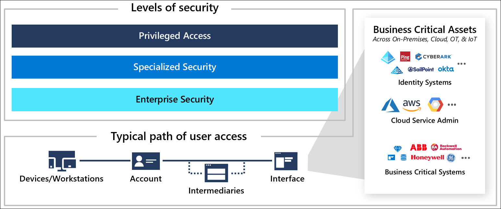
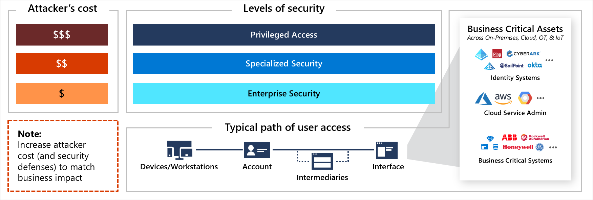

# Privileged access security levels

This document describes the security levels of a [privileged access strategy](privileged-access-strategy.md) For a roadmap on how to adopt this strategy, see the [rapid modernization plan (RaMP)](security-rapid-modernization-plan.md). For implementation guidance, see [privileged access deployment](privileged-access-deployment.md)

These levels are primarily designed to provide simple and straightforward technical guidance so that organizations can rapidly deploy these critically important protections. The privileged access strategy recognizes that organizations have unique needs, but also that custom solutions create complexity that results in higher costs and lower security over time. To balance this need, the strategy provides firm prescriptive guidance for each level and flexibility through allowing organizations to choose when each role will be required to meet the requirements of that level.

Making things simple helps people understand it and lowers the risk they will be confused and make mistakes. While the underlying technology is almost always complex, it is critical to keep things simple rather than creating custom solutions that are difficult to support. For more information, see [Security design principles](/azure/architecture/framework/security/security-principles).

Designing solutions that are focused on the needs of the administrators and end users, will keep it simple for them. Designing solutions that are simple for security and IT personnel to build, assess, and maintain (with automation where possible) leads to less security mistakes and more reliable security assurances. 

The recommended privileged access security strategy implements a simple three level system of assurances, that span across areas, designed to be easy to deploy for: accounts, devices, intermediaries, and interfaces.  

Each successive level drives up attacker costs, with additional level of Defender for Cloud investment. The levels are designed to target the 'sweet spots' where defenders get the most return (attacker cost increase) for each security investment they make.

Each role in your environment should be mapped to one of these levels (and optionally increased over time as part of a security improvement plan).  Each profile is clearly defined as a technical configuration and automated where possible to ease deployment and speed up security protections. For implementation details see the article, [Privileged access roadmap](security-rapid-modernization-plan.md).

## Security levels

The security levels used throughout this strategy are:

### Enterprise

- **Enterprise security** is suitable for all enterprise users and productivity scenarios. In the progression of the rapid modernization plan, enterprise also serves as the starting point for specialized and privileged access as they progressively build on the security controls in enterprise security.

   > [!NOTE]
   > Weaker security configurations do exist, but aren't recommended by Microsoft for enterprise organizations today because of the skills and resources attackers have available. For information on what attackers can buy from each other on the dark markets and average prices, see the video [Top 10 Best Practices for Azure Security](https://techcommunity.microsoft.com/t5/video-hub/top-10-best-practices-for-azure-security/m-p/1698837)

### Specialized

- **Specialized security** provides increased security controls for roles with an elevated business impact (if compromised by an attacker or malicious insider).

   Your organization should have documented criteria for specialized and privileged accounts (for example, potential business impact is over $1M USD) and then identify all the roles and accounts meeting that criteria. (used throughout this strategy, including in the Specialized Accounts)

   Specialized roles typically include:

   - **Developers** of business critical systems.
   - **Sensitive business roles** such as users of SWIFT terminals, researchers with access to sensitive data, personnel with access to financial reporting prior to public release, payroll administrators, approvers for sensitive business processes, and other high impact roles.  
   - **Executives** and personal assistants / administrative assistants that that regularly handle sensitive information.
   - **High impact social media accounts** that could damage the company reputation.
   - **Sensitive IT Admins** with a significant privileges and impact, but are not enterprise-wide. This group typically includes administrators of individual high impact workloads. (for example, enterprise resource planning administrators, banking administrators, help desk /tech support roles, etc.)

   Specialized Account security also serves as an interim step for privileged security, which further builds on these controls. See [privileged access roadmap](security-rapid-modernization-plan.md) for details on recommended order of progression.

## Privileged

- **Privileged security** is the highest level of security designed for roles that could easily cause a major incident and potential material damage to the organization in the hands of an attacker or malicious insider. This level typically includes technical roles with administrative permissions on most or all enterprise systems (and sometimes includes a select few business critical roles)

   Privileged accounts are focused on security first, with productivity defined as the ability to easily and securely perform sensitive job tasks securely. These roles will not have the ability to do both sensitive work and general productivity tasks (browse the web, install and use any app) using the same account or the same device/workstation. They will have highly restricted accounts and workstations with increased monitoring of their actions for anomalous activity that could represent attacker activity. 

   Privileged access security roles typically include:

   - Microsoft Entra [administrator roles](/entra/identity/role-based-access-control/permissions-reference)
   - Other identity management roles with administrative rights to an enterprise directory, identity synchronization systems, federation solution, virtual directory, privileged identity/access management system, or similar.  
   - Roles with membership in these on-premises Active Directory groups
      - Enterprise Admins
      - Domain Admins
      - Schema Admin
      - BUILTIN\Administrators
      - Account Operators
      - Backup Operators
      - Print Operators
      - Server Operators
      - Domain Controllers
      - Read-only Domain Controllers
      - Group Policy Creator Owners
      - Cryptographic Operators
      - Distributed COM Users
      - Sensitive on-premises Exchange groups (including Exchange Windows Permissions and Exchange Trusted Subsystem) 
      - Other Delegated Groups - Custom groups that may be created by your organization to manage directory operations.
      - Any local administrator for an underlying operating system or cloud service tenant that is hosting the above capabilities including
         - Members of local administrators group
         - Personnel who know the root or built in administrator password
         - Administrators of any management or security tool with agents installed on those systems

## Next steps

- [Securing privileged access overview](overview.md)
- [Privileged access strategy](privileged-access-strategy.md)
- [Measuring success](privileged-access-success-criteria.md)
- [Privileged access accounts](privileged-access-accounts.md)
- [Intermediaries](privileged-access-intermediaries.md)
- [Interfaces](privileged-access-interfaces.md)
- [Privileged access devices](privileged-access-devices.md)
- [Enterprise access model](privileged-access-access-model.md)
