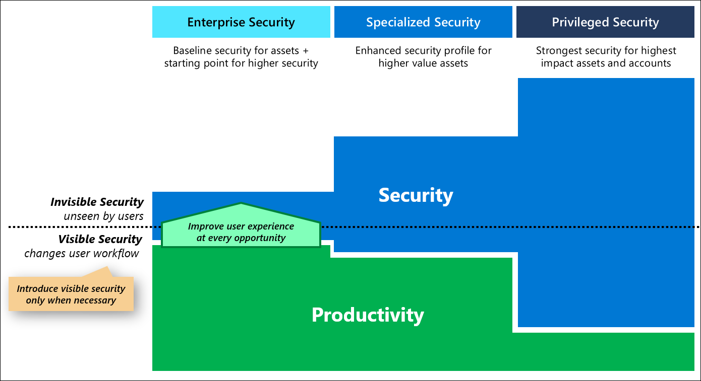
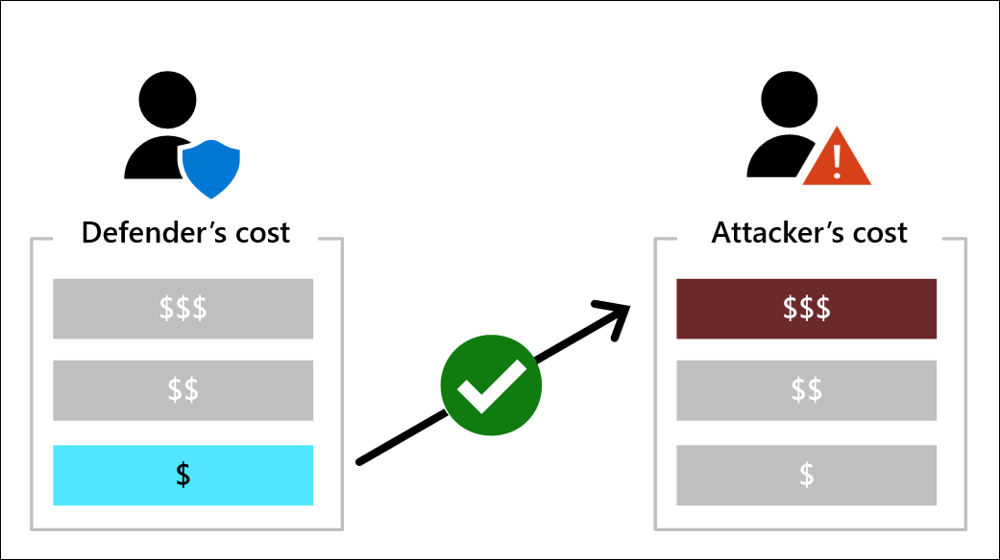
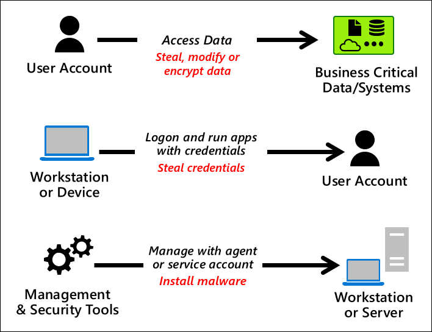

# Success criteria for privileged access strategy

This document describes the success criteria for a [privileged access strategy](privileged-access-strategy.md). This section describes strategic perspectives of success for a privileged access strategy. For a roadmap on how to adopt this strategy, see the [rapid modernization plan (RaMP)](security-rapid-modernization-plan.md). For implementation guidance, see [privileged access deployment](privileged-access-deployment.md)

Implementing a holistic strategy using Zero Trust approaches creates a "seal" of sorts over the access control for privileged access that makes it resistant to attackers. This strategy is accomplished by limiting pathways to privileged access only a select few, and then closely protecting and monitoring those authorized pathways.

A successful strategy must address the all points attackers can use to intercept privileged access workflows including four distinct initiatives:

- **Privileged Access workflow** elements of the privileged access workflow including underlying devices, operating systems, applications, and identities
- **Identity systems** hosting the privileged accounts and the groups, and other artifacts that confer privilege on the accounts
- **User access workflow** and authorized elevation paths that can lead to privileged access
- **Application interfaces** where zero trust access policy is enforced and role-based access control (RBAC) is configured to grant privileges 

 >[!NOTE]
 > A complete security strategy also includes asset protections that are beyond the scope of access control, such as data backups and protections against attacks on the application itself, the underlying operating system and hardware, on service accounts used by the application or service, and on data while at rest or in transit. For more information on modernizing a security strategy for cloud, see [Define a security strategy](/azure/cloud-adoption-framework/strategy/define-security-strategy).

An attack consists of human attackers leveraging automation and scripts to attack an organization is composed of humans, the processes they follow, and the technology they use. Because of this complexity of both attackers and defenders, the strategy must be multi-faceted to guard against all the people, process, and technology ways that the security assurances could inadvertently be undermined.

Ensuring sustainable long-term success requires meeting the following criteria:

- [Ruthless prioritization](#ruthless-prioritization)
- [Balance security and productivity](#balance-security-and-productivity)
- [Strong partnerships within the organization](#strong-partnerships-within-the-organization)
- [Disrupt attacker return on investment](#disrupt-attacker-return-on-investment)
- [Follow clean source principle](#clean-source-principle)

## Ruthless prioritization

Ruthless prioritization is the practice of taking the most effective actions with the fastest time to value first, even if those efforts don't fit pre-existing plans, perceptions, and habits. This strategy lays out the set of steps that have been learned in the fiery crucible of many major cybersecurity incidents. The learnings from these incidents form the steps we help organizations take to ensure that these crises don't happen again.  

While it's always tempting for security professionals to try to optimize familiar existing controls like network security and firewalls for newer attacks, this path consistently leads to failure. The [Microsoft Incident Response team)](https://www.microsoft.com/security/blog/microsoft-detection-and-response-team-dart-blog-series/) has been responding to privileged access attacks for nearly a decade and consistently sees these classic security approaches fail to detect or stop these attacks. While network security provides necessary and important basic security hygiene, it's critical to break out of these habits and focus on mitigations that will deter or block real world attacks.

Ruthlessly prioritize the security controls recommended in this strategy, even if it challenges existing assumptions and forces people to learn new skills.

## Balance security and productivity

As with all elements of security strategy, privileged access should ensure that both productivity and security goals are met.

Balancing security avoids the extremes that create risk for the organization by:

- Avoiding overly strict security that causes users to go outside the secure policies, pathways, and systems.
- Avoiding weak security that harms productivity by allowing adversaries to easily compromise the organization.

For more information about security strategy, see [Defining a security strategy](/azure/cloud-adoption-framework/strategy/define-security-strategy).

To minimize negative business impact from security controls, you should prioritize invisible security controls that improve user workflows, or at least don't impede or change user workflows. While security sensitive roles may need visible security measures that change their daily workflows to provide security assurances, this implementation should be done thoughtfully to limit the usability impact and scope as much as possible. 

This strategy follows this guidance by defining three profiles (detailed later in  Keep it Simple - Personas and Profiles)

## Strong partnerships within the organization

Security must work to build partnerships within the organization to be successful. In addition to the timeless truth that "none of us is as smart as all of us," the nature of security is to be a support function to protect someone else's resources. Security isn't accountable for the resources they help protect (profitability, uptime, performance, etc.), *security is a support function that provides expert advice and services* to help protect the intellectual property and business functionality that is important to the organization.

Security should **always work as a partner** in support of business and mission objectives. While security should not shy away from giving direct advice like recommending against accepting a high risk, security should also always frame that advice in terms of the business risk relative to other risks and opportunities managed by the resource owners.  

While some parts of security can be planned and executed successfully mostly within security organization, many like securing privileged access require working closely with IT and business organizations to understand which roles to protect, and help update and redesign workflows to ensure they are both secure and allow people to do their jobs. For more information on this idea, see the section [Transformations, mindsets, and expectations](/azure/cloud-adoption-framework/strategy/define-security-strategy#transformations-mindsets-and-expectations) in the security strategy guidance article.

## Disrupt attacker return on investment

Maintain focus on pragmatism by ensuring that defensive measures are likely to meaningfully disrupt the attacker value proposition of attacking you, increasing cost and friction on the attacker's ability to successfully attack you. Evaluating how defensive measures would impact the adversary's cost of attack provides both a healthy reminder to focus on the attackers perspective as well as a structured mechanism to compare the effectiveness of different mitigation options.  

Your goal should be to increase the attackers cost while minimizing your own security investment level:

Disrupt attacker return on investment (ROI) by increasing their cost of attack across the elements of the privileged access session. This concept is described in more detail in the article [Success criteria for privileged access strategy](privileged-access-success-criteria.md).

 > [!IMPORTANT]
 > A privileged access strategy should be comprehensive and provide defense in depth, but must avoid the Expense in depth fallacy where defenders simply pile on more same (familiar) type controls (often network firewalls/filters) past the point where they add any meaningful security value.

For more information on attacker ROI, see the short video and in-depth discussion [Disrupting attacker return on investment](/security/ciso-workshop/ciso-workshop-module-2#part-1-disrupting-attacker-return-on-investment-1431).

## Clean source principle

The clean source principle requires all security dependencies to be as trustworthy as the object being secured.

Any subject in control of an object is a security dependency of that object. If an adversary can control anything in control of a target object, they can control that target object. Because of this threat, you must ensure that the assurances for all security dependencies are at or above the desired security level of the object itself. This principle applies across many types of control relationships:

While simple in principle, this concept gets complex easily in the real world as most enterprises grew organically over decades and have many thousands of control relationships recursively that build on each other, loop back on each other, or both. This web of control relationships provides many access paths that an attacker can discover and navigate during an attack, often with automated tools.

Microsoft's recommended privileged access strategy is effectively a plan to untangle the most important parts of this knot first using a Zero Trust approach, by explicitly validating that the source is clean before allowing access to the destination.

In all cases, the trust level of the source must be the same or higher than the destination.

- The only notable exception to this principle is allowing the use of unmanaged personal devices and partner devices for enterprise scenarios. This exception enables enterprise collaboration and flexibility and can be mitigated to an acceptable level for most organizations because of the low relative value of the enterprise assets. For more context on BYOD security, see the blog post [How a BYOD policy can reduce security risk in the public sector](https://cloudblogs.microsoft.com/industry-blog/en-gb/government/2020/06/26/how-to-have-secure-remote-working-with-a-byod-policy/).
- This same exception cannot be extended to specialized security and privileged security levels however because of the security sensitivity of these assets. Some PIM/PAM vendors may advocate that their solutions can mitigate device risk from lower-level devices, but we respectfully disagree with those assertions based on our experience investigating incidents. The asset owners in your organization may choose to accept risk of using enterprise security level devices to access specialized or privileged resources, but Microsoft does not recommend this configuration.
For more information, see the intermediary guidance for Privileged Access Management / Privileged Identity management.

The privileged access strategy accomplishes this principle primarily by enforcing Zero Trust policy with Conditional Access on inbound sessions at interfaces and intermediaries. The clean source principle starts with getting a new device from an OEM that is built to your security specifications including operating system version, security baseline configuration, and other requirements such as using [Windows Autopilot](/mem/autopilot/windows-autopilot) for deployment.

Optionally, the clean source principle can extend into a highly rigorous review of each component in the supply chain including installation media for operating systems and applications. While this principle would be appropriate for organizations facing highly sophisticated attackers, it should be a lower priority than the other controls in this guidance.

## Next steps

- [Securing privileged access overview](overview.md)
- [Privileged access strategy](privileged-access-strategy.md)
- [Security levels](privileged-access-security-levels.md)
- [Privileged access accounts](privileged-access-accounts.md)
- [Intermediaries](privileged-access-intermediaries.md)
- [Interfaces](privileged-access-interfaces.md)
- [Privileged access devices](privileged-access-devices.md)
- [Enterprise access model](privileged-access-access-model.md)
