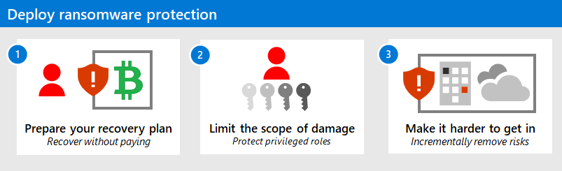
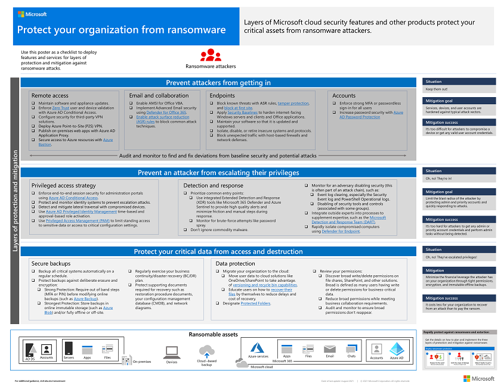

# What is ransomware?

In practice, a *ransomware attack* blocks access to your data until a ransom is paid.

In fact, ransomware is a type of malware or phishing cyber security attack that destroys or encrypts files and folders on a computer, server, or device.

Once devices or files are locked or encrypted, cybercriminals can extort money from the business or device owner in exchange for a *key* to unlock the encrypted data. But even when paid, cybercriminals *might never* give the key to the business or device owner and stop access *permanently*.

[Microsoft Security Copilot](/security/ransomware/human-operated-ransomware) leverages AI to help mitigate ransomware attacks. For more Microsoft solutions to ransomware, visit our [Ransomware solutions library](/security/ransomware).

## How do ransomware attacks work?

Ransomware can be automated or involve human hands on a keyboard - a *human-operated* attack, such as seen in recent attacks using [LockBit ransomware](https://blogs.microsoft.com/on-the-issues/2023/04/06/stopping-cybercriminals-from-abusing-security-tools).   

Human-operated ransomware attacks involve the following stages:

1. **Initial compromise** - The threat actor first gains access to a system or environment following a period of reconnaissance to identify weaknesses in defense.

1. **Persistence and defense evasion** - The threat actor establishes a foothold in the system or environment using a backdoor or other mechanism that operates in stealth to avoid detection by incident response teams.

1. **Lateral movement** - The threat actor uses the initial point of entry to migrate to other systems connected to the compromised device or network environment.

1. **Credential access** - The threat actor uses a fake sign-in page to harvest user or system credentials.

1. **Data theft** - The threat actor steals financial or other data from compromised users or systems.

1. **Impact** - The affected user or organization might suffer material or reputational damage.

## How Defender portal services help with unified security operations

- [Microsoft Defender XDR](https://www.microsoft.com/security/business/siem-and-xdr/microsoft-defender-xdr) - Microsoft Defender XDR includes powerful automated attack disruption capabilities that can protect your environment from sophisticated, high-impact attacks, including human-operated ransomware.
- [Microsoft Sentinel](https://azure.microsoft.com/products/microsoft-sentinel) - SIEM solution that stops a ransomware attack in its tracks by using machine learning to combine disparate data—network, identity, SaaS, and endpoints from both Microsoft and Partner data sources.
- [Security Copilot](https://www.microsoft.com/security/business/ai-machine-learning/microsoft-security-copilot?msockid=3fd141c935036ef610d9506e34696fe7) - During an active ransomware attack, Security Copilot uses machine learning to provide thorough context so security professionals can share clear, concise, and comprehensive summaries of active incidents. This gives targeted entities a deep understanding of the situation, even when an incident occurs after business hours.

## Common malware used in ransomware campaigns

- [Qakbot](https://www.microsoft.com/en-us/security/blog/2024/05/15/threat-actors-misusing-quick-assist-in-social-engineering-attacks-leading-to-ransomware) – Uses phishing to spread malicious links, malicious attachments, and to drop malicious payloads like Cobalt Strike Beacon

- [Ryuk](https://www.microsoft.com/en-us/security/blog/2020/03/05/human-operated-ransomware-attacks-a-preventable-disaster/?msockid=3fd141c935036ef610d9506e34696fe7) – Data encryptor typically targeting Windows 
- [Trickbot](https://www.microsoft.com/en-us/security/blog/2020/10/12/trickbot-disrupted/?msockid=3fd141c935036ef610d9506e34696fe7) – Has targeted Microsoft applications such as Excel and Word. Trickbot was typically delivered via email campaigns that used current events or financial lures to entice users to open malicious file attachments or click links to websites hosting the malicious files. Since 2022, Microsoft’s mitigation of campaigns using this malware appears to have disrupted its usefulness.

## Prevalent threat actors associated with ransomware campaigns

- [LockBit](https://techcommunity.microsoft.com/t5/microsoft-security-experts-blog/part-1-lockbit-2-0-ransomware-bugs-and-database-recovery/ba-p/3254354) – Financially motivated ransomware-as-a-service (RaaS) campaign and most prolific ransomware threat actor in the 2023-24 time period
- [Black Basta](https://www.microsoft.com/en-us/wdsi/threats/malware-encyclopedia-description?Name=Ransom:Win32/Basta&msockid=3fd141c935036ef610d9506e34696fe) – Gains access through spear-phishing emails and uses PowerShell to launch an encryption payload
- Storm-1674 (DarkGate and ZLoader) - Storm-1674 is an access broker known for distributing DarkGate, SectopRAT, and Zloader and handing off access to threat actors like Storm-0506 and Sangria Tempest. 

Meanwhile, Storm-1811 is a threat actor known for social engineering attacks leading to the deployment of BlackBasta using Qakbot and other malware. In late October to early November, Storm-1811 was observed flooding target email addresses with spam (email bombing attack) before posing as help desk personnel offering to help with the spam problem. In this new campaign, Storm-1811 was observed deploying a new malware loader called ReedBed.

Microsoft Defender data shows that the most widespread ransomware variants in the last quarter of 2024 were Akira, FOG, Qilin, Lynx, and the aforementioned RansomHub and BlackBasta. This period also saw the new ransomware variants SafePay and Hellcat. March 2025 has seen the resurface of Qilin ransomware through threat actor Moonstone Sleet.

## How Microsoft can help with an in-progress ransomware attack

To help mitigate in-progress ransomware attacks, Microsoft Incident Response can leverage and deploy [Microsoft Defender for Identity](https://www.microsoft.com/security/business/siem-and-xdr/microsoft-defender-for-identity) — a cloud-based security solution that helps detect and respond to identity-related threats. Bringing identity monitoring into incident response early supports the affected organization's security operations team to regain control. Microsoft Incident response uses Defender for Identity to help identify the incident scope and impacted accounts, protect critical infrastructure, and evict the threat actor. The response team then brings in [Microsoft Defender for Endpoint](https://www.microsoft.com/security/business/endpoint-security/microsoft-defender-endpoint) to trace the threat actor’s movements and disrupt their attempts to use compromised accounts to reenter the environment. After containing the incident andregaining and full administrative control over the environment, Microsoft Incident Response collaborates with the customer to help prevent future cyberattacks. 

### Automated ransomware attacks

*Commodity ransomware attacks* are often automated. These cyber attacks can spread like a virus, infect devices through methods like email phishing and malware delivery, and require malware remediation.

Therefore, you can safeguard your email system using 
[Microsoft Defender for Office 365](/microsoft-365/security/office-365-security/) that protects against malware and phishing delivery. [Microsoft Defender for Endpoint](/microsoft-365/security/defender-endpoint/) works alongside Defender for Office 365 to automatically detect and block suspicious activity on your devices, while [Microsoft Defender XDR](/microsoft-365/security/defender/) detects malware and phishing attempts *early*.

### Human-operated ransomware attacks

*Human-operated ransomware* is the result of an **active attack** by cybercriminals that infiltrate an organization's on-premises or cloud IT infrastructure, elevate their privileges, and deploy ransomware to critical data.

These "hands-on-keyboard" attacks usually target organizations rather than a single device.

*Human-operated* also means there's a human threat actor using their insights into common system and security misconfigurations. They aim to infiltrate the organization, navigate the network, and adapt to the environment and its weaknesses.

Hallmarks of these human-operated ransomware attacks typically include **credential theft** and **lateral movement** with an elevation of the privileges in stolen accounts.

Activities might take place during maintenance windows and involve security configuration gaps discovered by cybercriminals. The goal is the **deployment of a ransomware payload** to whatever *high business impact resources* the threat actors choose.

> [!IMPORTANT]
> These attacks can be *catastrophic* to business operations and are difficult to clean up, requiring complete adversary eviction to protect against future attacks. Unlike commodity ransomware that usually only requires malware remediation, **human-operated ransomware will continue to threaten your business operations after the initial encounter**.

[The impact and likelihood that human-operated ransomware attacks will continue](media/human-operated-ransomware/ransomware-extortion-based-attack.png)

## Ransomware protection for your organization

First, prevent phishing and malware delivery with [Microsoft Defender for Office 365](/microsoft-365/security/office-365-security/) to protect against malware and phishing delivery, [Microsoft Defender for Endpoint](/microsoft-365/security/defender-endpoint/) to automatically detect and block suspicious activity on your devices, and [Microsoft Defender XDR](/microsoft-365/security/defender/) to detect to malware and phishing attempts *early*.

For a comprehensive view of ransomware and extortion and how to protect your organization, use the information in the **[Human-Operated Ransomware Mitigation Project Plan](https://download.microsoft.com/download/7/5/1/751682ca-5aae-405b-afa0-e4832138e436/RansomwareRecommendations.pptx)** PowerPoint presentation. 

## Follow Microsoft Incident Response's approach to ransomware prevention and mitigation.

1. Assess the situation	by analyzing the suspicious activity that alerted your team to the attack. 

2. What time/date did you first learn of the incident? What logs are available and is there any indication that the actor is currently accessing systems?
   
3. Identify the affected line-of-business (LOB) applications, and get any impacted systems back online. Does the affected application require an identity that might have been compromised?

4. Are backups of the application, configuration, and data available and regularly verified using a restore exercise?

5. Determine the compromise recovery (CR) process to remove the threat actor from the environment.

## Here's a summary of Microsoft's Human-Operated Ransomware Mitigation Project Plan guidance:

[The summary of the guidance in the Human-Operated Ransomware Mitigation Project Plan](media/human-operated-ransomware/stakes-weaknesses-plan.png)

- The stakes of ransomware and extortion-based attacks are high.
- However, the attacks have weaknesses that can reduce your likelihood of being attacked.
- There are three steps to configuring your infrastructure to exploit attack weaknesses.

For the three steps to exploit attack weaknesses, see the [Protect your organization against ransomware and extortion](protect-against-ransomware.md) solution to **quickly** configure your IT infrastructure for the best protection:

1. Prepare your organization to recover from an attack without having to pay the ransom.
2. Limit the scope of damage of a ransomware attack by protecting privileged roles.
1. Make it harder for a threat actor to access your environment by incrementally removing risks.

Download the [Protect your organization from ransomware poster](https://download.microsoft.com/download/5/e/3/5e37cbff-9a7a-45b2-8b95-6d3cc5426301/protect-your-organization-from-ransomware.pdf) for an overview of the three phases as layers of protection against ransomware attacks.

## Additional ransomware prevention resources

Key information from Microsoft:

- [The latest ransomware trends from Microsoft](https://www.microsoft.com/security/blog/threat-intelligence/ransomware/), Microsoft latest ransomware blog
- [2024 Microsoft Digital Defense Report](https://www.microsoft.com/security/security-insider/intelligence-reports/microsoft-digital-defense-report-2024) 
Microsoft 365:

- [Deploy ransomware protection for your Microsoft 365 tenant](/microsoft-365/solutions/ransomware-protection-microsoft-365)

Microsoft Defender XDR:

- [Find ransomware with advanced hunting](/microsoft-365/security/defender/advanced-hunting-find-ransomware)

Microsoft Defender for Cloud Apps:

-  [Create anomaly detection policies in Defender for Cloud Apps](/cloud-app-security/anomaly-detection-policy)

Microsoft Azure:

- [Azure Defenses for Ransomware Attack](https://azure.microsoft.com/resources/azure-defenses-for-ransomware-attack/)

Microsoft Copilot for Security:

- [Defend against human-operated ransomware attacks with Microsoft Copilot for Security​​](https://www.microsoft.com/security/blog/2024/03/04/defend-against-human-operated-ransomware-attacks-with-microsoft-copilot-for-security/)

OpenAI key ransomware mitigation strategies, in ChatGPT’s own words, include: 

1. **Training data curation**

1. **Safety layers and filters**

1. **Empirical testing and red teaming**

1. **Continuous monitoring**

1. **Alignment and safety research**

1. **Community reporting and feedback**

1. **Partnerships and policies**

For more detailed information, refer to OpenAI's official documentation on their approach to [AI safety and misuse mitigation](https://openai.com/safety).

Microsoft Security ransomware mitigation resources:

See the latest list of ransomware articles in the [Microsoft Security Blog](https://www.microsoft.com/security/blog/?sort-by=relevance&date=any&s=ransomware).

- [Navigating recent ransomware threats (June 2024)](https://techcommunity.microsoft.com/t5/microsoft-security-experts-blog/octo-tempest-hybrid-identity-compromise-recovery/ba-p/4166783)
