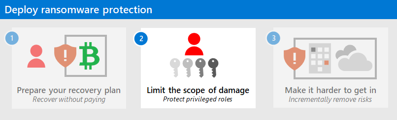

# Prepare a ransomware attack recovery plan

*Always* prepare an alternative to ransom payment to help avoid losing access to your data.

> [!IMPORTANT]
>  **Read the whole ransomware prevention series, and make your organization *hard to ransomware attack*.**
>
>- [Have a recovery plan](protect-against-ransomware-phase1.md)
>- [A plan to limit the harm done](protect-against-ransomware-phase2.md)
>- [Make it hard to get in](protect-against-ransomware-phase3.md)

Ransomware actors in control of your organization have many ways to pressure you into paying. The demands primarily focus on two categories:

- **Pay a ransom to regain access**

  Threat actors demand payment under the threat that they *won’t give you back access to your systems and data*. This is usually done by encrypting your systems and data and demanding payment for the decryption key. 

  >[!Important]
  >Paying the ransom won't guarantee restored access to your data. 
> Financially motivated cybercriminals (and often relatively amateur operators who are using a toolkit provided by someone else), might keep both the payment locked files. 
> There is no legal guarantee that they will provide a key that decrypts 100% of your systems and data, or even provide a key at all. The process to decrypt these systems uses homegrown attack tools, an often clumsy and manual process.
  >

- **Pay to avoid disclosure**

   Threat actors demand payment in exchange for not releasing sensitive or embarrassing data to the dark web (other criminals) or the general public. 

To avoid being forced into payment (the profitable situation for threat actors), the most immediate and effective action you can take is to make sure your organization can restore your entire enterprise from immutable storage, which neither the cybercriminal nor you can modify. 

Identifying the most sensitive assets and protecting them at a higher level of assurance is also critically important but is a longer and more challenging process to execute. We don’t want you to hold up other areas in phases 1 or 2, but we recommend you get the process started by bringing together business, IT, and security stakeholders to ask and answer questions like: 

- What business assets would be the most damaging if compromised? For example, for which assets would our business leadership be willing to pay an extortion demand if cybercriminals controlled them? 
- How do these business assets translate to IT assets (such as files, applications, databases, servers, and control systems)?
- How can we protect or isolate these assets so that threat actors with access to the general IT environment can’t access them? 

## Secure backups

You must ensure that critical systems and their data are backed up and backups are protected against deliberate erasure or encryption by a threat actor.

Attacks on your backups focus on crippling your organization’s ability to respond without paying, frequently targeting backups and key documentation required for recovery to force you into paying extortion demands. 

Most organizations don’t protect backup and restoration procedures against this level of intentional targeting. 

[Backup and restore plan to protect against ransomware](/azure/security/fundamentals/backup-plan-to-protect-against-ransomware) addresses what to do before an attack to protect your critical business systems and during an attack to ensure a rapid recovery of your business operations.

### Program and project member accountabilities

This table describes the overall protection of your data from ransomware in terms of a sponsorship/program management/project management hierarchy to determine and drive results.

| Lead | Implementor | Accountability |
|:-------|:-------|:-----|
| [Central IT](/azure/cloud-adoption-framework/organize/central-it) Operations or CIO | | Executive sponsorship |
| Program lead from [Central IT](/azure/cloud-adoption-framework/organize/central-it) infrastructure | | Drive results and cross-team collaboration |
|  | [Central IT](/azure/cloud-adoption-framework/organize/central-it) Infrastructure/Backup | Enable Infrastructure backup |
|  | [Central IT](/azure/cloud-adoption-framework/organize/central-it) Productivity / End User | Enable OneDrive Backup |
|  | [Security Architecture](/azure/cloud-adoption-framework/organize/cloud-security-architecture)  | Advise on configuration and standards |
| | [Security Policy and Standards](/azure/cloud-adoption-framework/organize/cloud-security-policy-standards) | Update standards and policy documents |
| | [Security Compliance Management](/azure/cloud-adoption-framework/organize/cloud-security-compliance-management) | Monitor to ensure compliance |
|  |  |  |

### Implementation checklist

Apply these best practices to secure your backup infrastructure.

| Done| Task | Description |
|:-------|:-------|:-----|
| <input type="checkbox" /> | Backup all critical data automatically on a regular schedule. | Allows you to recover data up to the last backup. |
| <input type="checkbox" /> | Regularly exercise your business continuity/disaster recovery (BC/DR) plan. | Ensures rapid recovery of business operations by treating a ransomware or extortion attack with the same importance as a natural disaster. |
| <input type="checkbox" /> | Protect backups against deliberate erasure and encryption:    - Strong Protection – Require out of band steps (MFA or PIN) before modifying online backups (such as [Azure Backup](/azure/backup/backup-azure-security-feature#prevent-attacks)).    - Strongest Protection – Store backups in online immutable storage (such as [Azure Blob](/azure/storage/blobs/storage-blob-immutable-storage)) and/or fully offline or off-site. | Backups accessible by cybercriminals can be rendered unusable for business recovery.  Implement stronger security to access backups and the inability to change the data stored in backups. |
| <input type="checkbox" /> | Protect supporting documents required for recovery such as restoration procedure documents, your configuration management database (CMDB), and network diagrams. | Threat actors deliberately target these resources because it impacts your ability to recover. Make sure they survive a ransomware attack. |

### Implementation results and timelines

Within 30 days, ensure that Mean Time to Recover (MTTR) meets your BC/DR goal, as measured during simulations and real-world operations.

## Data protection

You must implement data protection to ensure rapid and reliable recovery from a ransomware attack and to block some attack techniques.

Ransomware extortion and destructive attacks only work when all legitimate access to data and systems is lost. Ensuring that threat actors cannot remove your ability to resume operations without payment will protect your business and undermine the monetary incentive for attacking your organization.

### Program and project member accountabilities

This table describes the overall protection of your organization data from ransomware in terms of a sponsorship/program management/project management hierarchy to determine and drive results.

| Lead | Implementor | Accountability |
|:-------|:-------|:-----|
| [Central IT](/azure/cloud-adoption-framework/organize/central-it) Operations or CIO | | Executive sponsorship |
| Program lead from [Data Security](/azure/cloud-adoption-framework/organize/cloud-security-data-security) | | Drive results and cross-team collaboration |
|  | [Central IT](/azure/cloud-adoption-framework/organize/central-it) Productivity / End User |  Implement changes to Microsoft 365 tenant for OneDrive and Protected Folders |
|  | [Central IT](/azure/cloud-adoption-framework/organize/central-it) Infrastructure/Backup | Enable Infrastructure backup |
|  | Business / Application | Identify critical business assets |
|  | [Security Architecture](/azure/cloud-adoption-framework/organize/cloud-security-architecture)  | Advise on configuration and standards |
|  | [Security Policy and Standards](/azure/cloud-adoption-framework/organize/cloud-security-policy-standards) | Update standards and policy documents |
|  | [Security Compliance Management](/azure/cloud-adoption-framework/organize/cloud-security-compliance-management) | Monitor to ensure compliance |
|  | User Education Team | Ensure guidance for users reflects policy updates |
|  |  |  |

### Implementation checklist

Apply these best practices to protect your organization data.

| Done| Task | Description |
|:-------|:-------|:-----|
| <input type="checkbox" /> | Migrate your organization to the cloud:    - Move user data to cloud solutions like OneDrive/SharePoint to take advantage of [versioning and recycle bin capabilities](/microsoft-365/enterprise/microsoft-365-malware-and-ransomware-protection#sharepoint-online-and-onedrive-for-business-protection-against-ransomware).    - Educate users on how to [recover their files](https://support.microsoft.com/office/restore-your-onedrive-fa231298-759d-41cf-bcd0-25ac53eb8a15) by themselves to reduce delays and cost of recovery. | User data in the Microsoft cloud can be protected by built-in security and data management features. |
| <input type="checkbox" /> | Designate [Protected Folders](/windows/security/threat-protection/microsoft-defender-atp/controlled-folders). | Makes it more difficult for unauthorized applications to modify the data in these folders. |
| <input type="checkbox" /> | Review your permissions:    - Discover broad write/delete permissions on file shares, SharePoint, and other solutions. Broad is defined as many users having write/delete permissions for business-critical data.    - Reduce broad permissions for critical data locations while meeting business collaboration requirements.     - Audit and monitor critical data locations to ensure broad permissions don’t reappear. | Reduces risk from ransomware activities that rely on broad access. |
|  |  |  |

## Next step

Continue with [Phase 2](protect-against-ransomware-phase2.md) to limit the scope of damage of an attack by protecting privileged roles.

## Additional ransomware resources

Key information from Microsoft:

- [2023 Microsoft Digital Defense Report](https://www.microsoft.com/en-us/security/security-insider/microsoft-digital-defense-report- 
  2023) (see pages 17-26)
- [Microsoft Blog - Ransomware](https://www.microsoft.com/security/blog/threat-intelligence/ransomware/), Latest threats - Ransomware
- [Human-operated ransomware](human-operated-ransomware.md)
- [Rapidly protect against ransomware and extortion](protect-against-ransomware.md)
- [Ransomware: A pervasive and ongoing threat](https://security.microsoft.com/threatanalytics3/05658b6c-dc62-496d-ad3c-c6a795a33c27/overview) threat analytics report in the Microsoft Defender portal
- Microsoft Incident Response team (formerly DART/CRSP) ransomware [approach](/security/operations/incident-response-playbook-dart-ransomware-approach) and [case study](dart-ransomware-case-study.md)

Microsoft 365:

- [Deploy ransomware protection for your Microsoft 365 tenant](/microsoft-365/solutions/ransomware-protection-microsoft-365)
- [Maximize Ransomware Resiliency with Azure and Microsoft 365](https://azure.microsoft.com/resources/maximize-ransomware-resiliency-with-azure-and-microsoft-365/)
- [Recover from a ransomware attack](/microsoft-365/security/office-365-security/recover-from-ransomware)
- [Malware and ransomware protection](/compliance/assurance/assurance-malware-and-ransomware-protection)
- [Protect your Windows 10 PC from ransomware](https://support.microsoft.com//windows/protect-your-pc-from-ransomware-08ed68a7-939f-726c-7e84-a72ba92c01c3)
- [Handling ransomware in SharePoint Online](/sharepoint/troubleshoot/security/handling-ransomware-in-sharepoint-online)
- [Threat analytics reports for ransomware](https://security.microsoft.com/threatanalytics3?page_size=30&filters=tags%3DRansomware&ordering=-lastUpdatedOn&fields=displayName,alertsCount,impactedEntities,reportType,createdOn,lastUpdatedOn,tags,flag) in the Microsoft Defender portal

Microsoft Defender XDR:

- [Find ransomware with advanced hunting](/microsoft-365/security/defender/advanced-hunting-find-ransomware)

Microsoft Azure:

- [Azure Defenses for Ransomware Attack](https://azure.microsoft.com/resources/azure-defenses-for-ransomware-attack/)
- [Maximize Ransomware Resiliency with Azure and Microsoft 365](https://azure.microsoft.com/resources/maximize-ransomware-resiliency-with-azure-and-microsoft-365/)
- [Backup and restore plan to protect against ransomware](/azure/security/fundamentals/backup-plan-to-protect-against-ransomware)
- [Help protect from ransomware with Microsoft Azure Backup](https://www.youtube.com/watch?v=VhLOr2_1MCg) (26 minute video)
- [Recovering from systemic identity compromise](/azure/security/fundamentals/recover-from-identity-compromise)
- [Advanced multistage attack detection in Microsoft Sentinel](/azure/sentinel/fusion#ransomware)
- [Fusion Detection for Ransomware in Microsoft Sentinel](https://techcommunity.microsoft.com/t5/azure-sentinel/what-s-new-fusion-detection-for-ransomware/ba-p/2621373)

Microsoft Defender for Cloud Apps:

- [Create anomaly detection policies in Defender for Cloud Apps](/cloud-app-security/anomaly-detection-policy)

Microsoft Security team blog posts:

- [A guide to combatting human-operated ransomware: Part 1 (September 2021)](https://www.microsoft.com/security/blog/2021/09/20/a-guide-to-combatting-human-operated-ransomware-part-1/)

- [A guide to combatting human-operated ransomware: Part 2 (September 2021)](https://www.microsoft.com/security/blog/2021/09/27/a-guide-to-combatting-human-operated-ransomware-part-2/)

  Recommendations and best practices.

- [3 steps to prevent and recover from ransomware (September 2021)](https://www.microsoft.com/security/blog/2021/09/07/3-steps-to-prevent-and-recover-from-ransomware/)
- [Becoming resilient by understanding cybersecurity risks: Part 4—navigating current threats (May 2021)](https://www.microsoft.com/security/blog/2021/05/26/becoming-resilient-by-understanding-cybersecurity-risks-part-4-navigating-current-threats/)

  See the **Ransomware** section.

- [Human-operated ransomware attacks: A preventable disaster (March 2020)](https://www.microsoft.com/security/blog/2020/03/05/human-operated-ransomware-attacks-a-preventable-disaster/)

  Includes attack chain analyses of actual attacks.

- [Ransomware response—to pay or not to pay? (December 2019)](https://www.microsoft.com/security/blog/2019/12/16/ransomware-response-to-pay-or-not-to-pay/)
- [Norsk Hydro responds to ransomware attack with transparency (December 2019)](https://www.microsoft.com/security/blog/2019/12/17/norsk-hydro-ransomware-attack-transparency/)
