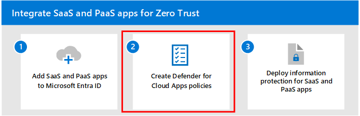

# Step 1: Add SaaS apps to Microsoft Entra ID and to the scope of policies 

<!---
Many organizations rely on SaaS apps to run business workflows. The ease of use, cost effectiveness, and scalability makes it a viable solution for organizations to adopt. Because of the amount information and access to valuable resources these apps have, proper measures must be in place to secure these business-critical apps.
--->

Microsoft Entra ID is the Microsoft cloud-based identity and access management service. Microsoft Entra ID provides secure authentication and authorization solutions so that customers, partners, and employees can access the applications they need. With Microsoft Entra ID, [Conditional Access](/azure/active-directory/conditional-access/overview), [multi-factor authentication](/azure/active-directory/authentication/concept-mfa-howitworks), [single-sign on (SSO)](/azure/active-directory/hybrid/how-to-connect-sso), and [automatic user provisioning](/azure/active-directory/app-provisioning/user-provisioning) make identity and access management easy and secure.

Add your cloud apps in Microsoft Entra ID so that you can monitor and configure access for them. Microsoft Entra ID has an application gallery, which is a collection of SaaS apps that have been pre-integrated with Microsoft Entra ID. You can also your own custom apps. For more information, see [Five steps for integrating all your apps with Microsoft Entra ID](/azure/active-directory/fundamentals/five-steps-to-full-application-integration-with-azure-ad).

After adding apps to Microsoft Entra ID, you can configure how apps are accessed and subject to specific conditions by including them in the scope of your [Zero Trust identity and device access policies](/microsoft-365/security/office-365-security/zero-trust-identity-device-access-policies-overview). 

If you already have Microsoft Defender for Cloud Apps deployed, you can discover SaaS apps that are being used in your organization. For more information, see [Step 2 of this solution](create-policies.md) and [Discover and manage shadow IT in your network](/defender-cloud-apps/tutorial-shadow-it).

## Adding apps in Microsoft Entra ID

Adding apps in Microsoft Entra ID helps you leverage one or more of the services it provides including:

- Application authentication and authorization
- User authentication and authorization
- SSO using federation or password
- User provisioning and synchronization
- Role-based access control: Use the directory to define application roles to perform role-based authorization checks in an application.
- OAuth authorization services: Used by Microsoft 365 and other Microsoft applications to authorize access to APIs/resources.
- Application publishing and proxy: Publish an application from your private network to the internet.
- Directory schema extension attributes to store additional data in Microsoft Entra ID

There are several ways you can add apps in Microsoft Entra ID. The easiest way to start managing apps is to use the application gallery. You also have the option of adding custom apps. This section will guide you through both ways. 

### Add apps from the application gallery

Microsoft Entra ID has an application gallery that contains a collection of SaaS apps that have been pre-integrated with Microsoft Entra ID. Just sign into Microsoft Entra ID and choose the applications from specific cloud platforms, featured applications, or search for the application that you want to use.

For more information, see [Add an enterprise application](/azure/active-directory/manage-apps/add-application-portal#add-an-enterprise-application) and [Overview of Microsoft Entra application gallery](/azure/active-directory/manage-apps/overview-application-gallery).

### Adding custom apps in Microsoft Entra app gallery

You can develop your own custom cloud apps and register them in Microsoft Entra ID. Registering them with Microsoft Entra ID lets you leverage the security features that your Microsoft 365 tenant provides. You can register your application in **App Registrations**, or you can register it using the **Create your own application** link when adding a new application in **Enterprise applications**.

For more information, see [Request to publish your application in the Microsoft Entra application gallery](/azure/active-directory/manage-apps/v2-howto-app-gallery-listing).

## Add apps to the scope of your Zero Trust identity and device access policies

Conditional Access policies allow you to assign controls to specific applications, actions, or authentication context. You can define conditions such as what device type can access a resource, user risk levels, trusted locations, as well as other conditions such as strong authentication. For example multifactor authentication (MFA) helps safeguard access to data and applications, by providing additional security by requiring a second form of verification and delivers strong authentication. 

After adding apps in Microsoft Entra ID, you'll need to add them to the scope of your identity and device Conditional Access policies. 

### Updating common policies 

The following diagram shows the Zero Trust identity and device access policies for SaaS and PaaS apps, highlighting the set of common Conditional Access policies whose scopes must be modified to include your SaaS apps.

:::image type="content" source="./media/identity-access-ruleset-saas.svg" alt-text="The Zero Trust identity and device access policies for SaaS apps with the policies whose scopes must be modified highlighted." lightbox="./media/identity-access-ruleset-saas.svg":::

For each policy to update, make sure that your apps and their dependent services are included in the assignment of cloud apps.

This table lists the policies that need to be reviewed with links to each policy in the [common identity and device access policies](/microsoft-365/security/office-365-security/microsoft-365-policies-configurations).

|Protection level|Policies|Description|
|---|---|---|
| **Starting point** | [Require MFA when sign-in risk is *medium* or *high*](/microsoft-365/security/office-365-security/identity-access-policies#require-mfa-based-on-sign-in-risk) | Be sure apps and dependent services are included in the list of apps. |
| | [Block clients that don't support modern authentication](/microsoft-365/security/office-365-security/identity-access-policies#block-clients-that-dont-support-multi-factor) | Include apps and dependent services in the assignment of cloud apps.|
| | [High risk users must change password](/microsoft-365/security/office-365-security/identity-access-policies#high-risk-users-must-change-password) | Forces app users to change their password when signing in if high-risk activity is detected for their account. |
| | [Apply APP data protection policies](/microsoft-365/security/office-365-security/identity-access-policies#apply-app-data-protection-policies) | Be sure apps and dependent services are included in the list of apps. Update the policy for each platform (iOS, Android, Windows). |
| **Enterprise** | [Require MFA when sign-in risk is *low*, *medium*, or *high*](/microsoft-365/security/office-365-security/identity-access-policies#require-mfa-based-on-sign-in-risk) | Include apps and dependent services in this policy. |
| | [Require compliant PCs *and* mobile devices](/microsoft-365/security/office-365-security/identity-access-policies#require-compliant-pcs-and-mobile-devices) | Include apps and dependent services in this policy. |
| **Specialized security** | [Always require MFA](/microsoft-365/security/office-365-security/identity-access-policies#require-mfa-based-on-sign-in-risk) | Regardless of user identity, MFA will be used by your organization.  |

For more information, see [Recommended Microsoft Defender for Cloud Apps policies for SaaS apps](/microsoft-365/security/office-365-security/mcas-saas-access-policies). 

## Next step

Continue with [Step 2](create-policies.md) to create Defender for Cloud Apps policies.
