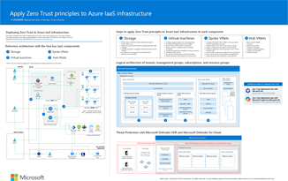
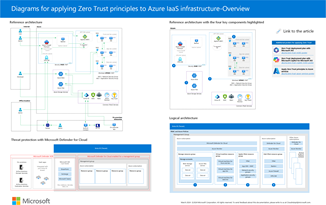

<!---

Writers notes:

For updates to product names, please also update the appropriate figures.

To update figures that are not screen shots, your options are:

- Locate the source Visio file in internal storage.
- Use the published Visio file in the Microsoft Download Center (see the "Technical publications" section of this article).
- For figures that are published in Scalable Vector Graphics (SVG) format, save the SVG file from the article web page, insert into Visio, modify, and then save it as a new version of the SVG file.

For any updates to figures, please update the corresponding posters as needed (see the "Technical publications" section of this article) and republish the Visio and PDF files in the Microsoft Download Center.

For new articles in this content set, please:

- Add cross-links in the "Next Steps" section FROM all the other articles in this content set TO the new article.
- Add a link to the Zero Trust Guidance Center page (index.yml).
- Update the "Content architecture" figure in the apply-zero-trust-azure-services-overview.md article as needed.

--->

# Overview – Apply Zero Trust principles to Azure networking

This series of articles help you apply the principles of Zero Trust to your networking infrastructure in Microsoft Azure based on a multi-disciplinary approach to applying the Zero Trust principles. Zero Trust is a security strategy. It isn't a product or a service, but an approach in designing and implementing the following set of security principles:

- Verify explicitly
- Use least privileged access
- Assume breach

Implementing the Zero Trust mindset to "assume breach, never trust, always verify" requires changes to cloud networking infrastructure, deployment strategy, and implementation.

The following articles show you how to apply Zero Trust approach to networking for commonly deployed Azure infrastructure services:

- [Encryption](azure-networking-encryption.md)
- [Segmentation](azure-networking-segmentation.md)

> [!IMPORTANT]
> This Zero Trust guidance describes how to use and configure several security solutions and features available on Azure for a reference architecture. Several other resources also provide security guidance for these solutions and features, including:

> - [Microsoft Cloud Security Benchmark](/security/benchmark/azure/introduction)
> - [Microsoft Cloud Security Baseline](/security/benchmark/azure/security-baselines-overview)

To describe how to apply a Zero Trust approach, this guidance targets a common pattern used in production by many organizations: a virtual-machine-based application hosted in a VNet (and IaaS application). This is a common pattern for organizations migrating on-premises applications to Azure, which is sometimes referred to as "lift-and-shift."

## Threat Protection with Microsoft Defender for Cloud

**Microsoft Defender for Cloud** is an extended detection and response (XDR) solution that automatically collects, correlates, and analyzes signal, threat, and alert data from across your environment. Defender for Cloud is intended to be used together with Microsoft Defender XDR to provide a greater breadth of correlated protection of your environment, as shown in the following diagram.

:::image type="content" source="media/azure-infra-overview/azure-infra-overview-threat-protection.svg" alt-text="The logical architecture of Microsoft Defender for Cloud and Microsoft Defender XDR that provides threat protection for Azure IaaS components." lightbox="media/azure-infra-overview/azure-infra-overview-threat-protection.svg":::

In the diagram:

- Defender for Cloud is enabled for a management group that includes multiple Azure subscriptions.
- Microsoft Defender XDR is enabled for Microsoft 365 apps and data, SaaS apps that are integrated with Microsoft Entra ID, and on-premises Active Directory Domain Services (AD DS) servers.

For more information about configuring management groups and enabling Defender for Cloud, see:

- [Organize subscriptions into management groups and assign roles to users](/azure/defender-for-cloud/management-groups-roles)
- [Enable Defender for Cloud on all subscriptions in a management group](/azure/defender-for-cloud/onboard-management-group)

## Next Steps

See these articles for applying Zero Trust principles to Azure networking:

- [Encryption](azure-networking-encryption.md)
- [Segmentation](azure-networking-segmentation.md)

See these additional articles for applying Zero Trust principles to Azure IaaS:

- For Azure IaaS:
  - [Azure storage](azure-infrastructure-storage.md)
  - [Virtual machines](azure-infrastructure-virtual-machines.md)
  - [Spoke virtual networks](azure-infrastructure-iaas.md)
  - [Hub virtual networks](azure-infrastructure-networking.md)
  - [Spoke virtual networks with Azure PaaS services](azure-infrastructure-paas.md)
- [Azure Virtual Desktop](azure-infrastructure-avd.md)
- [Azure Virtual WAN](azure-virtual-wan.md)
- [IaaS applications in Amazon Web Services](secure-iaas-apps.md)
- [Microsoft Sentinel and Microsoft Defender XDR](/security/operations/siem-xdr-overview)

<!---

## Security solutions in this series of articles

Zero Trust involves applying multiple disciplines of security and information protection together. In this series of articles, this multi-discipline approach is applied to each of the units of work for infrastructure components as follows:

**[Apply Zero Trust principles to Azure storage](azure-infrastructure-storage.md)**

1. Protect data in all three modes: data at rest, data in transit, and data in use
1. Verify users and control access to storage data with the least privileges
1. Logically separate or segregate critical data with network controls
1. Use Defender for Storage for automated threat detection and protection

**[Apply Zero Trust principles to virtual machines in Azure](azure-infrastructure-virtual-machines.md)**

1. Configure logical isolation for virtual machines
1. Leverage Role Based Access Control (RBAC)
1. Secure virtual machine boot components
1. Enable customer-managed keys and double encryption
1. Control the applications installed on virtual machines
1. Configure secure access
1. Set up secure maintenance of virtual machines
1. Enable advanced threat detection and protection

**[Apply Zero Trust principles to a spoke VNet in Azure](azure-infrastructure-iaas.md)**

1. Leverage Microsoft Entra RBAC or set up custom roles for networking resources
1. Isolate infrastructure into its own resource group
1. Create a network security group for each subnet
1. Create an application security group for each virtual machine role
1. Secure traffic and resources within the VNet
1. Secure access to the VNet and application
1. Enable advanced threat detection and protection

**[Apply Zero Trust principles to a hub VNet in Azure](azure-infrastructure-networking.md)**

1. Secure Azure Firewall Premium
1. Deploy Azure DDoS Protection Standard
1. Configure network gateway routing to the firewall
1. Configure threat protection

## Recommended training for Zero Trust

The following are the recommended training modules for Zero Trust.

### Azure management and governance

|Training  |[Describe Azure management and governance](/training/paths/describe-azure-management-governance/)  |
|---------|---------|
|:::image type="icon" source="media/describe-azure-management-governance-resized.png" border="false":::    | The Microsoft Azure Fundamentals training is composed of three learning paths: Microsoft Azure Fundamentals: Describe cloud concepts, Describe Azure architecture and services, and Describe Azure management and governance. Microsoft Azure Fundamentals: Describe Azure management and governance is the third learning path in Microsoft Azure Fundamentals. This learning path explores the management and governance resources available to help you manage your cloud and on-premises resources.  This learning path helps prepare you for [Exam AZ-900: Microsoft Azure Fundamentals.](/certifications/exams/az-900)|
> [!div class="nextstepaction"]
> [Start >](/training/modules/describe-cost-management-azure/1-introduction)

### Configure Azure Policy

|Training  |[Configure Azure Policy](/training/modules/configure-azure-policy/)|
|---------|---------|
|:::image type="icon" source="media/azure-policy-configure.png" border="false"::: | Learn how to configure Azure Policy to implement compliance requirements.  In this module, you learn how to: <li>Create management groups to target policies and spending budgets. <li>Implement Azure Policy with policy and initiative definitions. <li>Scope Azure policies and determine compliance.|
> [!div class="nextstepaction"]
> [Start >](/training/modules/configure-azure-policy/1-introduction)

### Manage security operation

|Training  |[Manage Security operation](/training/paths/manage-security-operation/)|
|---------|---------|
| :::image type="icon" source="media/operation-manage-security-resized.png" border="false":::   | Once you have deployed and secured your Azure environment, learn to monitor, operate, and continuously improve the security of your solutions.  This learning path helps prepare you for [Exam AZ-500: Microsoft Azure Security Technologies](/certifications/exams/az-500).|
> [!div class="nextstepaction"]
> [Start >](/training/modules/azure-monitor/1-introduction)

### Configure storage security  

|Training  |[Configure Storage security](/training/modules/configure-storage-security/)|
|---------|---------|
|:::image type="icon" source="media/storage-security-configure.png" border="false"::: | Learn how to configure common Azure Storage security features like storage access signatures. In this module, you learn how to:<li>Configure a shared access signature (SAS), including the uniform resource identifier (URI) and SAS parameters.<li>Configure Azure Storage encryption.<li>Implement customer-managed keys.<li>Recommend opportunities to improve Azure Storage security.|
> [!div class="nextstepaction"]
> [Start >](/training/modules/configure-storage-security/1-introduction)

### Configure Azure Firewall  

|Training  |[Configure Azure Firewall](/training/modules/configure-azure-firewall/)|
|---------|---------|
|:::image type="icon" source="media/azure-firewall-configure.png" border="false"::: | You will learn how to configure the Azure Firewall including firewall rules. After completing this module, you will be able to:<li>Determine when to use Azure Firewall.<li>Implement Azure Firewall including firewall rules.|
> [!div class="nextstepaction"]
> [Start >](/training/modules/configure-azure-firewall/1-introduction)

For more training on security in Azure, see these resources in the Microsoft catalog:  
[Security in Azure | Microsoft Learn](/training/browse/?subjects=security&products=azure)

## Technical illustrations

This poster provides a single-page, at-a-glance view of the components of Azure IaaS as reference and logical architectures, along with the steps to ensure that these components have the "never trust, always verify" principles of the Zero Trust model applied.

| Item | Related solution guides |
|:-----|:-----|
|   [PDF](https://download.microsoft.com/download/d/8/b/d8b38a95-803c-4956-88e6-c0de68f7f8e9/apply-zero-trust-to-Azure-IaaS-infra-poster.pdf) \| [Visio](https://download.microsoft.com/download/d/8/b/d8b38a95-803c-4956-88e6-c0de68f7f8e9/apply-zero-trust-to-Azure-IaaS-infra-poster.vsdx)   Updated March 2024 | <ul><li>[Azure Storage services](azure-infrastructure-storage.md)</li><li>[Virtual machines](azure-infrastructure-virtual-machines.md)</li><li>[Spoke VNets](azure-infrastructure-iaas.md)</li><li>[Hub VNets](azure-infrastructure-networking.md)</li></ul>|

This poster provides the reference and logical architectures and the detailed configurations of the separate components of Zero Trust for Azure IaaS. Use the pages of this poster for separate IT departments or specialties or, with the Microsoft Visio version of the file, customize the diagrams for your infrastructure.

| Item | Related solution guides |
|:-----|:-----|
|   [PDF](https://download.microsoft.com/download/c/e/a/ceac5996-7cbf-4184-aed8-16dffcad3795/apply-zero-trust-to-Azure-IaaS-infra-diagrams.pdf) \| [Visio](https://download.microsoft.com/download/c/e/a/ceac5996-7cbf-4184-aed8-16dffcad3795/apply-zero-trust-to-Azure-IaaS-infra-diagrams.vsdx)   Updated March 2024 | <ul><li>[Azure Storage services](azure-infrastructure-storage.md)</li><li>[Virtual machines](azure-infrastructure-virtual-machines.md)</li><li>[Spoke VNets](azure-infrastructure-iaas.md)</li><li>[Hub VNets](azure-infrastructure-networking.md)</li></ul>|

For additional technical illustrations, click [here](zero-trust-tech-illus.md).

## References

Refer to the following links to learn about the various services and technologies mentioned in this article.

- [What is Azure - Microsoft Cloud Services](https://azure.microsoft.com/resources/cloud-computing-dictionary/what-is-azure/)
- [Azure Infrastructure as a Service (IaaS)](https://azure.microsoft.com/resources/cloud-computing-dictionary/what-is-azure/azure-iaas/#benefits)
- [Virtual Machines (VMs) for Linux and Windows](https://azure.microsoft.com/products/virtual-machines/)
- [Introduction to Azure Storage](/azure/storage/common/storage-introduction)
- [Azure Virtual Network](/azure/virtual-network/virtual-networks-overview)
- [Introduction to Azure security](/azure/security/fundamentals/overview)
- [Zero Trust implementation guidance](zero-trust-overview.md)
- [Overview of the Microsoft cloud security benchmark](/security/benchmark/azure/overview)
- [Security baselines for Azure overview](/security/benchmark/azure/security-baselines-overview)
- [Building the first layer of defense with Azure security services](/azure/architecture/solution-ideas/articles/azure-security-build-first-layer-defense)
- [Microsoft Cybersecurity Reference Architectures](/security/cybersecurity-reference-architecture/mcra)

--->
