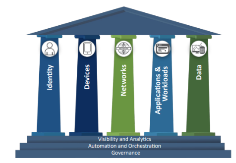
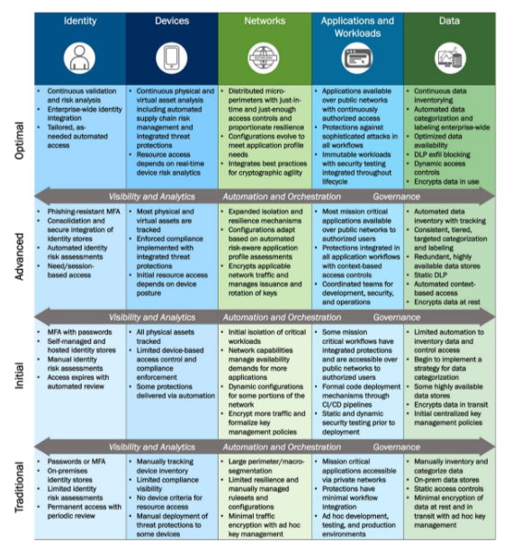

# Configure Microsoft cloud services for the CISA Zero Trust Maturity Model

As cyber threats become increasingly sophisticated, the need for robust cybersecurity measures is more critical than ever. The U.S. Cybersecurity & Infrastructure Security Agency ([CISA](https://www.cisa.gov/)) plays a central role in defending cyberspace, spearheading national efforts to enhance the resilience of vital functions, and promoting a strong technology ecosystem. The CISA mission includes maintaining cyber situational awareness among Federal Civilian Executive Branch (FCEB) agencies, and securing the **.gov** domain. CISA assists federal agencies and industry partners with effective management of significant cyber incidents. In April 2023, CISA released the [Zero Trust Maturity Model Version 2.0](https://www.cisa.gov/zero-trust-maturity-model) (ZTMM).  

   > [!NOTE]
   > In this guidance, the term **organization** refers to FCEB agencies and industry partners. 

The rapid adoption of new technologies, and the evolving threat landscape, pose ongoing challenges to cybersecurity. [Executive Order 14028: Improving the Nation's Cybersecurity](https://www.gsa.gov/technology/it-contract-vehicles-and-purchasing-programs/information-technology-category/it-security/executive-order-14028) emphasizes a renewed focus on modernizing federal cybersecurity, and endorses a Zero Trust Architecture ([ZTA](/security/zero-trust/zero-trust-overview)) as the preferred security model for government entities. The order mandates that organizations develop comprehensive plans for ZTA implementation. The order requires an assessment of the current cybersecurity posture and to prepare for full deployment. 

The CISA ZTMM serves as a crucial roadmap for organizations to evaluate their security posture rigorously and implement necessary changes to transition to ZTA. By adopting this model, organizations can enhance their resilience significantly against cyber threats, ensure stronger protection of critical information assets, and fortify the overall security framework. 

In support of this transition, Office of Management and Budget (OMB) [Memorandum M-22-09](https://www.whitehouse.gov/wp-content/uploads/2022/01/M-22-09.pdf) outlines actions to adopt in alignment with the ZTMM pillars. The Federal ZTA strategy requires organizations to meet key cybersecurity objectives and to consider **Executive Order (EO) 14028** and **M-22-09** as they develop and implement their Zero Trust strategies. 

Microsoft offers an expanding range of Zero Trust capabilities powered by a unified platform of integrated security tools. The platform provides comprehensive coverage across CISA ZTMM pillars and the cross-cutting capabilities, described in the following section. These solutions support organizations in their journey toward effective Zero Trust implementation, helping to ensure a secure, and resilient, federal cybersecurity framework. 

## Pillars, functions, capabilities, and ZTMM journey stages

The CISA ZTMM is built upon **five pillars** that encompass **functions** to enhance Zero Trust protection areas. Use the following links to go to sections of the guide:

* Introduction
* [Identity](cisa-zero-trust-maturity-model-identity.md)
* [Devices](cisa-zero-trust-maturity-model-devices.md)
* [Networks](cisa-zero-trust-maturity-model-networks.md)
* [Applications and workloads](cisa-zero-trust-maturity-model-apps.md)
* [Data](cisa-zero-trust-maturity-model-data.md)

Each pillar has three **cross-cutting capabilities**, which emphasize activities that enhance function interoperability across the pillars: 

* **Visibility and analytics**: Visibility refers to observable artifacts from the characteristics of, and events in, enterprise-wide environments. The focus on cyber-related data analysis helps inform policy decisions, facilitate response activities, and build a risk profile to develop proactive security measures.  
* **Automation and orchestration**: Zero Trust uses automated tools and workflows for security response functions across products and services. It helps enterprises maintain oversight, security, and development process interaction for such functions, products, and services. 
* **Governance**: In this document, governance is the enforcement of enterprise cybersecurity policies, procedures, and processes, in and across pillars. Governances mitigates security risks in support of Zero Trust principles and to fulfill federal requirements. 

   > [!NOTE]
   > Visibility and analytics, automation and orchestration, and governance capabilities enable organizations to integrate advancements across pillars. The following image illustrates the pillars and cross-cutting capabilities. 

   

### ZTMM journey stages

The pillars span the ZTMM journey's four stages.

* **Traditional**: Manually configured lifecycles, for instance from establishment to decommission, and attribute assignments such as security and logging. Static security policies and solutions address pillars with dependencies on external systems. Least privilege is established at provisioning. Siloed pillars of policy enforcement; manual response and mitigation deployment, and limited correlation of dependencies, logs, and telemetry. 
* **Initial**: Start automation of attribute assignment, lifecycle configuration, policy decisions, and enforcement. Initial cross-pillar solutions and external systems integration. Some responsive changes to least privilege after provisioning. Aggregated visibility for internal systems. 
* **Advanced**: Where applicable, automate controls for lifecycles, also configuration, and policy assignment with cross-pillar coordination. Centralize visibility and identity control, and policy enforcement integrated across pillars. Base responses to predefined mitigations, changes to least privilege on risk and posture assessments. Create enterprise-wide awareness, including externally hosted resources. 
* **Optimal**: Automated, just-in-time (JIT) lifecycles and attribute assignments to assets and resources that can self-report with dynamic policies, based on automated and observed triggers. Use dynamic least privileged access, just-enough access (JEA) and within thresholds for assets and their dependencies; Enable cross-pillar interoperability with continuous monitoring, and centralized visibility with comprehensive situational awareness. 

### Maturity model criteria

Use the following criteria to identify the maturity stage for Zero Trust technology pillars and provide consistency across the model: 

   

## Scope of guidance

Use this guidance to help meet the goals for ZTMM functions and make progress through maturity stages. We assume organizations are, at least, at the **Traditional** stage.  

In the following sections, pillars are divided into function areas with tables that have the ZTMM journey stage descriptions with Microsoft guidance and recommendations. Use the tables to learn how Microsoft cloud services align to the ZTMM. Each function has guidance for maturity stages. For example, organizations that implement guidance at the **Optimal** stage, implemented **Advanced** stage guidance.  

   > [!NOTE]
   > Guidance is scoped to features in General Availability (GA), or in Public Preview, in Microsoft commercial clouds.  

## Implementation approach

In most instances, multiple teams collaborate to guide an organization through lifecycle stages. Microsoft recommends your approach includes the following principles: 

* Create a team with clear ownership of pillars and cross-cutting capabilities 
* Ensure there are defined lines of communication and regularly updated status 
* Integrate products across ZTMM pillars including cross-cutting capabilities 

Organizations can reduce complexity, cost, and risk by using integrated solutions that meet the cross-cutting capabilities in the ZTMM. [Microsoft Security](/security/) products are integrated natively with [Microsoft Azure](/azure/cloud-adoption-framework/get-started/what-is-azure) and [Microsoft 365](/microsoft-365/admin/admin-overview/what-is-microsoft-365-for-business?view=o365-worldwide&preserve-view=true). For instance, organizations can deploy [Microsoft Sentinel](/azure/sentinel/) as the security information and event management (SIEM) and security orchestration, automation, and response (SOAR) solution. In addition, incorporating extended detection and response ([XDR](/defender-xdr/microsoft-365-defender)) can strengthen the capabilities with insights and streamlined threat detection. Align these products across the ZTMM pillars to improve and enhance organizational cybersecurity capabilities.  

## Next steps 

Configure Microsoft Cloud Services for the CISA Zero Trust Maturity Model. 

* Introduction 
* [Identity](cisa-zero-trust-maturity-model-identity.md)
* [Devices](cisa-zero-trust-maturity-model-devices.md)
* [Networks](cisa-zero-trust-maturity-model-networks.md)
* [Applications and workloads](cisa-zero-trust-maturity-model-apps.md)
* [Data](cisa-zero-trust-maturity-model-data.md)
