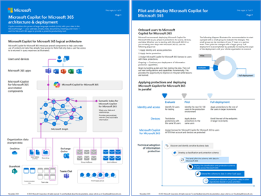

# Apply principles of Zero Trust to Microsoft 365 Copilot

**Summary:** To apply Zero Trust principles to Microsoft 365 Copilot, you need to apply seven layers of protection in your Microsoft 365 tenant:

1. Data protection
2. Identity and access
3. App protection
4. Device management and protection
5. Threat protection
6. Secure collaboration with Teams
7. User permissions to data

## Introduction

Before you introduce Microsoft 365 Copilot (Copilot) into your environment, Microsoft recommends that you build a strong foundation of security. Fortunately, guidance for a strong security foundation exists in the form of [Zero Trust](../zero-trust-overview.md). The Zero Trust security strategy treats each connection and resource request as though it originated from an uncontrolled network and a bad actor. Regardless of where the request originates or what resource it accesses, Zero Trust teaches us to "never trust, always verify."

This article provides steps to apply the [principles of Zero Trust](../zero-trust-overview.md) security to prepare your environment for Copilot in the following ways:

| Zero Trust principle | Definition | Met by |
| --- | --- | --- |
| Verify explicitly | Always authenticate and authorize based on all available data points. | Enforce the validation of user credentials, device requirements, and app permissions and behaviors. |
| Use least privileged access |  Limit user access with Just-In-Time and Just-Enough-Access (JIT/JEA), risk-based adaptive policies, and data protection. | Validate JEA across your organization to eliminate oversharing by ensuring that correct permissions are assigned to files, folders, Teams, and email. Use sensitivity labels and data loss prevention policies to protect data.  |
| Assume breach | Minimize blast radius and segment access. Verify end-to-end encryption and use analytics to get visibility, drive threat detection, and improve defenses. | Use Exchange Online Protection (EOP) and Microsoft Defender XDR services to automatically prevent common attacks and to detect and respond to security incidents. |

For the basics of Copilot, see the [overview](/microsoft-365-copilot/microsoft-365-copilot-overview) and [how to get started](/microsoft-365-copilot/microsoft-365-copilot-setup).

## Logical architecture

You apply Zero Trust principles for Copilot across the entire architecture, from users and devices to the application data that they have access to. The following diagram shows the logical architecture components.

:::image type="content" source="../media/copilot/m365-copilot-tenant-architecture.svg" alt-text="Diagram of the logical architecture for Copilot." lightbox="../media/copilot/m365-copilot-tenant-architecture.svg":::

In the diagram:

- User devices have Microsoft 365 apps installed from which users can initiate Copilot prompts
- Copilot components include:
  - The Copilot service, which orchestrates the responses to user prompts
  - The Large Language Model (LLM) that Copilot references to produce the best response for a user
  - An instance of the Microsoft Graph for the data of your Microsoft 365 tenant
- Your Microsoft 365 tenant that contains your organization data
- Copilot results for a user contain only data that the user is allowed to access

For additional technical illustrations, see the following articles in the Microsoft 365 Copilot library:
- [Microsoft 365 Copilot architecture and how it works](/microsoft-365-copilot/microsoft-365-copilot-architecture)
- [Microsoft 365 Copilot data protection and auditing architecture](/microsoft-365-copilot/microsoft-365-copilot-architecture-data-protection-auditing)

## What’s in this article

This article walks you through the steps to apply the principles of Zero Trust to prepare your Microsoft 365 environment for Copilot.

| Step | Task | Zero Trust principle(s) applied |
| --- | --- | --- |
| 1 | Deploy or validate your data protection and get started with compliance tools | Verify explicitly   Use least privileged access |
| 2 | Deploy or validate your identity and access policies | Verify explicitly   Use least privileged access |
| 3 | Deploy or validate your App Protection policies | Use least privileged access   Assume breach |
| 4 | Deploy or validate device management and protection | Verify explicitly |
| 5 | Deploy or validate your threat protection services |  Assume breach |
| 6 | Deploy or validate secure collaboration with Teams | Verify explicitly   Use least privileged access |
| 7 | Deploy or validate user permissions to data | Use least privileged access |

#### Getting started with E3 and next steps with E5
To help you make progress, each of the steps in this article is organized in the following way:
- Get started with E3 capabilities
- Next steps with E5 capabilities

#### Adapting this guidance for your organization

Because different organizations can be at various stages of deploying Zero Trust protections, in each of these steps:

- If you're NOT using any of the protections described in the step, take the time to pilot and deploy them before assigning Copilot licenses.
- If you're using some of the protections described in the step, use the information in the step as a checklist and verify that each protection stated has been piloted and deployed before assigning Copilot licenses.

For the latest Copilot support for security-related and other features of Microsoft 365, see [Copilot requirements](/microsoft-365-copilot/microsoft-365-copilot-requirements).

## Step 1. Deploy or validate your data protection and get started with compliance tools

To prevent your organization’s data from being at risk of overexposure or oversharing, the next step is to protect the data in your Microsoft 365 tenant. Microsoft Purview includes a robust set of capabilities for discovering, classifying, labeling, and protecting data. However, we understand that it can take a while to do this work. Microsoft 365 includes controls you can use immediately to help you prevent oversharing data through Copilot. Microsoft 365 also includes capabilities to help you meet compliance obligations.

### Apply oversharing controls

Microsoft 365 oversharing controls help you:
- Temporarily limit Copilot search to a list of sites you specify (Restricted SharePoint Search)
- Quickly identify sites that potentially contain overshared data or sensitive content (data access governance reports)
- Flag sites so that users can't find them through Copilot or Org-wide search (Restricted Content Discovery)

To get started with oversharing controls, use the following resources:
- [Illustration and description of oversharing controls you can use with Microsoft 365 Copilot](/microsoft-365-copilot/microsoft-365-copilot-architecture-data-protection-auditing#oversharing-controls-you-can-use-with-microsoft-365-copilot)
- [Downloadable blueprint to prevent oversharing](/microsoft-365-copilot/microsoft-365-copilot-blueprint-oversharing)

### Implement Microsoft Purview capabilities starting with DSPM for AI

Use Microsoft Purview to mitigate and manage the risks associated with AI usage, and implement corresponding protection and governance controls.

Microsoft Purview Data Security Posture Management (DSPM) for AI provides easy-to-use graphical tools and reports to quickly gain insights into AI use within your organization. One-click policies help you protect your data and comply with regulatory requirements.

Use DSPM AI to quickly protect sensitive data that interacts with Copilot. Review recommendations regularly, especially each time you add new users. DSPM for AI helps you:

- Fix oversharing issues identified through your default data risk assessment
- Create a default set of sensitivity labels
- Create data loss prevention (DLP) policies
- Detect risky interactions
- Get guided assistance to AI regulations with Compliance Manager
- Secure interactions for Microsoft Copilot experiences
- Detect sensitive data shared with AI via network using Secure Access Service Edge or Security Service Edge integration

### Start using Purview Compliance capabilities

Microsoft Purview provides capabilities to help you stay on top of compliance obligations, including new AI regulations and standards. Get started with Microsoft Purview Compliance Manager and use additional capabilities, as needed:

- Microsoft Purview **Compliance Manager** is a solution that helps you automatically assess and manage compliance across the regulations that apply to your organization.
- Purview **Communication Compliance** helps minimize communication risks by helping you detect, capture, and act on potentially inappropriate messages in your organization.
- Purview **Data Lifecycle Management** helps you retain the content that you need to keep, and delete the content that you don't.
- Use **eDiscovery** together with **audit logs** for Microsoft 365 Copilot for investigations, as needed. 

For more information, use these resources:
- [Illustrations for data protection and auditing with Microsoft 365 Copilot](/microsoft-365-copilot/microsoft-365-copilot-architecture-data-protection-auditing)
- [Microsoft Purview data security and compliance protections for Microsoft Copilot](/purview/ai-microsoft-purview) 
- [Considerations for DSPM for AI to manage data security and compliance protections for AI interactions](/purview/ai-microsoft-purview-considerations).
- [Govern AI apps and data for regulatory compliance](/security/security-for-ai/govern.md)

### Getting started with E3

First, apply oversharing controls that work with Copilot, as appropriate for your environment. These controls help you protect data immediately. After doing the longer-term work of classifying data and applying sensitivity labels and protection, be sure to revisit the oversharing controls you applied initially to ensure these are still appropriate. Review the [oversharing illustration](/microsoft-365-copilot/microsoft-365-copilot-architecture-data-protection-auditing#oversharing-controls-you-can-use-with-microsoft-365-copilot) and 
[download the blueprint to prevent oversharing](/microsoft-365-copilot/microsoft-365-copilot-blueprint-oversharing).

Next, invest in data classification and protection with Microsoft Purview capabilities.

[Sensitivity labels](/purview/sensitivity-labels) form the cornerstone of protecting your data. Before you create the labels to denote the sensitivity of items and the protection actions that are applied, you must understand your organization’s existing classification taxonomy and how it maps to labels that users see and apply in apps. After creating the sensitivity labels, publish them, and provide guidance to users how and when to apply them in Word, Excel, PowerPoint, and Outlook. 

For more information, see:

- [Get started with sensitivity labels](/purview/get-started-with-sensitivity-labels)
- [Create and configure sensitivity labels and their policies](/purview/create-sensitivity-labels)
- [Enable sensitivity labels for Office files in SharePoint and OneDrive](/purview/sensitivity-labels-sharepoint-onedrive-files)

Consider augmenting manual labeling by using the sensitivity label policy settings of a default label and mandatory labeling. A default label helps to set a base level of protection settings that you want applied to all your content. Mandatory labeling ensures users label documents and emails. However, without comprehensive user training and other controls, these settings can result in inaccurate labeling.

See these additional resources to protect your organization’s data:

- [Create DLP policies](/purview/dlp-learn-about-dlp) for files and email.
- [Create retention policies](/purview/create-retention-policies) to keep what you need and delete what you don’t.
- [Use content explorer](/purview/data-classification-content-explorer) to see and verify items that have a sensitivity label, a retention label, or were classified as a sensitive information type in your organization.

### Next Steps with E5

With Microsoft 365 E5, you can expand sensitivity labeling to protecting more content and more labeling methods. For example, labeling SharePoint sites and Teams by using container labels, and automatically labeling items in Microsoft 365 and beyond. For more information, see a list of [common labeling scenarios](/purview/get-started-with-sensitivity-labels#common-scenarios-for-sensitivity-labels) and how they align to business goals.

Consider these additional Microsoft 365 E5 capabilities:

- Extend your data loss prevention policies to more locations and use a greater range of classifiers to find sensitive information. 
- [Retention labels can be automatically applied](/purview/apply-retention-labels-automatically) when sensitive information is found that needs different settings from your retention policies, or a higher level of management.
- To help you better understand your sensitive data and how it’s being labeled, use [activity explorer](/purview/data-classification-activity-explorer) and the full capabilities of content explorer. 

## Step 2. Deploy or validate your identity and access policies

To prevent bad actors from using Copilot to more quickly discover and access sensitive data, the first step is to prevent them from gaining access. You must ensure that:

- Users are required to use strong authentication that can't be compromised by guessing user passwords alone.
- Authentication attempts are evaluated for their risk and have more requirements imposed.
- You can perform reviews of access granted to user accounts to prevent oversharing.

### Getting started with E3

Microsoft 365 E3 includes Microsoft Entra ID P1 licenses. With this plan, Microsoft recommends using [common Conditional Access policies](/entra/identity/conditional-access/concept-conditional-access-policy-common?tabs=secure-foundation), which are the following:

- [Require multifactor authentication (MFA) for administrators](/entra/identity/conditional-access/howto-conditional-access-policy-admin-mfa)
- [Require MFA for all users](/entra/identity/conditional-access/howto-conditional-access-policy-all-users-mfa)
- [Block legacy authentication](/entra/identity/conditional-access/howto-conditional-access-policy-block-legacy)

Ensure that you include Microsoft 365 Services and your other SaaS apps in the scope of these policies. 

If your environment includes hybrid identities with on-premises Active Directory Domain Services, be sure to deploy [Microsoft Entra Password Protection](/entra/identity/authentication/concept-password-ban-bad-on-premises). This capability detects and blocks known weak passwords and their variants and can also block more weak terms within passwords that are specific to your organization. 

### Next steps with E5

Microsoft 365 E5 includes Microsoft Entra ID P2 licenses. Begin implementing Microsoft's [recommended set of Conditional Access and related policies](/microsoft-365/security/office-365-security/identity-access-policies), including:

- Requiring MFA when sign-in risk is medium or high.
- Requiring that high risk users change their password (applicable when you aren't using passwordless authentication).

For more information about implementing protection for identity and access based on your licensing plan, see [Increase sign-in security for hybrid workers with MFA](/microsoft-365/solutions/empower-people-to-work-remotely-secure-sign-in).

Microsoft 365 E5 and Microsoft Entra ID P2 both include more protection for privileged accounts. Implement the capabilities summarized in the following table.

| Capability | Resources |
| --- | --- |
| Privileged Identity Management (PIM) | Provides protections for privileged accounts that access resources, including resources in Microsoft Entra ID, Azure, and other Microsoft Online Services such as Microsoft 365 or Microsoft Intune. See [Plan a Privileged Identity Management deployment](/entra/id-governance/privileged-identity-management/pim-deployment-plan). |
| Microsoft Purview Privileged Access Management | Allows granular access control over privileged Exchange Online admin tasks in Office 365. It can help protect your organization from breaches that use existing privileged admin accounts with standing access to sensitive data or access to critical configuration settings. See [Privileged access management overview](/purview/privileged-access-management-solution-overview). |

Finally, consider implementing [access reviews](/entra/id-governance/access-reviews-overview) as part of your overall JEA strategy. Access reviews enable your organization to efficiently manage group memberships, access to enterprise applications, and role assignments. User's access can be reviewed regularly to make sure only the right people have the appropriate continued access.

## Step 3. Deploy or validate your App Protection policies 

For both Microsoft 365 E3 and E5, use [Intune App Protection policies (APP)](/mem/intune/apps/app-protection-policy), which are rules that ensure an organization's data remains safe or contained within a managed app.

With APP, Intune creates a wall between your organization data and personal data. APP ensures that organization data in specified apps can't be copied and pasted to other apps on the device, even if the device isn't managed.

APP can prevent the inadvertent or intentional copying of Copilot-generated content to apps on a device that aren't included in the list of permitted apps. APP can limit the blast radius of an attacker using a compromised device.

For more information, see [Create App Protection policies](/mem/intune/apps/app-protection-policies).

## Step 4. Deploy or validate your device management and protection

To prevent bad actors from compromising devices or using compromised devices to gain access to Copilot, the next step is to use Microsoft 365 features of device management and protection. You must ensure that:

- Devices are enrolled in Microsoft Intune and must meet health and compliance requirements.
- You can administer settings and features on devices.
- You can monitor your devices for their level of risk.
- You can proactively prevent data loss.

### Getting started with E3

Microsoft 365 E3 includes Microsoft Intune for managing devices. 

Next, begin to enroll devices into management. Once enrolled, set up compliance policies and then require healthy and compliant devices. Finally, you can deploy device profiles, also known as configuration profiles, to manage settings and features on devices. 

To deploy these protections, use the following set of articles.

- [Step 1. Implement App Protection policies](/microsoft-365/solutions/manage-devices-with-intune-app-protection)
- [Step 2. Enroll devices into management](/microsoft-365/solutions/manage-devices-with-intune-enroll)
- [Step 3. Set up compliance policies](/microsoft-365/solutions/manage-devices-with-intune-compliance-policies)
- [Step 4. Require healthy and compliant devices](/microsoft-365/solutions/manage-devices-with-intune-require-compliance)
- [Step 5. Deploy device profiles](/microsoft-365/solutions/manage-devices-with-intune-configuration-profiles)

### Next steps with E5

Microsoft 365 E5 also includes Microsoft Defender for Endpoint. After deploying Microsoft Defender for Endpoint, you can gain greater insights and protection of your devices by integrating Microsoft Intune with Defender for Endpoint. For mobile devices, this includes the ability to monitor device risk as a condition for access. For Windows devices, you can monitor compliance of these devices to security baselines.

Microsoft 365 E5 also includes endpoint data loss prevention (DLP). If your organization already understands your data, has developed a data sensitivity schema, and applied the schema, you might be ready to extend elements of this schema to endpoints by using Microsoft Purview DLP policies.

To deploy these device protection and management capabilities, use the following articles:

- [Step 6. Monitor device risk and compliance to security baselines](/microsoft-365/solutions/manage-devices-with-intune-monitor-risk)
- [Step 7. Implement DLP with information protection capabilities](/microsoft-365/solutions/manage-devices-with-intune-dlp-mip)

## Step 5. Deploy or validate your threat protection services

To detect the activities of bad actors and keep them from gaining access to Copilot, the next step is to use threat protection services of Microsoft 365. You must ensure that:

- You can automatically prevent common types of email and device-based attacks.
- You can use features to reduce the attack surface area of Windows devices.
- You can detect and respond to security incidents with a comprehensive suite of threat protection services.

### Getting started with E3

Microsoft 365 E3 includes several key capabilities in Defender for Office 365 and Defender for Endpoint. Additionally, Windows 11 and Windows 10 include many threat protection capabilities.

#### Microsoft Defender for Office 365 P1

Microsoft Defender for Office 365 P1 includes Exchange Online Protection (EOP), which are included in Microsoft 365 E3. EOP helps protect your email and collaboration tools from phishing, impersonation, and other threats. Use these resources to configure anti-malware, anti-spam, and anti-phishing protection:

- [EOP overview ](/microsoft-365/security/office-365-security/eop-about)
- [Preset security policies ](/microsoft-365/security/office-365-security/preset-security-policies)

#### Defender for Endpoint P1

Microsoft 365 E3 includes Microsoft Defender for Endpoint P1, which includes the following capabilities:

- [Next-generation protection](/microsoft-365/security/defender-endpoint/next-generation-protection) – Helps protect your devices from emerging threats in real-time. This capability includes Microsoft Defender Antivirus, which continually scans your device using file and process behavior monitoring. 
- [Attack surface reduction](/microsoft-365/security/defender-endpoint/overview-attack-surface-reduction) – Prevents attacks from happening in the first place by configuring settings that automatically block potentially suspicious activity. 

Use these resources to configure Defender for Endpoint Plan 1:

- [Overview of Microsoft Defender for Endpoint Plan 1](/microsoft-365/security/defender-endpoint/defender-endpoint-plan-1)
- [Set up and configure](/microsoft-365/security/defender-endpoint/mde-p1-setup-configuration)
- [Get started](/microsoft-365/security/defender-endpoint/mde-plan1-getting-started)

#### Windows protection capabilities

By default, Windows includes strong security and protections across hardware, operating system, apps, and more. See [Introduction to Windows security](/windows/security/introduction) to learn more. The following table lists the important Windows client threat protection capabilities included with Microsoft 365 E3. 

| Capability | Resources |
| --- | --- |
| Windows Hello	| [Windows Hello for Business Overview](/windows/security/identity-protection/hello-for-business/) |
| Microsoft Defender Firewall | [Windows Defender Firewall documentation](/windows/security/operating-system-security/network-security/windows-firewall/windows-firewall-with-advanced-security) |
| Microsoft Defender SmartScreen | [Microsoft Defender SmartScreen overview](/windows/security/operating-system-security/virus-and-threat-protection/microsoft-defender-smartscreen/) |
| Application Control for Windows | [Application Control for Windows](/windows/security/application-security/application-control/windows-defender-application-control/wdac) |
| BitLocker | [Overview of BitLocker device encryption](/windows/security/operating-system-security/data-protection/bitlocker/bitlocker-device-encryption-overview-windows-10) |
| Microsoft Defender Application Guard for Edge | [Microsoft Defender Application Guard overview](/windows/security/application-security/application-isolation/microsoft-defender-application-guard/md-app-guard-overview) |

These capabilities can be configured directly on the client, by using Group Policy Objects (GPOs), or by using a device management tool, including Intune. However, you can manage settings on devices in Intune only by deploying [configuration profiles](/microsoft-365/solutions/manage-devices-with-intune-configuration-profiles), which is a feature of Microsoft 365 E5.

### Next steps with E5

For more comprehensive threat protection, pilot and deploy Microsoft Defender XDR, which includes:

- Defender for Identity
- Defender for Office 365 P2
- Defender for Endpoint P2
- Defender for Cloud Apps

Microsoft recommends enabling the components of Microsoft 365 in the order illustrated:

:::image type="content" source="../media/copilot/defender-xdr-pilot-deploy-flow.svg" alt-text="Diagram of the process to evaluate and deploy Microsoft Defender XDR components." lightbox="../media/copilot/defender-xdr-pilot-deploy-flow.svg":::
 
For more information and a description of this illustration, see [Evaluate and pilot Microsoft Defender XDR](/microsoft-365/security/defender/eval-overview#the-evaluation-process-for-microsoft-365-defender-cyber-security).

After deploying Microsoft Defender XDR, integrate these eXtended detection and response (XDR) tools with Microsoft Sentinel. Microsoft Sentinel is licensed and billed separately from Microsoft 365 E5. Use these resources for more information:

- [Implement Microsoft Sentinel and Microsoft Defender XDR for Zero Trust](/security/operations/siem-xdr-overview)
- [Plan costs and understanding Microsoft Sentinel pricing and billing](/azure/sentinel/billing?tabs=simplified%2Ccommitment-tiers)

## Step 6. Deploy or validate secure collaboration for Microsoft Teams

Microsoft provides guidance for protecting your Teams at three different levels – baseline, sensitive, and highly sensitive. Introducing Copilot is a good time to review your environment and ensure that appropriate protection is configured. Use these steps:

1. Identify Teams or projects that warrant highly sensitive protection. Configure protections for this level. Many organizations don’t have data that requires this level of protection.
2. Identify Teams or projects that warrant sensitive protection and apply this protection.
3. Ensure that all Teams and projects are configured for baseline protection, at a minimum.

See these resources for more information:

- [Compare levels of protection](/microsoft-365/solutions/setup-secure-collaboration-with-teams#securing-teams-for-sensitive-and-highly-sensitive-data)
- [Configure Teams with three tiers of protection](/microsoft-365/solutions/setup-secure-collaboration-with-teams)

### External sharing

Introducing Copilot is a good time to review your policies for sharing files with people outside your organization and for allowing external contributors. Guest accounts aren't licensed to use Copilot.

For sharing with people outside your organization, you might need to share information of any sensitivity. See these resources:

- [Apply best practices for sharing files and folders with unauthenticated users](/microsoft-365/solutions/best-practices-anonymous-sharing)
- [Limit accidental exposure to files when sharing with people outside your organization](/microsoft-365/solutions/share-limit-accidental-exposure)
- [Create a secure guest sharing environment](/microsoft-365/solutions/create-secure-guest-sharing-environment)

For collaborating with people outside your organization, see these resources:

- [Collaborate on documents](/microsoft-365/solutions/collaborate-on-documents) to share individual files or folders
- [Collaborate on a site](/microsoft-365/solutions/collaborate-in-site) for guests in a SharePoint site
- [Collaborate as a team](/microsoft-365/solutions/collaborate-as-team) for guests in a team
- [Collaborate with external participants in a channel](/microsoft-365/solutions/collaborate-teams-direct-connect) for people outside the organization in a shared channel

## Step 7. Deploy or validate minimum user permissions to data

To prevent your organization’s data from being at risk of overexposure or oversharing, the next step is to ensure that all users have Just Enough Access (JEA) to perform their jobs and no more. Users shouldn't discover data they aren't supposed to be able to view or share data that they shouldn't be sharing. 

To prevent oversharing, implement permissions requirements and organizational policies that all users must follow and train your users to use them. For example, put controls in place, like requiring site access reviews by site owners or restricting access to defined security groups from one central place.

To detect existing oversharing:

- At the file level 

  Use [Microsoft Purview's Information Protection](https://www.microsoft.com/security/business/information-protection/microsoft-purview-information-protection) and its data classification controls, integrated content labeling, and corresponding data loss prevention policies. 

  These features can help you identify files in Microsoft Teams, SharePoint sites, OneDrive locations, within email, in chat conversations, in your on-premises infrastructure, and on endpoint devices either containing sensitive information or classified content, then automatically apply controls to limit their access.

- At the site team and container level within Microsoft Teams and SharePoint

  You can audit access to shared content at the site and team level and enforce restrictions that limits information discovery to only those who should have access.

  To help automate this process even more, [Microsoft Syntex – SharePoint Advanced Management](/sharepoint/advanced-management) helps you find potential oversharing with your SharePoint and Microsoft Teams files.

## Applying protections and deploying Copilot in parallel

To streamline the assignment of Copilot licenses in your tenant with the appropriate protections in place, you do both in parallel. The following diagram shows how you can move through the phases of rolling out protections prior to assigning Copilot licenses to individual user accounts and their devices once they're protected.

:::image type="content" source="../media/copilot/parallel-deployment-for-microsoft-365-copilot.svg" alt-text="Diagram of applying protections and deploying Copilot in parallel." lightbox="../media/copilot/parallel-deployment-for-microsoft-365-copilot.svg":::

As the diagram also shows, you can extend data protection across your organization as you increase the size of your deployment by continuing to use DSPM for AI and using the recommendations. 

For compliance, you can get started right away with Compliance Manager and implement additional capabilities as you go, as needed.

## Training 

### Get started with Copilot

|Training  |[Get started with Copilot](/training/paths/get-started-with-microsoft-365-copilot/)|
|---------|---------|
|:::image type="icon" source="../media/generic-trophy.svg" border="false"::: | This learning path walks you through the basics of Copilot, showcases its versatility across various Microsoft 365 applications, and offers advice on maximizing its potential. |
> [!div class="nextstepaction"]
> [Start >](/training/paths/get-started-with-microsoft-365-copilot/)

|Training  |[Prepare your organization for Copilot](/training/paths/prepare-your-organization-microsoft-365-copilot/)|
|---------|---------|
|:::image type="icon" source="../media/generic-trophy.svg" border="false"::: | This learning path examines the Copilot design, its security and compliance features, and provides instruction on how to implement Copilot. |
> [!div class="nextstepaction"]
> [Start >](/training/paths/prepare-your-organization-microsoft-365-copilot/)

## Next steps

Watch the [How to get ready for Copilot](https://www.youtube.com/watch?v=oeX0lsMA69U&t=2s) video.

See these additional articles for Zero Trust and Microsoft's Copilots:

- [Overview](apply-zero-trust-copilots-overview.md)
- [Microsoft Copilot](zero-trust-microsoft-copilot.md)
- [Microsoft Copilot for Security](zero-trust-microsoft-copilot-for-security.md)

Also see:

- [Microsoft Purview data security and compliance protections for Microsoft Copilot](/purview/ai-microsoft-purview)
- [Data, Privacy, and Security for Copilot for Microsoft 365](/microsoft-365-copilot/microsoft-365-copilot-privacy)
- [Copilot for Microsoft 365 documentation](/microsoft-365-copilot/)

## Summary poster

For a visual summary of the information in this article, see the **Copilot architecture & deployment** poster. 

[PDF](https://download.microsoft.com/download/c/d/6/cd6c6858-f87b-4dc5-a593-e87db0aa6029/microsoft-365-copilot-architecture.pdf) | [Visio](https://download.microsoft.com/download/c/d/6/cd6c6858-f87b-4dc5-a593-e87db0aa6029/microsoft-365-copilot-architecture.vsdx)

Use the Visio file to customize these illustrations for your own use.

For more Zero Trust technical illustrations, see [Zero Trust illustrations for IT architects and implementers](../zero-trust-tech-illus.md).

## References

Refer to these links to learn about the various services and technologies mentioned in this article.

- [Copilot for Microsoft 365 overview](/microsoft-365-copilot/microsoft-365-copilot-overview)
- [Common security policies for Microsoft 365 organizations](/microsoft-365/security/office-365-security/zero-trust-identity-device-access-policies-common)
- [Intune App Protection policies (APP)](/mem/intune/apps/app-protection-policy)
- [Manage devices with Intune](/microsoft-365/solutions/manage-devices-with-intune-overview)
- [EOP overview](/microsoft-365/security/office-365-security/eop-about)
- [Introduction to Windows security](/windows/security/introduction)
- [Evaluate and pilot Microsoft Defender XDR](/microsoft-365/security/defender/eval-overview#the-evaluation-process-for-microsoft-365-defender-cyber-security)
- [Get started with sensitivity labels](/purview/get-started-with-sensitivity-labels)
- [Create DLP policies](/purview/dlp-learn-about-dlp)
- [Configure Teams with three tiers of protection](/microsoft-365/solutions/setup-secure-collaboration-with-teams)
- [Microsoft Syntex – SharePoint Advanced Management](/sharepoint/advanced-management)
