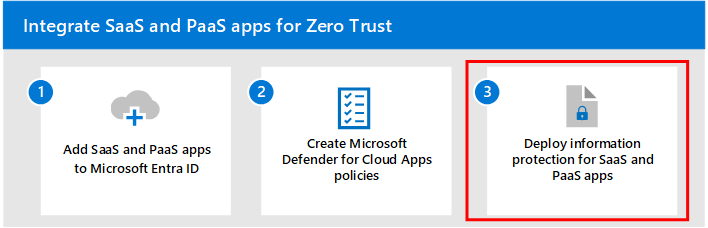

# Step 2: Create Defender for Cloud Apps policies

SaaS apps play a key role in ensuring that your applications and resources are available and accessible from any device with an Internet connection. However, some apps can pose a security risk with the potential to cause significant damage to your organization if not discovered and managed. You must have visibility into the apps that are being used in your organization so that you can protect your sensitive data and resources.

Microsoft Defender for Cloud Apps keeps you in control through comprehensive visibility, auditing, and granular controls over your sensitive data. Defender for Cloud Apps has tools that help uncover shadow IT and assess risk while enabling you to enforce policies and investigate app activities. It helps you control access in real time and stop threats so your organization can more safely move to the cloud.

This article provides guidance on how to:

- Discover cloud apps
- Sanction cloud apps
- Configure Conditional Access App Control
- Use app connectors
- Apply session controls

If you haven't already set up Defender for Cloud Apps, see [Evaluate Microsoft Defender for Cloud Apps](/microsoft-365/security/defender/eval-defender-mcas-overview).

## Discover cloud apps

Without visibility into the apps being used in your organization, you will not be able to properly manage and control how users use the apps and how the apps access sensitive data and resources.  

Defender for Cloud Apps has a capability called Cloud Discovery that analyzes your traffic logs against the Microsoft Defender for Cloud Apps catalog of over 31,000 cloud apps. The apps are ranked and scored based on more than 90 risk factors and provide you with ongoing visibility into cloud app use, Shadow IT, and the risk posed by unknown and unmanaged apps.

The following diagram shows the components of cloud app discovery and the two methods used to monitor network traffic and discover cloud apps that are being used in your organization

:::image type="content" source="./media/cloud-app-discovery-architecture.svg" alt-text="Diagram of the components of cloud app discovery for cloud app traffic that goes through Defender for Endpoint or on-premises firewalls or proxies." lightbox="./media/cloud-app-discovery-architecture.svg":::

In this diagram:

- **Method 1:** Cloud App Discovery integrates with Microsoft Defender for Endpoint, which reports cloud apps and services being accessed from IT-managed Windows 10 and Windows 11 devices. 
- **Method 2:** For coverage on all devices connected to a network, a Defender for Cloud Apps log collector installed on firewalls and proxies collect and send data from endpoints to Defender for Cloud Apps for analysis.

Use the following guidance to leverage the built-in capabilities in Defender for Cloud Apps to discover apps in your organization:

- [Set up Cloud Discovery](/defender-cloud-apps/set-up-cloud-discovery)
- [Discover and identify Shadow IT](/defender-cloud-apps/tutorial-shadow-it#phase-1-discover-and-identify-shadow-it)

## Sanction your apps

After you've reviewed the list of discovered apps in your environment, you can secure your environment by approving safe apps (Sanctioned) or prohibiting unwanted apps (Unsanctioned).

For more information, see [Sanctioning/unsanctioning an app](/defender-cloud-apps/governance-discovery#sanctioningunsanctioning-an-app).

## Configure Conditional Access App Control to protect apps

Conditional Access policies allow you to assign controls and requirements to specific applications, actions, or authentication conditions. You have the ability to define which users or user groups can access your cloud apps, which cloud apps they can access, and from which locations and networks a user must originate their access. See [Step 1](add-saas-apps.md) of this solution for additional information.

In conjunction with Conditional Access policies, you can further increase the security of your cloud apps by applying access and session controls using Conditional Access App Control. With the Conditional Access App Control capability in Defender for Cloud Apps, user app access and sessions are monitored and controlled in real time based on access and session policies. Access and session policies configured with the Defender for Cloud Apps portal allow you to further refine filters and set actions that users can perform.

Microsoft Defender for Cloud Apps natively integrates with Microsoft Entra. When you configure a policy in Microsoft Entra to use Conditional Access App Control, cloud app traffic is routed through Defender for Cloud Apps as a proxy, which allows Defender for Cloud Apps to monitor this traffic and to apply session controls.

The following diagram shows how cloud app traffic gets routed through Microsoft Entra and Defender for Cloud Apps.

:::image type="content" source="media/conditional-access-app-control-architecture.svg" alt-text="Diagram showing how cloud app traffic travels through Microsoft Entra and Defender for Cloud Apps when Conditional Access App Control policies are configured." lightbox="media/conditional-access-app-control-architecture.svg":::

In this diagram:

- Microsoft Entra has a Conditional Access App Control policy for the traffic the specified and integrated SaaS apps. Microsoft Entra ID then directs (proxies) the session traffic through Defender for Cloud Apps.
- Defender for Cloud Apps monitors this traffic and applies session control policies.

Conditional Access dictates the requirements that must be fulfilled before a user can access an app. Conditional Access App Control dictates what apps a user can access and the set of actions that a user can take during a session **after** they've been granted access. 

For more information, see:

- [Protect apps with Microsoft Defender for Cloud Apps Conditional Access App Control](/defender-cloud-apps/proxy-intro-aad)
- [Integrating Microsoft Entra ID with Conditional Access App Control](/microsoft-365/security/defender/eval-defender-mcas-architecture#integrating-with-azure-ad-with-conditional-access-app-control)

## Use app connectors

App connectors use the APIs of app providers to enable greater visibility and control by Defender for Cloud Apps over the apps being used in your organization. Depending on the app to which you're connecting, app connections enable the following:

- **Account information** - Visibility into users, accounts, profile information, status (suspended, active, disabled) groups, and privileges.
- **Audit trail** - Visibility into user activities, admin activities, and sign-in activities.
- **Account governance** - Ability to suspend users, revoke passwords, and other abilities.
- **App permissions** - Visibility into issued tokens and their permissions.
- **App permission governance** - Ability to remove tokens.
- **Data scan** - Scanning of unstructured data using two processes -periodically (every 12 hours) and in real-time (triggered each time a change is detected).
- **Data governance** - Ability to quarantine files, including files in trash, and to overwrite files.

For more information, see [Connect apps](/defender-cloud-apps/enable-instant-visibility-protection-and-governance-actions-for-your-apps).

Defender for Cloud Apps provides end-to-end protection for connected apps using cloud-to-cloud integration, [API connectors](/defender-cloud-apps/enable-instant-visibility-protection-and-governance-actions-for-your-apps), and real-time access and session controls that leverage [Conditional app access controls](/defender-cloud-apps/proxy-intro-aad).

## Apply session controls

Session controls allow you to apply parameters to how cloud apps are used by your organization. For example, if your organization is using Salesforce, you can configure a session policy that allows only enrolled and managed devices to access your organization's Salesforce data. A simpler example could be configuring a policy to monitor traffic from unmanaged devices so you can analyze the risk of this traffic before applying stricter policies.

Defender for Cloud Apps documentation includes the following series of tutorials to help you discover risk and protect your environment:

- [Detect suspicious user activity](/cloud-app-security/tutorial-suspicious-activity)
- [Investigate risky users](/cloud-app-security/tutorial-ueba)
- [Investigate risky OAuth apps](/cloud-app-security/investigate-risky-oauth)
- [Discover and protect sensitive information](/cloud-app-security/tutorial-dlp)
- [Protect any app in your organization in real time](/cloud-app-security/tutorial-proxy)
- [Block downloads of sensitive information](/cloud-app-security/use-case-proxy-block-session-aad)
- [Protect your files with admin quarantine](/cloud-app-security/use-case-admin-quarantine)
- [Require step-up authentication upon risky action](/cloud-app-security/tutorial-step-up-authentication)

## Next step

Continue with [Step 3](deploy-information-protection-saas.md) to deploy information protection for SaaS apps.
