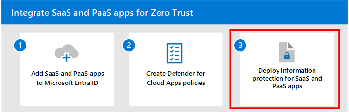

# Step 2: Create Defender for Cloud App policies

SaaS apps play a key role in ensuring that your applications and resources are available and accessible from any device with an Internet connection. Many employees use apps to tackle tasks more efficiently. However, some of these apps can be unwanted (unsanctioned) and can post a security risk to cause significant damage to your organization when not discovered and managed properly. You must have visibility into the apps that are being used in your organization so that you can properly manage and protect important resources.

Microsoft Defender for Cloud Apps keeps you in control through comprehensive visibility, auditing, and granular controls over your sensitive data.

Defender for Cloud Apps has tools that help uncover shadow IT and assess risk while enabling you to enforce policies and investigate activities. It helps you control access in real time and stop threats so your organization can more safely move to the cloud.

This article provides guidance on how to:

- Discover cloud apps
- Sanction cloud apps
- Configure Conditional Access App Control
- Use app connectors
- Apply session controls

If you haven't already set up Defender for Cloud Apps, see [Evaluate Microsoft Defender for Cloud Apps](/microsoft-365/security/defender/eval-defender-mcas-overview).

## Discover cloud apps

Without visibility into the apps being used in your organization, you will not be able to properly manage and control how users use and access important resources with them.  

Defender for Cloud Apps has a capability called Cloud Discovery that analyzes your traffic logs against the Microsoft Defender for Cloud Apps catalog of over 31,000 cloud apps. The apps are ranked and scored based on more than 90 risk factors and provide you with ongoing visibility into cloud use, Shadow IT, and the risk Shadow IT poses to your organization. 

The following diagram shows the components of cloud app discovery and two methods used to monitor network traffic and discover cloud apps that are being used by your organization

:::image type="content" source="./media/m365-defender-mcas-architecture-b.svg" alt-text="Image of Microsoft Defender XDR and cloud apps" lightbox="./media/m365-defender-mcas-architecture-b.svg":::

In this diagram:

- **Method 1:** Cloud App Discovery integrates with Microsoft Defender for Endpoint natively. Defender for Endpoint reports cloud apps and services being accessed from IT-managed Windows 10 and Windows 11 devices. 
- **Method 2:** For coverage on all devices connected to a network, the Defender for Cloud Apps log collector installed on firewalls and other proxies collect and sent data from endpoints to Defender for Cloud Apps for analysis.

Use the following guidance to leverage the built-in capabilities in Defender for Cloud Apps to discover apps in your organization:

- [Set up Cloud Discovery](/defender-cloud-apps/set-up-cloud-discovery)
- [Discover and identify Shadow IT](/defender-cloud-apps/tutorial-shadow-it#phase-1-discover-and-identify-shadow-it)

## Sanction your apps

After you've reviewed the list of discovered apps in your environment, you can secure your environment by approving safe apps (Sanctioned) or prohibiting unwanted apps (Unsanctioned).

For more information, see [Sanctioning/unsanctioning an app](/defender-cloud-apps/governance-discovery#BKMK_SanctionApp).

## Configure Conditional Access App Control to protect apps

In [Step 1: Add SaaS apps to Microsoft Entra ID and to the scope of policies](add-saas-apps.md), 

Conditional Access policies allow you to assign controls and requirements to specific applications, actions, or authentication context. You have the ability to define which users or user groups can access your cloud apps, which cloud apps users can access, and which locations and networks a user has access. In conjunction with Conditional Access policies, you can further increase the security of cloud apps by applying access and session controls using Conditional Access App Control. Conditional Access App Control enables user app access and sessions to be monitored and controlled in real time based on access and session policies. Access and session policies are used within the Defender for Cloud Apps portal to further refine filters and set actions to be taken on a user.

Microsoft Defender for Cloud Apps natively integrates with Microsoft Entra ID. All you have to do is configure a policy in Microsoft Entra ID to use Conditional Access App Control in Defender for Cloud Apps. This routes network traffic for these managed SaaS apps through Defender for Cloud Apps as a proxy, which allows Defender for Cloud Apps to monitor this traffic and to apply session controls. 

The following diagram shows how Microsoft Defender XDR and on-premises components sends information about cloud apps in use to Defender for Cloud Apps.

:::image type="content" source="media/m365-defender-mcas-architecture-e.svg" alt-text="The architecture for the Microsoft Defender for Cloud Apps - SaaS apps" lightbox="media/m365-defender-mcas-architecture-e.svg":::

In this diagram:

STOP

- SaaS apps are integrated with the Microsoft Entra ID tenant. This integration allows Microsoft Entra ID to enforce Conditional Access policies, including multi-factor authentication.
- A policy is added to Microsoft Entra ID to direct traffic for SaaS apps to Defender for Cloud Apps. The policy specifies which SaaS apps to apply this policy to. Therefore, after Microsoft Entra ID enforces any Conditional Access policies that apply to these SaaS apps, Microsoft Entra ID then directs (proxies) the session traffic through Defender for Cloud Apps.
- Defender for Cloud Apps monitors this traffic and applies any session control policies that have been configured by administrators. 

To summarize, Conditional Access dictates the requirements that must be fulfilled before a user can access apps. Conditional Access App Control dictates what apps a user can access and the set of actions that a user can take during a session **after** they've been granted access. 

Use the following references for more information:
-  [Protect apps with Microsoft Defender for Cloud Apps Conditional Access App Control](/defender-cloud-apps/proxy-intro-aad)
- [Integrating Microsoft Entra ID with Conditional Access App Control](/microsoft-365/security/defender/eval-defender-mcas-architecture#integrating-with-azure-ad-with-conditional-access-app-control)

## Use app connectors

App connectors use the APIs of app providers to enable greater visibility and control by Microsoft Defender for Cloud Apps over the apps you connect to.

Depending on the app to which you're connecting, API connection enables the following items:

- **Account information** - Visibility into users, accounts, profile information, status (suspended, active, disabled) groups, and privileges.
- **Audit trail** - Visibility into user activities, admin activities, sign-in activities.
- **Account governance** - Ability to suspend users, revoke passwords, etc.
- **App permissions** - Visibility into issued tokens and their permissions.
- **App permission governance** - Ability to remove tokens.
- **Data scan** - Scanning of unstructured data using two processes -periodically (every 12 hours) and in real-time scan (triggered each time a change is detected).
- **Data governance** - Ability to quarantine files, including files in trash, and overwrite files.

For more information, see [Connect apps](/defender-cloud-apps/enable-instant-visibility-protection-and-governance-actions-for-your-apps).

Defender for Cloud Apps provides end-to-end protection for connected apps using Cloud-to-Cloud integration, [API connectors](/defender-cloud-apps/enable-instant-visibility-protection-and-governance-actions-for-your-apps), and real-time access and session controls leveraging our [Conditional App Access Controls](/defender-cloud-apps/proxy-intro-aad).

For more information, see [Protecting connected apps](/defender-cloud-apps/protect-connected-apps).

## Apply session controls

Session controls allow you to apply parameters to how cloud apps are used by your organization. For example, if your organization is using Salesforce, you can configure a session policy that allows only managed devices to access your organization's data at Salesforce. A simpler example could be configuring a policy to monitor traffic from unmanaged devices so you can analyze the risk of this traffic before applying stricter policies.

Microsoft Defender for Cloud Apps documentation includes a series of tutorials to help you discover risk and protect your environment.

Try out Defender for Cloud Apps tutorials:

- [Detect suspicious user activity](/cloud-app-security/tutorial-suspicious-activity)
- [Investigate risky users](/cloud-app-security/tutorial-ueba)
- [Investigate risky OAuth apps](/cloud-app-security/investigate-risky-oauth)
- [Discover and protect sensitive information](/cloud-app-security/tutorial-dlp)
- [Protect any app in your organization in real time](/cloud-app-security/tutorial-proxy)
- [Block downloads of sensitive information](/cloud-app-security/use-case-proxy-block-session-aad)
- [Protect your files with admin quarantine](/cloud-app-security/use-case-admin-quarantine)
- [Require step-up authentication upon risky action](/cloud-app-security/tutorial-step-up-authentication)

## Next step

Continue with [Step 3](deploy-information-protection-saas.md) to deploy information protection for SaaS apps.
