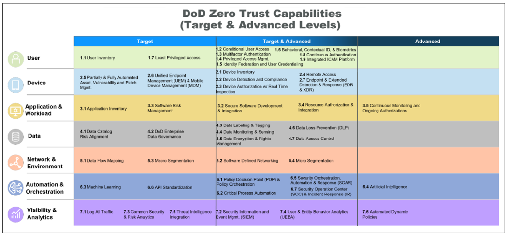

# Configure Microsoft cloud services for the DoD Zero Trust Strategy

The U.S. Department of Defense (DoD) Zero Trust Portfolio Management Office (ZT PfMO) was established to orchestrate DoD-wide Zero Trust adoption and execution. In November 2022, the DoD ZT PfMO released the [DoD Zero Trust Strategy and Roadmap](https://www.defense.gov/News/Releases/Release/Article/3225919/department-of-defense-releases-zero-trust-strategy-and-roadmap/). 

The strategy and accompanying execution plans outline a path to adopt a new cybersecurity framework to facilitate well-informed, risk-based decisions. This model incorporates Zero Trust principles by eliminating traditional perimeters and trust assumptions, enabling a more efficient architecture that enhances security, user experience, and mission performance. The Zero Trust Framework aims to minimize DoD attack surface, reduce risks, enable effective data-sharing and collaboration, proactively safeguard its technical estate, and disrupt adversarial activities.

The strategy has four goals.

* **Zero Trust Cultural Adoption** - A Zero Trust security framework and mindset that guides the design, development, integration, and deployment of information technology across the DoD Zero Trust ecosystem.
* **Department of Defense Information Systems are Secured and Defended** - DoD cybersecurity practices incorporate and operationalize Zero Trust to achieve enterprise resilience in DoD information systems.
* **Technology Acceleration** - Zero Trust technologies deploy at a pace equal to, or that exceeds, industry advancements to remain ahead of the changing threat environment.
* **Zero Trust Enablement** - DoD Zero Trust execution integrates with DoD, and component-level processes, resulting in seamless and coordinated Zero Trust execution.

Microsoft has an expanding array of Zero Trust capabilities powered by a unified identity platform and pre-integrated, fit-for-purpose security tools. They offer repeatable, comprehensive coverage across the seven pillars of the DoD Zero Trust Strategy for target and advanced activities.

## Pillars, capabilities, and activities

The DoD Zero Trust Strategy covers seven pillars representing protection areas for Zero Trust. Use the following links to go to sections of the guide. 

* Introduction
* [User](dod-zero-trust-strategy-user.md)
* [Device](dod-zero-trust-strategy-device.md)
* [Applications and workloads](dod-zero-trust-strategy-apps.md)
* [Data](dod-zero-trust-strategy-data.md)
* [Network](dod-zero-trust-strategy-network.md)
* [Automation and orchestration](dod-zero-trust-strategy-automation.md)
* [Visibility and analytics](dod-zero-trust-strategy-visibility.md)

The pillars span **45 Zero Trust capabilities**. Capabilities are achieved by completing one or more implementation activities. In the following tables, activities are tagged with `Target` or `Advanced`, based on Zero Trust phases defined by the DoD. A capability might include target activities, advanced activities, or both. See, Table 1. There are **152 activities** in total, 92 target and 60 advanced. DoD Zero Trust Capability Execution Roadmap sets a timeline for achieving **Target Level ZT** by 2027 and **Advanced Level ZT by 2032**.

   

Activity details are outlined in the [Zero Trust Capabilities and Activities Execution Roadmap](https://dodcio.defense.gov/Portals/0/Documents/Library/ZTCapabilitiesActivities.pdf). The activities cover a range of technical and nontechnical tasks. Technical tasks deploy, configure, and adopt security tools. Nontechnical tasks procure tools, create policies and standards, and assemble teams to operationalize the Zero Trust strategy.

## Scope of guidance

This document has summary guidance for 45 Zero Trust capabilities and prescriptive guidance for completing 152 Zero Trust activities with Microsoft cloud services. In each table, the **Microsoft guidance and recommendations** column has activity-level guidance based on activity descriptions and outcomes in the context of the activity parent capability. Use the activity-level guidance with capability summaries to learn how Microsoft cloud services align to the DoD Zero Trust Strategy. Guidance is scoped to features generally available (GA) or in public preview in Microsoft 365 DoD cloud and Azure for US Government cloud. 

> [!IMPORTANT]
> When activities have more than one part, Microsoft guidance assumes you implemented the previous parts. For example, if an activity has three parts, finish Pt1, then Pt2, and then Pt3.

This document prioritizes recommendations by product, or feature area, listing the most essential items first. When implementation actions span features in different Microsoft services, these actions are ordered in the required configuration sequence. Activity-level guidance lists all recommendations relevant for each activity. Your organization might complete the activity by doing a portion of the recommended configuration or implementing alternative solutions.

The DoD Zero Trust Strategy assigns activities to target or advanced phases. This guide indicates `Target` and `Adanced` in the activity title. Target-level ZT is achieved by completing all target activities. Advanced-level ZT is achieved by completing all advanced activities. You don't need to finish all target activities before starting advanced activities. Configuring one feature might complete target and advanced activities at the same time. We recommend implementing key protections first, following the [Microsoft Zero Trust Rapid Modernization Plan](/security/zero-trust/zero-trust-ramp-overview).

## Next steps

Configure Microsoft cloud services for the DoD Zero Trust Strategy:

* Introduction
* [User](dod-zero-trust-strategy-user.md)
* [Device](dod-zero-trust-strategy-device.md)
* [Applications and workloads](dod-zero-trust-strategy-apps.md)
* [Data](dod-zero-trust-strategy-data.md)
* [Network](dod-zero-trust-strategy-network.md)
* [Automation and orchestration](dod-zero-trust-strategy-automation.md)
* [Visibility and analytics](dod-zero-trust-strategy-visibility.md)
