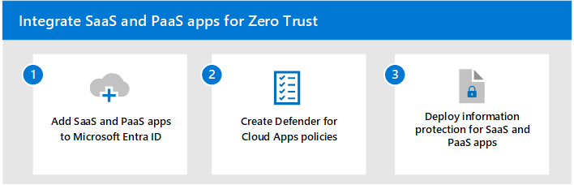

# Integrate SaaS apps for Zero Trust with Microsoft 365 

The widespread increase in cloud adoption is transforming how organizations achieve business outcomes. This shift highlights the reliance on cloud-based apps resulting in higher demand for services such as Software as a Service (SaaS), Platform as a Service (PaaS), Infrastructure as a Service (IaaS), and app development platforms. SaaS apps play a key role in ensuring that applications and resources are available and accessible from any device with an Internet connection.

While a multi-cloud environment can help reduce operational costs and improve scalability, the large amount of sensitive data and the flexibility it affords organizations can potentially pose a security risk. Deliberate steps must be taken to ensure that apps hosted in the cloud and their data are protected. 

To ensure that access and productivity is secure, implementation of SaaS apps need to align with the Zero Trust security model, which is based on these guiding principles.

| Zero Trust principle | Definition |
| --- | --- |
| Verify explicitly | Always authenticate and authorize based on all available data points. |
| Use least privileged access | Limit user access with Just-In-Time and Just-Enough-Access (JIT/JEA), risk-based adaptive policies, and data protection. |
| Assume breach | Minimize blast radius and segment access. Verify end-to-end encryption and use analytics to get visibility, drive threat detection, and improve defenses. |

This solution helps you apply Zero Trust principles using Microsoft 365 to help manage your digital estate of cloud apps, with a focus on SaaS. 

The following diagram shows the relationships between your cloud apps and Microsoft Entra ID, Microsoft Defender for Cloud Apps, and Microsoft Purview Information Protection to apply these principles.

:::image type="content" source="./media/saas-apps-products.svg" alt-text="The relationships between your third-party cloud apps, Microsoft Entra ID, Microsoft Defender for Cloud Apps, and Microsoft Purview Information Protection." lightbox="./media/saas-apps-products.svg":::

The diagram shows:

- Examples of third-party cloud apps that include SaaS apps and your custom PaaS apps.
- The role of Microsoft Entra ID to include these apps in the scope of your strong authentication and other Conditional Access policies. For more information, see [Integrating all your apps with Microsoft Entra ID](/azure/active-directory/fundamentals/five-steps-to-full-application-integration-with-azure-ad).
- The role of Microsoft Defender for Cloud Apps in discovering the cloud apps that your organization uses. You can approve apps, apply session controls, and discover sensitive data. For newly-discovered enterprise cloud apps that support federation, you can add them to Microsoft Entra ID to enforce strong authentication and other policies.
- The role of Microsoft Purview Information Protection to protect cloud app data and prevent data loss in conjunction with Microsoft Defender for Cloud apps.

## Implementing the layers of protection for SaaS apps

This diagram shows the units of work for deploying Zero Trust capabilities across Microsoft 365, with the specific steps for SaaS app integration and protection.

:::image type="content" source="./media/saas-zt.svg" alt-text="The Microsoft 365 Zero Trust deployment stack with the specific steps for SaaS app integration and protection highlighted." lightbox="./media/saas-zt.svg":::

|Step|Description|
|---|---|
| 1. [Add SaaS apps to Microsoft Entra ID](add-saas-apps.md) | Add applications to Microsoft Entra ID so that authorized users can securely access it. Many types of applications can be registered with Microsoft Entra ID. |
| 2. [Create Microsoft Defender for Cloud Apps policies](create-policies.md) | You want to make sure that policies are in place to ensure that only authorized users and specific conditions are met before users are able to access resources. |
| 3. [Deploy information protection for SaaS apps](deploy-information-protection-saas.md) | Organizations need to protect proprietary information and ensure that information protection is in place so that sensitive data is protected. |

For guidance on licensing, see [Microsoft 365 guidance for security & compliance](/office365/servicedescriptions/microsoft-365-service-descriptions/microsoft-365-tenantlevel-services-licensing-guidance/microsoft-365-security-compliance-licensing-guidance).

For more information about applying Zero Trust protections across Microsoft 365, see the [Microsoft 365 Zero Trust deployment plan](/microsoft-365/security/microsoft-365-zero-trust).

## Next steps

<!---
This solution steps through the deployment of steps to apply Zero Trust principles for your SaaS apps with Microsoft 365. 

Microsoft 365 helps you discover and manage your SaaS apps. You're likely already aware of the primary cloud apps used by your organization. Microsoft Entra ID includes a gallery of apps you can add to your directory. You can also use Microsoft Defender for Cloud Apps to discover other cloud apps that your users are using. For more information, see [Discover and assess cloud apps](/defender-cloud-apps/best-practices#discover-and-assess-cloud-apps). After you discover all your cloud apps, you'll need to make sure that only authorized users and that certain conditions are met before they're accessed, and that the app data is properly protected.
--->

Use these steps to apply Zero Trust principles for your SaaS apps with Microsoft 365:

1. [Add SaaS apps to Microsoft Entra ID](add-saas-apps.md).
2. [Create Microsoft Defender for Cloud Apps policies](create-policies.md).
3. [Deploy information protection for SaaS apps](deploy-information-protection-saas.md).

## Recommended training

|Training  |[Specify requirements for securing SaaS, PaaS, and IaaS services](/training/modules/specify-requirements-securing-saas-paas-iaas-services/)|
|---------|---------|
|:::image type="icon" source="media/specify-requirements-secure-saas-paas-iaas-services.svg" border="false"::: | Learn how to analyze security requirements for different cloud offerings (SaaS, PaaS, and IaaS), IoT workloads, web workloads and containers. |
> [!div class="nextstepaction"]
> [Start >](/training/modules/specify-requirements-securing-saas-paas-iaas-services/)
