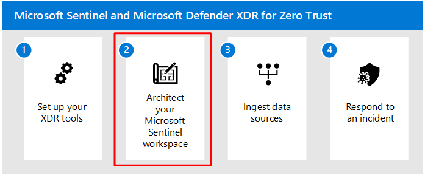

# Step 1. Set up your XDR tools

This article guides you to the best approaches for setting up Microsoft Defender 365 and other Microsoft XDR tools, which is the first step in setting up an integrated environment with Microsoft Sentinel.

The Microsoft Defender products are best in class for a security suite. Mature organizations unify their security platforms to ensure solutions are sharing information with each other for a more granular threat detection. Microsoft XDR tools have settings that allow the utilities to forward their information to each other. Additionally, each tool is designed to enrich data to each other.  

## Pilot and deploy Microsoft Defender XDR

Microsoft provides guidance to help you set up and get started with Microsoft Defender XDR components. The component services that are part of the Microsoft Defender XDR stack are:

- [Microsoft Defender for Identity](/defender-for-identity/what-is)
- [Microsoft Defender for Office 365](/microsoft-365/security/office-365-security)
- [Microsoft Defender for Cloud Apps](/defender-cloud-apps/)
- [Microsoft Defender for Endpoint](/microsoft-365/security/defender-endpoint)

### Recommended order of piloting and deploying Microsoft Defender XDR components

Microsoft recommends enabling the components of Microsoft 365 Defender in the following order.

:::image type="content" source="media/defender-xdr-pilot-deploy-flow.svg" alt-text="A diagram that shows the pilot and deploy process for Microsoft Defender XDR." lightbox="media/defender-xdr-pilot-deploy-flow.svg" border="false":::

| Phase | Link |
|---|---|
| A. Start the pilot | [Start the pilot](/defender-xdr/pilot-deploy-overview#start-the-pilot)|
| B. Pilot and deploy Microsoft Defender XDR components | - [Pilot and deploy Defender for Identity](/defender-xdr/pilot-deploy-defender-identity)    - [Pilot and deploy Defender for Office 365](/defender-xdr/pilot-deploy-defender-office-365)    - [Pilot and deploy Defender for Endpoint](/defender-xdr/pilot-deploy-defender-endpoint)    - [Pilot and deploy Microsoft Defender for Cloud Apps](/defender-xdr/pilot-deploy-defender-cloud-apps) |
|C. Investigate and respond to threats | [Practice incident investigation and response](/defender-xdr/pilot-deploy-investigate-respond) |

This order is designed to apply the value of the capabilities quickly based on how much effort is typically required to deploy and configure the capabilities. For example, Defender for Office 365 can be configured in less time than it takes to enroll devices in Defender for Endpoint. Prioritize the components to meet your business needs.

## Microsoft Defender portal

The [Microsoft Defender portal](https://sip.security.microsoft.com/homepage) combines protection, detection, investigation, and response to email, collaboration, identity, device, and cloud app threats, in a central place. The Microsoft Defender XDR unified portal emphasizes quick access to information, simpler layouts, and bringing related information together for easier use.

By default, the Defender portal includes:

- **[Microsoft Defender for Office 365](/microsoft-365/security/office-365-security/defender-for-office-365)** Microsoft Defender for Office 365 helps organizations secure their enterprise with a set of prevention, detection, investigation and hunting features to protect email, and Office 365 resources.
- **[Microsoft Defender for Endpoint](/microsoft-365/security/defender-endpoint/microsoft-defender-advanced-threat-protection)** delivers preventative protection, post-breach detection, automated investigation, and response for devices in your organization.
- **[Microsoft Defender for Identity](/defender-for-identity/what-is)** is a cloud-based security solution that uses your on-premises Active Directory signals to identify, detect, and investigate advanced threats, compromised identities, and malicious insider actions directed at your organization.
- **[Microsoft Defender for Cloud Apps](/cloud-app-security/)** is a comprehensive cross-SaaS and PaaS solution bringing deep visibility, strong data controls, and enhanced threat protection to your cloud apps.

Later, when you've set up your Microsoft Sentinel workspace, you can also add Microsoft Sentinel to the Defender portal.

Watch this short video to learn about the Microsoft Defender portal.
> [!VIDEO https://learn-video.azurefd.net/vod/player?id=d97b17c8-8900-4a18-a099-7d30d9a316ea]

## Enable Microsoft Entra ID Protection

Microsoft Defender XDR also ingests and includes the signals of Microsoft Entra ID Protection, as illustrated below.

:::image type="content" source="./media/siem-xdr-entra-id-protection.svg" alt-text="A diagram that shows the integration of Microsoft Entra ID Protection with Microsoft Defender XDR." lightbox="./media/siem-xdr-entra-id-protection.svg" border="false":::

Microsoft Entra ID Protection is separate from Microsoft Defender XDR and is included with Microsoft Entra ID P2 licenses.

Microsoft Entra ID Protection evaluates risk data from billions of sign-in attempts and uses this data to evaluate the risk of each sign-in to your environment. This data is used by Microsoft Entra ID to allow or prevent account access, depending on how Conditional Access policies are configured.  

If you aren't going to onboard your Microsoft Sentinel workspace to the unified security operations platform, we recommend that you also ingest the signals from Microsoft Entra ID Protection into Microsoft Sentinel. To enable Microsoft Entra ID Protection, see [Microsoft Entra ID Protection](/defender-cloud-apps/aadip-integration).

## Enable Microsoft Defender for Cloud

You can complete the deployment of Microsoft XDR tools by enabling Microsoft Defender for Cloud, and then include Defender for Cloud signals in your Microsoft Sentinel workspace.  

<!---

--->

Use the following guidance to enable Defender for Cloud and integrate its capabilities.

|       Task  |     Description  |     See . . .  |
|:---|:---|:---|
|Set up Defender for Cloud |	Recommended steps to enable Microsoft Defender for Cloud and the enhanced security features | [Quickstart: Set up Microsoft Defender for Cloud](/azure/defender-for-cloud/get-started)
|Protect your server resources | With Microsoft Defender for Servers (included with Defender for Cloud), you gain access to and can deploy Microsoft Defender for Endpoint to your server resources. | [Protect your endpoints with Defender for Cloud's integrated EDR solution: Microsoft Defender for Endpoint](/azure/defender-for-cloud/integration-defender-for-endpoint?WT.mc_id=Portal-Microsoft_Azure_Security_CloudNativeCompute)

## Recommended training

### Explore security solutions in Microsoft Defender XDR

|Training  |[Explore security solutions in Microsoft Defender XDR](/training/modules/explore-security-solutions-microsoft-365-defender/)|
|---------|---------|
|:::image type="icon" source="media/generic-badge.svg" border="false"::: | This module introduces you to several features in Microsoft 365 that can help protect your organization against cyberthreats, detect when a user or computer has been compromised, and monitor your organization for suspicious activities.|
> [!div class="nextstepaction"]
> [Start >](/training/modules/explore-security-solutions-microsoft-365-defender/)

### Enable and manage Microsoft Defender for Cloud

|Training  |[Enable and manage Microsoft Defender for Cloud](/training/modules/azure-security-center/)|
|---------|---------|
|:::image type="icon" source="media/microsoft-cloud-app-security.svg" border="false"::: | Use Microsoft Defender for Cloud to strengthen security posture and protect workloads against modern threats. |
> [!div class="nextstepaction"]
> [Start >](/training/modules/azure-security-center/)

## Next steps

Continue to [Step 2](siem-workspace.md) to architect a Microsoft Sentinel workspace.

