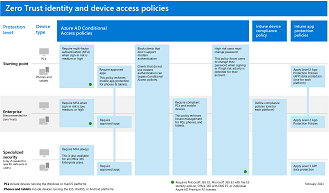
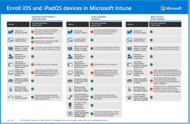

# Secure remote and hybrid work with Zero Trust

As part of Zero Trust adoption guidance, this article describes the business scenario of securing remote and hybrid work. Note that securing your business data and infrastructure are the topics of separate business scenarios and isn't included in this guidance.

The shift to a hybrid workstyle has been forcing organizations to rapidly adapt. Remote employees are getting work done any way they can—using personal devices, collaborating through cloud services, and sharing data outside the corporate network perimeter. Hybrid employees work on both corporate and home networks, switching between business and personal devices.

As employees’ home networks stretch the corporate network perimeter, with different devices joining that network, security threats are both multiplying and becoming more sophisticated while attack vectors evolve.

| Traditional protection with network controls | Modern protection with Zero Trust |
| --- | --- |
| Traditional protection relies on network firewalls and virtual private networks (VPNs) to isolate and restrict corporate resources.    Employees physically ‘badge in’ to the office and use their user account and password to sign in with their device. Both the user account and the device are trusted by default. | A Zero Trust model combines policies, processes, and technology to establish trust from cloud to edge, irrespective of where users access your network.    A Zero Trust model doesn’t presume any user identity or device is secure on any network. The approach mandates that you verify the user identity and device, and do so while continuously monitoring network, data, and application security in the office, at home, and across devices. |

:::image type="content" source="../media/adoption-guide/on-premises-remote-devices.png" alt-text="Zero Trust applies to both known and unknown locations." lightbox="../media/adoption-guide/on-premises-remote-devices.png":::

The guidance in this article walks through how to get started with and implement your strategy for securing remote and hybrid work.

## How business leaders think about securing remote and hybrid work

Before starting any technical work, it’s important to understand the different motivations for investing in securing remote and hybrid work as these motivations help inform the strategy, objectives, and measures for success.

The following table provides reasons why business leaders across an organization should invest in securing remote and hybrid work.

| Role | Why securing remote and hybrid work is important |
| --- | --- |
| Chief Executive Officer (CEO) | The business must be empowered to achieve its strategic goals and objectives, irrespective of the employee's location. Business agility and business execution should not be constrained. The cost of a successful cyberattack can be a lot more than the price of implementing security measures. In many cases, compliance with cyber insurance requirements or standards or regional regulations is required. |
| Chief Marketing Officer (CMO) | How the business is perceived both internally and externally should not be restricted by devices or circumstances. Employee well-being is a high priority empowered by the choice to work from home or an office. A successful attack can become public knowledge, potentially harming brand value. |
| Chief Information Officer (CIO) | The applications used by a mobile and hybrid workforce must be accessible while securing the company's data. Security should be a measurable outcome and aligned with IT strategy. User experience and productivity are important. |
| Chief Information Security Officer (CISO) | A remote or hybrid work environment creates a larger surface area for security breaches. The organization should still comply with security and data protection requirements, standards, and regulations as the environment expands. |
| Chief Technology Officer (CTO)| The technologies and processes used to support business innovation must be protected. SecOps and DevSecOps practices can reduce the impact of an attack. Complimentary technologies that facilitate both remote work and the adoption of cloud services in a secure manner must be adopted. |
| Chief Operations Officer (COO) | As the workforce becomes mobile and uses a fixed office location less often, business assets need to stay secure and business risk must be managed. With accountability to the CEO for day-to-day business production, any interference with operations or supply chain due to an attack will impact the bottom line. |
| Chief Financial Officer (CFO)| Spending priorities are shifting from fixed to agile models. Fixed datacenter investment and buildings are moving to cloud applications and users working from home. The costs of implementing security features must be balanced with risk and cost analyses. |

In addition to the motivations for business leaders, many employees expect flexibility and want to work from anywhere, anytime, and from any device. 

Microsoft is one of many enterprise-scale organizations that embraced remote and hybrid work at the start of the COVID-19 pandemic. On page 87 of the [Microsoft Digital Defense Report 2022](https://www.microsoft.com/en-us/security/business/microsoft-digital-defense-report-2022), Microsoft emphasizes that this business opportunity introduces risk and must be paired with security measures to increase resiliency against attacks:

- Cyber security is a key enabler of technological success. Innovation and enhanced productivity can only be achieved by introducing security measures that make organizations as resilient as possible against modern attacks. 
- The pandemic has challenged us to pivot our security practices and technologies to protect Microsoft’s employees wherever they work. This past year, threat actors continued to take advantage of vulnerabilities exposed during the pandemic and the shift to a hybrid work environment.

This report emphasizes that the vast majority of successful cyberattacks can be prevented by using basic security hygiene.

## The adoption cycle for securing remote and hybrid work

Securing remote and hybrid work with Zero Trust includes deploying security protections that are basic and at the same time provide sophisticated protection. Technically, this objective involves policy enforcement and monitoring for all access to your organization’s resources with a full end-to-end lifecycle approach.

This article walks through this business scenario using the same lifecycle phases as the Cloud Adoption Framework for Azure—Define strategy, Plan, Ready, Adopt, Govern, and Manage—but adapted for Zero Trust.

:::image type="content" source="../media/adoption-guide/zero-trust-framework-lifecycle-phases.svg" alt-text="Zero Trust adoption guidance uses the same lifecycle phases." lightbox="../media/adoption-guide/zero-trust-framework-lifecycle-phases.svg":::

Read more about the Zero Trust adoption cycle in the [Zero Trust adoption framework overview](zero-trust-adoption-overview.md).

## Define strategy phase

The **Define strategy** phase is critical to define and formalize our efforts to address the “Why?” of this scenario. In this phase, we understand the scenario through business, IT, operational, and strategic perspectives.

We define the outcomes against which to measure success in the scenario, understanding that security is an incremental and iterative journey.

This article suggests motivations and outcomes that are relevant to many organizations. Use these suggestions to hone the strategy for your organization based on your unique needs.

### Secure remote and hybrid work motivations

The motivations for securing remote and hybrid work are straightforward, but different parts of your organization will have different incentives for doing this work. The following table summarizes some of these motivations.

| Area | Motivations |
| --- | --- |
| Business needs | To provide access to information anytime, anywhere on any device, without lowering security standards and managing data access risks. |
| IT needs | A standardized identity platform that caters for human and non-human identity requirements , removes the needs for VPNs, and provides remote management of corporate and BYOD devices in a compliant manner while providing a seamless and positive user experience. |
| Operational needs | Implement existing security solutions in a standardized manner. Lower the management effort required to implement and maintain secure identities. Identity governance means onboarding and offboarding users, granting access to resources at the right time, and providing just enough access. It also means revoking access when no longer needed. |
| Strategic needs | To incrementally reduce the return on investment for cyber-attacks by implementing strong security solutions. The Zero Trust **assume breach** principle allows planning to occur to minimize blast radius, attack surfaces and reduce the recovery time from a breach. |

### Secure remote and hybrid work scenario outcomes

To be productive, users must be able to use:

- Their user account credentials to verify their identity.
- Their endpoint (device), such as a PC, tablet, or phone.
- The applications you have provided to them.
- The data required to perform their job.
- A network over which traffic flows between devices and applications, whether the user and their device are on-premises or on the internet.

Each one of these elements is the target of attackers and must be protected with the "never trust, always verify" principle of Zero Trust.

The following table provides objectives and their outcomes for the secure remote and hybrid work scenario.

| Objective | Outcome |
| --- | --- |
| Productivity | Organizations want to extend productivity securely to users and their devices, without restricting employee capabilities based on workforce location. |
| Safe access | Company data and apps need to be accessed by the right employees in a secure manner that guards company intellectual property and personal data. |
| Support end users |As organizations adopt a hybrid workforce mentality, employees need more application and platform capabilities for a secure and mobile work experience. |
| Increase security | The security of current or proposed work solutions needs to be increased to help organizations scale to mobile workforce requirements. The security capabilities should equal or exceed what is achievable to the on-premises workforce. |
| Empower IT | The IT team wants to secure the workplace, which starts with securing employee’s user experience without unduly increasing the friction to users. Furthermore, the IT team needs processes and visibility to support governance and to enable detection and mitigation of cyberattacks. |

## Plan phase

Adoption plans convert the aspirational goals of a Zero Trust strategy into an actionable plan. Your collective teams can use the adoption plan to guide their technical efforts and align them with your organization's business strategy.

The motivations and outcomes you define, together with your business leaders and teams, support the “Why?” for your organization. These become the North Star, or guiding target, for your strategy. Next comes the technical planning to achieve the motivations and objectives.

Use the following exercises to help you plan the implementation of your organization's technology strategy. These exercises support Zero Trust adoption efforts by capturing prioritized tasks. At the end of this process, you'll have a cloud adoption plan that maps to the metrics and motivations defined in the cloud adoption strategy.

| Exercise | Description |
| --- | --- |
| Digital estate | Take inventory of your digital estate — identities, devices, apps. Prioritize your digital estate based on assumptions that align your organization's motivations and business outcomes. |
| Initial organizational alignment | Align your organization to a technical strategy and adoption plan. The strategy and plan are based on your organization’s objectives along with the priorities you identified within your inventory. |
| Technical skills readiness plan	 | Create a plan for addressing skills readiness gaps within your organization. |
| Cloud adoption plan | Develop a cloud adoption plan to manage change across skills, the digital estate, and your organization. |

Technical adoption for securing remote and hybrid work involves taking a graduated approach to ensuring Zero Trust principles are applied to identities, devices, and applications by requiring that:

- Multifactor authentication (MFA) with Conditional Access is applied to all user identities that are accessing the environment.
- Devices are enrolled in device management and monitored for health.
- Access to applications and their data requires verifying identities, healthy devices, and appropriate data access.

Many organizations can take a four-staged approach to these technical activities, summarized in the following chart.

| Stage 1 | Stage 2 | Stage 3 | Stage 4 |
| --- | --- | --- | --- |
| Verify and secure every identity with strong authentication    Integrate SaaS apps with Active Directory (Azure AD) for single sign-on    All new applications use modern authentication | Register devices with Azure AD    Implement **Starting point** Zero Trust identity and device access policies    Use Azure AD Application Proxy with on-premises apps for single sign-on | Enroll devices in your device management solution and apply recommended security protections    Allow only compliant and trusted devices to access data | Monitor device configuration drift    Implement passwordless authentication |

If this staged approach works for your organization, you can share your progress with your teams and business leaders by downloading [this PowerPoint deck](add link) and updating the slides that corresponds to this business scenario. Here is an example.

:::image type="content" source="../media/adoption-guide/zero-trust-remote-work-progress-tracking.png" alt-text="PowerPoint slide for the stages of your secure remote and hybrid work deployment." lightbox="../media/adoption-guide/zero-trust-remote-work-progress-tracking.png":::

If your organization subscribes to a specific Governance Risk & Compliance (GRC) or Security Operations Center (SOC) strategy, it is vitally important that the technical work incorporate configurations that meet these requirements.

### Understand your organization

Each organization's needs and composition are different. A multinational enterprise with many applications and highly standardized security will implement security differently from an agile startup or a medium-sized organization.

Irrespective of the size and complexity of your organization, the following actions apply:

- Inventory users, endpoints, apps, data, and networks to understand the state of security and estimate the level of effort required to transform the estate.
- Document the goals and plan for incremental adoption based on priorities. An example is to secure identities and Microsoft 365 services, followed by endpoints. Next, secure apps and SaaS services using modern authentication methods and segmentation capabilities provided by Conditional Access.
- For the principle of using least privileged access, inventory how many accounts have privileged access and reduce those to the least number of accounts possible. Accounts that require privileged access should use just-in-time and just-enough-access (JIT/JEA) to limit standing administration privileges. Should a breach occur, accounts that are compromised are limited, which minimizes the blast radius. Except for a “break glass” account, no standing admin access should be permitted for highly privileged roles, which include application administration roles for productivity services such as SharePoint, Exchange, and Teams.

### Organizational planning and alignment

The implementation and governance of a secure access methodology affects several overlapping areas and is typically implemented in the order of:

1. Identities
2. Endpoints (devices)
3. Apps
4. Network

Protecting data is also important for securing remote and hybrid work. This topic is addressed more thoroughly in [Identify and protect sensitive business data](identify-protect-sensitive-business-data.md).
 
This table summarizes roles that are recommended when building a sponsorship program and project management hierarchy to determine and drive results.

| Area | Program leaders | Technical owner roles |
| --- | --- | --- |
| Identities | CISO, CIO, or Director of Identity Security    Program lead from Identity Security or Identity Architect | Security Architect    Identity Security or an Identity Architect    Identity Admin     Security Governance or Identity Admin    User Education Team |
| Endpoints | CISO, CIO, or Director of Identity Security    Program lead from Identity Security or an Identity Architect | Security Architect    Identity Security or an Infrastructure Security Architect    Mobile device management (MDM) Admin    Security Governance or MDM Admin    User Education Team |
| Apps | CISO, CIO, or Director of Application Security    Program lead from Apps Management | Identity Architect    Developer Architect    Network Architect    Cloud Network Architect    Security Governance |
| Network | CISO, CIO, or Director of Network Security    Program lead from Networking Leadership | Security Architect    Network Architect    Network Engineers    Network Implementers    Networking Governance |

The [PowerPoint deck of resources](add link) for this adoption content includes the following slide with a stakeholder view that you can customize for your own organization.

:::image type="content" source="../media/adoption-guide/zero-trust-remote-work-stakeholders.png" alt-text="PowerPoint slide to identify key stakeholders." lightbox="../media/adoption-guide/zero-trust-remote-work-stakeholders.png":::

### Technical planning and skills readiness

Microsoft provides resources to help you prioritize this work, get started, and mature your deployment. At this stage we use these resources as planning activities to understand the impact of the proposed changes and to create an implementation plan.

These resources include prescriptive guidance that you can use as recommended starting points for your own organization. Adjust the recommendations based on your priorities and requirements.

| Resource | Description |
|:-----|:-----|
| Rapid Modernization Plan (RaMP) checklist: [Explicitly validate trust for all access requests](/security/zero-trust/data-compliance-gov-data)  | This series of checklists enumerate the technical objectives of each security deployment area in priority order and documents the steps you'll need to take to achieving them. It also lists project members who need to be involved for each area.    Using this resource helps you to identify quick wins. |
| [Zero Trust identity and device access configurations](/microsoft-365/security/office-365-security/microsoft-365-policies-configurations)  | This solution guide recommends a set of [identity and device access policies](/microsoft-365/security/office-365-security/identity-access-policies) that have been tested together. It includes: <ul><li>**Starting point** level policies that get you started and do not require managing devices.</li><li>**Enterprise** level policies are recommended for Zero Trust. This requires enrolling devices for endpoint management.</li></ul> Use these recommendations as a starting point and, if needed, adapt the policies for your unique environment and goals. |
| [Manage devices with Intune](/microsoft-365/solutions/manage-devices-with-intune-overview)  | This solution guide walks through the phases of managing devices, from actions that don’t require enrolling devices into management to fully managing devices. These recommendations are coordinated with the above resources. |
| [Intune Enrollment Options](/microsoft-365/solutions/cloud-architecture-models#intune-enrollment-options)     [PDF](https://download.microsoft.com/download/e/6/2/e6233fdd-a956-4f77-93a5-1aa254ee2917/msft-intune-enrollment-options.pdf) \| [Visio](https://download.microsoft.com/download/e/6/2/e6233fdd-a956-4f77-93a5-1aa254ee2917/msft-intune-enrollment-options.vsdx)   Updated June 2022 | This poster-set provides an easy-to-scan comparison of device enrollment options per platform. |
| [MFA deployment plan](/azure/active-directory/authentication/howto-mfa-getstarted) | This deployment guide shows you how to plan and implement an Azure AD MFA roll-out. |

In addition to these resources, the following sections highlight resources for specific tasks in the four stages previously defined.

#### Stage 1

| Task | Resources |
| --- | --- |
| Verify and secure every identity with strong authentication | [What authentication and verification methods are available in Azure AD?](/azure/active-directory/authentication/concept-authentication-methods) |
| Integrate SaaS apps with Azure AD for single sign-on | [Add SaaS apps to Azure AD and to the scope of policies](/security/zero-trust/add-saas-apps) |
| New applications use modern authentication | [Checklist — How are you managing the identity for your workload?](/azure/architecture/framework/security/design-identity) |

#### Stage 2

| Task | Resources |
| --- | --- |
| Register devices with Azure AD | [Azure AD registered devices](/azure/active-directory/devices/concept-azure-ad-register)    [Plan your Azure AD join implementation](/azure/active-directory/devices/azureadjoin-plan) |
| Implement Zero Trust **Starting point** identity and device access policies | [Zero Trust identity and device access configurations](/microsoft-365/security/office-365-security/microsoft-365-policies-configurations) |
| Use App Proxy with on-prem apps for single sign-on | [Azure AD Application Proxy documentation](/en-us/azure/active-directory/app-proxy/) |

#### Stage 3

| Task | Resources |
| --- | --- |
| Enroll devices into management and apply recommended security protections | [Manage devices with Intune overview](/microsoft-365/solutions/manage-devices-with-intune-overview)    [Zero Trust identity and device access configurations](/microsoft-365/security/office-365-security/microsoft-365-policies-configurations) |
| Allow only compliant and trusted devices to access data | [Set up compliance policies for devices with Intune](/microsoft-365/solutions/manage-devices-with-intune-compliance-policies)    [Require healthy and compliant devices with Intune](/microsoft-365/solutions/manage-devices-with-intune-require-compliance) |

#### Stage 4

| Task | Resources |
| --- | --- |
| Monitor device configuration drift | [Deploy device profiles in Microsoft Intune](/microsoft-365/solutions/manage-devices-with-intune-configuration-profiles)    [Monitor device risk and compliance to security baselines](/microsoft-365/solutions/manage-devices-with-intune-monitor-risk) |
| Implement passwordless authentication | [Increase sign-in security with passwordless authentication](/microsoft-365/solutions/ransomware-protection-microsoft-365-identities#increase-sign-in-security) |

### Cloud adoption plan

An adoption plan is an essential requirement for the successful adoption of Zero Trust. A Zero Trust adoption plan is an iterative project plan that helps a company transition from traditional security approaches to a more mature and sophisticated strategy that includes change management and governance.

Identities, Endpoints, Apps, and Networks are in the scope of this planning phase. Each of these has a requirement to secure the existing estate and also plans to extend security to new entities as they arrive as part of a larger onboarding process.

Secure remote and hybrid work solution planning considers that organizations have existing identities that need to be secured, and new identities must be created that adhere to security standards.

An adoption plan also includes training your staff to work in a new way to understand what is required to support your organization, which can include:

- Training administrators on new ways of working. Privileged access methods differ from standing admin access and can raise friction initially until universal acceptance is reached.
- Equipping Helpdesk and IT personnel at all levels with the same benefits realization message. Increasing security raises attacker friction, balanced by the benefits of working securely. Ensure that this message is understood and communicable at all levels. 
- Creating user adoption and training materials. Security is adopted pervasively as a shared responsibility and the security benefits aligned to business goals must be communicated to users. Ensure that user adoption for security is achieved to the same level as user adoption for new technology.

For more information from the Cloud Adoption Framework, see the [Plan for cloud adoption](/azure/cloud-adoption-framework/plan/plan-intro).

## Ready phase

This scenario (securing remote and hybrid work) evaluates and secures identities, devices, and data over the networks that use them. Since the technologies may be potentially disruptive, a staged approach is recommended, starting with small projects offering quick wins that take advantage of your existing licensing and have minimal user impact.

Begin by building a plan and then testing the plan. Then roll out new configurations and capabilities incrementally. This provides the opportunity to improve on the plan while lessons are learned. Be sure to develop a communication plan and announce changes as you broaden your scope of deployment.

The following diagram illustrates the recommendation to start a project with a small group to evaluate the changes. This small group can be members of your IT team or a partner team that is invested in the outcome. Then, pilot the changes with a larger group. While the illustration includes a third stage of full deployment, this is often accomplished by gradually increasing the scope of the deployment until your whole organization is covered.

:::image type="content" source="../media/adoption-guide/adoption-phases.svg" alt-text="Pilot, evaluate, and full deployment adoption phases." lightbox="../media/adoption-guide/adoption-phases.svg":::
 
When enrolling devices, for example, the following guidance is recommended.

| Deployment stage | Description |
| --- | --- |
| Evaluate | Stage 1: Identify 50 endpoints for testing |
| Pilot | Stage 2: Identify the next 50-100 endpoints in the production environment |
| Full deployment | Stage 3: Enroll the rest of the endpoints in larger increments |

Securing identities starts with adopting MFA and segmenting access using Azure AD Conditional Access. These features support the principle of verifying explicitly but require an incremental adoption process. Depending on the approach, the MFA methodology may need to be rolled out and communicated to users before the switch-on date, especially for an existing workforce used to using passwords only.

Considered the following elements while planning for this scenario:

- Depending on the MFA methodology, user buy-in may need to be sought to use mobile application-based MFA, versus using a FIDO2 or other token-based approach. This also applies to Windows Hello for Business. 
- Conditional Access policies can be complex regarding their evaluation and decision-making criteria. This requires Conditional Access to be piloted and rolled out incrementally across the app and user landscape.
- Conditional Access may take into account the relative health and patch status of the endpoint and the user's locations as conditional parameters. If endpoints are required to be managed to qualify them to access an app or service as an access condition, then endpoints need to be enrolled into management.
- Modern apps that support modern authentication methods readily integrate with MFA-based authentication and Conditional Access policies. Understanding the number of applications and their authentication methods is critical.

As you plan and stage the layers of protection to build Zero Trust, take advantage of resources provided by Microsoft. For securing remote and hybrid work, Microsoft provides a [Common Zero Trust identity and device access policies](/microsoft-365/security/office-365-security/identity-access-policies) set. This is a set of policies that are tested and known to work well together.

Here are the policies for three levels of protection.

:::image type="content" source="../media/identity-device-access-policies-byplan.png" alt-text="Zero Trust identity and device access policies." lightbox="../media/identity-device-access-policies-byplan.png":::

This policy set includes a **Starting point** protection level with minimal user impact. This set of policies does not require enrolling devices into management. When you’re ready and you’ve enrolled devices, you can then deploy the **Enterprise** level, which is recommended for Zero Trust. 

In addition to these protection levels, you can incrementally increase the scope of the policies in the following ways:

- Apply the scope of the policies to a small set of users to begin with and then increase the scope of users included. User segmentation allows for risk mitigation against service outage or user disruption as only targeted users or devices are affected.
- Start by adding Microsoft 365 apps and services to the scope of the policies. Then advance to include other SaaS apps your organization uses. When you’re ready, include apps you built in Azure or other cloud providers in the scope of the policies.

Finally, don’t forget about your users. User adoption and communication is critical when implementing security for identities, similar to the importance of the initial user adoption of moving to Microsoft 365 from datacenter-based services. Single phase approaches rarely succeed when implementing security services. Security initiatives often fail due to increased friction for users if changes are disruptive and poorly communicated and tested. This is where executive sponsorship of security initiatives works best. When executives demonstrate support by adopting early in the deployment stages, it's easier for users to follow.

To help with user education and adoption, Microsoft provides end-user rollout templates and materials you can download. These include instructions for how you can rebrand these and recommendations for sharing these with users. See [https://aka.ms/entratemplates](https://aka.ms/entratemplates). 

### Build and test

After assembling your team, reviewing the recommended technical resources, and developing a plan to stage your projects and deployment, you'll hopefully have a well-documented plan. Before formally adopting the plan, be sure to build and test the configurations in a test environment.

Each technical area, such as a Conditional Access policy set, can be secured by enabling functionality across the tenant. However, a wrongly configured policy can have far reaching consequences. For example, a badly written Conditional Access policy may lock all administrators out of a tenant. To mitigate risk, consider deploying a test or QA tenant to implement each feature as you become familiar with it, or roll it out for the first time. A test or QA tenant should be reasonably representative of your current user environment and be accurate enough for you to perform QA functions to test that the enabled functionality is understood and supportive of the function it is securing.

The [RAMP Checklist](/security/zero-trust/user-access-productivity-validate-trust) can be used to track your progress. It lists both planning and implementation steps. The QA tenant is the test bed of the implementation actions as they are performed for the first time.

The output of this stage should be a documented configuration that is built and tested initially against the QA tenant  with plans to then transition to adoption in the production tenant where the changes are rolled out incrementally while new learnings are applied to the plan.

As you roll out new configurations in your production environment, maintain consistent user messaging and stay on top of how these changes affect your users. Implementing security features may have a low technology impact, such as enabling just in time access, but reciprocally have a high process impact, such as administrators needing to request access to services via an approval workflow to perform their duties.

Similarly, device registration has a low impact on user experience, while implementing Conditional Access based on device compliance and health requirements may have a dramatic impact on the user base as users are unable to access services.

Testing each service to understand the impact of the service and planned change is critical to success. Be aware that some impacts might not be fully apparent until you begin piloting in production.

### Keep track of governance and management changes

The very goal of Zero Trust is to incrementally increase security and implement changes in the environment that achieve this goal. These changes require changes in the management and governance models of the environment. As testing and deployment occurs, be sure to document the changes and impacts to the management and governance model.

## Adopt phase

In the adoption phase, you incrementally implement your strategy and deployment plans across functional areas. The adoption phase is a larger implementation of the proof of concept. The deployment plan is executed, and rollout occurs in successive waves, based on user segmentation and the areas you are targeting across your digital estate.

As recommended, deploy each new configuration into the production tenant as a limited proof of concept (labeled “Evaluate” in this illustration).

:::image type="content" source="../media/adoption-guide/adoption-phases.svg" alt-text="Adoption phases which includes pilot, evaluate, and full deployment." lightbox="../media/adoption-guide/adoption-phases.svg":::

Even though you have already tested the new configurations in a QA environment, be sure your production deployment plans also document what you are testing and evaluating and the acceptance criteria for measuring success at each stage. Ideally choose a subset of low-impact users, endpoints, and apps to test on before broadening the deployment. Following the same methodology, you learn from the success and failures of the implementation and update the plans.

Note that some of the functionality that is deployed, even though targeted at a limited audience, can have a service-wide impact. You can mitigate this impact by identifying risks during QA testing and ensuring that a roll-back plan exists.

A successful deployment plan includes the following elements:

- Adoption and rollout plan to include the user communication strategy
- Executive adoption and rollout plan to ensure executive endorsement 
- User adoption and rollout plan
- Project management and governance artifacts
- User segmentation by business unit or user impact
- Device segmentation by business unit or user impact
- Apps ranked by criticality and complexity of implementation
- Draft updates for changes in day-to-day management and governance

## Govern and Manage phases

Security governance is an iterative process. For organizations with existing policies that govern security across a digital estate, adopting a Zero Trust strategy provides the incentive to evolve those policies. As security strategy and policies mature over time, so do cloud governance processes and policies.

In the planning phase, new functionality was tested against a test tenant in which management activities occurred. It is important to note that implementing the features that support Zero Trust principles requires a different way of managing the resulting end-state.

Here are some examples of new requirements for this scenario:

- Establish a process to approve administration access when required as opposed to standing admin access.
- Update lifecycle management of users as they enter, use, and exit the organization. 
- Update the lifecycle management of devices.
- Update the release criteria for new apps to be sure these are included in the scope of Conditional Access policies.

As the rollout plan progresses, management of the resulting environment drives changes to the management and governance methodology.  How the environment is monitored as a result of Zero Trust changes.

As Zero Trust addresses security risk in the environment, identity object lifecycle management is no longer optional. Object attestation is a manifestation of object lifecycle and drives accountability into the business and away from IT as the sole custodian of the object lifecycle.

Zero Trust requires an increase of maturity in the resultant administration of the estate, including how users and administrators interact with the rolled-out end-state. See the following table as an example of potential changes.

| Audience | Function | Reference |
| --- | --- | --- |
| Users | User-based object attestation review | [Manage user and guest user access with access reviews](/azure/active-directory/governance/manage-access-review) |
| Administrators | The Identity and Access lifecycles of Azure AD Identity Governance | [What is Azure AD Identity Governance?](/azure/active-directory/governance/identity-governance-overview) |

Additional resources for day-to-day governance and operation include:

- [Azure AD reports and monitoring documentation](/azure/active-directory/reports-monitoring/)
- [Azure AD Identity Governance documentation](/azure/active-directory/governance/) 

  Discusses other governance areas and tools that address several areas. Due to different organizational needs, not all of the governance features called out in this document are applicable to all organizations.

## Next Steps

- [Zero Trust adoption framework overview](zero-trust-adoption-overview.md)
- [Identify and protect sensitive business data with Zero Trust](identify-protect-sensitive-business-data.md)
