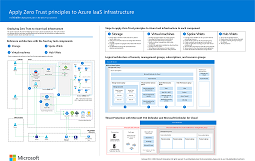
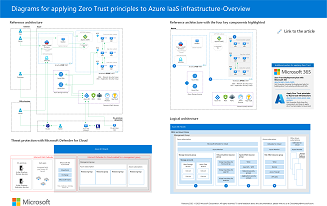

# Overview – Apply Zero Trust principles to Azure IaaS

This series of articles help you apply the principles of Zero Trust to your workloads in Microsoft Azure IaaS based on a multi-disciplinary approach to applying the Zero Trust principles. Zero Trust is a security strategy. It is not a product or a service, but an approach in designing and implementing the following set of security principles:

- Verify explicitly
- Use least privileged access
- Assume breach

Implementing the Zero Trust mindset to “assume breach, never trust, always verify” requires changes to cloud infrastructure, deployment strategy, and implementation.

These initial series of five articles (including this introduction) show you how to apply Zero Trust approach to a very common IT business scenario based on infrastructure services. The work is broken into units that can be configured together as follows:

- [Azure storage](azure-infrastructure-storage.md)
- [Virtual machines](azure-infrastructure-virtual-machines.md)
- [Spoke virtual networks (VNets) for virtual machine-based workloads](azure-infrastructure-iaas.md)
- [Hub VNets to support access to many workloads in Azure](azure-infrastructure-networking.md)

See [Apply Zero Trust principles to Azure Virtual Desktop](azure-infrastructure-avd.md) for additional guidance.

> [!NOTE]
> Additional articles will be added to this series in the future, including how organizations can apply a Zero Trust approach to applications, networking, data, and DevOps services based on real IT business environments.

> [!IMPORTANT]
> This Zero Trust guidance describes how to use and configure several security solutions and features available on Azure for a reference architecture. Several other resources also provide security guidance for these solutions and features, including:

> - [Microsoft Cloud Security Benchmark](/security/benchmark/azure/introduction)
> - [Microsoft Cloud Security Baseline](/security/benchmark/azure/security-baselines-overview)

To describe how to apply a Zero Trust approach, this guidance targets a common pattern used in production by many organizations: a virtual-machine-based application hosted in a VNet (and IaaS application). This is a common pattern for organizations migrating on-premises applications to Azure, which is sometimes referred to as "lift-and-shift". The reference architecture includes all components necessary to support this application, including storage services and a hub VNet.

The reference architecture reflects a common deployment pattern in production environments. It is not based on the enterprise-scale landing zones recommended in the Cloud Adoption Framework (CAF), although many of the best practices in CAF are included in the reference architecture, such as using a dedicated VNet to host components that broker access to the application (hub VNet).

If you are interested in learning about the guidance recommended in the Cloud Adoption Framework Azure landing zones, see these resources:

- [Get started with the Cloud Adoption Framework](/azure/cloud-adoption-framework/get-started/index)
- [What is an Azure landing zone?](/azure/cloud-adoption-framework/ready/landing-zone/index)

## Reference architecture

The following figure shows the reference architecture for this Zero Trust guidance.

:::image type="content" source="media/azure-infra-overview/azure-infra-overview-reference-architecture-1.png" alt-text="Diagram of the reference architecture for applying Zero Trust to IaaS." lightbox="media/azure-infra-overview/azure-infra-overview-reference-architecture-1.png":::

This architecture contains:

- Multiple IaaS components and elements, including different types of users and IT consumers accessing the app from different sites. such as Azure, the internet, on-premises, and branch offices.
- A common three-tier application containing a front end tier, application tier, and data tier. All tiers run on virtual machines within a VNet named SPOKE. Access to the app is protected by another VNet named HUB that contains additional security services.
- Some of the most used PaaS services on Azure that support IaaS applications, including role-based access control (RBAC) and Azure Active Directory (Azure AD). These contribute to the Zero Trust security approach.
- Storage Blobs and Storage Files that provide object storage for the applications and files shared by users.

This series of articles walk through the recommendations for implementing Zero Trust for the reference article by addressing each of these larger pieces hosted in Azure, as shown here.

:::image type="content" source="media/azure-infra-overview/azure-infra-overview.png" alt-text="Diagram of the larger pieces of Azure infrastructure for Zero Trust implementation." lightbox="media/azure-infra-overview/azure-infra-overview.png":::

The diagram outlines the larger areas of the architecture that are addressed by each article in this series:

1. [Azure Storage Services](azure-infrastructure-storage.md)
2. [Virtual machines](azure-infrastructure-virtual-machines.md)
3. [Spoke VNets](azure-infrastructure-iaas.md)
4. [Hub VNets](azure-infrastructure-networking.md)

It’s important to note that the guidance in this series of articles is more specific for this type of architecture than the guidance provided in the Cloud Adoption Framework and Azure landing zone architectures. If you have applied the guidance in either of these resources, be sure to also review this series of articles for additional recommendations.  

## Understanding Azure components

The reference architecture diagram provides a topological view of the environment. It’s also valuable to see logically how each of the components can be organized within the Azure environment. The following diagram provides a way to organize your subscriptions and resource groups. Your Azure subscriptions might be organized differently.

:::image type="content" source="media/azure-infra-overview/azure-infra-overview-subscription-architecture-3.png" alt-text="Diagram of components in Azure infrastructure." lightbox="media/azure-infra-overview/azure-infra-overview-subscription-architecture-3.png":::

In this diagram, the Azure infrastructure is contained within one Azure AD tenant. The following table describes the different sections shown in the diagram.

- Azure subscriptions

   You can distribute the resources in more than one subscription, where each subscription may hold different roles, such as network subscription, or security subscription. This is described in the Cloud Adoption Framework and Azure Landing Zone documentation previously referenced. The different subscriptions may also hold different environments, such as production, development, and tests environments. It depends on how you want to separate your environment and the number of resources you will have in each. One or more subscriptions can be managed together using a Management Group. This will give you the ability to apply permissions with role based access control (RBAC) and Azure policies to a group of subscriptions instead of setting up each subscription individually.

- Microsoft Defender for Cloud and Azure Monitor

   For each Azure subscription, a set of Azure Monitor solutions and Defender for Cloud is available. If you manage these subscriptions through a Management Group, you will be able to consolidate in a single portal for all the functionality of Azure Monitor and Defender for Cloud. For example, Secure Score, provided by Defender for Cloud, will be consolidated for all your subscriptions, using a Management Group as the scope.

- Storage resource group (1)

   The storage account is contained in a dedicated resource group. You can isolate each storage account in a different resource group for more granular permission control. Azure storage services are contained within a dedicated storage account. You can have one storage account for each type of storage workload, for example an Object Storage (also called Blob storage) and Azure Files. This provides more granular access control and can improve performance.

- Virtual machines resource group (2)

   Virtual machines are contained in one resource group. You can also have each virtual machine type for workload tiers such as front end, application, and data in different resource groups to further isolate access control.

- Spoke (3) and hub (4) VNet resource groups in separate subscriptions

   The network and other resources for each of the VNets in the reference architecture are isolated within dedicated resource groups for spoke and hub VNets. This organization works well when responsibility for these live on different teams. Another option is to organize these components by putting all network resources in one resource group and security resources in another. It depends on how your organization is set up to manage these resources.

## Threat Protection with Microsoft Defender for Cloud

**Microsoft Defender for Cloud** is an extended detection and response (XDR) solution that automatically collects, correlates, and analyzes signal, threat, and alert data from across your environment. Defender for Cloud is intended to be used together with Microsoft 365 Defender to provide a greater breadth of correlated protection of your environment, as shown in the following diagram.

:::image type="content" source="media/azure-infra-overview/azure-infra-overview-threat-protection.png" alt-text="Diagram of threat protection with Microsoft Defender for Cloud." lightbox="media/azure-infra-overview/azure-infra-overview-threat-protection.png":::

In the diagram:

- Defender for Cloud is enabled for a management group that includes multiple Azure subscriptions.
- Microsoft 365 Defender is enabled for Microsoft 365 apps and data, SaaS apps that are integrated with Azure AD, and on-premises Active Directory Domain Services (AD DS) servers.

For more information about configuring management groups and enabling Defender for Cloud, see:

- [Organize subscriptions into management groups and assign roles to users](/azure/defender-for-cloud/management-groups-roles)
- [Enable Defender for Cloud on all subscriptions in a management group](/azure/defender-for-cloud/onboard-management-group)

## Security solutions in this series of articles

Zero Trust involves applying multiple disciplines of security and information protection together. In this series of articles, this multi-discipline approach is applied to each of the units of work for infrastructure components as follows:

**[Apply Zero Trust principles to Azure storage](azure-infrastructure-storage.md)**

1. Protect data in all three modes: data at rest, data in transit, and data in use
1. Verify users and control access to storage data with the least privileges
1. Logically separate or segregate critical data with network controls
1. Use Defender for Storage for automated threat detection and protection

**[Apply Zero Trust principles to virtual machines in Azure](azure-infrastructure-virtual-machines.md)**

1. Configure logical isolation for virtual machines
1. Leverage Role Based Access Control (RBAC)
1. Secure virtual machine boot components
1. Enable customer-managed keys and double encryption
1. Control the applications installed on virtual machines
1. Configure secure access
1. Set up secure maintenance of virtual machines
1. Enable advanced threat detection and protection

**[Apply Zero Trust principles to a spoke VNet in Azure](azure-infrastructure-iaas.md)**

1. Leverage Azure AD RBAC or set up custom roles for networking resources
1. Isolate infrastructure into its own resource group
1. Create a network security group for each subnet
1. Create an application security group for each virtual machine role
1. Secure traffic and resources within the VNet
1. Secure access to the VNet and application
1. Enable advanced threat detection and protection

**[Apply Zero Trust principles to a hub VNet in Azure](azure-infrastructure-networking.md)**

1. Secure Azure Firewall Premium
1. Deploy Azure DDoS Protection Standard
1. Configure network gateway routing to the firewall
1. Configure threat protection

## Recommended training for Zero Trust

The following are the recommended training modules for Zero Trust.

### Azure management and governance

|Training  |[Describe Azure management and governance](/training/paths/describe-azure-management-governance/)  |
|---------|---------|
|:::image type="icon" source="media/describe-azure-management-governance-resized.png" border="false":::    | The Microsoft Azure Fundamentals training is composed of three learning paths: Microsoft Azure Fundamentals: Describe cloud concepts, Describe Azure architecture and services, and Describe Azure management and governance. Microsoft Azure Fundamentals: Describe Azure management and governance is the third learning path in Microsoft Azure Fundamentals. This learning path explores the management and governance resources available to help you manage your cloud and on-premises resources.  This learning path helps prepare you for [Exam AZ-900: Microsoft Azure Fundamentals.](/certifications/exams/az-900)|
> [!div class="nextstepaction"]
> [Start >](/training/modules/describe-cost-management-azure/1-introduction)

### Configure Azure Policy

|Training  |[Configure Azure Policy](/training/modules/configure-azure-policy/)|
|---------|---------|
|:::image type="icon" source="media/azure-policy-configure.png" border="false"::: | Learn how to configure Azure Policy to implement compliance requirements.  In this module, you learn how to: <li>Create management groups to target policies and spending budgets. <li>Implement Azure Policy with policy and initiative definitions. <li>Scope Azure policies and determine compliance.|
> [!div class="nextstepaction"]
> [Start >](/training/modules/configure-azure-policy/1-introduction)

### Manage security operation

|Training  |[Manage Security operation](/training/paths/manage-security-operation/)|
|---------|---------|
| :::image type="icon" source="media/operation-manage-security-resized.png" border="false":::   | Once you have deployed and secured your Azure environment, learn to monitor, operate, and continuously improve the security of your solutions.  This learning path helps prepare you for [Exam AZ-500: Microsoft Azure Security Technologies](/certifications/exams/az-500).|
> [!div class="nextstepaction"]
> [Start >](/training/modules/azure-monitor/1-introduction)

### Configure storage security  

|Training  |[Configure Storage security](/training/modules/configure-storage-security/)|
|---------|---------|
|:::image type="icon" source="media/storage-security-configure.png" border="false"::: | Learn how to configure common Azure Storage security features like storage access signatures. In this module, you learn how to:<li>Configure a shared access signature (SAS), including the uniform resource identifier (URI) and SAS parameters.<li>Configure Azure Storage encryption.<li>Implement customer-managed keys.<li>Recommend opportunities to improve Azure Storage security.|
> [!div class="nextstepaction"]
> [Start >](/training/modules/configure-storage-security/1-introduction)

### Configure Azure Firewall  

|Training  |[Configure Azure Firewall](/training/modules/configure-azure-firewall/)|
|---------|---------|
|:::image type="icon" source="media/azure-firewall-configure.png" border="false"::: | You will learn how to configure the Azure Firewall including firewall rules. After completing this module, you will be able to:<li>Determine when to use Azure Firewall.<li>Implement Azure Firewall including firewall rules.|
> [!div class="nextstepaction"]
> [Start >](/training/modules/configure-azure-firewall/1-introduction)

For more training on security in Azure, see these resources in the Microsoft catalog:  
[Security in Azure | Microsoft Learn](/training/browse/?subjects=security&products=azure)

## Next Steps

See these additional articles for applying Zero Trust principles to Azure:

- For Azure IaaS:
  - [Azure storage](azure-infrastructure-storage.md)
  - [Virtual machines](azure-infrastructure-virtual-machines.md)
  - [Spoke virtual networks](azure-infrastructure-iaas.md)
  - [Hub virtual networks](azure-infrastructure-networking.md)

- [Azure Virtual Desktop](azure-infrastructure-avd.md)
- [Azure Virtual WAN](azure-virtual-wan.md)
- [IaaS applications in Amazon Web Services](secure-iaas-apps.md)
- [Microsoft Sentinel and Microsoft 365 Defender](/security/operations/siem-xdr-overview)

## Technical illustrations

This poster provides a single-page, at-a-glance view of the components of Azure IaaS as reference and logical architectures, along with the steps to ensure that these components have the "never trust, always verify" principles of the Zero Trust model applied.

| Item | Related solution guides |
|:-----|:-----|
|   [PDF](https://download.microsoft.com/download/d/8/b/d8b38a95-803c-4956-88e6-c0de68f7f8e9/apply-zero-trust-to-Azure-IaaS-infra-poster.pdf) \| [Visio](https://download.microsoft.com/download/d/8/b/d8b38a95-803c-4956-88e6-c0de68f7f8e9/apply-zero-trust-to-Azure-IaaS-infra-poster.vsdx)   Updated February 2023 | <ul><li>[Azure Storage services](azure-infrastructure-storage.md)</li><li>[Virtual machines](azure-infrastructure-virtual-machines.md)</li><li>[Spoke VNets](azure-infrastructure-iaas.md)</li><li>[Hub VNets](azure-infrastructure-networking.md)</li></ul>|

This poster provides the reference and logical architectures and the detailed configurations of the separate components of Zero Trust for Azure IaaS. Use the pages of this poster for separate IT departments or specialties or, with the Microsoft Visio version of the file, customize the diagrams for your infrastructure.

| Item | Related solution guides |
|:-----|:-----|
|   [PDF](https://download.microsoft.com/download/c/e/a/ceac5996-7cbf-4184-aed8-16dffcad3795/apply-zero-trust-to-Azure-IaaS-infra-diagrams.pdf) \| [Visio](https://download.microsoft.com/download/c/e/a/ceac5996-7cbf-4184-aed8-16dffcad3795/apply-zero-trust-to-Azure-IaaS-infra-diagrams.vsdx)   Updated February 2023 | <ul><li>[Azure Storage services](azure-infrastructure-storage.md)</li><li>[Virtual machines](azure-infrastructure-virtual-machines.md)</li><li>[Spoke VNets](azure-infrastructure-iaas.md)</li><li>[Hub VNets](azure-infrastructure-networking.md)</li></ul>|

For additional technical illustrations, click [here](zero-trust-tech-illus.md).

## References

Refer to the links below to learn about the various services and technologies mentioned in this article.

- [What is Azure - Microsoft Cloud Services](https://azure.microsoft.com/resources/cloud-computing-dictionary/what-is-azure/)
- [Azure Infrastructure as a Service (IaaS)](https://azure.microsoft.com/resources/cloud-computing-dictionary/what-is-azure/azure-iaas/#benefits)
- [Virtual Machines (VMs) for Linux and Windows](https://azure.microsoft.com/products/virtual-machines/)
- [Introduction to Azure Storage](/azure/storage/common/storage-introduction)
- [Azure Virtual Network](/azure/virtual-network/virtual-networks-overview)
- [Introduction to Azure security](/azure/security/fundamentals/overview)
- [Zero Trust implementation guidance](/security/zero-trust/zero-trust-overview)
- [Overview of the Microsoft cloud security benchmark](/security/benchmark/azure/overview)
- [Security baselines for Azure overview](/security/benchmark/azure/security-baselines-overview)
- [Building the first layer of defense with Azure security services](/azure/architecture/solution-ideas/articles/azure-security-build-first-layer-defense)
- [Microsoft Cybersecurity Reference Architectures](/security/cybersecurity-reference-architecture/mcra)
