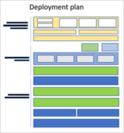

# Zero Trust deployment for technology pillars

Because your organization might already have elements of Zero Trust protections already in place, this documentation set provides conceptual information to get you started and deployment plans and implementation recommendations for end-to-end adherance to Zero Trust principles. Each article acts an a checklist of deployment objectives with steps and links to more information.

You deploy Zero Trust principles across your IT infrastructure by implementing Zero Trust controls and technologies across seven technology pillars. Six of these pillars are signal sources, a control plane for enforcement, and a critical resource to be defended. Across these is the pillar that collects those signals and provides visibility for security incidents and automation and orchestration for responding to and mitigating cybersecurity threats.

:::image type="content" source="../media/diagram-zero-trust-security-elements.png" alt-text="Diagram of elements of visibility, automation, and orchestration in Zero Trust." border="false":::

The following articles provide conceptual information and deployment objectives for these seven technology pillars. Use these articles to assess your readiness and build a deployment plan to apply [Zero Trust principles](../zero-trust-overview.md).

 

<table border="0">
   <tbody>
      <tr>
         <td>
            

         </td>
         <td>
            
<strong><a href="https://learn.microsoft.com/security/zero-trust/deploy/identity">Identities</a></strong> 

            
Identities—whether they represent people, services, or IoT devices—define the Zero Trust control plane. When an identity attempts to access a resource, verify that identity with strong authentication, and ensure access is compliant and typical for that identity. Also follow least privilege access principles.

         </td>
         <!--<td>
            

         </td>-->
      </tr>
      <tr>
         <td>
            

         </td>
         <td>
            
<strong><a href="https://learn.microsoft.com/security/zero-trust/deploy/endpoints">Endpoints</a></strong> 

            
Once an identity has been granted access to a resource, data can flow to a variety of different endpoints (devices), from IoT devices to smartphones, BYOD to partner-managed devices, and on-premises workloads to cloud-hosted servers. This diversity creates a massive attack surface area. Monitor and enforce device health and compliance for secure access.

         </td>
         <!--<td>
            

         </td>-->
      </tr>
      <tr>
         <td>
            

         </td>
         <td>
            
<strong><a href="https://learn.microsoft.com/security/zero-trust/deploy/applications">Applications</a></strong>

            
Applications and APIs provide the interface by which data is consumed. They may be legacy on-premises workloads, lifted-and-shifted to cloud workloads, or modern SaaS applications. Apply controls and technologies to discover shadow IT, ensure appropriate in-app permissions, gate access based on real-time analytics, monitor for abnormal behavior, control user actions, and validate secure configuration options.

         </td>
         <!--<td>
            

         </td>-->
      </tr>
      <tr>
         <td>
            

         </td>
         <td>
            
<strong><a href="https://learn.microsoft.com/security/zero-trust/deploy/data">Data</a></strong>

            
Ultimately, security teams are protecting data. Where possible, data should remain safe even if it leaves the devices, apps, infrastructure, and networks the organization controls. Classify, label, and encrypt data, and restrict access based on those attributes.

         </td>
         <!--<td>
            

         </td>-->
      </tr>
      <tr>
         <td>
            

         </td>
         <td>
            
<strong><a href="https://learn.microsoft.com/security/zero-trust/deploy/infrastructure">Infrastructure</a></strong>

            
Infrastructure—whether on-premises servers, cloud-based VMs, containers, or micro-services—represents a critical threat vector. Assess for version, configuration, and JIT access to harden defense. Use telemetry to detect attacks and anomalies, and automatically block and flag risky behavior and take protective actions.

         </td>
         <!--<td>
            

         </td>-->
      </tr>
      <tr>
         <td>
            

         </td>
         <td>
            
<strong><a href="https://learn.microsoft.com/security/zero-trust/deploy/networks">Networks</a></strong>

            
All data is ultimately accessed over network infrastructure. Networking controls can provide critical controls to enhance visibility and help prevent attackers from moving laterally across the network. Segment networks (and do deeper in-network micro-segmentation) and deploy real-time threat protection, end-to-end encryption, monitoring, and analytics.

         </td>
         <!--<td>
            

         </td>-->
      </tr>
      <tr>
         <td>
            

         </td>
         <td>
            
<strong><a href="https://learn.microsoft.com/security/zero-trust/deploy/visibility-automation-orchestration">Visibility, automation, and orchestration</a></strong> 

            
In our Zero Trust guides, we define the approach to implement an end-to-end Zero Trust methodology across identities, endpoints (devices), data, apps, infrastructure, and network. These activities increase your visibility, which gives you better data for making trust decisions. With each of these individual areas generating their own relevant alerts, we need an integrated capability to manage the resulting influx of data to better defend against threats and validate trust in a transaction.

         </td>
         <!--<td>
            

         </td>-->
      </tr>
   </tbody>
</table>

<!---

|  |  |
| --- | --- |
|  | [Secure identity with Zero Trust](identity.md)    Identities—whether they represent people, services, or IoT devices—define the Zero Trust control plane. When an identity attempts to access a resource, verify that identity with strong authentication, and ensure access is compliant and typical for that identity. Follow least privilege access principles. |
| | [Secure endpoints with Zero Trust](endpoints.md)    Once an identity has been granted access to a resource, data can flow to a variety of different endpoints (devices), from IoT devices to smartphones, BYOD to partner-managed devices, and on-premises workloads to cloud-hosted servers. This diversity creates a massive attack surface area. Monitor and enforce device health and compliance for secure access. |
|  | [Secure applications with Zero Trust](applications.md)    Applications and APIs provide the interface by which data is consumed. They may be legacy on-premises workloads, lifted-and-shifted to cloud workloads, or modern SaaS applications. Apply controls and technologies to discover shadow IT, ensure appropriate in-app permissions, gate access based on real-time analytics, monitor for abnormal behavior, control user actions, and validate secure configuration options. |
|  | [Secure data with Zero Trust](data.md)    Ultimately, security teams are protecting data. Where possible, data should remain safe even if it leaves the devices, apps, infrastructure, and networks the organization controls. Classify, label, and encrypt data, and restrict access based on those attributes. |
|  | [Secure infrastructure with Zero Trust](infrastructure.md)    Infrastructure—whether on-premises servers, cloud-based VMs, containers, or micro-services—represents a critical threat vector. Assess for version, configuration, and JIT access to harden defense. Use telemetry to detect attacks and anomalies, and automatically block and flag risky behavior and take protective actions. |
|  | [Secure networks with Zero Trust](networks.md)    All data is ultimately accessed over network infrastructure. Networking controls can provide critical controls to enhance visibility and help prevent attackers from moving laterally across the network. Segment networks (and do deeper in-network micro-segmentation) and deploy real-time threat protection, end-to-end encryption, monitoring, and analytics. |
|  | [Visibility, automation, and orchestration with Zero Trust](visibility-automation-orchestration.md)    In our Zero Trust guides, we define the approach to implement an end-to-end Zero Trust methodology across identities, endpoints (devices), data, apps, infrastructure, and network. These activities increase your visibility, which gives you better data for making trust decisions. With each of these individual areas generating their own relevant alerts, we need an integrated capability to manage the resulting influx of data to better defend against threats and validate trust in a transaction. |

--->

## Additional Zero Trust resources

Use these additional Zero Trust resources based on a documentation set or roles in your organization.

### Documentation set

Follow this table for the best Zero Trust documentation sets for your needs.

| Documentation set | Helps you... | Roles |
| --- | --- | --- |
| [Adoption framework](../adopt/zero-trust-adoption-overview.md) for phase and step guidance for key business solutions and outcomes | Apply Zero Trust protections from the C-suite to the IT implementation. | Security architects, IT teams, and project managers |
| [Zero Trust for small businesses](../guidance-smb-partner.md) | Apply Zero Trust principles to small business customers. | Customers and partners working with Microsoft 365 for business |
| [Zero Trust Rapid Modernization Plan (RaMP)](../zero-trust-ramp-overview.md) for project management guidance and checklists for easy wins | Quickly implement key layers of Zero Trust protection. | Security architects and IT implementers |
| [Zero Trust deployment plan with Microsoft 365](/microsoft-365/security/microsoft-365-zero-trust?bc=%2fsecurity%2fzero-trust%2fbreadcrumb%2ftoc.json&toc=%2fsecurity%2fzero-trust%2ftoc.json) for stepped and detailed design and deployment guidance | Apply Zero Trust protections to your Microsoft 365 tenant. | IT teams and security staff |
| [Zero Trust for Copilot for Microsoft 365](../zero-trust-microsoft-365-copilot.md) for stepped and detailed design and deployment guidance | Apply Zero Trust protections to Copilot for Microsoft 365. | IT teams and security staff |
| [Zero Trust for Azure services](../azure-infrastructure-overview.md) for stepped and detailed design and deployment guidance | Apply Zero Trust protections to Azure workloads and services. | IT teams and security staff |
| [Partner integration with Zero Trust](../integrate/overview.md) for design guidance for technology areas and specializations | Apply Zero Trust protections to partner Microsoft cloud solutions. | Partner developers, IT teams, and security staff |
| [Develop using Zero Trust principles](../develop/overview.md) for application development design guidance and best practices | Apply Zero Trust protections to your application. | Application developers |

### Your role

Follow this table for the best documentation sets for the roles in your organization.

| Role | Documentation set | Helps you... |
| --- | --- | --- |
| Security architect    IT project manager    IT implementer | [Adoption framework](../adopt/zero-trust-adoption-overview.md) for phase and step guidance for key business solutions and outcomes| Apply Zero Trust protections from the C-suite to the IT implementation. |
| Customer or partner for Microsoft 365 for business | [Zero Trust for small businesses](../guidance-smb-partner.md) | Apply Zero Trust principles to small business customers.  |
| Security architect    IT implementer | [Zero Trust Rapid Modernization Plan (RaMP)](../zero-trust-ramp-overview.md) for project management guidance and checklists for easy wins | Quickly implement key layers of Zero Trust protection. |
| Member of an IT or security team for Microsoft 365 | [Zero Trust deployment plan with Microsoft 365](/microsoft-365/security/microsoft-365-zero-trust?bc=%2fsecurity%2fzero-trust%2fbreadcrumb%2ftoc.json&toc=%2fsecurity%2fzero-trust%2ftoc.json) for stepped and detailed design and deployment guidance for Microsoft 365 | Apply Zero Trust protections to your Microsoft 365 tenant. |
| Member of an IT or security team for Microsoft Copilots | [Zero Trust for Copilot for Microsoft 365](../zero-trust-microsoft-365-copilot.md) for stepped and detailed design and deployment guidance | Apply Zero Trust protections to Copilot for Microsoft 365. |
| Member of an IT or security team for Azure services | [Zero Trust for Azure services](../azure-infrastructure-overview.md) for stepped and detailed design and deployment guidance | Apply Zero Trust protections to Azure workloads and services. |
| Partner developer or member of an IT or security team | [Partner integration with Zero Trust](../integrate/overview.md) for design guidance for technology areas and specializations | Apply Zero Trust protections to partner Microsoft cloud solutions. |
| Application developer | [Develop using Zero Trust principles](../develop/overview.md) for application development design guidance and best practices | Apply Zero Trust protections to your application. |

<!---

After learning about the foundational concepts, you can proceed with guidance materials to help you in your Zero Trust journey:

- Rapid Modernization Plan
- Deployment plan

| [Rapid Modernization Plan (RaMP)](/security/zero-trust/zero-trust-ramp-overview)        | [Deployment plans](/microsoft-365/security/microsoft-365-zero-trust)       |
| ------------- | ------------- |
|  |  
| If you're in the early stages in your Zero Trust journey, the RaMP guide is a good place to start.    Designed to deliver quick wins, the RaMP guide is organized by initiatives with checklists that identify critical layers of protection to get you up to speed in identifying fundamental deployment paths.   The plan identifies key stakeholders and roles so you can put together a project plan. It is presented in a chronological order with leeway for multiple teams to tackle some tasks concurrently.   [Rapid Modernization Plan](/security/zero-trust/zero-trust-ramp-overview) | For a more comprehensive guide on rolling out Zero Trust, the deployment plans provide in-depth guidance.   Unlike the checklist format of the RaMP, deployment solutions weave together resources across products and services.      Work is broken into units of work that can be configured together, helping you create a good foundation that you can build up from.    [Microsoft 365 Zero Trust deployment plan](/microsoft-365/security/microsoft-365-zero-trust) |

--->
