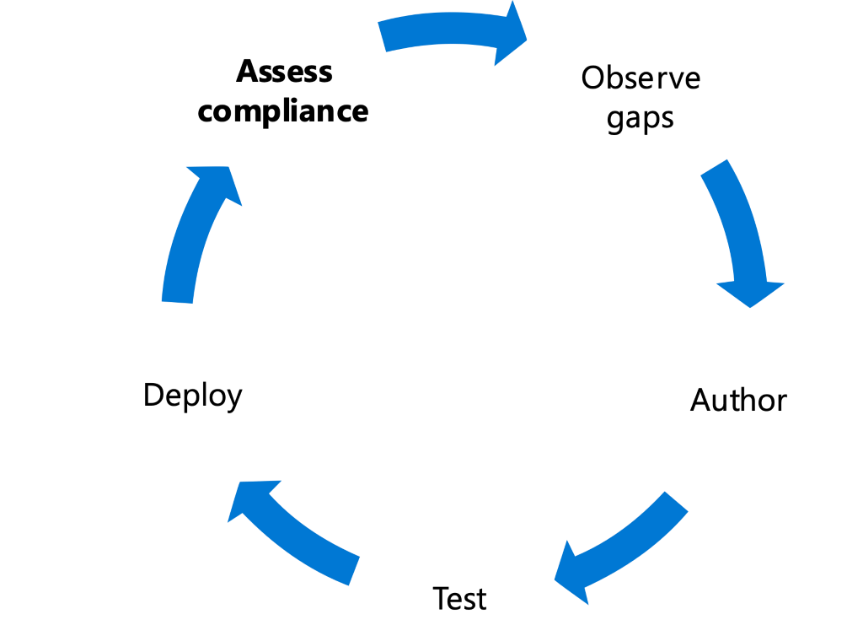

Securing infrastructure with Zero Trust
================================================================================================================

**  
Background**

Infrastructure represents a critical threat vector. IT Infrastructure,
whether on-premises or multi-cloud, is defined as all the hardware
(physical, virtual, containerized), software (open source, first- and
third-party, PaaS, SaaS), micro-services (functions, APIs), networking
infrastructure, facilities, etc. that are required to develop, test,
deliver, monitor, control, or support IT services. It is an area where
Microsoft has invested tremendous resources to develop a comprehensive
set of capabilities to secure your future cloud and on-premises
infrastructure.

Modern security with an end-to-end Zero Trust strategy makes it easier
for you to:

-   Assess for version.

-   Perform configuration management.

-   Employ Just-In-Time and Just-Enough-Access (JIT/JEA) administrative
    privileges to harden defenses.

-   Use telemetry to detect attacks and anomalies.

-   Automatically block and flag risky behavior and take protective
    actions.

Just as importantly, Microsoft Azure Blueprints and related capabilities
ensure that resources are designed, implemented, and sustained in ways
that conform to an organization's policies, standards, and requirements.

Azure Blueprints, Azure Policies, Azure Security Center, Azure Sentinel,
and Azure Sphere can greatly contribute to improving the security of
your deployed infrastructure---and enable a different approach to
defining, designing, provisioning, deploying, and monitoring your
infrastructure.

## Infrastructure Zero Trust deployment objectives

> **  
> Before** most organizations **start the Zero Trust journey, their**
> approach to infrastructure security is characterized by the following:

-   Permissions are managed manually across environments.

-   Configuration management of VMs and servers on which workloads are
    > running.

When implementing an end-to-end Zero Trust framework for managing and
monitoring your identities, we recommend you focus first on these
**initial deployment objectives**:

-   Workloads are monitored and alerted for abnormal
    > behavior.

-   Every workload is assigned an app identity.

-   Human access to resources requires Just-In-Time.

Once these are completed, focus on these **additional deployment
objectives:**

-   Unauthorized deployments are blocked, and alert is triggered.

-   Granular
    > visibility and access control are available across all workloads.

-   User and resource access is segmented for each workload.

**  
**

**  
**

**Products covered in this guide  
  
Microsoft Azure**

[Azure
Blueprints](https://azure.microsoft.com/services/blueprints/)

[Azure
Policy](https://docs.microsoft.com/azure/governance/policy/overview)

[Azure Arc](https://azure.microsoft.com/services/azure-arc)

[Azure Security Center
(ASC)](https://azure.microsoft.com/services/security-center)

[Azure
Sentinel](https://azure.microsoft.com/services/azure-sentinel/)

[Azure Resource Manager (ARM)
templates](https://docs.microsoft.com/azure/azure-resource-manager/templates/overview)

## Infrastructure Zero Trust deployment guide

This guide will walk you through the steps required to secure your
infrastructure following the principles of a Zero Trust security
framework.

Before you get started, ensure you've met these baseline infrastructure
deployment objectives.  
  
**Permissions are managed manually across environments.**

From the tenant level down to the individual resources within each
resource group ad subscription, appropriate role-based access controls
must be applied.

[Learn about implementing an end-to-end identity Zero Trust
strategy](https://aka.ms/ZTIdentity)

**Configuration management of VMS and servers on which workloads are
running.**

Just as we have managed our on-prem data center environment, we must
also ensure that we are effectively managing our cloud resources. The
benefit of leveraging Azure is the ability to manage all your VMs from
one platform using [Azure
Arc](https://azure.microsoft.com/services/azure-arc/) (preview).
Using Azure Arc, you can extend your Security Baselines from [Azure
Policy](https://docs.microsoft.com/azure/governance/policy/overview),
your [Azure Security
Center](https://azure.microsoft.com/services/security-center)
(ASC) policies, and Secure Score evaluations, as well as logging and
monitoring all your resources in one place. Here are some actions for
getting started:

#### **Implement [Azure Arc (preview)](https://azure.microsoft.com/services/azure-arc/)**

#### [Azure Arc](https://azure.microsoft.com/services/azure-arc/) allows organizations to extend the familiar security controls of Azure to on-premises and the edge of the organization's infrastructure. Administrators have several options for connecting on-premises resources to Azure Arc. These include Azure Portal, PowerShell, and Windows Installation with Service Principal scripting. 

#### [Learn more about these techniques](https://docs.microsoft.com/azure/azure-arc/).

#### **Apply security baselines through Azure Policy, including application of in-guest policies**

Enabling [ASC
Standard](https://docs.microsoft.com/azure/security-center/security-center-get-started)
will allow you to incorporate a set of baseline controls through Azure
Policy by incorporating the [Azure Policy built-in policy definitions
for Azure Security
Center](https://docs.microsoft.com/azure/security-center/policy-samples).
The set of baseline policies will be reflected in the [ASC secure
score](https://docs.microsoft.com/azure/security-center/security-center-secure-score),
where you can measure your compliance to those policies.

You can extend your coverage of policies beyond the ASC set and create
custom policies if a built-in is not available. You and can also
incorporate [Guest Configuration
policies](https://docs.microsoft.com/azure/governance/policy/how-to/guest-configuration-create)
which will measure compliance inside your guest VMs within your
subscriptions.

**Apply ASC Endpoint Protection and Vulnerability Management controls**

Endpoint protection is essential to ensuring infrastructure remains
secure and available. As part of any endpoint protection and
vulnerability management strategy, you will be able to measure
compliance centrally to ensure malware protection is enabled and
configured through the [Endpoint protection assessment and
recommendations in Azure Security
Center](https://docs.microsoft.com/azure/security-center/security-center-endpoint-protection).  
Additionally, as part of ASC Standard, you can use the policy [Enable
the built-in vulnerability assessment solution on virtual machines
(powered by
Qualys)](https://docs.microsoft.com/azure/security-center/built-in-vulnerability-assessment)
to scan your VMs for vulnerabilities, and have those reflected directly
in ASC. If you already have a Vulnerability scanning solution deployed
in your enterprise, you can use the alternate policy Vulnerability
assessment solution, which should be installed on your virtual machines
for [Deploying a partner vulnerability scanning
solution](https://docs.microsoft.com/azure/security-center/partner-vulnerability-assessment).

> [Learn about implementing an end-to-end Zero Trust strategy for
> endpoints](https://aka.ms/ZTEndpoints)

### 

> **Initial deployment objectives  
> **
>
> Once you've met the baseline infrastructure objectives, you can focus
> on implementing a modern infrastructure with an end-to-end Zero Trust
> strategy.

### **Workloads are monitored and alerted to abnormal behavior.**  When you create new infrastructure, you need to ensure that you also establish rules for monitoring and raising alerts. This is key for identifying when a resource is displaying unexpected behavior. 

**Enabling [Azure Security Center with Standard
Tier](https://docs.microsoft.com/azure/security-center/security-center-get-started)
(ASC)**, including the relevant bundles to cover your various resources
(e.g., Container Registry, Kubernetes, IoT, Virtual Machines, etc.) is
highly recommended.

For monitoring identities, we recommend **enabling [Azure Advanced
Threat
Protection](https://docs.microsoft.com/azure-advanced-threat-protection/what-is-atp)
(A-ATP) and [Advanced Threat
Analytics](https://docs.microsoft.com/advanced-threat-analytics/what-is-ata)
(ATA)** in order to enable signal collection to identify, detect, and
investigate advanced threats, compromised identities, and malicious
insider actions directed at your organization.

Integrating these signals from ASC, A-ATP, ATA, and other monitoring and
auditing systems with [Azure
Sentinel](https://docs.microsoft.com/azure/sentinel/overview), a
cloud-native, security information event management (SIEM) and security
orchestration automated response (SOAR) solution, will allow your
Security Operations Center (SOC) to work from a single pane of glass to
monitor security events across your enterprise.

> [Learn about implementing an end-to-end identity Zero Trust
> strategy](https://aka.ms/ZTIdentity)

I.  **Every workload is assigned an app identity---and configured and
    deployed consistently.**

Microsoft recommends customers use a
[policy](https://docs.microsoft.com/azure/governance/policy/tutorials/create-and-manage)
that is assigned and enforced when creating resources/workloads.
Policies can require tags be to applied to a resource upon creation,
mandate resource group assignment, as well as restrict/direct technical
characteristics, such as regions allowed, VM specifications (e.g., VM
type, disks, network policies applied).

> [Learn about implementing an end-to-end Zero Trust strategy for
> applications](https://aka.ms/ZTApplications)

I.  **Human access to resources requires Just-In-Time.**

Personnel should use administrative access sparingly. When
administrative functions are required, users should receive temporary
administrative access.

Organizations should establish a [Protect the
Administrator](https://www.microsoft.com/itshowcase/protecting-high-risk-environments-with-secure-admin-workstations)
program. Characteristics of these programs include:

-   Targeted reduction in the number of users with administrative
    permissions.

-   Auditing elevated permission accounts and roles.

-   Creating special High-Value Asset (HVA) infrastructure zones to
    reduce surface area.

-   Giving administrators special Secure Admin Workstations (SAWs) to
    reduce the likelihood of credential theft.

All of these items help an organization become more aware of how
administrative permissions are being used, where these permissions are
still necessary, and provide a roadmap for how to operate more securely.

> **Additional
> deployment objectives**
>
> Once you've accomplished your initial three objectives, you can focus
> on additional objectives such as blocking unauthorized deployments.

I.  **Identities unauthorized deployments are blocked, and alert is
    triggered.**

When organizations move to the cloud, the possibilities are limitless.
That's not always a good thing. For a variety of reasons, organizations
need to be able to block unauthorized deployments and trigger alerts to
make leaders and managers aware of the issues.

Microsoft Azure offers [Azure
Blueprints](https://docs.microsoft.com/azure/governance/blueprints/overview)
to govern how resources are deployed, ensuring that only approved
resources (e.g., ARM templates) can be deployed. Blueprints can ensure
that resources which do not meet the Blueprint's policies or other rules
are blocked from deployment. Actual or attempted Blueprint violation can
raise alerts as needed and make notifications, activate webhooks or
automation runbooks, or even create service management tickets.

I.  **Granular visibility and access control are available across
    workloads.**

Microsoft Azure offers a variety of methods to achieve resource
[visibility](https://aka.ms/ZTCrossPillars). From the Azure Portal,
resource owners can set up many metric and log collection and analysis
capabilities. This visibility can be used not only to feed security
operations but can also to support computing efficiency and
organizational objectives. These include capabilities like [VM Scale
Sets](https://docs.microsoft.com/azure/virtual-machine-scale-sets/overview),
which allow for the secure and efficient scaling out and scaling in of
resources based on metrics.

On the access control side, [Role-Based Access Control
(RBAC)](https://docs.microsoft.com/azure/role-based-access-control/overview)
can be employed to assign permissions to resources. This allows
permissions to be assigned and revoked uniformly at the individual and
group levels by using a variety of built-in or custom roles.

I.  **User and resource access segmented for each workload.**

Microsoft Azure offers many ways to segment workloads to manage user and
resource access. [Network
segmentation](https://docs.microsoft.com/azure/architecture/reference-architectures/hybrid-networking/network-level-segmentation)
is the overall approach, and, within Azure, resources can be isolated at
the subscription level with Virtual networks (VNets), VNet peering
rules, Network Security Groups (NSGs), Application Security Groups
(ASGs), and Azure Firewalls. There are several design patterns to
determine the best approach to segmenting workloads.

> [Learn about implementing an end-to-end Zero Trust strategy for your
> network](https://aka.ms/ZTNetwork)

Conclusion

Infrastructure is central to a successful Zero Trust strategy. For
further information or help with implementation, please contact your
Customer Success team, or continue to read through the other chapters of
this guide, which spans all Zero Trust pillars.

**The Zero Trust deployment guide series**

|  |  |  |  |  |  |  |    |
|----------------------------------------------------------------------------|-----------------------------------------------------------------------------|-----------------------------------------------------------------------------|-----------------------------------------------------------------------------|-----------------------------------------------------------------------------|---------------------------------------------------------------------------|-----------------------------------------------------------------------------|-------------------------------------------------------------------------------|
| [[Introduction]{.ul}](https://aka.ms/ZTDeploymentGuideIntroduction)        | [[Identity]{.ul}](https://aka.ms/ZTIdentity)                                | [[Endpoints]{.ul}](https://aka.ms/ZTEndpoints)                              | [[Applications]{.ul}](https://aka.ms/ZTApplications)                        | [[Data]{.ul}](https://aka.ms/ZTData)                                        | [[Network]{.ul}](https://aka.ms/ZTNetwork)                                | [[Infrastructure]{.ul}](https://aka.ms/ZTInfrastructure)                    | [[Visibility, Automation, Orchestration]{.ul}](https://aka.ms/ZTCrossPillars) |
