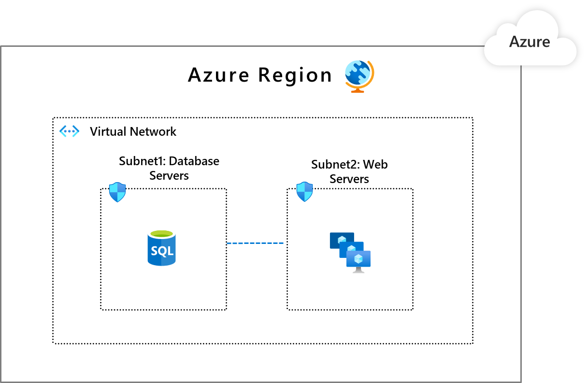

# Securing networks with Zero Trust

Big data presents new opportunities to derive new insights and gain a competitive edge. We are moving away from an era where networks were clearly defined and usually specific to a certain location. The cloud, mobile devices, and other [endpoints](https://aka.ms/ZTEndpoints) expand the boundaries and change the paradigm. Now there isn't necessarily a contained/defined network to secure. Instead, there is a vast portfolio of devices and networks, all linked by the cloud.

Instead of believing everything behind the corporate firewall is safe, an end-to-end Zero Trust strategy assumes breaches are inevitable. That means you must verify each request as if it originates from an uncontrolled network---[identity](https://aka.ms/ZTIdentity) management plays a crucial role in this.

In the Zero Trust model, there are three key objectives when it comes to securing your networks:

- Be ready to handle attacks before they happen.

- Minimize the extent of the damage and how fast it spreads.

- Increase the difficulty of compromising your cloud footprint.

To make this happen, we follow three Zero Trust principles:

- **Verify explicitly.** Always authenticate and authorize based on all available data points, including user identity, location, device health, service or workload, data classification, and anomalies.

- **Use least-privileged access.** Limit user access with Just-In-Time and Just-Enough-Access (JIT/JEA), risk-based adaptive polices, and data protection to protect both data and productivity.

- **Assume breach.** Minimize blast radius for breaches and prevent lateral movement by segmenting access by network, user, devices, and application awareness. Verify all sessions are encrypted end to end. Use analytics to get [visibility](https://aka.ms/ZTCrossPillars), drive threat detection, and improve defenses.

## Network Zero Trust deployment objectives

> **Before** most organization **start the Zero Trust journey**, they have network security that is characterized by the following:

- Few network security perimeters and open, flat networks.

- Minimal threat protection and static traffic filtering.

- Unencrypted internal traffic.

When implementing an end-to-end Zero Trust framework for securing networks, we recommend you focus first on these **initial deployment objectives**:

-  Network segmentation. Many ingress/egress cloud micro-perimeters with some micro-segmentation.

- Threat protection. Cloud-native filtering and protection for known threats.

- Encryption. User-to-app internal traffic is encrypted.

Once these are completed, focus on these **additional deployment objectives**:

- Network segmentation. Fully distributed ingress/egress cloud micro-perimeters and deeper micro-segmentation.

- Threat protection. Machine learning-based threat protection and filtering with context-based signals.

- Encryption. All traffic is encrypted.

## Products covered in this guide

**Microsoft Azure**

[Azure Networking](https://docs.microsoft.com/azure/networking/)

[Virtual Networks and Subnets](https://docs.microsoft.com/azure/virtual-network/virtual-networks-overview)

[Network Security Groups](https://docs.microsoft.com/azure/virtual-network/security-overview)
and [Application Security Groups](https://docs.microsoft.com/azure/virtual-network/application-security-groups)

[Azure Firewall](https://docs.microsoft.com/azure/firewall/overview)

[Azure DDoS Protection](https://docs.microsoft.com/azure/virtual-network/ddos-protection-overview)

[Azure Web Application Firewall](https://docs.microsoft.com/azure/web-application-firewall/ag/ag-overview)

[Azure VPN Gateway](https://docs.microsoft.com/azure/vpn-gateway/vpn-gateway-about-vpngateways)

[Azure ExpressRoute](https://docs.microsoft.com/azure/expressroute/expressroute-introduction)

[Azure Network Watcher](https://docs.microsoft.com/azure/network-watcher/network-watcher-monitoring-overview)

## Networking Zero Trust deployment guide

This guide will walk you through the steps required to secure your networks following the principles of a Zero Trust security framework.

## Initial deployment objectives

### Network segmentation: Many ingress/egress cloud micro-perimeters with some micro-segmentation.

Organizations should not just have one single, big pipe in and out of their network. In a Zero Trust approach, networks are instead segmented into smaller islands where specific workloads are contained. Each segment has its own ingress and egress controls to minimize the "blast radius" of unauthorized access to data. By implementing software-defined perimeters with granular controls, you increase the difficulty for unauthorized actors to propagate throughout your network, and so reduce the lateral movement of threats.

There is no architecture design that fits the needs of all organizations. You have the option between a few [common design patterns](https://www.microsoft.com/security/blog/2020/06/15/zero-trust-part-1-networking/) for segmenting your network according to the Zero Trust model.

In this deployment guide, we'll walk you through the steps to achieve one of those designs: Micro-segmentation.

With micro-segmentation, organizations can move beyond simple centralized network-based perimeters to comprehensive and distributed segmentation using software-defined micro-perimeters.  
  
**Applications are partitioned to different Azure Virtual Networks
(VNets) and connected using a hub-spoke model**

Follow these steps:

1.  [Create dedicated virtual networks](https://docs.microsoft.com/azure/virtual-network/quick-create-portal) for different applications and/or application components.

2.  Create a central VNet to set up the security posture for inter-app connectivity and connect the app VNets in [a hub-and-spoke architecture](https://docs.microsoft.com/azure/architecture/reference-architectures/hybrid-networking/hub-spoke).

3.  [Deploy Azure Firewall](https://docs.microsoft.com/azure/firewall/deploy-ps) in the hub VNet to inspect and govern traffic between the VNets.

### Threat protection: Cloud native filtering and protection for known threats

Cloud applications that have opened up endpoints to external environments, such as the internet or your on-premises footprint, are at risk of attacks coming in from those environments. It is therefore imperative that you scan the traffic for malicious payloads or logic.

These types of threats fall into two broad categories:

- **Known attacks**. Threats that have been discovered by your software provider or the larger community. In such cases, the attack signature is available and you need to ensure that each request is checked against those signatures. The key is to be able to quickly update your detection engine with any newly identified attacks.

- **Unknown attacks.** These are threats that don't quite match against any known signature. These types of threats include zero-day vulnerabilities and unusual patterns in request traffic. The ability to detect such attacks depends on how well your defenses know what's normal and what is not. Your defenses should be constantly learning and updating such patterns as your business (and associated traffic) evolves.

Take these steps to protect against known threats:

1.  **For endpoints with HTTP/S traffic**, protect using [Azure Web Application Firewall (WAF)](https://docs.microsoft.com/azure/web-application-firewall/overview) by:

    b.  Turning on the bot protection ruleset to prevent malicious bots from scraping information, conducting credential stuffing, etc.

    c.  Adding custom rules to protect against threats specific to your business.

  You can use one of two options:

 [Azure Front Door](https://docs.microsoft.com/azure/frontdoor/front-door-overview)

    a.  [Create a Web Application Firewall policy on Azure Front Door](https://docs.microsoft.com/azure/web-application-firewall/afds/waf-front-door-create-portal).

    b.  [Configure bot protection for Web Application Firewall](https://docs.microsoft.com/azure/web-application-firewall/afds/waf-front-door-policy-configure-bot-protection).

    c.  [Custom rules for Web Application Firewall](https://docs.microsoft.com/azure/web-application-firewall/afds/waf-front-door-custom-rules-powershell).

 [Azure Application Gateway](https://docs.microsoft.com/azure/application-gateway/overview)

    a.  [Create an application gateway with a Web Application Firewall](https://docs.microsoft.com/azure/web-application-firewall/ag/application-gateway-web-application-firewall-portal).

    b.  [Configure bot protection for Web Application Firewall](https://docs.microsoft.com/azure/web-application-firewall/ag/bot-protection).

    c.  [Create and use Web Application Firewall v2 custom rules.](https://docs.microsoft.com/azure/web-application-firewall/ag/create-custom-waf-rules).

2.  **For all endpoints (HTTP or not)**, front with [Azure Firewall](https://docs.microsoft.com/azure/firewall/overview) for threat intelligence-based filtering at Layer 4:

    a.  [Deploy and configure Azure Firewall](https://docs.microsoft.com/azure/firewall/tutorial-firewall-deploy-portal) using the Azure portal.

    b.  [Enable threat intelligence-based filtering](https://docs.microsoft.com/azure/firewall/threat-intel) for your traffic.

[Learn about implementing an end-to-end Zero Trust strategy for endpoints](https://aka.ms/ZTEndpoints).

### User-to-app internal traffic is encrypted.

The third initial objective to focus on is adding encryption to ensure user-to-app internal traffic is encrypted.

Follow these steps:

1.  Enforce HTTPS-only communication for your internet facing web applications by [redirecting HTTP traffic to HTTPS using Azure Front Door](https://docs.microsoft.com/azure/frontdoor/front-door-how-to-redirect-https).

2.  Connect remote employees/partners to Microsoft Azure using the [Azure VPN Gateway](https://docs.microsoft.com/azure/vpn-gateway/vpn-gateway-about-vpngateways).

    a.  [Turn on encryption](https://docs.microsoft.com/azure/vpn-gateway/vpn-gateway-security-controls#data-protection) for any point-to-site traffic in Azure VPN Gateway service.

3.  Access your Azure virtual machines securely using encrypted communication via [Azure Bastion](https://docs.microsoft.com/azure/bastion/bastion-overview).

    a.  [Connect using SSH to a Linux virtual machine](https://docs.microsoft.com/azure/bastion/bastion-connect-vm-ssh).

    b.  [Connect using RDP to a Windows virtual machine](https://docs.microsoft.com/azure/bastion/bastion-connect-vm-rdp).

[Learn about implementing an end-to-end Zero Trust strategy for applications](https://aka.ms/ZTApplications).

## Additional deployment objectives

### Fully distributed ingress/egress cloud micro-perimeters and deeper micro-segmentation

Once you've accomplished your initial three objectives, the next step is to further segment your network.

**Partition app components to different subnets**

Follow these steps:

1.  Within the VNet, [add virtual network subnets](https://docs.microsoft.com/azure/virtual-network/virtual-network-manage-subnet) so that discrete components of an application can have their own perimeters.

2.  [Apply network security group rules](https://docs.microsoft.com/azure/virtual-network/tutorial-filter-network-traffic#create-security-rules) to allow traffic only from the subnets that have an app subcomponent identified as a legitimate communications counterpart.

**Segment and enforce the external boundaries**

Follow these steps, depending on the type of boundary:

**Internet boundary**

1.  If internet connectivity is required for your application that needs to be routed via the hub VNet, [update the network security group rules](https://docs.microsoft.com/azure/virtual-network/tutorial-filter-network-traffic) in hub VNet to allow internet connectivity.

2.  [Turn on Azure DDoS Protection Standard](https://docs.microsoft.com/azure/virtual-network/manage-ddos-protection#enable-ddos-for-an-existing-virtual-network)
    to protect the hub VNet from volumetric network layer attacks.

3.  If your application uses HTTP/S protocols, [turn on Azure Web Application Firewall](https://docs.microsoft.com/azure/web-application-firewall/afds/waf-front-door-custom-rules-powershell) to protect against Layer 7 threats.

**On-premises boundary**

1.  If your app needs connectivity to your on-premise data center, [use Azure ExpressRoute](https://docs.microsoft.com/azure/expressroute/expressroute-howto-circuit-portal-resource-manager) of Azure VPN [for connectivity to your hub VNet](https://docs.microsoft.com/azure/vpn-gateway/vpn-gateway-howto-site-to-site-resource-manager-portal).

2.  [Configure the Azure Firewall](https://docs.microsoft.com/azure/firewall/tutorial-hybrid-ps) in the hub VNet to inspect and govern traffic.

**PaaS services boundary**

1.  When using Azure-provided PaaS services (e.g., Azure Storage, [Azure Cosmos DB](https://docs.microsoft.com/azure/private-link/create-private-endpoint-cosmosdb-portal),
    or [Azure Web App](https://docs.microsoft.com/azure/private-link/create-private-endpoint-webapp-portal), use the [PrivateLink](https://docs.microsoft.com/azure/private-link/create-private-link-service-portal) connectivity option to ensure all data exchanges are over the private IP space and the traffic never leaves the Microsoft network.

[Learn about implementing an end-to-end Zero Trust strategy for data](https://aka.ms/ZTData).

### Threat protection: Machine learning-based threat protection and filtering with context-based signals

For further threat protection, turn on [Azure DDoS Protection Standard](https://docs.microsoft.com/azure/virtual-network/ddos-protection-overview) to constantly monitor your Azure-hosted application traffic, use ML-based frameworks to baseline and detect volumetric traffic floods, and apply automatic mitigations.

Follow these steps:

1.  [Configure and manage](https://docs.microsoft.com/azure/virtual-network/manage-ddos-protection) Azure DDoS Protection Standard.

2.  [Configure alerts](https://docs.microsoft.com/azure/virtual-network/manage-ddos-protection#configure-alerts-for-ddos-protection-metrics) for DDoS protection metrics.

### Encryption: All traffic is encrypted

Finally, complete your network protection by ensuring that all traffic is encrypted.

Follow these steps:

1.  [Encrypt application backend traffic](https://docs.microsoft.com/azure/vpn-gateway/vpn-gateway-ipsecikepolicy-rm-powershell) between virtual networks.

2.  Encrypt traffic between on-premises and cloud:

    a.  [Configure a site-to-site VPN](https://docs.microsoft.com/azure/expressroute/site-to-site-vpn-over-microsoft-peering) over ExpressRoute Microsoft peering.

    b.  [Configure IPsec transport mode](https://docs.microsoft.com/azure/expressroute/expressroute-howto-ipsec-transport-private-windows) for ExpressRoute private peering.

## Conclusion

Securing networks is central to a successful Zero Trust strategy. For further information or help with implementation, please contact your Customer Success team or continue to read through the other chapters of this guide, which spans all Zero Trust pillars.

**The Zero Trust deployment guide series**

|  |  |  |  |  |  |  |  |
|-----------------------------------------------------------------------------|-----------------------------------------------------------------------------|-----------------------------------------------------------------------------|-----------------------------------------------------------------------------|-----------------------------------------------------------------------------|----------------------------------------------------------------------------|----------------------------------------------------------------------------|-----------------------------------------------------------------------------|
| [Introduction](https://aka.ms/ZTDeploymentGuideIntroduction)                | [Identity](https://aka.ms/ZTIdentity)                                       | [Endpoints](https://aka.ms/ZTEndpoints)                                     | [Applications](https://aka.ms/ZTApplications)                               | [Data](https://aka.ms/ZTData)                                               | [Network](https://aka.ms/ZTNetwork)                                        | [Infrastructure](https://aka.ms/ZTInfrastructure)                          | [Visibility, Automation, Orchestration](https://aka.ms/ZTCrossPillars)      |
