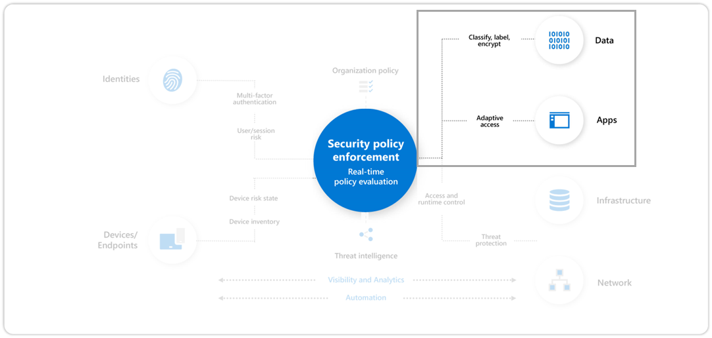
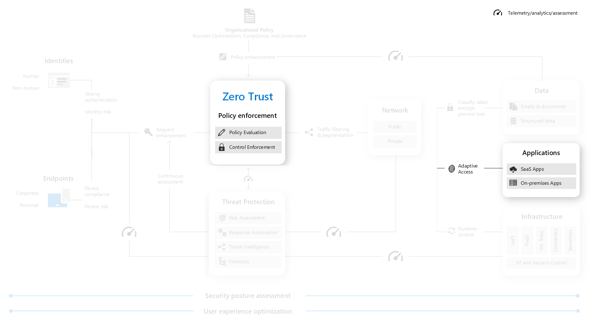
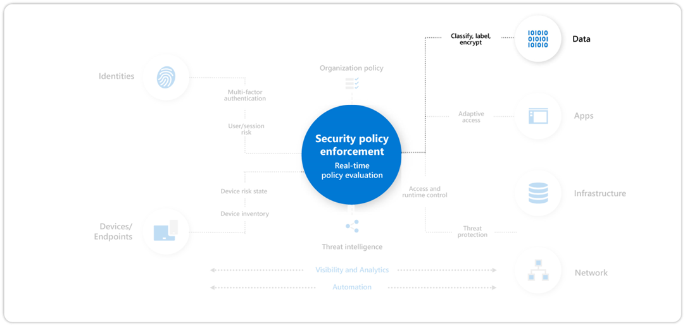

# Step 2. Increase security for accessing key resources

This step includes using Zero Trust to explicitly validate trust for all access requests for:

- Apps

  Enable Azure AD for all SaaS, for VPN authentication, and publish legacy on-premises/IaaS via App Proxy.

- Devices

  Discover and protect sensitive data (via Cloud App Security, CA App Control, Microsoft Info Protection).

After completing this step, you will have built out this part of the Zero Trust architecture.

## Apps

Content TBD

## Data

Verify and secure each identity with strong authentication across your entire digital estate with Azure Active Directory (Azure AD), a complete identity and access management solution with integrated security that connects 425 Million people to their apps, devices, and data each month.

<!--
Discover and protect sensitive data (via Cloud App Security, CA App Control, Microsoft Info Protection)

https://docs.microsoft.com/en-us/microsoft-365/compliance/information-protection?view=o365-worldwide

https://docs.microsoft.com/en-us/security/compass/protect-against-ransomware-phase1#data-protection

https://review.docs.microsoft.com/en-us/microsoft-365/solutions/protect-against-ransomware-microsoft-365-step5?view=o365-21vianet&branch=Josephd-M365-ransomware-solution
--> 

- Know your data

  Understand your data landscape and identify important information across your cloud and on-premises environment.

- Protect your data

  Protect your sensitive data throughout its lifecycle by applying sensitivity labels linked to protection actions like encryption, access restrictions, visual markings, and more.

- Prevent data loss

  Apply a consistent set of data loss prevention policies across the cloud, on-premises environments, and endpoints to monitor, prevent, and remediate risky activities with sensitive data.

You must implement data protection to ensure rapid and reliable recovery from a ransomware attack and to block some techniques of attackers.

### Program and project member accountabilities

This table describes the overall protection of your organization data from ransomware in terms of a sponsorship/program management/project management hierarchy to determine and drive results.

| Lead | Implementor | Accountability |
|:-------|:-------|:-----|
| [Central IT](/azure/cloud-adoption-framework/organize/central-it) Operations or CIO | | Executive sponsorship |
| Program lead from [Data Security](/azure/cloud-adoption-framework/organize/cloud-security-data-security) | | Drive results and cross-team collaboration |
|  | [Central IT](/azure/cloud-adoption-framework/organize/central-it) Productivity / End User |  Implement changes to Microsoft 365 tenant for OneDrive and Protected Folders |
|  | [Central IT](/azure/cloud-adoption-framework/organize/central-it) Infrastructure/Backup | Enable Infrastructure backup |
|  | Business / Application | Identify critical business assets |
|  | [Security Architecture](/azure/cloud-adoption-framework/organize/cloud-security-architecture)  | Advise on configuration and standards |
|  | [Security Policy and Standards](/azure/cloud-adoption-framework/organize/cloud-security-policy-standards) | Update standards and policy documents |
|  | [Security Compliance Management](/azure/cloud-adoption-framework/organize/cloud-security-compliance-management) | Monitor to ensure compliance |
|  | User Education Team | Ensure guidance for users reflects policy updates |

### Deployment objectives

Meet these deployment objectives to protect your data with Zero Trust.

| Done | Deployment objective | Owner | Link to steps |
|:-------|:-------|:-----|:-----|
| <input type="checkbox" /> | 1. Know your data |  |  |
| <input type="checkbox" /> | 2. Protect your data |  |  |
| <input type="checkbox" /> | 3. Prevent data loss |  |  |
| <input type="checkbox" /> | 4. Use tight permissions |  |  |

After completing these deployment objectives, you will have built out the data section of the Zero Trust architecture.

#### 1. Know your data

Perform these implementation steps to meet the **Know your data** deployment objective .

| Done | Step objective and results | Owner | Documentation |
|:-------|:-------|:-----|:-----|
| <input type="checkbox" /> | 1. Determine data classification levels |  |  |
| <input type="checkbox" /> | 2. Determine built-in and custom sensitive information types |  |  |
| <input type="checkbox" /> | 3.  |  |  |

#### 2. Protect your data

Perform these implementation steps to meet the **Protect your data** deployment objective.

| Done | Step objective and results | Owner | Documentation |
|:-------|:-------|:-----|:-----|
| <input type="checkbox" /> | 1. Determine use and design of sensitivity labels |  |  |
| <input type="checkbox" /> | 2. Enable double key encryption |  |  |
| <input type="checkbox" /> | 3. Enable Office Message Encryption (OME) |  |  |
| <input type="checkbox" /> | 4. Enable and configure Microsoft Cloud App Security |  |  |
| <input type="checkbox" /> | 5.  |  |  |

### 3. Prevent data loss

Perform these implementation steps to meet the **Prevent data loss** deployment objective.

| Done | Step objective and results | Owner | Documentation |
|:-------|:-------|:-----|:-----|
| <input type="checkbox" /> | 1. Design and create data loss prevention (DLP) policies |  |  |
| <input type="checkbox" /> | 2. Enable and configure endpoint data loss prevention |  |  |
| <input type="checkbox" /> | 3. Enable and configure Microsoft Cloud App Security |  |  |
| <input type="checkbox" /> | 4. Configure access policies for Cloud App Security Conditional Access App Control |  |  |

### 4. Use tight permissions

Perform these implementation steps to meet the **Use tight permissions** deployment objective.

| Done | Step objective and results | Owner | Documentation |
|:-------|:-------|:-----|:-----|
| <input type="checkbox" /> | 1. From the **Know your data** deployment objective, review the permissions for the locations of sensitive and critical information. |  |  |
| <input type="checkbox" /> | 2. Implement strict permissions for the sensitive and critical information while meeting collaboration and business requirements and inform the users that are affected. |  |  |
| <input type="checkbox" /> | 3. Perform change management for your users so that future locations for sensitive and critical information are created and maintained with strict permissions. |  |  |
| <input type="checkbox" /> | 4. Audit and monitor the locations for sensitive and critical information to ensure that broad permissions aren't being granted |  |  |

## Next step

Continue your Zero Trust deployment journey with [Step 3. Governance](user-access-productivity-governance.md).

