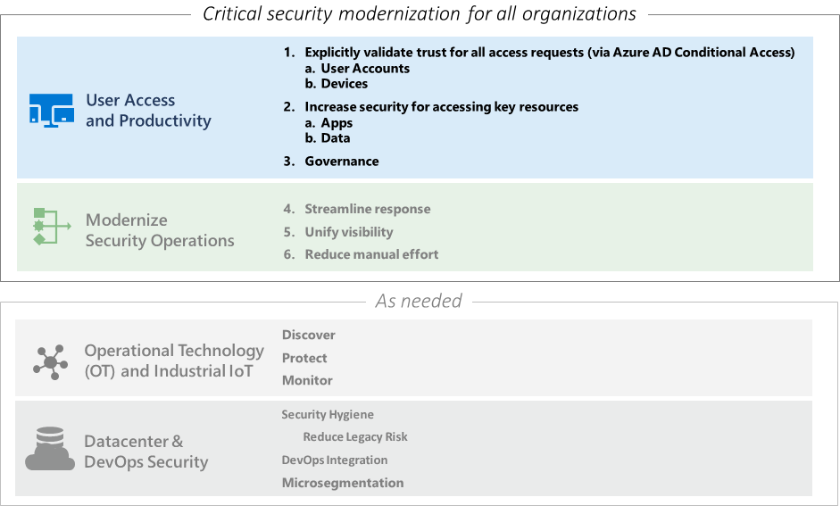

# User Access and Productivity Overview

In this Zero Trust RaMP pillar, you will build out the following part of the Zero Trust RaMP story.

This pillar is composed of these RaMP pillar scenarios:

- [Step 1. Explicitly validate trust for all access requests](user-access-productivity-validate-trust.md)

- [Step 2. Increase security for accessing key resources](user-access-productivity-increase-security-access.md)

- [Step 3. Governance](user-access-productivity-governance.md)

## Next step

Begin the User Access and Productivity Zero Trust RaMP pillar with [Step 1. Explicitly validate trust for all access requests](user-access-productivity-validate-trust.md).

