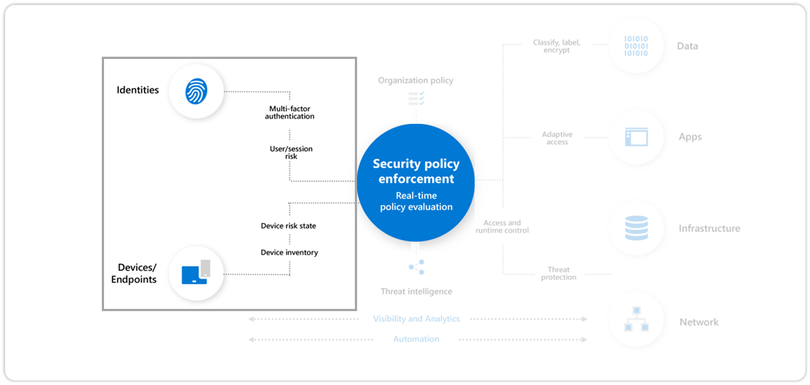
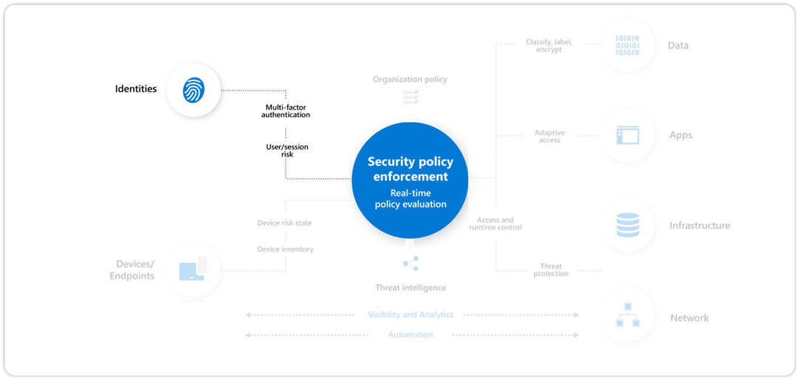
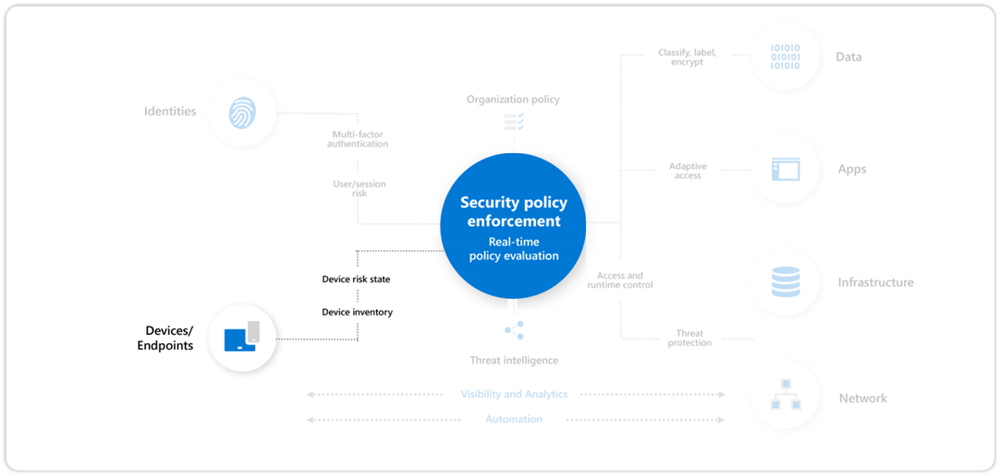

# Step 1. Explicitly validate trust for all access requests

This step includes using Zero Trust to explicitly validate trust for all access requests for:

- User Accounts

  Require Passwordless or multi-factor authentication (MFA) for all users and measure risk with threat intelligence and behavior analytics.

- Devices

  Require device integrity and health compliance for access.

After completing this step, you will have built out this part of the Zero Trust architecture.

## User accounts

Verify and secure each identity with strong authentication across your entire digital estate with Azure Active Directory (Azure AD), a complete identity and access management solution with integrated security that connects 425 Million people to their apps, devices, and data each month.

### Program and project member accountabilities

This table describes the overall protection of your user accounts in terms of a sponsorship/program management/project management hierarchy to determine and drive results.

| Lead | Implementor | Accountability |
|:-------|:-------|:-----|
| [Central IT](https://docs.microsoft.com/azure/cloud-adoption-framework/organize/central-it) sponsored by CISO, CIO, or Director of Identity | | Executive sponsorship |
| Program lead from [Identity and Key Management](https://docs.microsoft.com/azure/cloud-adoption-framework/organize/cloud-security-identity-keys) and/or [Security Architecture](https://docs.microsoft.com/azure/cloud-adoption-framework/organize/cloud-security-architecture) | | Drive results and cross-team collaboration |
|  | [Security Architecture](https://docs.microsoft.com/azure/cloud-adoption-framework/organize/cloud-security-architecture)  | Advise on configuration and standards |
| | [Security Policy and Standards](https://docs.microsoft.com/azure/cloud-adoption-framework/organize/cloud-security-policy-standards) | Update standards and policy documents |
| | [Identity and Key Management](https://docs.microsoft.com/azure/cloud-adoption-framework/organize/cloud-security-identity-keys) or [Central IT Operations](https://docs.microsoft.com/azure/cloud-adoption-framework/organize/central-it) | To implement any changes |
| | [Security Compliance Management](https://docs.microsoft.com/azure/cloud-adoption-framework/organize/cloud-security-compliance-management) | Monitor to ensure compliance |

### Deployment objectives

Meet these deployment objectives to protect your accounts with Zero Trust.

| Done | Deployment objective | Owner | Documentation |
|:-------|:-------|:-----|:-----|
| <input type="checkbox" /> | 1. Self-service password reset (SSPR) has been enabled, which gives you credential reset capabilities | IT implementer | [Plan an Azure Active Directory self-service password reset deployment](https://docs.microsoft.com/azure/active-directory/authentication/howto-sspr-deployment) |
| <input type="checkbox" /> | 2. Multi-Factor Authentication (MFA) has been enabled and appropriate methods for MFA have been selected | IT implementer | [Plan an Azure Active Directory Multi-Factor Authentication deployment](https://docs.microsoft.com/azure/active-directory/authentication/howto-mfa-getstarted) |
| <input type="checkbox" /> | 3. Combined User Registration has been enabled for your directory, allows users to register for SSPR and MFA in one step | IT implementer | [Enable combined security information registration in Azure Active Directory](https://docs.microsoft.com/azure/active-directory/authentication/howto-registration-mfa-sspr-combined) |
| <input type="checkbox" /> | 4. Configure a Conditional Access policy to require MFA registration. | IT implementer | [How To: Configure the Azure AD Multi-Factor Authentication registration policy](https://docs.microsoft.com/en-us/azure/active-directory/identity-protection/howto-identity-protection-configure-mfa-policy) |
| <input type="checkbox" /> | 5. Enable user and sign-in risk-based policies to protect user access to resources. | IT implementer | [How To: Configure and enable risk policies](https://docs.microsoft.com/azure/active-directory/identity-protection/howto-identity-protection-configure-risk-policies) |
| <input type="checkbox" /> | 6. Detect and block known weak passwords and their variants, and block additional weak terms specific to your organization. | IT implementer | [Eliminate bad passwords using Azure Active Directory Password Protection](https://docs.microsoft.com/azure/active-directory/authentication/concept-password-ban-bad) |
| <input type="checkbox" /> | 7. Microsoft Defender for Identity | IT implementer | Deploy and enable [Microsoft Defender for Identity](https://docs.microsoft.com/defender-for-identity/what-is#whats-next). Review and mitigate any open alerts. |
| <input type="checkbox" /> | 8. Passwordless credential deployment | IT implementer | [Plan a passwordless authentication deployment in Azure Active Directory](https://docs.microsoft.com/azure/active-directory/authentication/howto-authentication-passwordless-deployment) |

You have now built out the identities section of the Zero Trust architecture.

## Devices

Ensure compliance and health status before granting access to your devices (endpoint) and gain visibility into how they are accessing the network. 

### Program and project member accountabilities

This table describes the overall protection of your devices in terms of a sponsorship/program management/project management hierarchy to determine and drive results.

| Lead | Implementor | Accountability |
|:-------|:-------|:-----|
| [Central IT](/azure/cloud-adoption-framework/organize/central-it) Operations or CIO | | Executive sponsorship |
| Program lead from [Central IT](/azure/cloud-adoption-framework/organize/central-it) infrastructure | | Drive results and cross-team collaboration |
|  | [Security Architecture](/azure/cloud-adoption-framework/organize/cloud-security-architecture)  | Advise on configuration and standards |
| | [Security Policy and Standards](/azure/cloud-adoption-framework/organize/cloud-security-policy-standards) | Update standards and policy documents |
| | [Security Compliance Management](/azure/cloud-adoption-framework/organize/cloud-security-compliance-management) | Monitor to ensure compliance |
|

### Deployment objectives

Meet these deployment objectives to protect your devices with Zero Trust.

| Done | Deployment objective | Owner | Documentation |
|:-------|:-------|:-----|:-----|
| <input type="checkbox" /> | 1.   |  | link |
| <input type="checkbox" /> |  |  | link |
| <input type="checkbox" /> |  |  | link |
| <input type="checkbox" /> |  |  | link |
|

You have now built out the devices section of the Zero Trust architecture.

## Next step

Continue your Zero Trust deployment journey with [Step 2. Increase security for accessing key resources](user-access-productivity-increase-security-access.md).

