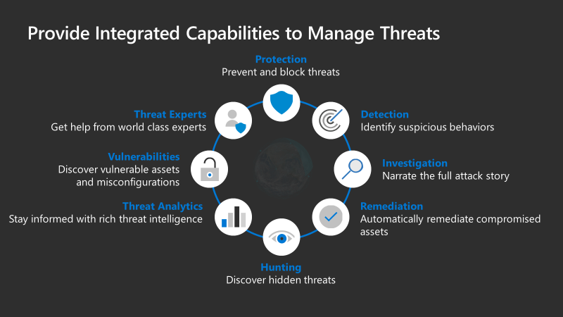

# Visibility, automation, and orchestration with Zero Trust

:::image type="icon" source="./media/icon-gear-medium.png":::

One of the significant changes in perspectives that is a hallmark of a Zero Trust security frameworks is moving away from trust-by-default toward trust-by-exception. However, you need some reliable way to establish trust once trust is needed. Since you no longer assume that requests are trustworthy, establishing a means to attest to the trustworthiness of the request is critical to proving its point-in-time trustworthiness. This attestation requires the ability to gain visibility into the activities on and around the request.

In our other Zero Trust guides, we defined the approach to implementing an end-to-end Zero Trust approach across [identities](https://microsoft.sharepoint.com/teams/ZeroTrust768/Shared%20Documents/Deployment%20Guidance/Zero%20Trust%20deployment%20guidance/7.%20Visibility%20automation%20orchestration/aka.ms/ZTIdentity), [endpoints](https://microsoft.sharepoint.com/teams/ZeroTrust768/Shared%20Documents/Deployment%20Guidance/Zero%20Trust%20deployment%20guidance/7.%20Visibility%20automation%20orchestration/aka.ms/ZTEndpoints) and devices, [data](https://microsoft.sharepoint.com/teams/ZeroTrust768/Shared%20Documents/Deployment%20Guidance/Zero%20Trust%20deployment%20guidance/7.%20Visibility%20automation%20orchestration/aka.ms/ZTData), [apps](https://microsoft.sharepoint.com/teams/ZeroTrust768/Shared%20Documents/Deployment%20Guidance/Zero%20Trust%20deployment%20guidance/7.%20Visibility%20automation%20orchestration/aka.ms/ZTApplications), [infrastructure](https://microsoft.sharepoint.com/teams/ZeroTrust768/Shared%20Documents/Deployment%20Guidance/Zero%20Trust%20deployment%20guidance/7.%20Visibility%20automation%20orchestration/aka.ms/ZTInfrastructure), and [network](https://microsoft.sharepoint.com/teams/ZeroTrust768/Shared%20Documents/Deployment%20Guidance/Zero%20Trust%20deployment%20guidance/7.%20Visibility%20automation%20orchestration/aka.ms/ZTNetwork). All these investments increase your visibility, which gives you better data for making trust decisions. However, by adopting a Zero Trust approach in these six areas, you necessarily increase the number of incidents Security Operation Centers (SOC) analysts need to mitigate. Your analysts become busier than ever, at a time when there is already a talent shortage. This can lead to chronic alert fatigue and analysts missing critical alerts.

With each of these individual areas generating their own relevant alerts, we need an integrated capability to manage the resulting influx of data to better defend against threats and validate trust in a transaction.

You want the ability to:

-  Detect threats and vulnerabilities.
-  Investigate.
-  Respond.
-  Hunt.
-  Provide additional context through threat analytics.
-  Assess vulnerabilities.
-  Get help from world class experts
-  Prevent or block events from happening across the pillars.

Managing threats includes reactive as well as proactive detection and requires tools that support both.

**Reactive detection** is when incidents are triggered from one of thesix p illars that can be investigated. Additionally, a management product like a SIEM will likely support another layer of analytics that will enrich and correlate data, resulting in flagging an incident as bad. The next step would then be to investigate to get the full narrative of the attack.

**Proactive detection** is when you apply hunting to the data to prove a compromised hypothesis. Threat hunting starts with the assumption you have been breached--you hunt for proof that there is indeed a breach.

Threat hunting starts with a hypothesis based on current threats, such as COVID-19 phishing attacks. Analysts start with this hypothetical threat, identify the key indicators of compromise, and hunt through the data to see if there is proof that the environment has been compromised. If indicators exist, hunting scenarios may result in analytics that would notify the organizations if the certain indicators occurs again.

Either way, once an incident is detected, you need to investigate it to build out the complete story of the attack. What else did the user do? What other systems were involved? What executables were run?

If an investigation results in actionable learnings, you can take remediation steps. For example, if an investigation uncovers gaps in a zero trust deployment, policies can be modified to address these gaps and prevent future unwanted incidents. Whenever possible it is desirable to automate remediation steps, because it reduces the time it takes for a SOC analyst to address the threat and move onto the next incident.

Another key component in the assessment of threats is incorporating known threat intelligence against the ingested data. If an IP, hash, URL, file, executable, etc. are known to be bad, they can be identified, investigated, and remediated.

In the [infrastructure](https://aka.ms/ZTInfrastructure) pillar, time was spent on addressing vulnerabilities. If a system is known to be vulnerable and a threat took advantage of that vulnerability, this is something that could be detected, investigated, and remediated.

In order to use these tactics to manage threats, you should have a central console to allow SOC administrators to detect, investigate, remediate, hunt, utilize threat intelligence, understand known vulnerabilities, lean on threat experts and block threats across any of the six pillars. The tools needed to support these phases work best if
converged into a single workflow, providing a seamless experience that increases the effectiveness of the SOC analyst.

Security Operation Centers often deploy a combination of SIEM and SOAR technologies to collect, detect, investigate, and respond to threats. Microsoft offers Azure Sentinel as its SIEM-as-a-service offering. Azure Sentinel ingests all Microsoft Azure Threat Protection (Azure ATP) and third-party data.

Microsoft Threat Protection (MTP), a key feed into Azure Sentinel, provides a unified enterprise defense suite that brings context-aware protection, detection, and response across all Microsoft 365 components. By being context- aware and coordinated, customers using Microsoft 365 can gain visibility and protection across endpoints, collaboration
tools, identities, and applications.

It is through this hierarchy that we enable our customers to maximize their focus. Though context-awareness and automated remediation, MTP can detect and stop many threats without adding additional alert-fatigue to already overloaded SOC personnel. Advanced hunting inside of MTP brings that context to the hunt to focus on many key attack points. And hunting and orchestration across the entire ecosystem through Azure Sentinel provides the ability to gain the right visibility into all aspects of a heterogeneous environment, all while minimizing the cognitive overload of the operator.

## Visibility, automation, and orchestration Zero Trust deployment objectives

<table border="0">
   <tr>
      <td colspan="2">
         
When implementing an end-to-end Zero Trust framework for visibility, automation, and orchestration, we recommend you focus first on these <i>initial</i> deployment objectives:

	  </td>
   </tr>
   <tr>
      <td>
		 

      </td>
      <td>
		 
<b>I.</b> <a href="#i-establish-visibility">Establish visibility.</a>

	     
<b>II.</b> <a href="#ii-enable-automation">Enable automation.</a>

      </td>
   </tr>
   <tr>
      <td colspan="2">
         
After these are completed, focus on these <i>additional</i> deployment objectives:

      </td>
   </tr>
   <tr>
      <td>
		 

      </td>
      <td>
         
<b>III.</b> <a href="#iii-enable-additional-protection-and-detection-controls">Enable additional protection and detection controls.</a>

      </td>
   </tr>
</table>

## Visibility, automation, and orchestration Zero Trust deployment guide

This guide will walk you through the steps required to manage visibility, automation, and orchestration following the principles of a Zero Trust security framework.

  
<table border="0">
   <tr>
      <td>
	      
         

      </td>
      <td>
         <h2>Initial deployment objectives</h2>
      </td>
   </tr>
</table>

### I. Establish visibility

The first step is to establish visibility by enabling [Microsoft Threat Protection](https://www.microsoft.com/security/business/threat-protection/integrated-threat-protection) (MTP).

Follow these steps:

1.  Sign up for one of the Microsoft Threat Protection workloads.
2.  Enable the workloads and establish connectivity.
3.  Configure detection on your devices and infrastructure to bring immediate visibility into activities going on in the environment.
    This gives you the all-important "dial tone" to start the flow of critical data.
4.  Enable Microsoft Threat Protection to gain cross-workload visibility and incident detection.

### II. Enable automation

The next key step, once you have established visibility, is to enable automation.

#### Automated investigations and remediation

With Microsoft Threat Protection, we have automated both investigations and remediation, which essentially provides an extra Tier 1 SOC analysis.

[Automated Investigation and Remediation](https://docs.microsoft.com/microsoft-365/security/mtp/mtp-autoir?view=o365-worldwide) (AIR) can be enabled gradually, so that you can develop a comfort level with the actions that are taken.

Follow these steps:

1.  Enable AIR for a test group.
2.  Analyze the investigation steps and response actions.
3.  Gradually transition to automatic approval for all devices to reduce the time to detection and response.

#### Link Microsoft data connectors and relevant third-party products to Azure Sentinel

In order to gain visibility into the incidents that result from deploying a Zero Trust model, it is important to connect MTP, other Microsoft data connectors, and relevant third party products to [Azure Sentinel](https://azure.microsoft.com/services/azure-sentinel/) in order to provide a centralized platform for incident investigation and response.  
  
As part of the data connection process, relevant analytics can be enabled to trigger incidents and workbooks can be created for a graphical representation of the data over time.

#### Link threat intelligence data to Azure Sentinel

Although machine learning and fusion analytics are provided out of the box, it is also beneficial to ingest threat intelligence data into Azure Sentinel to help identify events that relate to known bad entities.

<table border="0">
   <tr>
      <td>
          
		 

      </td>
      <td>
         <h2>Additional deployment objectives</h2>
      </td>
   </tr>
</table>

### III. Enable additional protection and detection controls

Enabling additional controls improves the signal coming in to MTP and Sentinel to improve your visibility and ability to orchestrate responses.

[Attack surface reduction](https://docs.microsoft.com/windows/security/threat-protection/microsoft-defender-atp/overview-attack-surface-reduction) controls represent one such opportunity. These protective controls not only block certain activities that are most associated with malware, but also give into attempts to use specific approaches, which can help to detect adversaries leveraging these techniques earlier in the process.

## Products covered in this guide

**Microsoft Azure**

[Azure Advanced Threat Protection](https://azure.microsoft.com/features/azure-advanced-threat-protection/)

[Azure Sentinel](https://azure.microsoft.com/services/azure-sentinel/)

**Microsoft 365**

[Microsoft Threat Protection](https://www.microsoft.com/security/business/threat-protection/integrated-threat-protection)

  
[!INCLUDE [navbar, bottom](./includes/navbar-bottom.md)]
