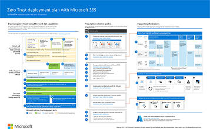
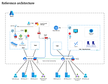

# Zero Trust illustrations for IT architects and implementers

These posters and technical diagrams give you information about deployment and implementation steps to apply the [principles of Zero Trust](zero-trust-overview.md#guiding-principles-of-zero-trust) to Microsoft cloud services, including Microsoft 365 and Microsoft Azure.

Zero Trust is a new security model that assumes breach and verifies each request as though it originated from an uncontrolled network. Regardless of where the request originates or what resource it accesses, the Zero Trust model teaches us to "never trust, always verify."

As an IT architect or implementer, you can use these resources for deployment steps, reference architectures, and logical architectures to more quickly apply Zero Trust principles to your existing environment for:

- [Microsoft 365](/microsoft-365/security/microsoft-365-zero-trust)
- [Azure IaaS](azure-infrastructure-overview.md)

You can download these illustrations in the form of:

- A PDF file for easier viewing, links to articles, and to print for your IT department.
- If available, a Microsoft Visio file to modify the illustrations for your own use.
- If available, a Microsoft PowerPoint file for presentations and to modify the slides for your own use.

To use the same set of icons and templates in the Visio or PowerPoint files, get the downloads in [Microsoft 365 architecture templates and icons](/microsoft-365/solutions/architecture-icons-templates).

### Zero Trust for Microsoft 365

This illustration provides a deployment plan for applying Zero Trust principles to Microsoft 365.

| Item | Description |
|:-----|:-----|
|   [PDF](https://download.microsoft.com/download/f/d/b/fdb6ab0c-34bb-4cb8-84e6-5de8f13298da/m365-zero-trust-deployment-plan.pdf) \| [Visio](https://download.microsoft.com/download/f/d/b/fdb6ab0c-34bb-4cb8-84e6-5de8f13298da/m365-zero-trust-deployment-plan.vsdx)   Updated February 2023 | Use this illustration together with this article: [Microsoft 365 Zero Trust deployment plan](/microsoft-365/security/microsoft-365-zero-trust)   **Related solution guides**   <ul><li>[Deploy your identity infrastructure for Microsoft 365](/microsoft-365/enterprise/deploy-identity-solution-overview)</li><li>[Recommended identity and device access configurations](/microsoft-365/security/office-365-security/microsoft-365-policies-configurations)</li><li>[Manage devices with Intune](/microsoft-365/solutions/manage-devices-with-intune-overview)</li><li>[Evaluate and pilot Microsoft 365 Defender](/microsoft-365/security/defender/eval-overview)</li><li>[Deploy an information protection solution with Microsoft Purview](/microsoft-365/compliance/information-protection-solution)</li><li>[Deploy information protection for data privacy regulations with Microsoft 365](/microsoft-365/solutions/data-privacy-protection)</li></ul>|

### Zero Trust for Microsoft Copilot for Microsoft 365

Adopting Microsoft Copilot for Microsoft 365 is a great incentive for your organization to invest in Zero Trust. This set of illustrations introduces new logical architecture components for Microsoft Copilot for Microsoft 365. It also includes security and deployment recommendations for preparing your environment for Microsoft Copilot for Microsoft 365. These recommendations align with Zero Trust recommendations and help you begin this journey, even if your licenses are Microsoft 365 E3!  

| Item | Description |
|:-----|:-----|
|   [PDF](https://download.microsoft.com/download/c/d/6/cd6c6858-f87b-4dc5-a593-e87db0aa6029/microsoft-365-copilot-architecture.pdf) \| [Visio](https://download.microsoft.com/download/c/d/6/cd6c6858-f87b-4dc5-a593-e87db0aa6029/microsoft-365-copilot-architecture.vsdx)   Updated November 2023 |Copilot combines the power of large language models (LLMs) with your data in the Microsoft Graph — your calendar, emails, chats, documents, meetings, and more — and the Microsoft 365 apps to provide a powerful productivity tool.    This series of illustrations provides a view into new logical architecture components. It includes recommendations for preparing your environment for Microsoft Copilot for Microsoft 365 with security and information protection while assigning licenses. |

<!---
### Zero Trust for Microsoft Azure

This illustration provides a deployment plan for applying Zero Trust principles to Microsoft Azure.

| Item | Related solution guides |
|:-----|:-----|
|   [PDF](Microsoft Download Center link) \| [Visio](Microsoft Download Center link)   Updated June 2023 | Use this illustration together with this article: [Microsoft Azure Zero Trust deployment plan](apply-zero-trust-azure-services-overview.md)   **Related solution guides**   <ul><li>[Azure IaaS services](azure-infrastructure-overview.md)</li><li>[Azure Virtual Desktop](azure-infrastructure-avd.md)</li><li>[Azure Virtual WAN](azure-virtual-wan.md)</li><li>[IaaS applications in Amazon Web Services](secure-iaas-apps.md)</li><li>[Microsoft Sentinel and Microsoft 365 Defender](/security/operations/siem-xdr-overview)</li></ul>|
--->

### Zero Trust for Azure IaaS services

This illustration shows the components of Azure IaaS as reference and logical architectures, along with the steps to ensure that these components have the "never trust, always verify" principles of the Zero Trust model applied.

| Item | Description |
|:-----|:-----|
|   [PDF](https://download.microsoft.com/download/d/8/b/d8b38a95-803c-4956-88e6-c0de68f7f8e9/apply-zero-trust-to-Azure-IaaS-infra-poster.pdf) \| [Visio](https://download.microsoft.com/download/d/8/b/d8b38a95-803c-4956-88e6-c0de68f7f8e9/apply-zero-trust-to-Azure-IaaS-infra-poster.vsdx)   Updated February 2023 | Use this illustration together with this article: [Apply Zero Trust principles to Azure IaaS overview](azure-infrastructure-overview.md)   **Related solution guides**   <ul><li>[Azure Storage services](azure-infrastructure-storage.md)</li><li>[Virtual machines](azure-infrastructure-virtual-machines.md)</li><li>[Spoke virtual networks (VNets)](azure-infrastructure-iaas.md)</li><li>[Hub VNets](azure-infrastructure-networking.md)</li></ul>|

You can also download the technical diagrams used in the [Zero Trust for Azure IaaS series of articles](azure-infrastructure-overview.md) as an easier way of viewing the illustrations in the articles or to modify them for your own use.

| Item | Description |
|:-----|:-----|
|   [PDF](https://download.microsoft.com/download/c/e/a/ceac5996-7cbf-4184-aed8-16dffcad3795/apply-zero-trust-to-Azure-IaaS-infra-diagrams.pdf) \| [Visio](https://download.microsoft.com/download/c/e/a/ceac5996-7cbf-4184-aed8-16dffcad3795/apply-zero-trust-to-Azure-IaaS-infra-diagrams.vsdx)   Updated February 2023 | Use these diagrams together with the articles starting here: [Apply Zero Trust principles to Azure IaaS overview](azure-infrastructure-overview.md)   **Related solution guides**   <ul><li>[Azure Storage services](azure-infrastructure-storage.md)</li><li>[Virtual machines](azure-infrastructure-virtual-machines.md)</li><li>[Spoke VNets](azure-infrastructure-iaas.md)</li><li>[Hub VNets](azure-infrastructure-networking.md)</li></ul>|

### Zero Trust for Azure Virtual WAN diagrams

These diagrams show the reference and logical architectures for [applying Zero Trust to Azure Virtual WAN](azure-virtual-wan.md) as an easier way of viewing the illustrations in the article or to modify them for your own use.

| Item | Description |
|:-----|:-----|
|   [PDF](https://download.microsoft.com/download/1/e/f/1ef1ad20-138e-419d-b30d-7f20811ef923/apply-zero-trust-to-Azure-vWAN-diagrams.pdf) \| [Visio](https://download.microsoft.com/download/1/e/f/1ef1ad20-138e-419d-b30d-7f20811ef923/apply-zero-trust-to-Azure-vWAN-diagrams.vsdx)   Updated May 2023 | Use this illustration together with this article: [Apply Zero Trust principles to Azure Virtual WAN](azure-virtual-wan.md)</li></ul>|

### Zero Trust Identity and Device Access Policies

This illustration shows the set of Zero Trust identity and device access policies for three levels of protection.

| Item | Description |
|:-----|:-----|
|   [PDF](https://download.microsoft.com/download/e/d/0/ed03381c-16ce-453e-9c89-c13967819cea/zero-trust-identity-and-device-access-policies.pdf)   Updated February 2023 | Use this illustration together with this article: [Recommended identity and device access configurations](/microsoft-365/security/office-365-security/microsoft-365-policies-configurations)  **Related solution guides**   <ul><li>[Microsoft 365 Zero Trust deployment plan](/microsoft-365/security/microsoft-365-zero-trust)</li><li>[Deploy your identity infrastructure for Microsoft 365](/microsoft-365/enterprise/deploy-identity-solution-overview)</li><li>[Manage devices with Intune](/microsoft-365/solutions/manage-devices-with-intune-overview)</li><li>[Evaluate and pilot Microsoft 365 Defender](/microsoft-365/security/defender/eval-overview)</li><li>[Deploy an information protection solution with Microsoft Purview](/microsoft-365/compliance/information-protection-solution)</li><li>[Deploy information protection for data privacy regulations with Microsoft 365](/microsoft-365/solutions/data-privacy-protection)</li></ul>|

### Additional Microsoft security posters and illustrations

See these additional Microsoft security posters and illustrations:

- Microsoft Intune enrollment options: [PDF](https://download.microsoft.com/download/e/6/2/e6233fdd-a956-4f77-93a5-1aa254ee2917/msft-intune-enrollment-options.pdf) \| [Visio](https://download.microsoft.com/download/e/6/2/e6233fdd-a956-4f77-93a5-1aa254ee2917/msft-intune-enrollment-options.vsdx)

- Common attacks and Microsoft capabilities that protect your organization: [PDF](https://download.microsoft.com/download/F/A/C/FACFC1E9-FA35-4DF1-943C-8D4237B4275B/MSFT_Cloud_architecture_security_commonattacks.pdf) \| [Visio](https://download.microsoft.com/download/F/A/C/FACFC1E9-FA35-4DF1-943C-8D4237B4275B/MSFT_Cloud_architecture_security_commonattacks.vsdx)

- An overview of the three phases as layers of protection against ransomware attackers: [PDF](https://download.microsoft.com/download/5/e/3/5e37cbff-9a7a-45b2-8b95-6d3cc5426301/protect-your-organization-from-ransomware.pdf). Use this poster together with the [What is ransomware?](/security/compass/human-operated-ransomware) article.

- An overview of how Microsoft's SecOps team does incident response to mitigate ongoing attacks: [PDF](https://github.com/MarkSimos/MicrosoftSecurity/raw/master/Microsoft_CDOC_and_DCU_Poster.pdf)

- An overview of how Microsoft's SecOps team does incident response to mitigate ongoing attacks: [PDF](https://github.com/MarkSimos/MicrosoftSecurity/raw/master/Microsoft_CDOC_and_DCU_Poster.pdf)

- The Security Best Practices slide presentation: [PDF](/microsoft-365/downloads/security-compass-presentation.pdf) | [PowerPoint](/microsoft-365/downloads/security-compass-presentation.pptx)

- The top 10 Azure Security best practices: [PDF](/microsoft-365/downloads/top-10-azure-security-best-practices.pdf) | [PowerPoint](/microsoft-365/downloads/top-10-azure-security-best-practices.pptx)

- The app consent grant and other incident response playbook workflows: [PDF](https://download.microsoft.com/download/2/9/a/29a32dc4-d126-42af-a825-ffb944135a50/Incident-Response-Playbook-Workflows.pdf) | [Visio](https://download.microsoft.com/download/2/9/a/29a32dc4-d126-42af-a825-ffb944135a50/Incident-Response-Playbook-Workflows.vsdx)

## Next steps

- [Microsoft 365 Zero Trust deployment plan](/microsoft-365/security/microsoft-365-zero-trust)

- [Apply Zero Trust principles to Azure infrastructure](azure-infrastructure-overview.md)
